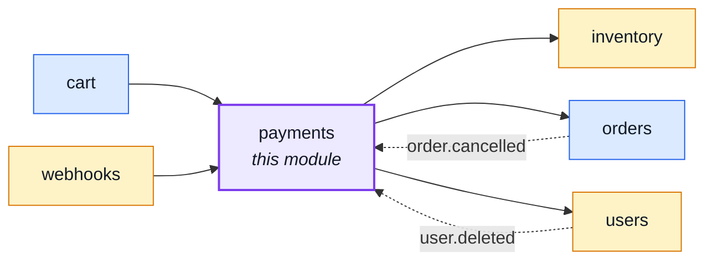
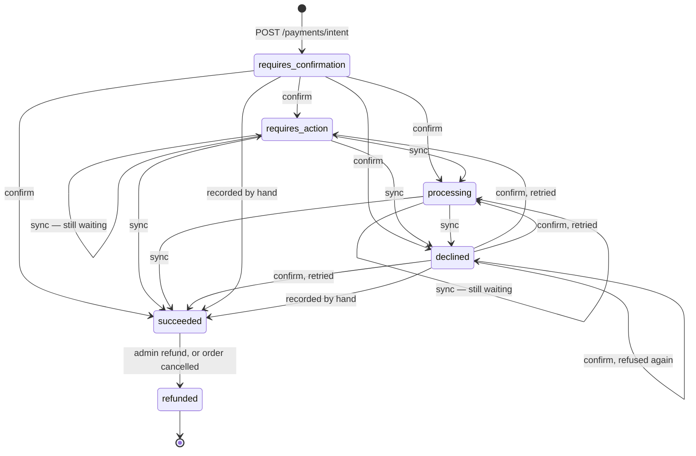
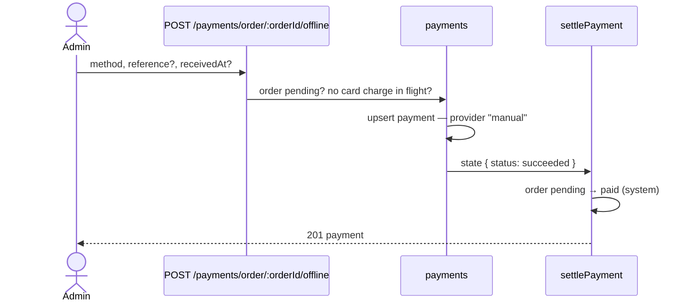
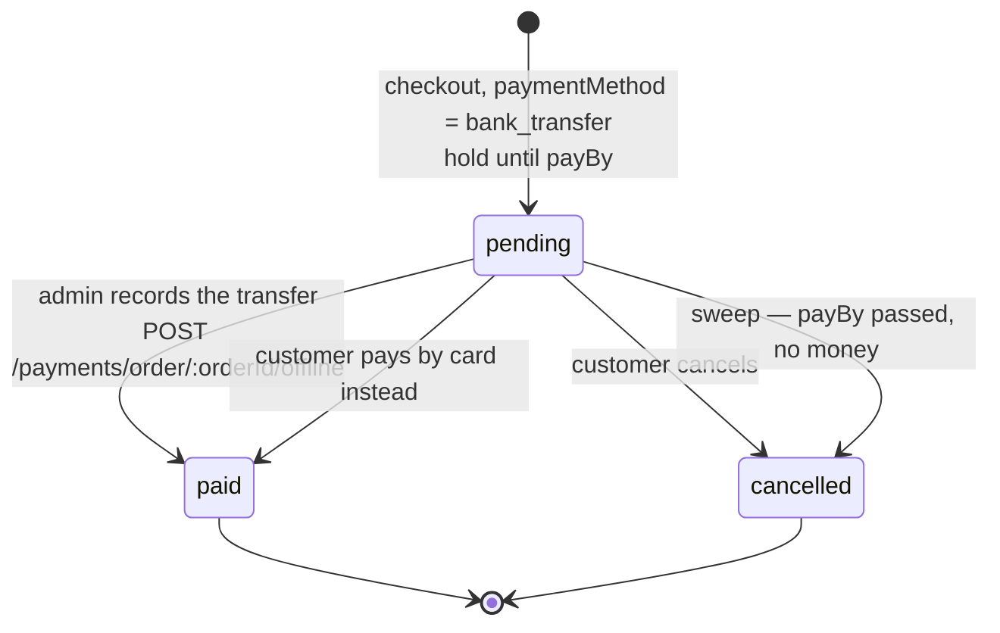
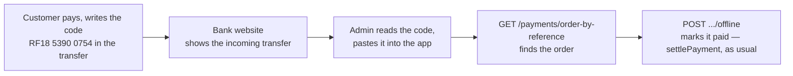
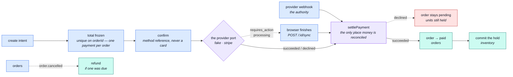

# payments

::: tip At a glance
**Owns** — an order's money, behind a provider port. The intent freezes a total; the confirm moves the order to `paid`.
**Depends on** — [`orders`](./orders.md), [`inventory`](./inventory.md), [`users`](./users.md).
**Breaks if you change** — the confirm path. It is the single moment held units become a sale.
:::

## Its neighbourhood

<!-- module-graph:payments:start -->

_Solid arrows are imports. Dotted arrows are domain events — the return path an import
graph cannot see._

<!-- module-graph:payments:end -->

## The story

A payment is _about_ an order: the intent freezes its total, the confirm moves its status to
`paid`. The arrow never comes back — [`orders`](./orders.md) announces `order.cancelled` and this
module answers with the refund.

**`settlePayment` is the one place where the money and the goods agree.** It commits the order's
held units itself rather than announcing and hoping, because that instant is the only moment a hold
becomes a sale. Without this module nothing would ever commit a hold, and every order would sit
reserved until its window expired.

It is reached three ways — the confirm, the sync, and the provider's webhook — and there is exactly
one of it because two would drift, and drifted copies commit the hold twice. Every write inside it
is conditional on the payment still being settleable, and the two terminal statuses are deliberately
outside that set: that absence is what makes a provider retrying a delivery for three days find
nothing left to move.

::: tip The provider is a port, and the implementation is fake on purpose
Nothing above `providers/` knows which processor is wired in. The fake is what lets the whole
checkout-to-paid path run in tests and in the demo profile without a sandbox account — including
the 3-D Secure challenge and the webhook, which it imposes exactly as a real provider would.
Swapping in a real processor is one file behind an interface that already exists.
:::

::: warning The card never reaches this server
`POST /payments/{id}/confirm` takes an opaque method reference the browser's provider widget
produced, never a card number. That is what keeps the deployment in the light PCI DSS bracket
rather than the heavy one, and it is why the request schema refuses a value shaped like a PAN.
:::

## The answer is not always immediate

Two statuses sit between submitted and settled, and a lifecycle without them loses every European
card payment the bank decides to challenge:

| Status            | What it means                                                                |
| ----------------- | ---------------------------------------------------------------------------- |
| `requires_action` | The bank wants a 3-D Secure challenge answered in the browser.               |
| `processing`      | The provider has the payment but has not settled it. Some methods take days. |

Both answer **200**, not an error: the browser has a next step, and a 4xx would tell it to stop.
`POST /payments/{id}/sync` re-reads the provider and settles, which is what makes the happy path
feel synchronous.

**`POST /payments/webhook` is the authority**, and the browser never is. It arrives whether or not
the customer kept the tab open, and it is the one route in the module mounted above the auth wall:
its caller is a machine with no account, authenticating by signing the raw body — a stronger proof
of origin than any cookie this API could ask it for. Deliveries are deduplicated by event id,
because a provider retries for days and the inventory commit is not conditional on anything else.

The dependency on [`users`](./users.md) is groundwork rather than a current feature. The order
already carries a `userId`; resolving it against the account record is what makes the id on a
payment document worth querying later, when "everything this account has paid" becomes a screen.
An unresolvable payer is logged rather than refused.

`unique: true` on `orderId` is the guard against a double charge: one payment per order is a
database fact, not a check somebody has to remember.

Delete this module and cancelling an order still releases its stock but returns no money — which is
exactly the sentence `CANCELLABLE_ORDER_STATUSES` documents.

## The pre-check, and the final write

Two different questions, asked at two different moments, both owned by `orders`:

- **The pre-check** — `orders.isPayable(order.status)` — gates every door that could open a new
  payment: `POST /payments/intent`, `POST /payments/order/{orderId}/offline`, and `getForOrder`'s
  `PaymentActions.pay`. `pending` only; a `paid` order answers `false` even though `system` may
  still write a `paid → paid` echo underneath it (the payment webhook's own retries) — that echo is
  not a fresh offer to pay. This module never compares a status literal to decide whether to open a
  door; it always asks `orders`, so it cannot drift off the rule the lifecycle owns.
- **The final write** — `orderService.markPaid` — is what actually moves the order once money has
  settled (`settlePayment` calls it; see "Status transitions" below and
  `docs/theory/tactical-ddd.md` §1 "Who writes the status"). It is `orders`' own conditional write,
  independent of the pre-check: a race that slips past the pre-check still cannot double-move the
  order, because `markPaid` only writes from `pending`.

## Status transitions

`requires_confirmation` is entered once, by `POST /payments/intent`, and never again — nothing a
provider reports is ever that value. From there, every non-terminal status can settle to any other
non-terminal status: `CONFIRMABLE_PAYMENT_STATUSES` (`service.ts`) gates which ones `POST
/payments/{id}/confirm` accepts as a starting point (`requires_confirmation`, `declined` — a
decline is retryable with another method), and `SETTLEABLE_PAYMENT_STATUSES` gates which ones
`settlePayment` will still write over (everything except the two terminal states below). `succeeded`
moves to `refunded` and nowhere else; `refunded` moves nowhere.

`POST /payments/order/{orderId}/offline` (below) is a fourth way to reach `succeeded`, alongside
confirm, sync and the webhook — it calls the exact same `settlePayment`, so nothing about this
diagram's terminal states or their guards changes for it.

## Offline payments

Not every payment goes through the provider: an admin can record money that arrived some other
way — cash at the counter, a phone order paid by bank transfer — on a still-`pending` order.

**The admin records a payment; `settlePayment` moves the order.** Same code path as a card, so the
stock commits, `ORDER_STATUS_CHANGED` and `PAYMENT_SUCCEEDED` fire, and webhooks and emails follow
exactly as they would for a card. `manual` is not a provider port implementation — the port is
card-shaped, and a `manual` adapter would be three methods that throw — the offline path instead
writes the row directly and calls `settlePayment`.

The amount is always the order's own total; a partial or over-payment is out of scope, handled by
hand and off-system. Recording is refused with `PAYMENT_ORDER_NOT_PAYABLE` once the order is no
longer `pending` (including a second attempt at the same order), and with `PAYMENT_IN_FLIGHT` while
a card charge on the same order is still `requires_action` or `processing` — the provider could
still land that charge on its own, and recording money too would risk charging twice. A card
attempt that never got that far (`requires_confirmation`, `declined`) is simply overwritten: the row
becomes the offline one.

**Refunding a `manual` payment moves the status and nothing else.** There is no provider to ask, so
`refundedByHand` on the payment is the admin's own record that the money actually went back to the
customer outside this application. Every other refund still dispatches to the provider named on the
payment's own `provider` field — never the deployment's currently configured one, so a refund of an
older payment still reaches the provider that actually took the money even after a deployment
switches to another.

Requires `payments.any.create`, the same fresh-session tier as a refund (`payments.any.update`) — an
admin's own word that money arrived is exactly as consequential as one that it left.

The webhook is not on this diagram because it does not add an edge the diagram doesn't already
have — it reaches the exact same `settlePayment` a sync does, with `succeeded` or `declined` as the
only two states it ever reports.

## Bank transfer

At checkout the customer may choose `bank_transfer` instead of `card` — `GET /payments/methods`
says whether this deployment offers it at all, which is only once `NODE_BANK_TRANSFER_BENEFICIARY`
and `_IBAN` are both set.

- **The order carries the chosen method as a preference, not a lock.** The card form stays offered
  regardless, and a card payment settles through the ordinary pipeline above.
- **The hold is longer, and the sweep needs no change to know it.** `cart`'s checkout hands
  `inventoryService.reserveForOrder` an explicit window — `NODE_BANK_TRANSFER_HOLD_HOURS` (default
  168, a week) instead of `NODE_RESERVATION_TTL_MINUTES` — and the same reservation sweep that
  releases a 30-minute card hold releases this one too, since it only ever reads each hold's own
  stored `expiresAt`. See [Inventory Reservations](./inventory-reservations.md#the-sweep).
- **A week-long hold is free to take, so an account is capped.** `NODE_BANK_TRANSFER_MAX_OPEN_PER_ACCOUNT`
  (default 2) counts that account's own `pending` transfer orders; a third checkout is refused with
  `CART_BANK_TRANSFER_LIMIT` before anything is written.
- **`transferInstructions` is computed at read time, never frozen onto the order — except its own
  `reference`.** The beneficiary/IBAN/BIC are deployment config, not order-specific data, so every
  response recomputes them from the current environment — a later correction to a typo'd IBAN
  shows up on every still-`pending` transfer order, not just new ones. `reference` is the one
  exception: the RF code checkout minted for THIS order, stored once on `transferReference` and
  never recomputed. Present only while `paymentMethod` is `bank_transfer` and `status` is
  `pending`. See [Matching a transfer back to its order](#matching-a-transfer-back-to-its-order).
- **`orders` owns the bank-transfer business rules outright**, `transferInstructions` and the
  open-transfer cap alike — the reference-minting and open-transfer-cap config that used to sit in
  `infrastructure` to dodge a cycle now lives in `orders/config.ts`, since `orders` is the entity
  both rules constrain. `payments` and `cart` read it through `orders`' own barrel; `payments`
  keeps the `ibantools` validation, the one thing that stays genuinely its own. See
  [Libraries a module owns](../theory/modules.md#libraries-a-module-owns).
- **Two emails, and a card timeout gets neither.** Checkout sends the instructions and the deadline
  instead of the ordinary confirmation — there is nothing to confirm yet. The sweep's own expiry
  sends a second one, but only when `paymentMethod` is `bank_transfer`: a card hold is thirty
  minutes, over before anyone could have opened a confirmation email, so a card timeout stays
  silent exactly as it does today.

## Matching a transfer back to its order

The bank never tells this app anything — there is no statement feed, no webhook, no polling.
Instead checkout gives the customer a clean code to write into the transfer, and an admin reads it
back off the bank's own website:

- **The reference is an ISO 11649 "RF" creditor reference** — the standard SEPA reference field,
  e.g. `RF13 2EY8 H44V JAVZ KX80 JRL`. Its mod-97 check digits (ISO 7064 MOD 97-10, the same scheme
  IBAN itself uses) mean a mistyped code is REJECTED rather than silently matching the wrong order.
  `orders/domain/transfer-reference.ts`'s `buildReference` mints it as part of writing the order,
  from the order's own id encoded as base-36 — lossless over every bit of the id, so two different
  orders can never mint the same code the way a hash could, which is what makes
  `transferReference`'s unique index a true invariant rather than a rarely-firing safety net.
  `payments`' lookup endpoint imports `parseReference` from the same file.
- **Minted once, in the same write that creates the order, never recomputed.** `orders`' `placeOrder`
  mints it atomically as part of the write — see `OrderDocument.transferReference`'s own comment.
  Absent on a `card` order, and on a `bank_transfer` order that predates this field.
- **The lookup accepts the pre-existing case too.** `GET /payments/order-by-reference` also
  accepts a raw 24-character order id, so an order placed before this field existed still resolves
  — there is no backfill, and on a boilerplate there are ~zero pending transfer orders to backfill
  anyway.
- **No new settlement code.** The admin screen calls the lookup, then the existing `POST
/payments/order/{orderId}/offline` — the same `pending → paid` move, stock commit, and events any
  other offline record already goes through.
- **A malformed and an unmatched reference answer the same 404.** Distinguishing them would tell a
  guesser which half of a code they got right.

## Libraries

`ibantools` is this module's alone — see [Package Dependencies](../tools/package-dependencies.md)
for where it sits among everything else this repo depends on. Used once, at boot: it is what
`customCheck` runs `NODE_BANK_TRANSFER_IBAN`/`_BIC` through before the deployment is allowed to
advertise `bank_transfer` at all.

| Library                      | Maintained    | What it costs you                                                              |
| ---------------------------- | ------------- | ------------------------------------------------------------------------------ |
| `ibantools` (chosen)         | active, typed | IBAN + BIC validation and formatting for every SEPA country, zero dependencies |
| a hand-rolled mod-97 check   | —             | exactly the kind of validation `CLAUDE.md` rules out writing by hand           |
| trusting the value unchecked | —             | a mistyped IBAN in `.env` sends every customer's money to the wrong account    |

The RF reference above is ALSO a hand-rolled mod-97 check, and is not a contradiction of the row
just above: `ibantools` validates IBAN and BIC only, has no ISO 11649 support at all, and no
maintained package on npm covers this narrow a spec — the "only then write it ourselves" branch of
`CLAUDE.md`'s own dependency rule, not the one the IBAN row warns against skipping.

## The pipeline

Three entry points, one settlement. What differs between them is only how the provider was asked.

## Configuration

| Variable                                  | Default | Meaning                                                                                                                                                                               |
| ----------------------------------------- | ------- | ------------------------------------------------------------------------------------------------------------------------------------------------------------------------------------- |
| `NODE_PAYMENT_PROVIDER`                   | `fake`  | Which implementation under `providers/` answers. A name this build does not carry throws at boot rather than silently taking no payments                                              |
| `NODE_PAYMENT_WEBHOOK_SECRET`             | —       | What `POST /payments/webhook` verifies deliveries against. With a live provider this is THEIR signing secret, and it is the only thing between an attacker and marking any order paid |
| `NODE_DEFAULT_CURRENCY`                   | `EUR`   | ISO-4217, stamped on every payment document at creation                                                                                                                               |
| `NODE_PAYMENT_ABANDONED_RETENTION_DAYS`   | `30`    | Days an attempt that never settled may sit untouched before `npm run reap:payments` deletes it. See Retention below.                                                                  |
| `NODE_BANK_TRANSFER_BENEFICIARY`          | —       | The account name a transfer is made out to. `bank_transfer` is offered only once this and `_IBAN` are both set                                                                        |
| `NODE_BANK_TRANSFER_IBAN`                 | —       | The account IBAN. Validated with `ibantools` at boot — a malformed value refuses to boot rather than silently advertising a dead account                                              |
| `NODE_BANK_TRANSFER_BIC`                  | —       | The account's BIC/SWIFT, optional even once transfer is offered. Validated at boot when set                                                                                           |
| `NODE_BANK_TRANSFER_HOLD_HOURS`           | `168`   | How long checkout holds stock for a `bank_transfer` order — a week, not `NODE_RESERVATION_TTL_MINUTES`'s thirty minutes                                                               |
| `NODE_BANK_TRANSFER_MAX_OPEN_PER_ACCOUNT` | `2`     | How many `pending` transfer orders one account may have at once, before checkout refuses a new one                                                                                    |

The currency is stamped rather than looked up, so changing it affects new payments and leaves
existing ones reading in the currency they were actually taken in. There is no conversion
anywhere in this module: a deployment that needs several currencies needs a price per currency
on the product, not a rate here.

Two more, not environment variables — code constants in `providers/webhook-signature.ts` and
`model.ts`, called out here because an operator debugging a webhook has no other reason to open
either file:

| Constant                       | Value | Meaning                                                                                                                                                                                   |
| ------------------------------ | ----- | ----------------------------------------------------------------------------------------------------------------------------------------------------------------------------------------- |
| `TOLERANCE_SECONDS`            | 300   | How far a delivery's `t=` may drift from the server's clock before it is rejected as stale.                                                                                               |
| `WEBHOOK_EVENT_RETENTION_DAYS` | 30    | How long a processed event id is remembered before its ledger row expires — chosen to sit past any provider's retry window, a claim about a third party this deployment does not control. |

## Retention

Two questions came up here, and both have a real answer worth writing down rather than leaving
implicit in the code.

**Is anything on a payment personal data (PII) that must eventually be scrubbed, the way
[`orders`](./orders.md) scrubs a shipping name and address?** No. `cardLast4` is four digits out
of a card number — not a PAN, and not enough to identify anyone or charge anything on its own,
the same reasoning that lets it appear on any receipt or bank statement. `amount`, `currency` and
`provider` were never personal data either. The only personal link on a payment is `userId`, and
that is already removed the moment an account is erased (`detachUserId`, immediate — no delay, no
timer). So once a payment settles, there is nothing left for a retention job to do.

**Does a settled payment ever get deleted?** No — same as `orders`, a `succeeded` or `refunded`
payment is an invoice, kept indefinitely for tax and commercial-law reasons. Neither status is
ever a candidate for `reap:payments`, `reap:orders`, or any other timer in this codebase.

**What about a payment that never settles at all** — a declined card nobody retried, a 3-D Secure
challenge nobody answered? That row was never a transaction: no money moved, so there is no
invoice to keep. `npm run reap:payments` deletes it once it has sat untouched (`updatedAt`) for
`NODE_PAYMENT_ABANDONED_RETENTION_DAYS` (default 30 days) — an abandoned checkout, not a financial
record. Retrying resets the clock, the same way editing a cart resets `carts`' own TTL.

| Payment state                            | Kept forever? | Mechanism                                      |
| ---------------------------------------- | :-----------: | ---------------------------------------------- |
| `succeeded` / `refunded`                 |      Yes      | Never touched by any timer — it is the invoice |
| Anything else, untouched past the window |      No       | `npm run reap:payments` deletes the row        |

`npm run reap:payments` runs nightly from `docker/crontab`, alongside the rest of this repo's
scheduled jobs — see [Scheduled jobs](../reference/ops.md#scheduled-jobs) for the full mechanism
and the module-removal convention that goes with owning one.

This is a genuinely different shape from `orders`' retention: `orders` keeps every row forever and
scrubs PII in place; `payments` keeps a settled row forever and deletes an unsettled one outright.
Neither scrubs a settled payment, because there is nothing on it left to scrub.

## Related pages

- [The provider port](./payments-provider-port.md) — the interface and the fake behind it
- [`orders`](./orders.md) — what a payment is about
- [`inventory`](./inventory.md) — the units this module commits
- [Layers](../theory/layers.md) — what a port is and where it sits
- [Security](../tools/security.md) — what is never stored here, and this module's own rate-limit budgets
