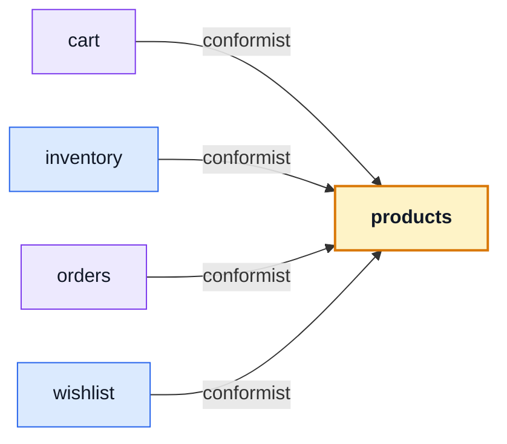

# products

::: tip At a glance
**Owns** — the catalogue: what the shop sells, and the two stock counters that sit on every product row.
**Depends on** — nothing. It is the leaf four other domains conform to.
**Breaks if you change** — `productSchema`. `orders` embeds it, so an order's history is literally this shape.
:::

<!-- gen:identity:start -->

| Fact                     | This module                                                                                                 |
| ------------------------ | ----------------------------------------------------------------------------------------------------------- |
| **Subdomain**            | `core` — The reason the product exists. Worth entities, value objects and invariants.                       |
| **Base path**            | `/products`                                                                                                 |
| **Collection**           | `products` (model `Product`)                                                                                |
| **Depends on**           | _nothing_                                                                                                   |
| **Depended on by**       | [`cart`](./cart.md) · [`inventory`](./inventory.md) · [`orders`](./orders.md) · [`wishlist`](./wishlist.md) |
| **Languages**            | `en` · `it`                                                                                                 |
| **Seeded**               | yes — `products` as `response`                                                                              |
| **Frontend counterpart** | `products` in `boilerplate-vue-frontend`                                                                    |

<!-- gen:identity:end -->

## The map

<!-- gen:map:start -->



- `cart` → **conformist** — Reads catalogue documents as they are to price lines and to pre-flight availability.
- `inventory` → **conformist** — Reads catalogue documents as they are and drives their two counters through the repository’s conditional primitives. The columns are the catalogue’s to declare; what they may become is this module’s to decide.
- `orders` → **conformist** — An order item embeds `productSchema` itself, so the catalogue’s shape is this module’s shape too.
- `wishlist` → **conformist** — Reads catalogue documents as they are — a saved line is meaningless without the product it points at.

<!-- gen:map:end -->

## The story

The catalogue is the model every other context conforms to rather than translates. A cart line, an
order item, a stock movement — each is a statement about a product, which is why this module is
`core` despite doing nothing more interesting than CRUD.

**It depends on nothing, and staying that way was a deliberate decision.** Products genuinely needs
something back: when a product disappears, every cart and wishlist holding it has to drop the
reference. As an import that would be a cycle. As `product.deleted` it is products announcing and
two modules listening, and the arrow still points one way.

::: warning The one field-ownership split worth remembering
`onHand` and `reserved` live on the product document so a catalogue read needs no join — but
**this module never writes them.** Every change goes through a transition in
[`inventory`](./inventory.md). A write to either counter from anywhere else is a bug, not a
shortcut.
:::

Deletion is soft: `active` and `deletedAt`, with a restore route, because an order that embedded a
product still has to render months later. The `active: 1, deletedAt: 1` index is what makes the
public list cheap while the admin list can still see everything.

## Data

<!-- gen:data:start -->

#### `products`

From model `Product`. `_id` and `__v` are omitted — every document carries them.

| Field         | Type      | Flags    | Default                           | Reference / values |
| ------------- | --------- | -------- | --------------------------------- | ------------------ |
| `title`       | `String`  | required | —                                 | —                  |
| `price`       | `Number`  | required | —                                 | —                  |
| `onHand`      | `Number`  | —        | 100                               | —                  |
| `reserved`    | `Number`  | —        | 0                                 | —                  |
| `description` | `String`  | —        | ""                                | —                  |
| `imageUrl`    | `String`  | —        | "https://placekitten.com/400/400" | —                  |
| `categories`  | `Mixed[]` | —        | []                                | —                  |
| `tags`        | `Mixed[]` | —        | []                                | —                  |
| `active`      | `Boolean` | —        | true                              | —                  |
| `deletedAt`   | `Date`    | —        | —                                 | —                  |
| `createdAt`   | `Date`    | —        | —                                 | —                  |
| `updatedAt`   | `Date`    | —        | —                                 | —                  |

**Declared indexes**

| Keys                      | Options                         |
| ------------------------- | ------------------------------- |
| `createdAt: -1`           | name: products_createdAt        |
| `active: 1, deletedAt: 1` | name: products_active_deletedAt |

<!-- gen:data:end -->

## Surface

<!-- gen:surface:start -->

| Endpoint                     | Middlewares                                                                                                   | Controller           | What it does                   |
| ---------------------------- | ------------------------------------------------------------------------------------------------------------- | -------------------- | ------------------------------ |
| `DELETE /products`           | `getAuth` → `isAuth` → `isAdmin` → `(inline)`                                                                 | `deleteProduct`      | Delete product                 |
| `GET /products`              | `getAuth` → `(inline)`                                                                                        | `getProducts`        | List products (paginated)      |
| `POST /products`             | `getAuth` → `isAuth` → `isAdmin` → `(inline)` → `(inline)` → `validateUploadedImages` → `storeUploadedImages` | `writeProducts`      | Create product                 |
| `PUT /products`              | `getAuth` → `isAuth` → `isAdmin` → `(inline)` → `(inline)` → `validateUploadedImages` → `storeUploadedImages` | `writeProducts`      | Edit product                   |
| `DELETE /products/{id}`      | `getAuth` → `isAuth` → `isAdmin` → `(inline)`                                                                 | `deleteProduct`      | Delete product                 |
| `GET /products/{id}`         | `getAuth` → `(inline)`                                                                                        | `getProductItem`     | Product details                |
| `PUT /products/{id}`         | `getAuth` → `isAuth` → `isAdmin` → `(inline)` → `(inline)` → `validateUploadedImages` → `storeUploadedImages` | `writeProducts`      | Edit product                   |
| `DELETE /products/{id}/hard` | `getAuth` → `isAuth` → `isAdmin` → `(inline)` → `(inline)`                                                    | `deleteProduct`      | Permanently delete product     |
| `GET /products/categories`   | `getAuth` → `(inline)`                                                                                        | `getCatalogueFacets` | Catalogue facets               |
| `POST /products/search`      | `getAuth` → `(inline)`                                                                                        | `getProducts`        | Search products (DTO-friendly) |

Middlewares run left to right; the controller is the last handler on the route. Summaries come from this module’s own `openapi.yaml`, which is where they are edited.

<!-- gen:surface:end -->

## Signals

<!-- gen:signals:start -->

#### Domain events

| Event             | Direction                |
| ----------------- | ------------------------ |
| `product.deleted` | published by this module |

#### Audit actions

| Constant                | Action name             |
| ----------------------- | ----------------------- |
| `ADMIN_PRODUCT_CREATED` | `admin.product.created` |
| `ADMIN_PRODUCT_UPDATED` | `admin.product.updated` |
| `ADMIN_PRODUCT_DELETED` | `admin.product.deleted` |

#### Analytics events

| Constant            | Event name          |
| ------------------- | ------------------- |
| `PRODUCTS_SEARCHED` | `products_searched` |
| `PRODUCT_VIEWED`    | `product_viewed`    |

#### Contract probes

Requests the contract cannot describe — the calls that prove this module refuses things.

| Call                                                                  | Probe                                         |
| --------------------------------------------------------------------- | --------------------------------------------- |
| `POST /products`                                                      | Probe: 422 on a body that violates the schema |
| `GET /products/{{seedProductId}}`                                     | Probe: the same product in Italian            |
| `GET /products?page=1&pageSize=5&minPrice=1&maxPrice=100&active=true` | Probe: the optional filters, all at once      |
| `GET /products/{{seedSoftDeletedProductId}}`                          | Probe: the soft-deleted product, anonymously  |
| `GET /products/{{seedInactiveProductId}}`                             | Probe: the inactive product, anonymously      |

<!-- gen:signals:end -->

## Files

<!-- gen:files:start -->

| File                                     | What it is                                                                                                                                                   | Explained in                              |
| ---------------------------------------- | ------------------------------------------------------------------------------------------------------------------------------------------------------------ | ----------------------------------------- |
| `analytics.ts`                           | The product-analytics event names this module emits.                                                                                                         | [read](../tools/analytics.md)             |
| `audit.ts`                               | Which of this module’s operations reach the audit trail, and under what action names.                                                                        | [read](../tools/winston.md)               |
| `controllers/delete-products.ts`         | One operation: reads inputs, calls the service, answers through the response envelope, and catches.                                                          | [read](../theory/request-flow.md)         |
| `controllers/get-catalogue-facets.ts`    | One operation: reads inputs, calls the service, answers through the response envelope, and catches.                                                          | [read](../theory/request-flow.md)         |
| `controllers/get-product-item.ts`        | One operation: reads inputs, calls the service, answers through the response envelope, and catches.                                                          | [read](../theory/request-flow.md)         |
| `controllers/get-products.ts`            | One operation: reads inputs, calls the service, answers through the response envelope, and catches.                                                          | [read](../theory/request-flow.md)         |
| `controllers/write-products.ts`          | One operation: reads inputs, calls the service, answers through the response envelope, and catches.                                                          | [read](../theory/request-flow.md)         |
| `demo.ts`                                | This module's seed fixtures, upserted through the shared seeding primitive.                                                                                  | [read](../tools/demo-profile.md)          |
| `events.ts`                              | The domain events this module publishes and subscribes to.                                                                                                   | [read](../tools/events-and-logging.md)    |
| `factory.ts`                             | Fixture builders for tests, on top of the shared persistence factory.                                                                                        | [read](../tools/unit-testing.md)          |
| `index.ts`                               | The public barrel: the only surface a sibling module may import.                                                                                             | [read](../theory/strategic-ddd.md)        |
| `locales/en.json`                        | This module's user-facing strings, one file per language.                                                                                                    | [read](../tools/i18n.md)                  |
| `locales/it.json`                        | This module's user-facing strings, one file per language.                                                                                                    | [read](../tools/i18n.md)                  |
| `model.ts`                               | The Mongoose schema, its indexes and its serialisation rules — the collection's shape.                                                                       | [read](../tools/mongodb-mongoose.md)      |
| `module.ts`                              | The manifest — the only file the application loads directly. Declares the name, base path, router, dependency edges, locales, seeds and event subscriptions. | [read](../theory/modules.md)              |
| `openapi.yaml`                           | This module's slice of the REST contract. The root `openapi.yaml` is bundled from these.                                                                     | [read](../api/contract-fragmentation.md)  |
| `probes.ts`                              | The requests the contract cannot describe — the calls that prove the API refuses things.                                                                     | [read](../tools/contract-request-data.md) |
| `repository.ts`                          | Every query this module makes, on the shared base repository. The only tier that talks to Mongoose.                                                          | [read](../tools/mongodb-mongoose.md)      |
| `routes.ts`                              | The URL surface — one line per endpoint, naming its middlewares, the role it requires and the controller it lands on.                                        | [read](../api/endpoints.md)               |
| `service.ts`                             | The domain decision, and the layer that owns status-code meaning.                                                                                            | [read](../theory/layers.md)               |
| `tests/contract/api.contract.test.ts`    | Contract suite — the responses, against the fragment.                                                                                                        | [read](../tools/contract-testing.md)      |
| `tests/factory.ts`                       | Fixture builders used only by this module’s own suites.                                                                                                      | [read](../tools/unit-testing.md)          |
| `tests/unit/audit.test.ts`               | Unit suite — the rules, in isolation.                                                                                                                        | [read](../tools/unit-testing.md)          |
| `tests/unit/facets.test.ts`              | Unit suite — the rules, in isolation.                                                                                                                        | [read](../tools/unit-testing.md)          |
| `tests/unit/model.test.ts`               | Unit suite — the rules, in isolation.                                                                                                                        | [read](../tools/unit-testing.md)          |
| `tests/unit/repository.test.ts`          | Unit suite — the rules, in isolation.                                                                                                                        | [read](../tools/unit-testing.md)          |
| `tests/unit/schema-contract.test.ts`     | Unit suite — the rules, in isolation.                                                                                                                        | [read](../tools/unit-testing.md)          |
| `tests/unit/service.test.ts`             | Unit suite — the rules, in isolation.                                                                                                                        | [read](../tools/unit-testing.md)          |
| `tests/unit/validation-messages.test.ts` | Unit suite — the rules, in isolation.                                                                                                                        | [read](../tools/unit-testing.md)          |

<!-- gen:files:end -->

## Working on it

<!-- gen:working:start -->

| Suite    | Files | Where                                  |
| -------- | ----- | -------------------------------------- |
| Unit     | 7     | `src/modules/products/tests/unit/`     |
| Contract | 1     | `src/modules/products/tests/contract/` |

```bash
# every suite this module carries
npm run test:module -- src/modules/products

# after editing this module’s openapi.yaml
npm run contracts:bundle && npm run lint:openapi:modules

# after editing this module’s seeds
npm run db:seed && npm run check:seed-export
```

<!-- gen:working:end -->

## Deeper in

<!-- gen:subpages:start -->

Nothing in this domain needs a page of its own — the story above is the whole of it.

<!-- gen:subpages:end -->

## Related pages

- [Modules overview](./index.md) — the whole context map
- [MongoDB & Mongoose](../tools/mongodb-mongoose.md) — what a repository and a model are
- [Strategic DDD](../theory/strategic-ddd.md) — why `conformist` is the label on four of the arrows pointing here
- [Events & Logging](../tools/events-and-logging.md) — the bus `product.deleted` travels on
- [Contract Ownership & Fragmentation](../api/contract-fragmentation.md) — how this module's `openapi.yaml` reaches the root document
