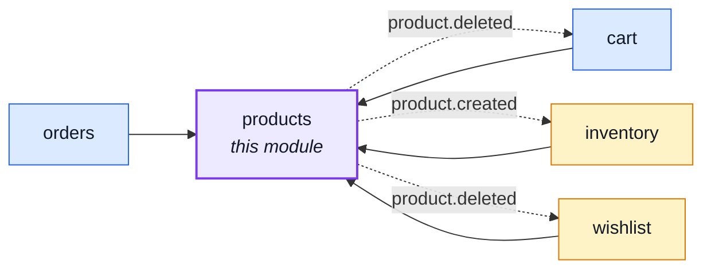
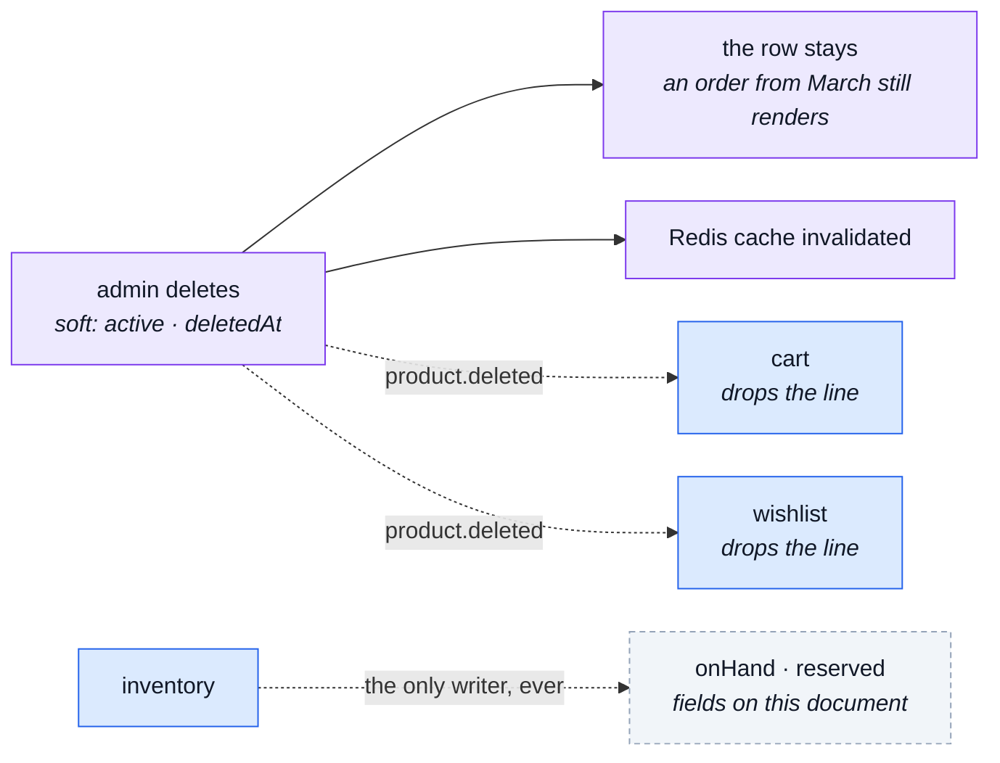

# products

::: tip At a glance
**Owns** — the catalogue: what the shop sells. `onHand`/`reserved`/`available` sit on every product
row too, but as a read-only mirror — [`inventory`](./inventory.md) owns the counters themselves.
**Depends on** — nothing. It is the leaf four other domains conform to.
**Breaks if you change** — `productSchema`. `orders` embeds it, so an order's history is literally this shape.
:::

## Its neighbourhood

<!-- module-graph:products:start -->

_Solid arrows are imports. Dotted arrows are domain events — the return path an import
graph cannot see._

<!-- module-graph:products:end -->

## The story

The catalogue is the model every other context conforms to rather than translates. A cart line, an
order item, a stock movement — each is a statement about a product, which is why this module is
`core` despite doing nothing more interesting than CRUD.

**It depends on nothing, and staying that way was a deliberate decision.** Products genuinely needs
something back: when a product disappears, every cart and wishlist holding it has to drop the
reference. As an import that would be a cycle. As `product.deleted` it is products announcing and
two modules listening, and the arrow still points one way.

::: warning The one field-ownership split worth remembering
`onHand`/`reserved`/`available` live on the product document so a catalogue read needs no join —
but they are a MIRROR, not the source. [`inventory`](./inventory.md) owns the real counters in its
own collection, and the only reason this document carries a copy at all is read performance. A
write to any of the three from anywhere but `inventory`'s own sync is a bug, not a shortcut.
:::

Deletion is soft: `active` and `deletedAt`, with a restore route, because an order that embedded a
product still has to render months later. The `active: 1, deletedAt: 1` index is what makes the
public list cheap while the admin list can still see everything.

## The pipeline

A delete is the interesting path, because it is the one that has to reach back into modules this
one may not import.

## Configuration

| Variable                | Default | Meaning                                                                                                                               |
| ----------------------- | ------- | ------------------------------------------------------------------------------------------------------------------------------------- |
| `NODE_VAT_RATE_DEFAULT` | `0.22`  | The rate charged on a product with no `taxClass` — every product's fallback. Range-checked at boot: outside `[0, 1)` refuses to start |
| `NODE_VAT_RATE_REDUCED` | `0.1`   | The rate charged on a product whose `taxClass` is `reduced`. Same boot-time range check as the default                                |

Both are read fresh per call (`config.ts`), so a corrected rate needs no restart. The boot check
(`invalidVatRateConfig`, this module's `customCheck`) parses a set value through the same
whole-string-decimal grammar the reader itself uses — `@infrastructure/runtime/environment`'s
`parseEnvironmentDecimal` — so a value the check accepts is never one the reader would then
silently fall back on. `resolveTaxRate` (`./tax`) is the one place either rate is resolved for a
product; `orders` freezes the result onto an order line at checkout and never reads a rate itself.

## Translated content

`title`/`description` are not columns this module resolves on its own. They live as per-locale rows
in the `translations` collection [`locales`](./locales.md) owns (`entityType: 'product'`) — one row
per language, the fallback language included, no special-cased "source" row.

Every read resolves them onto the wire shape: `search()` and `getById()` in
`src/modules/products/service.ts` call `applyTranslations('product', …)`, which overlays the
caller's `Accept-Language` chain — exact tag, base language, then the deployment's fallback — over
an already-serialized page in one batched query. See
[Internationalisation](../tools/i18n.md#tier-3-user-authored-content) for the resolve/fallback path.

::: warning The document's own `title`/`description` are a derived index column, not the wire shape
`productSchema`'s `title`/`description` (`src/modules/products/model.ts`) exist only so Mongo has
something to sort — [`inventory`](./inventory.md)'s stock board joins against this column for its
own `{ available: 1, 'product.title': 1, _id: 1 }` tie-break — and something to run free-text
search against (`repository.ts:89`'s `searchable.text`/`regex`). They are written only when the
FALLBACK-locale translation row changes, never read back into an API response: a public read
always goes through the resolver above.
:::

### Writing translated content

`POST /products` and `PATCH /products/{id}` take a `translations` map keyed by locale instead of a
flat `title`/`description` — the fallback locale's entry is required on create, every other locale
is optional, and `null` on an existing locale deletes its row (never on the fallback one).
`src/modules/products/service.ts`'s `writeCreate`/`writeUpdate` validate the whole batch
(`planTranslations`, the `@infrastructure/i18n` port) before writing anything, then write the
product and its rows in the same operation; `getAdmin` backs `GET /products/{id}/admin`, the one
read that returns every language at once rather than the caller's resolved one — what the editor's
form populates its tabs from.

This is a different door from the generic one — see
[`locales`](./locales.md#the-generic-translations-door-and-why-it-s-not-the-only-one): only
`/products/{id}`
may also touch price, stock flags and the image.

### Order line snapshots freeze the resolved words

An order line embeds a product snapshot at the buyer's locale rather than a live reference, and
freezes which locale it was resolved into alongside it — `orderLineProductSchema` and
`OrderDocumentItem.locale` in `src/modules/orders/model.ts`. `src/modules/orders/services/`'s
snapshot resolver does the resolving, bound explicitly to the buyer's locale with `runWithLocale`
rather than read off the ambient request context, since the order being created is not always the
buyer's own request.

## Related pages

- [Modules overview](./index.md) — the whole context map
- [`locales`](./locales.md) — the `translations` collection and its own admin door
- [Internationalisation](../tools/i18n.md) — the resolve/fallback mechanism translated content runs on
- [MongoDB & Mongoose](../tools/mongodb-mongoose.md) — what a repository and a model are
- [Strategic DDD](../theory/strategic-ddd.md) — why `conformist` is the label on four of the arrows pointing here
- [Events & Logging](../tools/events-and-logging.md) — the bus `product.deleted` travels on
- [Contract Ownership & Fragmentation](../api/contract-fragmentation.md) — how this module's `openapi.yaml` reaches the root document
