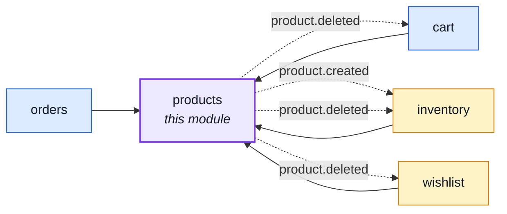
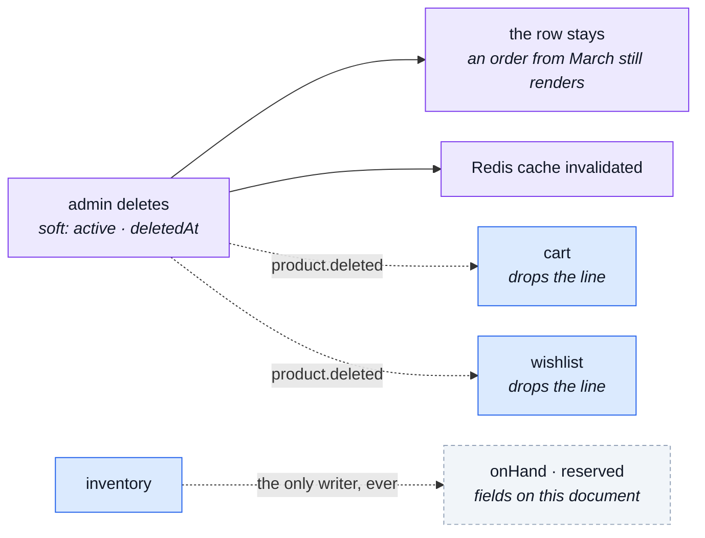

# products

::: tip At a glance
**Owns** — the catalogue: what the shop sells. `onHand`/`reserved`/`available` sit on every product
row too, but as a read-only mirror — [`inventory`](./inventory.md) owns the counters themselves.
**Depends on** — nothing. It is the leaf four other domains conform to.
**Breaks if you change** — `productSchema`. `orders` embeds it, so an order's history is literally this shape.
:::

## Its neighbourhood

<!-- module-graph:products:start -->

_Solid arrows are imports. Dotted arrows are domain events — the return path an import
graph cannot see._

```mermaid
%%{init: {'flowchart': {'nodeSpacing': 30, 'rankSpacing': 60}}}%%
flowchart LR
    products["products<br/><i>this module</i>"]
    cart["cart"]
    inventory["inventory"]
    orders["orders"]
    wishlist["wishlist"]

    cart --> products
    inventory --> products
    orders --> products
    wishlist --> products
    products -. "product.deleted" .-> cart
    products -. "product.created" .-> inventory
    products -. "product.deleted" .-> inventory
    products -. "product.deleted" .-> wishlist

    classDef core fill:#dbeafe,stroke:#2563eb,color:#111827;
    classDef supporting fill:#fef3c7,stroke:#d97706,color:#111827;
    classDef generic fill:#dcfce7,stroke:#16a34a,color:#111827;
    classDef centre fill:#ede9fe,stroke:#7c3aed,stroke-width:2px,color:#111827;
    class cart,orders core;
    class inventory,wishlist supporting;
    class products centre;
```

<!-- module-graph:products:end -->

## The story

The catalogue is the model every other context conforms to rather than translates. A cart line, an
order item, a stock movement — each is a statement about a product, which is why this module is
`core` despite doing nothing more interesting than CRUD.

**It depends on nothing, and staying that way was a deliberate decision.** Products genuinely needs
something back: when a product disappears, every cart and wishlist holding it has to drop the
reference. As an import that would be a cycle. As `product.deleted` it is products announcing and
two modules listening, and the arrow still points one way.

::: warning The one field-ownership split worth remembering
`onHand`/`reserved`/`available` live on the product document so a catalogue read needs no join —
but they are a MIRROR, not the source. [`inventory`](./inventory.md) owns the real counters in its
own collection, and the only reason this document carries a copy at all is read performance. A
write to any of the three from anywhere but `inventory`'s own sync is a bug, not a shortcut.
:::

**A shopper sees two flags, not the shelf.** The counters tell a competitor how fast a line sells
and how much is left, so a response carries `onHand`, `reserved` and `available` only for a caller
holding `inventory.any.read` (`canSeeStock` in `services/stock-view.ts`). Everyone else, a guest
included, gets `inStock` (is anything available) and `lowStock` (available at or below
`NODE_LOW_STOCK_THRESHOLD`), derived by `stockFlags` in `domain/stock.ts`. Both flags ride on every
representation, so a client never has to guess from an absent number. A cached public list is
keyed by the caller's reach, so one reader's counters are never served to another.

Deletion is soft by default: `active` and `deletedAt`, with a restore route, because an order that
embedded a product still has to render months later. An admin can still ask for a hard delete
(`hardDelete: true`), which destroys the row outright — see
[Removing or deactivating a product](#removing-or-deactivating-a-product) for what a hard delete
means for the rest of the shop. The `active: 1, deletedAt: 1` index is what makes the public list
cheap while the admin list can still see everything.

## The pipeline

A delete is the interesting path, because it is the one that has to reach back into modules this
one may not import.

```mermaid
%%{init: {'flowchart': {'nodeSpacing': 30, 'rankSpacing': 55}}}%%
flowchart LR
    D["admin deletes<br/><i>soft: active · deletedAt</i>"] --> R["the row stays<br/><i>an order from March still renders</i>"]
    D --> C["Redis cache invalidated"]
    D -. "product.deleted" .-> CA["cart<br/><i>drops the line</i>"]
    D -. "product.deleted" .-> WI["wishlist<br/><i>drops the line</i>"]
    IN["inventory"] -.->|"the only writer, ever"| ST["onHand · reserved<br/><i>fields on this document</i>"]

    classDef own fill:#ede9fe,stroke:#7c3aed,color:#111827;
    classDef peer fill:#dbeafe,stroke:#2563eb,color:#111827;
    classDef note fill:#f1f5f9,stroke:#94a3b8,color:#111827,stroke-dasharray:4 3;
    class D,R,C own;
    class CA,WI,IN peer;
    class ST note;
```

## Removing or deactivating a product

A delete (soft or hard) and a deactivation (an update that flips `active` to `false`) both mean the
product can no longer be **newly** sold, and neither reaches back into an order already placed:

- [`inventory`](./inventory.md) deletes the product's `stocklevels` row on a hard delete; a
  deactivation leaves the counters alone, since the product still exists and might come back.
- `orders` and `payments` do nothing: an order placed while the product was sellable treats it as
  present afterwards. It stays `pending`, nobody is emailed, and the buyer can still pay it, by card
  or offline. A real problem with such an order is an admin's to cancel by hand.
- `cart` and `wishlist` drop the line and announce whose lists held it, so
  [`notifications`](./notifications.md) can tell those users. `product.deleted` carries `titles`
  (the name in every language, locale → title) for exactly that: it is read before a hard delete
  drops the translation rows, because once the event fires the product is gone and nothing else
  could name it. A soft delete carries them too.
- `cart`'s checkout still refuses a basket holding an inactive or deleted product, and
  `CART_PRODUCT_UNAVAILABLE` carries `details.lines` naming exactly which lines are affected,
  instead of leaving the client to work it out. That guard is about a NEW purchase; once an order
  exists the product counts as present.

## Configuration

| Variable                | Default | Meaning                                                                                                                               |
| ----------------------- | ------- | ------------------------------------------------------------------------------------------------------------------------------------- |
| `NODE_VAT_RATE_DEFAULT` | `0.22`  | The rate charged on a product with no `taxClass` — every product's fallback. Range-checked at boot: outside `[0, 1)` refuses to start |
| `NODE_VAT_RATE_REDUCED` | `0.1`   | The rate charged on a product whose `taxClass` is `reduced`. Same boot-time range check as the default                                |

Both are read per call from one slice (`config.ts`), which parses a set value through a
whole-string-decimal grammar and refuses anything outside `[0, 1)` — at boot, and by the slice itself
on its one parse — so a value the gate accepts is never one the reader would then silently fall back on. `resolveTaxRate` (`./tax`) is the one place either rate is resolved for a
product; `orders` freezes the result onto an order line at checkout and never reads a rate itself.

The shop's one currency (`NODE_DEFAULT_CURRENCY`, documented under
[payments](./payments.md)) is published on `GET /products/settings` as `{ currency }`, public and
uncached. It is a shop setting, not a product field (Shopify's `shop.currency`): a create form has
no product yet to read `currency` from, and needs it to size the price input to that currency's
minor unit. Read through `productCurrency()`, never `orders`' own reader, for the cycle reason
that function's docblock gives.

## Translated content

`title`/`description` are not columns this module resolves on its own. They live as per-locale rows
in the `translations` collection [`locales`](./locales.md) owns (`entityType: 'product'`) — one row
per language, the fallback language included, no special-cased "source" row.

Every read resolves them onto the wire shape: `search()` and `getById()` in
`src/modules/products/services/{search,read}.ts` call `applyTranslations('product', …)`, which overlays the
caller's `Accept-Language` chain — exact tag, base language, then the deployment's fallback — over
an already-serialized page in one batched query. See
[Internationalisation](../tools/i18n.md#tier-3-user-authored-content) for the resolve/fallback path.

::: warning The document's own `title`/`description` are a derived index column, not the wire shape
`productSchema`'s `title`/`description` (`src/modules/products/model.ts`) exist only so Mongo has
something to sort, and something to run free-text search against (`productRepository`'s
`createRepository` call, its `searchable.text`/`regex` options). [`inventory`](./inventory.md)'s
stock board does not join against it — it composes its own `stocklevels` read with a separate call
to this module for titles, the same "the service is the door" rule everything else here follows.
They are written only when the
FALLBACK-locale translation row changes, never read back into an API response: a public read
always goes through the resolver above.
:::

### Writing translated content

`POST /products`, `PUT /products/{id}` and `PATCH /products/{id}` all take a `translations` map
keyed by locale instead of a flat `title`/`description`. The fallback locale's entry is required
and non-null on `POST` — a new product needs something to fall back to. On `PUT` and `PATCH` it is
optional (an absent key leaves that locale untouched: a translations table is keyed sub-resources,
not a field a whole-body replace can null out) but never `null` — deleting the one locale every
other read falls back to would leave the product with nothing. Every other locale is always
optional, and `null` on an existing one (never the fallback) deletes its row.
`src/modules/products/services/translated-write.ts`'s `writeCreate`/`writeUpdate` validate the whole batch
(`planTranslations`, the `@kernel/translation` port) before writing anything, then write the
product and its rows in the same operation; `getAdmin` backs `GET /products/{id}/admin`, the one
read that returns every language at once rather than the caller's resolved one — what the editor's
form populates its tabs from.

This is a different door from the generic one — see
[`locales`](./locales.md#the-generic-translations-door-and-why-it-s-not-the-only-one): only
`/products/{id}`
may also touch price, stock flags and the image.

### Order line snapshots freeze the resolved words

An order line embeds a product snapshot at the buyer's locale rather than a live reference, and
freezes which locale it was resolved into alongside it — `orderLineProductSchema` and
`OrderDocumentItem.locale` in `src/modules/orders/model.ts`. `src/modules/orders/services/`'s
snapshot resolver does the resolving, bound explicitly to the buyer's locale with `runWithLocale`
rather than read off the ambient request context, since the order being created is not always the
buyer's own request.

## Related pages

- [Modules overview](./index.md) — the whole context map
- [`locales`](./locales.md) — the `translations` collection and its own admin door
- [Internationalisation](../tools/i18n.md) — the resolve/fallback mechanism translated content runs on
- [MongoDB & Mongoose](../tools/mongodb-mongoose.md) — what a repository and a model are
- [Strategic DDD](../theory/strategic-ddd.md) — why `conformist` is the label on four of the arrows pointing here
- [Events & Logging](../tools/events-and-logging.md) — the bus `product.deleted` travels on
- [Contract Ownership & Fragmentation](../api/contract-fragmentation.md) — how this module's `openapi.yaml` reaches the root document
