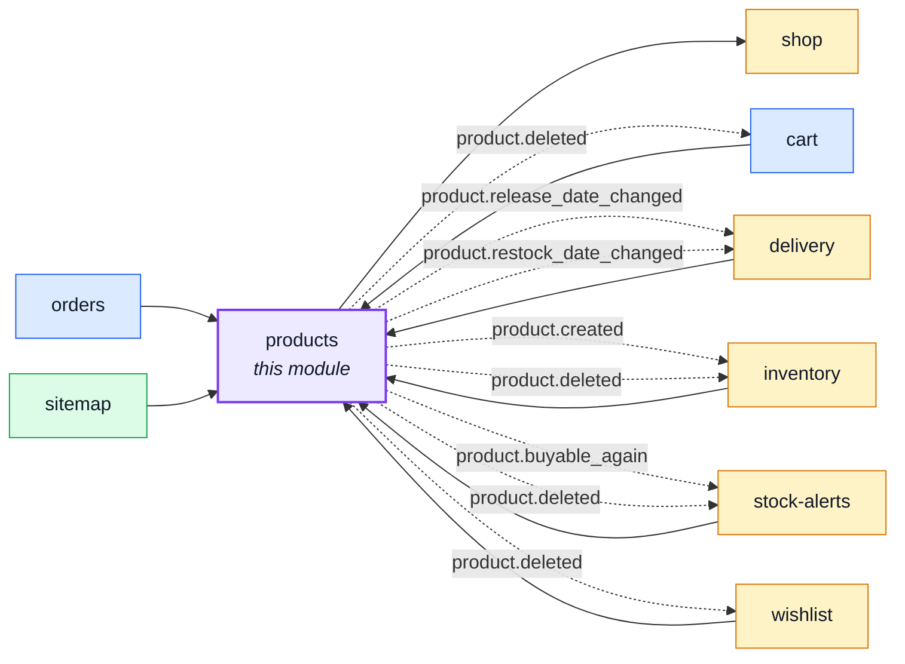
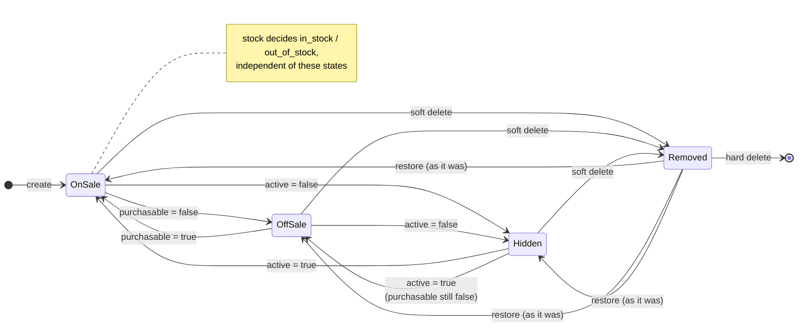
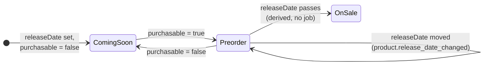
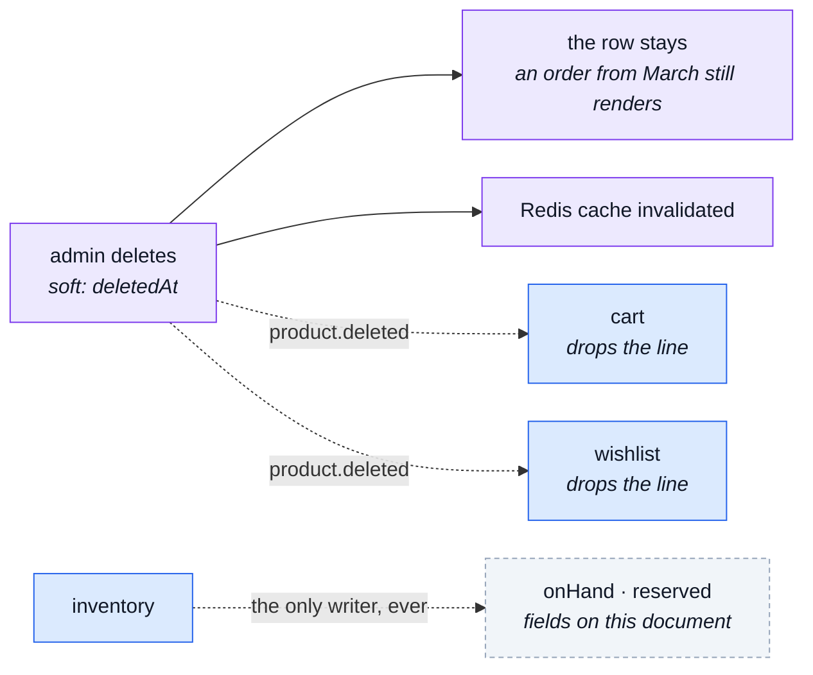

# products

::: tip At a glance
**Owns** — the catalogue: what the shop sells. `onHand`/`reserved`/`available` sit on every product
row too, but as a read-only mirror — [`inventory`](./inventory.md) owns the counters themselves.
**Depends on** — only [`shop`](./shop.md), for the currency. It is the leaf several domains read as it is.
**Breaks if you change** — `productSchema`. `orders` embeds it, so an order's history is literally this shape.
:::

## Its neighbourhood

<!-- module-graph:products:start -->

_Solid arrows are imports. Dotted arrows are domain events — the return path an import
graph cannot see._


```mermaid
%%{init: {'flowchart': {'nodeSpacing': 30, 'rankSpacing': 60}}}%%
flowchart LR
    products["products<br/><i>this module</i>"]
    cart["cart"]
    delivery["delivery"]
    inventory["inventory"]
    orders["orders"]
    shop["shop"]
    sitemap["sitemap"]
    stock_alerts["stock-alerts"]
    wishlist["wishlist"]

    cart --> products
    delivery --> products
    inventory --> products
    orders --> products
    sitemap --> products
    stock_alerts --> products
    wishlist --> products
    products --> shop
    products -. "product.deleted" .-> cart
    products -. "product.release_date_changed" .-> delivery
    products -. "product.restock_date_changed" .-> delivery
    products -. "product.created" .-> inventory
    products -. "product.deleted" .-> inventory
    products -. "product.buyable_again" .-> stock_alerts
    products -. "product.deleted" .-> stock_alerts
    products -. "product.deleted" .-> wishlist

    classDef core fill:#dbeafe,stroke:#2563eb,color:#111827;
    classDef supporting fill:#fef3c7,stroke:#d97706,color:#111827;
    classDef generic fill:#dcfce7,stroke:#16a34a,color:#111827;
    classDef centre fill:#ede9fe,stroke:#7c3aed,stroke-width:2px,color:#111827;
    class cart,orders core;
    class delivery,inventory,shop,stock_alerts,wishlist supporting;
    class sitemap generic;
    class products centre;
```

<!-- module-graph:products:end -->

## The story

The catalogue is the model every other context conforms to rather than translates. A cart line, an
order item, a stock movement — each is a statement about a product, which is why this module is
`core` despite doing nothing more interesting than CRUD.

**It depends on nothing, deliberately.** Products genuinely needs
something back: when a product disappears, every cart and wishlist holding it has to drop the
reference. As an import that would be a cycle. As `product.deleted` it is products announcing and
two modules listening, and the arrow still points one way.

::: warning The one field-ownership split worth remembering
`onHand`/`reserved`/`available` live on the product document so a catalogue read needs no join —
but they are a MIRROR, not the source. [`inventory`](./inventory.md) owns the real counters in its
own collection, and the only reason this document carries a copy at all is read performance. A
write to any of the three from anywhere but `inventory`'s own sync is a bug, not a shortcut.
:::

**A shopper sees two flags, not the shelf.** The counters tell a competitor how fast a line sells
and how much is left, so a response carries `onHand`, `reserved` and `available` only for a caller
holding `read:StockLevel` (`canSeeStock` in `services/stock-view.ts`). Everyone else, a guest
included, gets `inStock` (is anything available) and `lowStock` (available at or below
`NODE_LOW_STOCK_THRESHOLD`), derived by `stockFlags` in `domain/stock.ts`. Both flags ride on every
representation, so a client never has to guess from an absent number. A cached public list is
keyed by the caller's reach, so one reader's counters are never served to another.

**A new product has no stock.** `POST /products` takes no `onHand` (a body naming one is refused
`422`): stock is not a product field, and units enter only through `POST /inventory/receipts`, which
leaves a ledger row and needs `create:StockMovement`. The product form of a caller who holds that key
creates the product and then receives the opening count with an `Idempotency-Key`; if the second
call fails the product stays at zero, a valid state, and the page says to add stock from Inventory.

**An edit says what it changed.** `admin.product.updated` carries `metadata.changes` with `{ from, to }`
for every non-text field an update (PUT or PATCH) actually moved, `null` meaning unset: `price`,
`taxClass`, `rateType`, `active`, `purchasable`, `allowBackorder`, `weight`, `requiresShipping`,
`noWithdrawal`, `sku`, `categories`, `tags`, `releaseDate` and `restockDate`. Those decide what a
buyer pays, what VAT is charged, what shipping weighs, the buyer's right of withdrawal and whether
the product is published or on sale, so "who removed the withdrawal right on Tuesday" and "lower,
sell, restore" are readable from the audit trail instead of rebuilt from frozen order lines.
Free text and the picture are recorded by name only, as `metadata.changedFields` (`title`,
`description`, `image`): the trail never copies catalogue prose. The rule is the same for every
non-text field, so a field added later is covered by default. A value sent unchanged, or a field
left out, writes nothing.

Deletion is soft by default: it stamps `deletedAt` (and leaves `active` alone), with a restore route, because an order that
embedded a product still has to render months later. An admin can still ask for a hard delete
(`hardDelete: true`), which destroys the row outright — see
[Hiding, taking off sale, removing](#hiding-taking-off-sale-removing) for what a hard delete
means for the rest of the shop. The `active: 1, deletedAt: 1` index is what makes the public list
cheap while the admin list can still see everything.

## Product states

Three independent questions, three fields. Stock is the third axis and is unchanged.

| Field                 | Question                       | `false` / set means                        |
| --------------------- | ------------------------------ | ------------------------------------------ |
| `active`              | Can a shopper see it?          | hidden: 404 for shoppers, visible to staff |
| `purchasable`         | Can it be bought, stock aside? | listed, "Not available right now"          |
| `releaseDate`         | When does it ship from?        | a future date makes it a preorder          |
| `available` (derived) | Is there stock?                | `0`: sold out                              |
| `deletedAt`           | Was it removed?                | gone; carts and wishlists drop it          |

`purchasable` is ignored while `active` is `false`: hidden wins. `active` means visibility and
nothing else, the same meaning it has on users and languages.


```mermaid
stateDiagram-v2
    direction LR
    [*] --> OnSale: create
    OnSale --> OffSale: purchasable = false
    OffSale --> OnSale: purchasable = true
    OnSale --> Hidden: active = false
    OffSale --> Hidden: active = false
    Hidden --> OnSale: active = true
    Hidden --> OffSale: active = true<br/>(purchasable still false)
    OnSale --> Removed: soft delete
    OffSale --> Removed: soft delete
    Hidden --> Removed: soft delete
    Removed --> OnSale: restore (as it was)
    Removed --> OffSale: restore (as it was)
    Removed --> Hidden: restore (as it was)
    Removed --> [*]: hard delete
    note right of OnSale
        stock decides in_stock / out_of_stock,
        independent of these states
    end note
```

What each state does to the rest of the shop:

| State    | Catalogue (shopper) | Cart / wishlist line       | New add | Checkout      | Placed orders |
| -------- | ------------------- | -------------------------- | ------- | ------------- | ------------- |
| On sale  | listed              | `in_stock` / stock values  | ok      | stock decides | untouched     |
| Off sale | listed, flagged     | `unavailable`              | ok      | refused       | untouched     |
| Hidden   | 404                 | `removed`, kept            | 404     | refused       | untouched     |
| Removed  | 404                 | pulled (`product.deleted`) | 404     | n/a           | untouched     |

Who sees a hidden product is settled by `display:Product` (`manager`, `warehouse`, `editor`,
`admin`); an off-sale product is public, so `GET /products?purchasable=` is open to everyone. The
line values and their precedence live in [cart](./cart.md#line-availability).

### Preorder

A preorder is a product sold before it is released. It is derived, never stored:

```
preorder = active && purchasable && releaseDate > now
```

The day the date passes the product stops being one, with no job to run (BigCommerce and
WooCommerce auto-revert the same way). `releaseDate` is "ships from", an ISO 8601 date-time at most
one year ahead (Google's `availability_date` rule); a date in the past is accepted and means
"released". `null` clears it; a `PUT` that omits it clears it too.


```mermaid
stateDiagram-v2
    direction LR
    [*] --> ComingSoon: releaseDate set,<br/>purchasable = false
    ComingSoon --> Preorder: purchasable = true
    Preorder --> ComingSoon: purchasable = false
    Preorder --> Preorder: releaseDate moved<br/>(product.release_date_changed)
    Preorder --> OnSale: releaseDate passes<br/>(derived, no job)
```

| Piece                             | Owner       | What it does                                                          |
| --------------------------------- | ----------- | --------------------------------------------------------------------- |
| `releaseDate`, derived `preorder` | `products`  | the catalogue fact; a preorder is never "running low"                 |
| allowance and allocation          | `inventory` | `backorderLimit` caps how many can be ordered; receipts allocate them |
| the "ships from" promise          | `delivery`  | one fulfillment order per release day, on hold until stock arrives    |

A preorder's `available` (and with it `inStock`) counts the **allowance**, not the shelf: what is
left of `backorderLimit` after the units already claimed, so the product reads sold out the day the
allowance is full, and out of stock until staff set one (a new product's allowance is 0). The two
numbers are `inventory`'s, copied onto the product beside `onHand` and `reserved` by the same
`syncStockCache` door, and never sent to a client.

Moving the date announces `product.release_date_changed` through the outbox, in the edit's own
transaction and only when the instant actually changed. `delivery` listens: buyers who already paid
were promised the old date, and consumer law decides what they must be told (see
[delivery](./delivery.md#preorders-and-a-moved-date)). The edit form can [preview the
count](./delivery.md#previewing-a-move-before-it-is-saved) first.

### Industry mapping

Not stored; how these states translate if a feed or JSON-LD is ever emitted.

| Ours               | schema.org `availability` | Google feed           |
| ------------------ | ------------------------- | --------------------- |
| on sale, stock > 0 | `InStock`                 | `in_stock`            |
| on sale, stock 0   | `OutOfStock`              | `out_of_stock`        |
| off sale           | `OutOfStock`              | `out_of_stock`        |
| hidden / removed   | (not emitted)             | removed from the feed |

## Backorder

A released product the shop keeps selling while it is out of stock. Three fields and one derived flag:

| Field            | Meaning                                                                                        |
| ---------------- | ---------------------------------------------------------------------------------------------- |
| `allowBackorder` | the switch, off by default                                                                     |
| `restockDate`    | optional, at most a year ahead; without it the shop promises "within 30 days"                  |
| `backorder`      | derived, never stored: switch on, released, visible and buyable, date not passed, cap has room |

**A passed restock date reads sold out**, until staff set a new date or clear it. A missed date is
evidence the shop lacks a basis to promise another one. Moving the date later tells the buyers who
were promised it, by the same rule as a moved release date; a buyer promised the 30-day default is
left alone, whatever the catalogue does.

`product.buyable_again` is the signal [`stock-alerts`](./stock-alerts.md) listens to: it fires once when
the product flips from not orderable to orderable, in the transaction of the write that caused it.
A preorder whose release date passes is never written to, so no signal fires for it: the hourly
`sweep:stock-alerts` job in `stock-alerts` answers its waiting requests instead.

## The pipeline

A delete is the interesting path, because it is the one that has to reach back into modules this
one may not import.


```mermaid
%%{init: {'flowchart': {'nodeSpacing': 30, 'rankSpacing': 55}}}%%
flowchart LR
    D["admin deletes<br/><i>soft: deletedAt</i>"] --> R["the row stays<br/><i>an order from March still renders</i>"]
    D --> C["Redis cache invalidated"]
    D -. "product.deleted" .-> CA["cart<br/><i>drops the line</i>"]
    D -. "product.deleted" .-> WI["wishlist<br/><i>drops the line</i>"]
    IN["inventory"] -.->|"the only writer, ever"| ST["onHand · reserved<br/><i>fields on this document</i>"]

    classDef own fill:#ede9fe,stroke:#7c3aed,color:#111827;
    classDef peer fill:#dbeafe,stroke:#2563eb,color:#111827;
    classDef note fill:#f1f5f9,stroke:#94a3b8,color:#111827,stroke-dasharray:4 3;
    class D,R,C own;
    class CA,WI,IN peer;
    class ST note;
```

## Hiding, taking off sale, removing

Hiding (`active: false`), taking off sale (`purchasable: false`) and removing (soft or hard delete)
all mean the product can no longer be **newly** sold. None of them reaches back into an order
already placed, and none of them cancels one: an order is a contract snapshot, and the only
automatic cancel is an unpaid order timing out (the reservation expiry, in
[`inventory`](./inventory.md#reservations) and [`orders`](./orders.md)).

- [`inventory`](./inventory.md) deletes the product's `stocklevels` row on a hard delete; hiding
  and taking off sale leave the counters alone, since the product still exists and might come back.
- `orders` and `payments` do nothing: an order placed while the product was sellable treats it as
  present afterwards. It stays `pending`, nobody is emailed, and the buyer can still pay it, by card
  or offline. A real problem with such an order is an admin's to cancel by hand. No event is emitted
  for hiding or taking off sale: nothing would listen.
- `product.deleted` is written to the [outbox](../tools/outbox.md) in the transaction that deletes
  (soft or hard, `aggregateId` = the product), so it exists exactly when the delete committed and
  is retried until every subscriber has handled it. The cascade lands just after the response.
- Only a delete pulls lines. `cart` and `wishlist` drop the line and announce whose lists held it,
  so [`notifications`](./notifications.md) can tell those users. `product.deleted` carries `titles`
  (the name in every language, locale → title) for exactly that: it is read before a hard delete
  drops the translation rows, because once the event fires the product is gone and nothing else
  could name it. A soft delete carries them too.
- A **hidden** product's line stays in the cart and the wishlist, reads `removed` with no title,
  and comes back to a stock value if the product is shown again. An **off-sale** product's line
  stays too, reads `unavailable`, and is added to a cart like a sold-out product.
- `cart`'s checkout refuses both. A hidden or deleted product answers `CART_PRODUCT_UNAVAILABLE`;
  an off-sale one joins the stock refusal `CART_INSUFFICIENT_STOCK`. Each carries `details.lines`
  naming exactly which lines are affected (with an `availability` on the stock refusal), instead of
  leaving the client to work it out. That guard is about a NEW purchase; once an order exists the
  product counts as present.

## Configuration

| Variable                   | Default  | Meaning                                                                                                                                                                                                          |
| -------------------------- | -------- | ---------------------------------------------------------------------------------------------------------------------------------------------------------------------------------------------------------------- |
| `NODE_VAT_RATE_DEFAULT`    | required | The rate charged on a product with no `taxClass` — every product's fallback. Required at boot and range-checked: unset, or outside `[0, 1)`, refuses to start. `0.22` is only the `NODE_ENV=test` default        |
| `NODE_VAT_RATE_REDUCED`    | required | The rate charged on a product whose `taxClass` is `reduced`. Required and range-checked at boot like the default; `0.1` is only the `NODE_ENV=test` default                                                      |
| `NODE_LOW_STOCK_THRESHOLD` | `5`      | Availability at or under which `lowStock` is true. The same variable `inventory` reads for its stock board (one `stockConfig` slice in `src/infrastructure/runtime/config.ts`), so the badge and the board agree |

Both are read per call from one slice (`config.ts`), which parses a set value through a
whole-string-decimal grammar and refuses anything outside `[0, 1)` — at boot, and by the slice itself
on its one parse — so a value the gate accepts is never one the reader would then silently fall back on. `resolveTaxRate` (`./tax`) is the one place either rate is resolved for a
product; `orders` freezes the result onto an order line at checkout and never reads a rate itself.

The shop's one currency (`NODE_DEFAULT_CURRENCY`) belongs to [shop](./shop.md), which publishes it on
`GET /shop`. A create form has no product yet to read `currency` from, and needs it to size the price
input to that currency's minor unit. Read through `shopCurrency()`.

A price may have no more decimal places than that currency's minor unit (ISO 4217, pinned in
`domain-primitives/money.ts`): 19.999 EUR is a 422 on create, `PUT` and `PATCH`, because it would be
stored as typed and charged as 20.00. The price is stored as a `Decimal128`
([Money at rest](../theory/tactical-ddd.md#at-rest-decimal128)); the API still sends a plain number.

## Translated content

`title`/`description` are not columns this module resolves on its own. They live as per-locale rows
in the `translations` collection [`locales`](./locales.md) owns (`entityType: 'product'`) — one row
per language, the fallback language included, no special-cased "source" row.

Every read resolves them onto the wire shape: `search()` and `getById()` in
`src/modules/products/services/{search,read}.ts` call `applyTranslations('product', …)`, which overlays the
caller's negotiated language chain — exact tag, base language, then the deployment's fallback — over
an already-serialized page in one batched query. The language is the one the API negotiated from
`Accept-Language` among the languages that are switched on, a deployed file or a registered row
([one language per request](../tools/i18n.md#one-language-per-request)), not the raw header; text in
a language that is switched off is never part of the chain
([a draft language](./locales.md#a-draft-language)). See
[Internationalisation](../tools/i18n.md#tier-3-user-authored-content) for the resolve/fallback path.

::: warning The document's own `title`/`description` are a derived index column, not the wire shape
`productSchema`'s `title`/`description` (`src/modules/products/model.ts`) exist only so Mongo has
something to sort, and something to run free-text search against (`productRepository`'s
`createRepository` call, its `searchable.text`/`regex` options). [`inventory`](./inventory.md)'s
stock board does not join against it — it composes its own `stocklevels` read with a separate call
to this module for titles, the same "the service is the door" rule everything else here follows.
They are written only when the
FALLBACK-locale translation row changes, never read back into an API response: a public read
always goes through the resolver above.
:::

### Writing translated content

`POST /products`, `PUT /products/{id}` and `PATCH /products/{id}` all take a `translations` map
keyed by locale instead of a flat `title`/`description`. The fallback locale's entry is required
and non-null on `POST` — a new product needs something to fall back to. A `PUT` states the whole
map, like every other field: a locale it omits is deleted, and the fallback locale is required, so
the product always keeps something to fall back to. On `PATCH` the fallback entry is optional (an
absent key leaves that locale untouched) but never `null` — deleting the one locale every other read
falls back to would leave the product with nothing. Every other locale is optional, and `null` on an
existing one (never the fallback) deletes its row.
`src/modules/products/services/translated-write.ts`'s `create`/`updateById` validate the whole batch
(`planTranslations`, the `@kernel/translation` port) before writing anything, then write the
product and its rows in the same operation; `getAdmin` backs `GET /products/{id}/admin`, the one
read that returns every language at once rather than the caller's resolved one — what the editor's
form populates its tabs from.

This is a different door from the generic one — see
[`locales`](./locales.md#the-generic-translations-door-and-why-it-s-not-the-only-one): only
`/products/{id}`
may also touch price, stock flags and the image.

### Order line snapshots freeze the resolved words

An order line embeds a product snapshot at the buyer's locale rather than a live reference, and
freezes which locale it was resolved into alongside it — `orderLineProductSchema` and
`OrderDocumentItem.locale` in `src/modules/orders/model.ts`. `src/modules/orders/services/`'s
snapshot resolver does the resolving, bound explicitly to the buyer's locale with `runWithLocale`
rather than read off the ambient request context, since the order being created is not always the
buyer's own request.

## Who can do what

Every rule this module declares and who holds it, role by role. The rule is what a route guard asks for; the set is what a role lists.

<!-- permissions:start -->

| Rule              | Set                 | `guest` | `unverified` | `customer` | `manager` | `warehouse` | `support` | `editor` | `moderator` | `admin` | `operator` | Credential | What it lets them do                                                             |
| ----------------- | ------------------- | ------- | ------------ | ---------- | --------- | ----------- | --------- | -------- | ----------- | ------- | ---------- | ---------- | -------------------------------------------------------------------------------- |
| `read:Product`    | `ProductStorefront` | ✅      | ✅           | ✅         | ✅        | ✅          | ✅        | ✅       | ✅          | ✅      | —          | ✅         | Read active, undeleted products — the storefront's own view.                     |
| `display:Product` | `ProductDisplay`    | —       | —            | —          | ✅        | ✅          | —         | ✅       | —           | ✅      | —          | ✅         | Read every product regardless of publish state — what staff need to see a draft. |
| `create:Product`  | `ProductManagement` | —       | —            | —          | ✅        | —           | —         | ✅       | —           | ✅      | —          | ✅         | Add a product to the catalogue.                                                  |
| `update:Product`  | `ProductManagement` | —       | —            | —          | ✅        | —           | —         | ✅       | —           | ✅      | —          | ✅         | Change a product, including its price and its published state.                   |
| `delete:Product`  | `ProductManagement` | —       | —            | —          | ✅        | —           | —         | ✅       | —           | ✅      | —          | ✅         | Remove a product. Separate from update because the blast radius is.              |

✅ held · `own` only the caller’s own rows · ⚡c / ⚡s needs a freshly proved session (critical / sensitive) ·
Credential: ✅ when an API key can be minted with the rule. Generated from the rules and sets in
`src/modules/*/authorization.yaml` and the roles in `shared/authorization-roles.yaml`, asked of the
evaluator — [Authorization](../theory/authorization.md) explains the model.

<!-- permissions:end -->

## Related pages

- [Modules overview](./index.md) — the whole context map
- [`locales`](./locales.md) — the `translations` collection and its own admin door
- [Internationalisation](../tools/i18n.md) — the resolve/fallback mechanism translated content runs on
- [MongoDB & Mongoose](../tools/mongodb-mongoose.md) — what a repository and a model are
- [Strategic DDD](../theory/strategic-ddd.md) — why `conformist` is the label on the `cart → products` arrow, the one this module's pages document
- [Events & Logging](../tools/events-and-logging.md) — the bus `product.deleted` travels on
- [Contract Ownership & Fragmentation](../api/contract-fragmentation.md) — how this module's `openapi.yaml` reaches the root document
