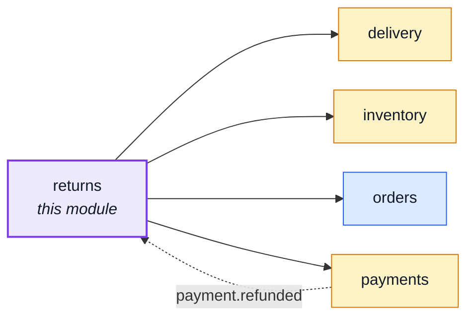
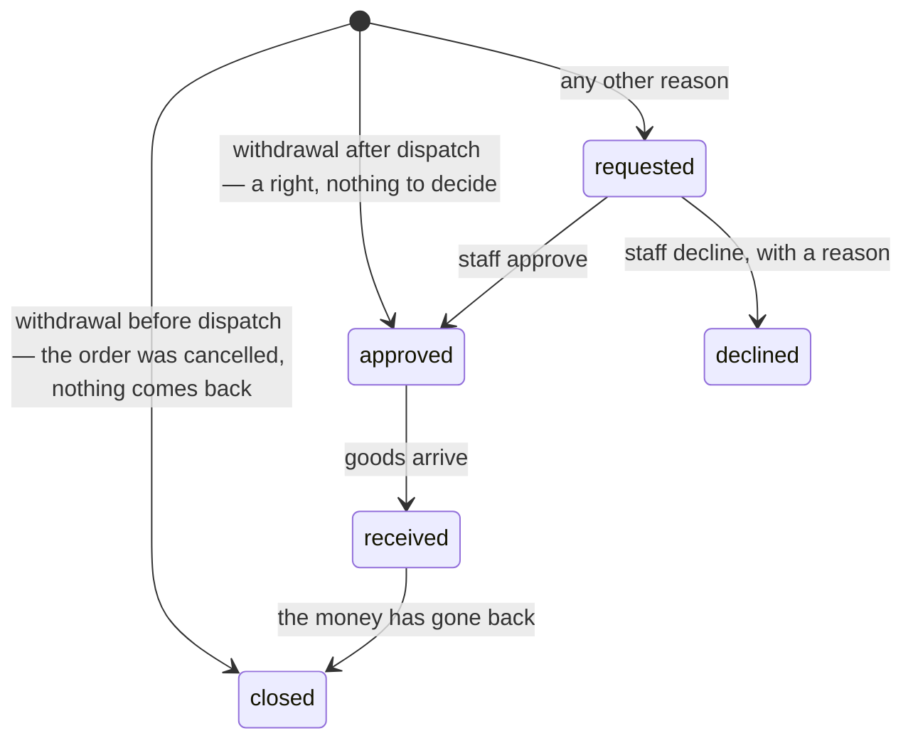
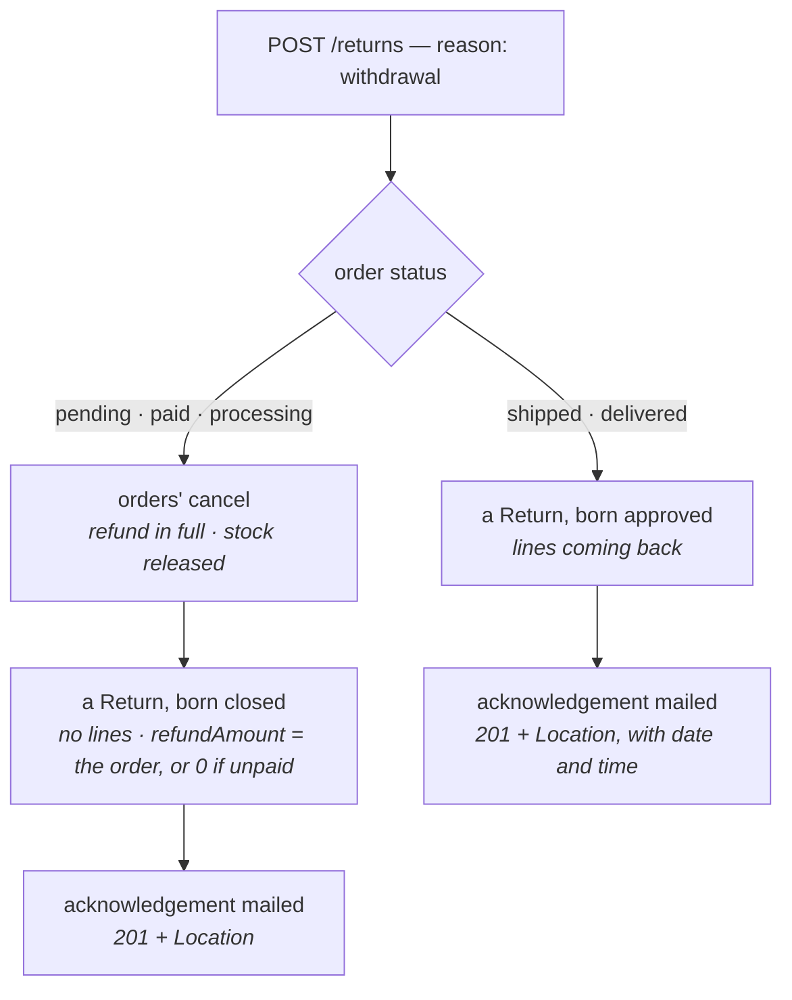

# returns

::: tip At a glance
**Owns** — the `Return` collection, outright: the request to send goods back, its lines, and where it
stands. A withdrawal is one of these.
**Depends on** — [`orders`](./orders.md) (the order a return is about, its owner, and the cancel a
withdrawal before dispatch becomes), [`inventory`](./inventory.md) (received goods back on sale),
[`payments`](./payments.md) (the refund, and `payment.refunded` closing the return) and
[`delivery`](./delivery.md) (the delivery a withdrawal refunds).
**Breaks if you change** — `orders`' `OrderActions.withdraw`/`withdrawUntil` (the button reads them)
and `cancelById`'s `withdrawal` option; `payments`' `refundForReturn` and the `returnId` on a refund.
:::

## Its neighbourhood

<!-- module-graph:returns:start -->

_Solid arrows are imports. Dotted arrows are domain events — the return path an import
graph cannot see._



<!-- module-graph:returns:end -->

## The story

Since 19 June 2026 an online shop in the EU must offer a "withdraw from contract here" button for
the whole withdrawal period, with a confirmation step and an acknowledgement on a durable medium
(Consumer Rights Directive Art. 11a, added by Directive 2023/2673). `docs/demo-ecommerce/scope.md`
promised it; this module is the promise kept.

The first draft treated the button as a feature. It is not. In Shopify, Medusa and commercetools it
is **a Return whose `reason` is `withdrawal`** — the same object a faulty-goods return uses, with a
legal deadline and an acknowledgement attached. So there is no separate endpoint: the button is
`POST /returns`.

Three objects, each owned once:

| Object                 | Owns                                                                        | Lives in                                   |
| ---------------------- | --------------------------------------------------------------------------- | ------------------------------------------ |
| **Return**             | the _request_: lines, reason, state                                         | this module                                |
| **Refund**             | the _money_: one record per attempt, on the payment                         | [`payments`](./payments.md#refund-records) |
| **Status projections** | `paymentStatus`, `fulfillmentStatus`, `returnStatus` beside the order's own | [`orders`](./orders.md)                    |

## The lifecycle



Every move is one conditional write from the statuses that may precede it
(`src/modules/returns/domain/lifecycle.ts`), so two staff members deciding the same request race in
the database and exactly one wins — the loser is told it was already decided (409). The one move
that is not conditional is the first: a withdrawal before dispatch is written `closed` at birth.

## The withdrawal button

The button is **server-driven**: `OrderActions.withdraw` says whether to show it and
`OrderActions.withdrawUntil` says until when. `OrderActions`' own description states the doctrine — a
client must not re-implement the lifecycle, because "a second copy in a separately deployed client is
how the two come to disagree". The frontend never counts the days. The clock itself is
[`orders`'](./orders.md#the-withdrawal-window).

The call always answers one thing: **201 and a `Return`** (the Stripe and GitHub rule: one resource
per endpoint). Where the goods are decides what that record is:



- **Before dispatch the Return is a record, not a flow.** The order is still in the shop's hands, so
  `orders`' cancel already does everything — refund in full, release the stock hold. The Return
  written beside it is **closed at birth** (`reason: withdrawal`, `decidedAt` and `closedAt` now, no
  `lines` because no goods are expected, `refundAmount` the whole order — zero when nothing was
  paid). It exists so every withdrawal has its own dated record (Art. 11a(3) asks the trader to
  acknowledge the date, time and content), and so `GET /returns?orderId=` answers "what happened to
  my withdrawal" the same way whatever the order's state. The client reloads the order from
  `Return.orderId`.
- **The money does not move through the Return.** The cancel's own refund runs as for any cancel
  (`ORDER_REFUND_OWED`, retried by the order's pending-effect sweep), so its `payment.refunded`
  carries no `returnId`, and `returns` does not close anything on it: the Return was closed already.
  The credit note follows that event as usual.
- **Events:** the order's own `order.cancelled` first, then `return.requested` and `return.closed`
  back to back. A subscriber to `return.closed` therefore also hears about withdrawals that never
  had goods.
- **One mail from this module:** the acknowledgement, with no postage line and no address (nothing
  is posted). `return-closed` is for a return whose goods came back, so it is never sent here. Any
  notice about the money is the refund's, which belongs to `payments`, not to this module.
- An order's `returnStatus` stays `none`: a Return with no lines holds no goods, and
  `projectReturnStatus` ignores it.
- **Only the buyer may do it**, an operator included: the right is the consumer's.
- **The acknowledgement** carries the order, the exact date and time (UTC, spelled out), and who
  pays the postage — Art. 14(1) permits the consumer to bear it only if told beforehand, so the
  same `NODE_RETURN_POSTAGE_PAYER` value drives the copy and is frozen on the return.

## Lines

A return names what comes back: `lines` of `productId` and `quantity`, checked against what the order
held less what earlier non-declined returns already took (`domain/quantities.ts`, pure). No `lines`
means everything still left — the shape of a withdrawal. The title and the gross unit price are
frozen onto the line, so a refund of it reads the same later whatever the catalogue does.

::: warning A known gap
Two returns opened at the same instant for the same units can each pass the quantity check. The
`Idempotency-Key` covers a double click; two different keys racing is adversarial, and what it
gains is a second record for units that already have one — money is capped separately, on the
payment (`amountRefunded`), so it cannot be returned twice.
:::

## Goods with no right of withdrawal

Art. 16 of the Consumer Rights Directive takes the right away from some goods — personalised,
sealed-hygiene or perishable ones. A product carries `noWithdrawal: true` (an admin sets it in the
product form); the flag is **frozen onto each order line at checkout**, like every other line field,
so changing the product later cannot rewrite what a customer was sold.

- A withdrawal that names no lines leaves excluded lines out of what comes back.
- A return that names an excluded line is refused (422, `RETURN_LINES_INVALID`).
- A withdrawal **before dispatch** takes the whole order, so one excluded line keeps it out (422); the
  ordinary cancel is the shop's own policy and is unaffected.
- `OrderActions.withdraw` is `false` on an order made only of excluded goods.
- Excluded units never come back, so they never keep the order from reading `returned` — and a
  return that leaves them behind is never a "full" return, so delivery is not refunded with it.

**Digital content** (Art. 16(m): the right is lost once delivery starts, with the consumer's express
consent) is not modelled: there is no consent step at checkout, and `noWithdrawal` is **not** the
switch for it. Until one is built, the full withdrawal period is the lawful default (Art. 14(4)(b)).

- Accepting the terms, or a pre-ticked box, is not express consent (Commission guidance on Directive
  2011/83/EU), so a clause in the shop's own terms-and-conditions text does not replace the step.
- The step belongs with digital downloads: a marker on the product, the consent, a stamp for when
  supply began, and the Art. 8(7)(b) confirmation.

## The statuses beside the order's own

`orders` cannot import `payments` or `returns`, so it cannot derive the money or the return on read.
Both are **stamped by their owner through `orders`' own service door** (`markPaymentStatus`,
`markReturnStatus`), the way `delivery` reports a shipment. `fulfillmentStatus` needs nothing
outside, so it derives from `status`.

| Field               | Values                                                                   | Stamped by                                                    |
| ------------------- | ------------------------------------------------------------------------ | ------------------------------------------------------------- |
| `paymentStatus`     | `unpaid` · `paid` · `partially_refunded` · `refunded`                    | `payments` (the refund states); `paid`/`unpaid` from `paidAt` |
| `fulfillmentStatus` | `unfulfilled` · `in_progress` · `shipped` · `fulfilled`                  | derived from `status`                                         |
| `returnStatus`      | `none` · `requested` · `in_progress` · `partially_returned` · `returned` | `returns`, after every move (`services/projection.ts`)        |

A stamp is a report of a fact already decided, so a failed one is logged and never undoes the move;
the next move stamps again.

## What the customer gets back

Receiving is where the two clocks meet, and they are kept apart on purpose:

```mermaid
sequenceDiagram
    participant W as warehouse
    participant R as returns
    participant I as inventory
    participant P as payments
    W->>R: POST /returns/{id}/receive
    R->>R: one transaction
    R->>I: approved → received, and one restock per line
    Note over R,I: commit — the goods are back on sale
    R->>P: open a refund carrying the returnId, then ask the provider
    alt the money went back
        P-->>R: settled — return closed
    else the provider refused
        P-->>R: failed, still open
        Note over P,R: the payment sweep retries the same refund; payment.refunded closes the return
    end
```

- **Received is a fact about a parcel; closed is a fact about money.** The status move and the
  restock are ONE transaction, so units are never on the shelf behind a return that reads `approved`
  nor missing from it behind one that reads `received`. Money cannot roll back, so it is not in it:
  the refund is opened on the payment first and carries this return's id, so a refund the provider
  refused is retried by the payment sweep and closes the return when it lands. A return is never stuck
  `received` for a reason nobody is retrying.
- **Restock happens on `received`, not on refund** — two facts, two moments. No reservation is
  claimed: the order's hold was `committed` at payment and stays that way.
- **The amount** is the returned lines at the price the order froze, plus refundable delivery, less
  an optional handling deduction (Art. 14(2)) staff enter at receipt. It is fixed then and shown as
  `refundAmount`. `src/modules/returns/services/refund-amount.ts` is pure integer arithmetic.
- **Delivery is refunded only on a full return** — one carrying every unit on the order — and never
  twice. For a withdrawal it is capped at the cheapest standard delivery the shop offers, so a paid
  express upgrade stays with the shop (Art. 13(2)); on a €150 express order, where standard would
  have been free, the refundable delivery is zero. `pickup` is collection, not delivery, and does
  not count. Goods that were faulty or not what was ordered are the seller's own doing: the whole
  delivery goes back.
- **The refund is clamped to what the payment has left**, so a goodwill refund made earlier can
  never make a return over-refund. The credit note follows the refund
  ([`invoicing`](./invoicing.md)).
- **Return postage** follows `NODE_RETURN_POSTAGE_PAYER`. It changes what the customer is told, not the
  refund: with `consumer` the customer posts at their own cost (Art. 14(1), told beforehand), with
  `shop` the shop covers it.

## GDPR

`personalData` is a required manifest field. A return is keyed by `orderId` and **never** by
`userId`, so `collect` walks `findOwnOrders`'s ids exactly like
[`invoicing`](./invoicing.md#gdpr) does, and no `erase` is needed: `orders`' `detachUserId` already
breaks the link on the order. That is the Art. 17(3)(b)/(e) retention exemption `invoicing`
documents — a return is the same kind of legal record. `POST /account/export` gains a `returns`
section.

## Permissions

There is no `returns.self.*` key: a customer opening or reading their own return needs only to be
signed in, the way an order's own cancel works, and "own" is the ORDER's owner.

| Key                   | Held by                                       | Does                                            |
| --------------------- | --------------------------------------------- | ----------------------------------------------- |
| `returns.any.read`    | manager, warehouse, support, moderator, admin | reads every return                              |
| `returns.any.update`  | manager, support, moderator, admin            | approves or declines a request                  |
| `returns.any.receive` | manager, warehouse, admin                     | records the goods arriving (`stepUp: critical`) |

`receive` is narrower than `update` the way `delivery.any.start` is narrower than
`orders.any.update`: the warehouse holds the parcel and may say it arrived, without being handed the
decision of whether the return was owed.

## Configuration

| Variable                      | Default | Meaning                                |
| ----------------------------- | ------- | -------------------------------------- |
| `NODE_RETURNS_RATE_LIMIT_MAX` | `20`    | Returns opened per window, per account |

The return address (`NODE_RETURN_ADDRESS_*`) and who pays postage (`NODE_RETURN_POSTAGE_PAYER`) are
[`orders`'s](./orders.md#shop-identity). The postage payer is frozen on each return when it opens.

## Related pages

- [`orders`](./orders.md) — the withdrawal clock and the cancel a pre-dispatch withdrawal becomes
- [`payments`](./payments.md#refund-records) — the money side
- [`invoicing`](./invoicing.md) — the credit note a refund issues
