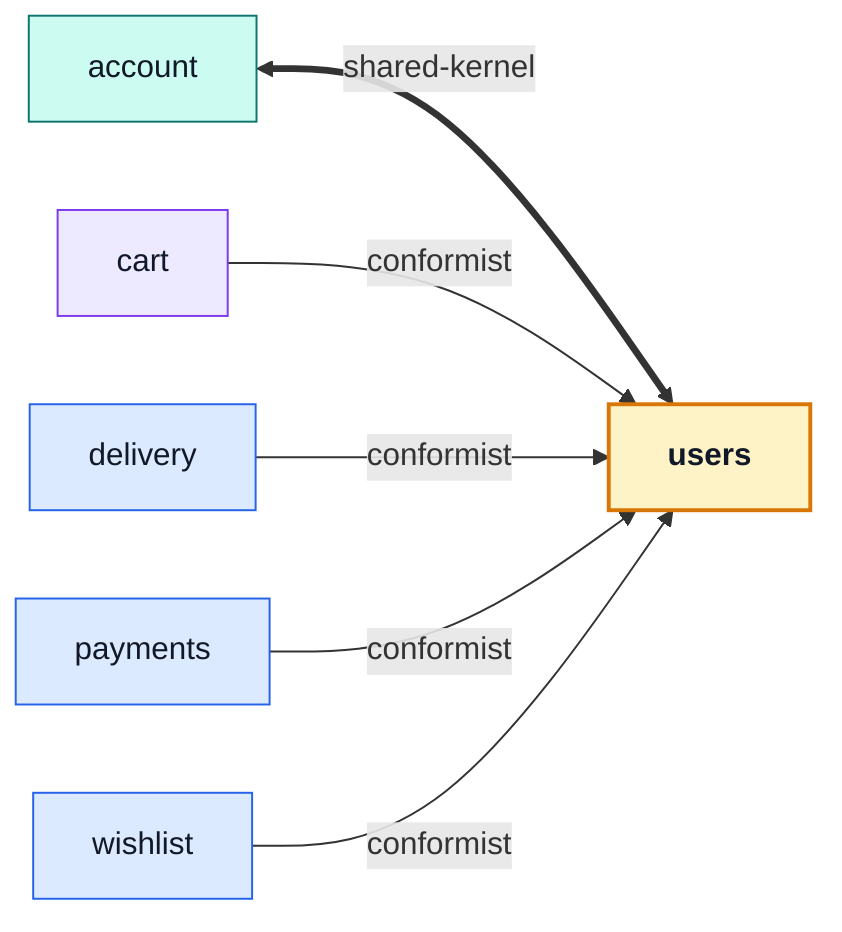

# users

::: tip At a glance
**Owns** — the user record: email, password hash, admin flag, and the reset/refresh tokens hanging off it.
**Depends on** — nothing. Authentication is next door in [`account`](./account.md).
**Breaks if you change** — the `tokens` subdocument. `account` reads and writes it, and it is the repo's only shared-kernel edge.
:::

<!-- gen:identity:start -->

| Fact                     | This module                                                                                                                               |
| ------------------------ | ----------------------------------------------------------------------------------------------------------------------------------------- |
| **Subdomain**            | `generic` — A solved problem. Modelling effort here would be waste.                                                                       |
| **Base path**            | `/users`                                                                                                                                  |
| **Collection**           | `users` (model `User`)                                                                                                                    |
| **Depends on**           | _nothing_                                                                                                                                 |
| **Depended on by**       | [`account`](./account.md) · [`cart`](./cart.md) · [`delivery`](./delivery.md) · [`payments`](./payments.md) · [`wishlist`](./wishlist.md) |
| **Languages**            | `en` · `it`                                                                                                                               |
| **Seeded**               | yes — `users` as `response`                                                                                                               |
| **Frontend counterpart** | `users` in `boilerplate-vue-frontend`                                                                                                     |

<!-- gen:identity:end -->

## The map

<!-- gen:map:start -->



- `account` → **shared-kernel** — Both modules read and write the same User record: `users` administers it, this module authenticates it. The only shared kernel in the repo, and the reason the users barrel exports its model and repository at all.
- `cart` → **conformist** — Reads the account record a checkout is priced against.
- `delivery` → **conformist** — Reads the recipient record to address the shipped email in their own language.
- `payments` → **conformist** — Resolves the payer against the account record rather than copying the id off the order, so a payment history is a query on an id that pointed at a real account when the money moved.
- `wishlist` → **conformist** — Reads the account the list belongs to, and listens for its destruction.

<!-- gen:map:end -->

## The story

A user record with an email, a password hash and an admin flag is the same problem in every
application that has ever had one. Nothing about it differentiates this shop — which is exactly
what `generic` means, and why no aggregate belongs here however central the record feels.

**Authentication is not here.** Signup, login, password reset and the token lifecycle all live in
[`account`](./account.md), which is a _second service over this same collection_. That split is why
this module's barrel is the widest in the repo: it publishes the model and the repository, not just
the service, because a sibling genuinely needs to write the record.

::: tip Why two modules and not one
`/users` and `/account` are different mounts, and a manifest carries one `basePath`. Merging them
would collapse two URL surfaces into one module for no gain — and the cost of keeping them apart is
visible on the map as a `shared-kernel` arrow rather than hidden inside a barrel.
:::

Five modules depend on this one and it depends on none, so it sits at the bottom of the graph.
Deleting an account has to empty that user's cart and wishlist, and that travels as `user.deleted`
for the same reason products uses an event: it keeps this module a leaf.

## Data

<!-- gen:data:start -->

#### `users`

From model `User`. `_id` and `__v` are omitted — every document carries them.

| Field          | Type            | Flags    | Default                           | Reference / values |
| -------------- | --------------- | -------- | --------------------------------- | ------------------ |
| `email`        | `String`        | required | —                                 | —                  |
| `username`     | `String`        | required | —                                 | —                  |
| `password`     | `String`        | required | —                                 | —                  |
| `imageUrl`     | `String`        | —        | "https://placekitten.com/600/600" | —                  |
| `locale`       | `String`        | —        | "en"                              | —                  |
| `admin`        | `Boolean`       | —        | false                             | —                  |
| `active`       | `Boolean`       | —        | true                              | —                  |
| `verified`     | `Boolean`       | —        | false                             | —                  |
| `tokens`       | `Subdocument[]` | —        | []                                | —                  |
| ↳ `type`       | `String`        | required | —                                 | —                  |
| ↳ `token`      | `String`        | required | —                                 | —                  |
| ↳ `expiration` | `Date`          | —        | —                                 | —                  |
| `deletedAt`    | `Date`          | —        | —                                 | —                  |
| `createdAt`    | `Date`          | —        | —                                 | —                  |
| `updatedAt`    | `Date`          | —        | —                                 | —                  |

**Declared indexes**

| Keys              | Options                   |
| ----------------- | ------------------------- |
| `email: 1`        | name: users_email, unique |
| `tokens.token: 1` | name: users_tokens_token  |

<!-- gen:data:end -->

## Surface

<!-- gen:surface:start -->

| Endpoint                  | Middlewares                                                                                                   | Controller    | What it does                |
| ------------------------- | ------------------------------------------------------------------------------------------------------------- | ------------- | --------------------------- |
| `DELETE /users`           | `getAuth` → `isAuth` → `isAdmin` → `(inline)`                                                                 | `deleteUser`  | Delete user                 |
| `GET /users`              | `getAuth` → `isAuth` → `isAdmin` → `(inline)`                                                                 | `getUsers`    | List users (paginated)      |
| `POST /users`             | `getAuth` → `isAuth` → `isAdmin` → `(inline)` → `(inline)` → `validateUploadedImages` → `storeUploadedImages` | `writeUsers`  | Create user                 |
| `PUT /users`              | `getAuth` → `isAuth` → `isAdmin` → `(inline)` → `(inline)` → `validateUploadedImages` → `storeUploadedImages` | `writeUsers`  | Edit user                   |
| `DELETE /users/{id}`      | `getAuth` → `isAuth` → `isAdmin` → `(inline)`                                                                 | `deleteUser`  | Delete user                 |
| `GET /users/{id}`         | `getAuth` → `isAuth` → `isAdmin` → `(inline)`                                                                 | `getUserItem` | User details                |
| `PUT /users/{id}`         | `getAuth` → `isAuth` → `isAdmin` → `(inline)` → `(inline)` → `validateUploadedImages` → `storeUploadedImages` | `writeUsers`  | Edit user                   |
| `DELETE /users/{id}/hard` | `getAuth` → `isAuth` → `isAdmin` → `(inline)` → `(inline)`                                                    | `deleteUser`  | Permanently delete user     |
| `POST /users/search`      | `getAuth` → `isAuth` → `isAdmin`                                                                              | `getUsers`    | Search users (DTO-friendly) |

Middlewares run left to right; the controller is the last handler on the route. Summaries come from this module’s own `openapi.yaml`, which is where they are edited.

<!-- gen:surface:end -->

## Signals

<!-- gen:signals:start -->

#### Domain events

| Event          | Direction                |
| -------------- | ------------------------ |
| `user.deleted` | published by this module |

#### Audit actions

| Constant             | Action name          |
| -------------------- | -------------------- |
| `ADMIN_USER_CREATED` | `admin.user.created` |
| `ADMIN_USER_UPDATED` | `admin.user.updated` |
| `ADMIN_USER_DELETED` | `admin.user.deleted` |

<!-- gen:signals:end -->

## Files

<!-- gen:files:start -->

| File                                     | What it is                                                                                                                                                   | Explained in                             |
| ---------------------------------------- | ------------------------------------------------------------------------------------------------------------------------------------------------------------ | ---------------------------------------- |
| `audit.ts`                               | Which of this module’s operations reach the audit trail, and under what action names.                                                                        | [read](../tools/winston.md)              |
| `controllers/delete-users.ts`            | One operation: reads inputs, calls the service, answers through the response envelope, and catches.                                                          | [read](../theory/request-flow.md)        |
| `controllers/get-user-item.ts`           | One operation: reads inputs, calls the service, answers through the response envelope, and catches.                                                          | [read](../theory/request-flow.md)        |
| `controllers/get-users.ts`               | One operation: reads inputs, calls the service, answers through the response envelope, and catches.                                                          | [read](../theory/request-flow.md)        |
| `controllers/write-users.ts`             | One operation: reads inputs, calls the service, answers through the response envelope, and catches.                                                          | [read](../theory/request-flow.md)        |
| `demo.ts`                                | This module's seed fixtures, upserted through the shared seeding primitive.                                                                                  | [read](../tools/demo-profile.md)         |
| `events.ts`                              | The domain events this module publishes and subscribes to.                                                                                                   | [read](../tools/events-and-logging.md)   |
| `factory.ts`                             | Fixture builders for tests, on top of the shared persistence factory.                                                                                        | [read](../tools/unit-testing.md)         |
| `index.ts`                               | The public barrel: the only surface a sibling module may import.                                                                                             | [read](../theory/strategic-ddd.md)       |
| `locales/en.json`                        | This module's user-facing strings, one file per language.                                                                                                    | [read](../tools/i18n.md)                 |
| `locales/it.json`                        | This module's user-facing strings, one file per language.                                                                                                    | [read](../tools/i18n.md)                 |
| `model.ts`                               | The Mongoose schema, its indexes and its serialisation rules — the collection's shape.                                                                       | [read](../tools/mongodb-mongoose.md)     |
| `module.ts`                              | The manifest — the only file the application loads directly. Declares the name, base path, router, dependency edges, locales, seeds and event subscriptions. | [read](../theory/modules.md)             |
| `openapi.yaml`                           | This module's slice of the REST contract. The root `openapi.yaml` is bundled from these.                                                                     | [read](../api/contract-fragmentation.md) |
| `repository.ts`                          | Every query this module makes, on the shared base repository. The only tier that talks to Mongoose.                                                          | [read](../tools/mongodb-mongoose.md)     |
| `routes.ts`                              | The URL surface — one line per endpoint, naming its middlewares, the role it requires and the controller it lands on.                                        | [read](../api/endpoints.md)              |
| `service.ts`                             | The domain decision, and the layer that owns status-code meaning.                                                                                            | [read](../theory/layers.md)              |
| `tests/contract/api.contract.test.ts`    | Contract suite — the responses, against the fragment.                                                                                                        | [read](../tools/contract-testing.md)     |
| `tests/factory.ts`                       | Fixture builders used only by this module’s own suites.                                                                                                      | [read](../tools/unit-testing.md)         |
| `tests/unit/audit.test.ts`               | Unit suite — the rules, in isolation.                                                                                                                        | [read](../tools/unit-testing.md)         |
| `tests/unit/model.test.ts`               | Unit suite — the rules, in isolation.                                                                                                                        | [read](../tools/unit-testing.md)         |
| `tests/unit/repository.test.ts`          | Unit suite — the rules, in isolation.                                                                                                                        | [read](../tools/unit-testing.md)         |
| `tests/unit/schema-contract.test.ts`     | Unit suite — the rules, in isolation.                                                                                                                        | [read](../tools/unit-testing.md)         |
| `tests/unit/service-tokens.test.ts`      | Unit suite — the rules, in isolation.                                                                                                                        | [read](../tools/unit-testing.md)         |
| `tests/unit/service.test.ts`             | Unit suite — the rules, in isolation.                                                                                                                        | [read](../tools/unit-testing.md)         |
| `tests/unit/validation-messages.test.ts` | Unit suite — the rules, in isolation.                                                                                                                        | [read](../tools/unit-testing.md)         |
| `tests/unit/validation.test.ts`          | Unit suite — the rules, in isolation.                                                                                                                        | [read](../tools/unit-testing.md)         |

<!-- gen:files:end -->

## Working on it

<!-- gen:working:start -->

| Suite    | Files | Where                               |
| -------- | ----- | ----------------------------------- |
| Unit     | 8     | `src/modules/users/tests/unit/`     |
| Contract | 1     | `src/modules/users/tests/contract/` |

```bash
# every suite this module carries
npm run test:module -- src/modules/users

# after editing this module’s openapi.yaml
npm run contracts:bundle && npm run lint:openapi:modules

# after editing this module’s seeds
npm run db:seed && npm run check:seed-export
```

<!-- gen:working:end -->

## Deeper in

<!-- gen:subpages:start -->

Nothing in this domain needs a page of its own — the story above is the whole of it.

<!-- gen:subpages:end -->

## Related pages

- [Modules overview](./index.md) — the whole context map
- [`account`](./account.md) — the other service over this collection
- [Strategic DDD](../theory/strategic-ddd.md#_5-published-language-—-the-barrel-held-to-a-size) — why a wide barrel is a map edge, not a private detail
- [Security](../tools/security.md) — password hashing and the token shapes
- [Events & Logging](../tools/events-and-logging.md) — `user.deleted` and its three listeners
