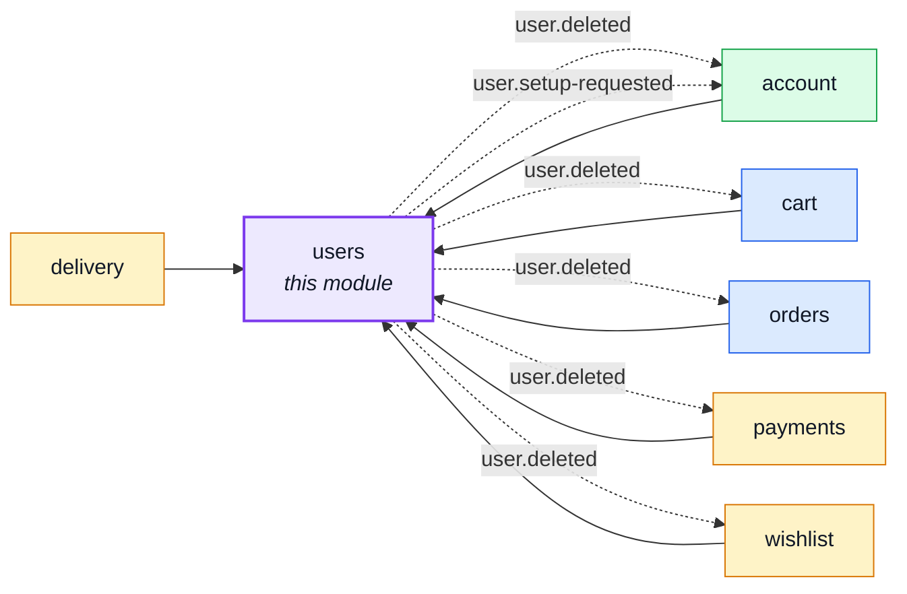
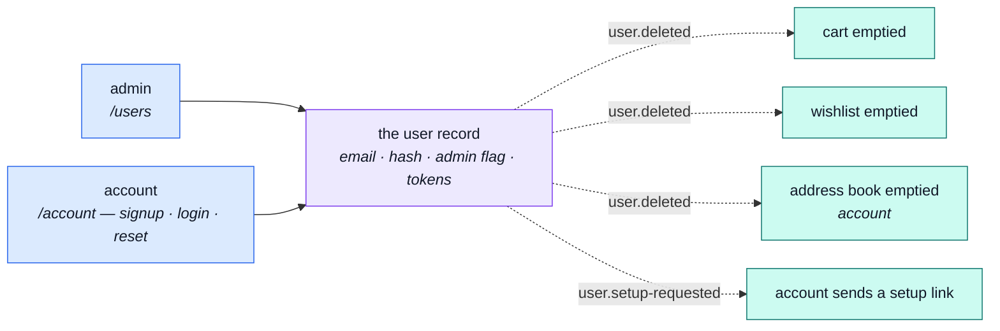

# users

::: tip At a glance
**Owns** — the user record: email, password hash, admin flag, and the reset/refresh tokens hanging off it.
**Depends on** — nothing. Authentication is next door in [`account`](./account.md).
**Breaks if you change** — the `tokens` subdocument. `account` reads and writes it, and it is the repo's only shared-kernel edge.
:::

## Its neighbourhood

<!-- module-graph:users:start -->

_Solid arrows are imports. Dotted arrows are domain events — the return path an import
graph cannot see._

<!-- module-graph:users:end -->

## The story

A user record with an email, a password hash and an admin flag is the same problem in every
application that has ever had one. Nothing about it differentiates this shop — which is exactly
what `generic` means, and why no aggregate belongs here however central the record feels.

**Authentication is not here.** Signup, login, password reset and the token lifecycle all live in
[`account`](./account.md), which is a _second service over this same collection_. That split is why
this module's barrel is the widest in the repo: it publishes the model and the repository, not just
the service, because a sibling genuinely needs to write the record.

::: tip Why two modules and not one
`/users` and `/account` are different mounts, and a manifest carries one `basePath`. Merging them
would collapse two URL surfaces into one module for no gain — and the cost of keeping them apart is
visible on the map as a `shared-kernel` arrow rather than hidden inside a barrel.
:::

Five modules depend on this one and it depends on none, so it sits at the bottom of the graph.
Deleting an account has to empty that user's cart and wishlist, and that travels as `user.deleted`
for the same reason products uses an event: it keeps this module a leaf.

## The pipeline

One collection, two services over it — and a deletion that has to reach three modules this one may
not import.

## Soft delete vs. erasure

`DELETE /users/:id` soft-deletes by default — `deletedAt` is stamped, nothing else moves, and a
second `DELETE` restores it. `?hardDelete=true` is the one that fires `user.deleted` (the cascade
above) and actually removes the row.

Only the hard path **discharges an Art. 17 erasure request**. The audit trail says
so explicitly: a soft delete emits `admin.user.soft_deleted`, a hard one `admin.user.erased` — two
actions rather than one `admin.user.deleted`, so "was this request actually closed out" is
answerable from the log alone, not from remembering which flag an admin clicked.

## Related pages

- [Modules overview](./index.md) — the whole context map
- [`account`](./account.md) — the other service over this collection
- [Strategic DDD](../theory/strategic-ddd.md#_5-published-language-—-the-barrel) — why a wide barrel is a map edge, not a private detail
- [Security](../tools/security.md) — password hashing and the token shapes
- [Events & Logging](../tools/events-and-logging.md) — `user.deleted` and its three listeners
