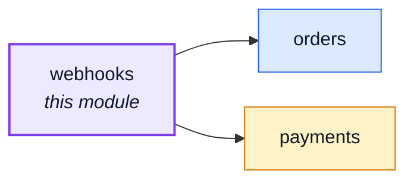
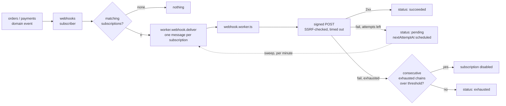

# webhooks

::: tip At a glance
**Owns** — subscriptions, the delivery log, signing, retries and auto-disable for outbound webhook delivery.
**Depends on** — [`orders`](./orders.md) and [`payments`](./payments.md), but only through the domain-event bus — no import either way.
**Breaks if you change** — the six event names in `asyncapi.yaml`, or the queue payload shape in `shared/contracts/asyncapi.workers.yaml`.
:::

## Its neighbourhood

<!-- module-graph:webhooks:start -->

_Solid arrows are imports. Dotted arrows are domain events — the return path an import
graph cannot see._

<!-- module-graph:webhooks:end -->

## The story

`orders` and `payments` can tell this module that something happened; this module cannot ask them
anything back. `webhooks/module.ts` subscribes to `order.created`, `order.status_changed` (filtered
to `to: 'paid'`/`to: 'shipped'`), `order.cancelled`, `payment.succeeded` and `payment.failed` on the
kernel's domain-event bus, and there the coupling ends — no import in either direction, the same
shape [`delivery`](./delivery.md) uses for `order.status_changed`.

**The public event catalogue is a contract, not an accident.** This module's own `asyncapi.yaml`
fragment declares the six events this shop's clone is willing to promise, and both
`GET /webhooks/events` and `tests/cross-cutting/webhook-event-producers.test.ts`'s producer-coverage
check read that fragment directly — `asyncapi.public.yaml` is a derived sibling output, not the
source either reads. A module reaching for the internal domain-event bus and calling it "public"
would publish internal coupling as an external promise; declaring the six here instead is what
keeps that from happening.

### The delivery path

**Delayed retry rides the cron container, not the broker.** `webhookdeliveries.nextAttemptAt`
carries when a failed row is due again; `ops/sweep-webhook-retries.ts` — the one job in
`docker/crontab` that runs every minute instead of nightly — claims each due row and re-publishes
it. `webhookDeliveryRepository.claimPending` (`pending` → `in-flight`) is the one atomic step that
keeps the sweep and a fast-path worker from ever delivering the same attempt twice.

**Signing is Standard Webhooks, hand-rolled.** `infrastructure/adapters/webhook-signing.ts` emits
the `webhook-id`/`webhook-timestamp`/`webhook-signature` headers a growing set of the ecosystem
already verifies with no custom code — the format is the interoperable part; the ~30 lines of
`node:crypto` around it are not worth a dependency. A subscription's secret ring is a list, not one
value, so `PATCH .../subscriptions/:id` can rotate without downtime: two active secrets sign two
space-separated `v1,...` values in one header during the overlap.

**The SSRF guard resolves, THEN validates, THEN pins.** `infrastructure/adapters/ssrf-guard.ts`
looks up a subscription's hostname itself, checks the resolved address against private/loopback/
link-local/CGNAT ranges — including an IPv4-mapped IPv6 literal, which a naive string check misses
— and hands `webhook-delivery.ts` a `lookup` override pinned to that one validated address. A
second, independent DNS resolution at connect time would reopen exactly the TOCTOU window this
exists to close, which is why the guard is infrastructure and not `domain/`: it does I/O.

::: tip What deleting this module actually costs
Every ingredient it is built from — the domain-event bus, the queue, the cron container, the public
AsyncAPI bundle — is still there and still used by whatever remains. `orders` and `payments` lose
nothing: they never knew this module existed. A clone with no orders declares its own six events in
its own `asyncapi.yaml` fragment and changes nothing else.
:::

## Managing it

Subscriptions, the secret ring and the delivery log all have an admin screen now, in the paired
`boilerplate-vue-frontend` — `webhooks` there, its own five routes over this module's seven
endpoints. "Usable via any HTTP client" is still true (nothing here requires the UI), but no longer
the only way in. See that repo's `docs/modules/webhooks.md` for the client side, including why
`rotateSecret`'s response never gets cached client-side.

## Seeing it work

`npm run demo` seeds no subscription by default — nothing to deliver to. Start
`docker compose --profile integrations up webhook-tester`, set `NODE_WEBHOOK_DEMO_SINK_URL` to its
base url (`.env-example` has the exact line), then reseed. `scenarios/webhooks.ts` points a
subscription at it and captures deliveries at `http://localhost:${WEBHOOK_TESTER_PORT:-3070}`.

Two things make this reachable at all, both narrowed on purpose:

- `webhook-tester` is plain HTTP on a private compose-network address — exactly what
  `ssrf-guard.ts` exists to refuse. It gets a one-hostname exemption
  (`@modules/webhooks/config`'s `getWebhookDemoAllowedHost`) from the `https:` and
  private-address checks only, and only in development/test; set `NODE_WEBHOOK_DEMO_SINK_URL`
  under production and the app refuses to boot.
- The seeded subscription's ring secret is a FIXED plaintext
  (`scenarios/webhooks.ts`'s `WEBHOOK_DEMO_SECRET`), not one a real `POST /webhooks/subscriptions`
  would mint — a minted secret is returned once and never stored in the clear, so nothing here
  could ever hand it to `webhook-tester` to verify against. Paste it into the tester's UI to check
  a captured delivery's `webhook-signature` header by hand.

See: [Events & Logging](../tools/events-and-logging.md), [RabbitMQ](../tools/rabbitmq.md), and
[the AsyncAPI workflow](../api/asyncapi-workflow.md).
