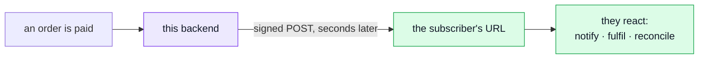
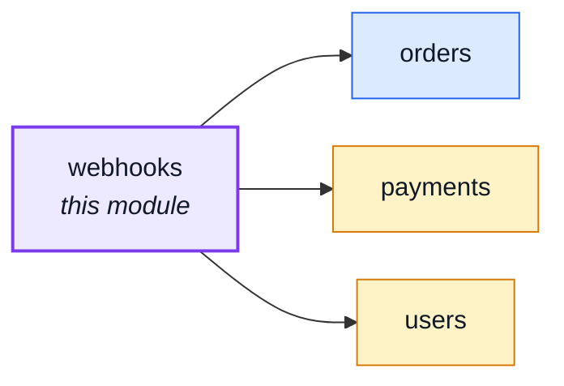
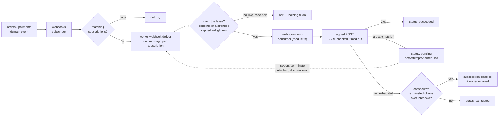

# webhooks

::: tip At a glance
**Owns** — subscriptions, the delivery log, signing, retries and auto-disable for outbound webhook delivery.
**Depends on** — [`orders`](./orders.md) and [`payments`](./payments.md), but only through the domain-event bus — no import either way.
**Breaks if you change** — the six event names in `asyncapi.yaml`, or the queue payload shape in `shared/contracts/asyncapi.workers.yaml`.
:::

## What a webhook is

A webhook is how this backend tells _someone else's_ server that something happened, without them
having to ask. A subscriber registers a URL once; from then on, every matching event becomes a
signed HTTP `POST` to that URL, seconds after it lands.

The direction is the whole point. A normal API waits to be called. A webhook is the reverse edge —
_this_ server does the calling — so the other side learns about an event the moment it happens
instead of polling "anything new?" on a timer.

Real uses, one mechanism:

- **A Slack channel that pings on every paid order** — through a thin translator in front of
  Slack's incoming-webhook URL. A delivery's body is the bare event payload (`{orderId}` for
  `payment.succeeded`); Slack requires a `text`/`blocks` body, so pointing a subscription straight
  at Slack's URL gets every delivery rejected until the subscription auto-disables.
- **A partner's fulfilment system that ships on order.** They subscribe to `order.created`; each
  delivery names the order (`{orderId}`), and their warehouse looks it up and starts packing
  without waiting on a nightly export.
- **A reconciliation endpoint that reverses failed or cancelled orders in near-real-time.**
  `payment.failed` and `order.cancelled` reach a small endpoint of your own — a publicly reachable
  HTTPS one, whatever it does internally, since [the SSRF guard](../theory/defences/ssrf.md)
  refuses a private address — rather than a batch job noticing hours later.

The catch — and the reason [SSRF](../theory/defences/ssrf.md) is a live concern here — is that the
destination URL is chosen by whoever creates the subscription. Delivering to a URL a caller
supplies is exactly the shape an attacker abuses to make the server fetch something internal, so
every delivery goes through `infrastructure/adapters/ssrf-guard.ts` first — see
[The delivery path](#the-delivery-path).

## Its neighbourhood

<!-- module-graph:webhooks:start -->

_Solid arrows are imports. Dotted arrows are domain events — the return path an import
graph cannot see._

<!-- module-graph:webhooks:end -->

## The story

`orders` and `payments` can tell this module that something happened; this module cannot ask them
anything back. `webhooks/module.ts` subscribes to `order.created`, `order.status_changed` (filtered
to `to: 'paid'`/`to: 'shipped'`), `order.cancelled`, `payment.succeeded` and `payment.failed` on the
kernel's domain-event bus, and there the coupling ends — no import in either direction, the same
shape [`delivery`](./delivery.md) uses for `order.status_changed`.

**The public event catalogue is a contract, not an accident.** This module's own `asyncapi.yaml`
fragment declares the six events this shop's clone is willing to promise, and both
`GET /webhooks/events` and `tests/cross-cutting/webhook-event-producers.test.ts`'s producer-coverage
check read that fragment directly — `asyncapi.public.yaml` is a derived sibling output, not the
source either reads. A module reaching for the internal domain-event bus and calling it "public"
would publish internal coupling as an external promise; declaring the six here instead is what
keeps that from happening.

### The delivery path

**The owner hears about their own endpoint; operators hear about the queue.** Once a subscription
auto-disables, `services/attempt.ts#notifyOwnerOfAutoDisable` emails whoever created it — the
address captured on the subscription at `POST /webhooks/subscriptions` time
(`WebhookSubscriptionDocument.ownerEmail`, resolved from the caller's own user record, never on the
wire). Best-effort and fire-and-forget, the same as every other queued notification in this
codebase; silently skipped for a subscription that predates the field, or whose creator's id never
resolved to a user. This is deliberately a DIFFERENT channel from the operator-facing
`QueueJobsParked` alert on parked deliveries (`docs/tools/prometheus.md`) — one person's endpoint
failing is not the same signal as the queue itself being unhealthy, and the two audiences never
share a line.

**Delayed retry rides the cron container, not the broker.** `webhookdeliveries.nextAttemptAt`
carries when a failed row is due again; `npm run sweep:webhook-retries` (`ops/sweep-webhook-retries.ts`)
— the one job in `docker/crontab` that runs every minute instead of nightly — publishes every due
row (and every stranded one, below) to the queue. See
[Scheduled jobs](../reference/ops.md#scheduled-jobs) for the full mechanism.

**The sweep publishes; only a claim delivers — a visibility-timeout lease, the way SQS does it.**
The sweep does NOT claim a row before publishing it: publishing is safe to do more than once (the
claim below is what actually decides who sends), and a sweep that claimed first is exactly the bug
this design replaced — every retry past the first attempt was silently acknowledged without ever
being sent, because the sweep had already moved the row to `in-flight` before the worker's own
claim ever ran. Now:

- `webhookDeliveryRepository.claimPending` (worker/queue path) and `claimForReplay` (admin replay)
  are the only two places a row becomes `in-flight` — each stamps a `leaseToken` and a
  `leaseExpiresAt` well above the 10s delivery timeout, in the same atomic `findOneAndUpdate`.
- `claimPending` matches `pending`, or an `in-flight` row whose lease has already expired — the
  crash-recovery path for a worker that took the row and never finished. `claimForReplay` matches
  anything NOT under a live lease, including a terminal `succeeded`/`exhausted` row, since replay's
  whole point is re-sending one of those.
- Every outcome write (`services/attempt.ts`) goes through `applyOutcome`, which applies only while
  the writer's `leaseToken` still matches the row's current one — a write from a claim whose lease
  has since expired and been reclaimed by something else is dropped, never retried.
- Delivery stays at-least-once even with the lease: a receiver still de-duplicates on `webhook-id`.

**Signing is Standard Webhooks, hand-rolled.** `transport/webhook-signing.ts` emits the
`webhook-id`/`webhook-timestamp`/`webhook-signature` headers a growing set of the ecosystem already
verifies with no custom code — the format is the interoperable part; the ~30 lines of `node:crypto`
around it are not worth a dependency. A subscription's secret ring is a list, not one value, so
`PATCH .../subscriptions/:id` can rotate without downtime: two active secrets sign two
space-separated `v1,...` values in one header during the overlap.

**The SSRF guard resolves, THEN validates, THEN pins.** `infrastructure/adapters/ssrf-guard.ts` —
generic, infrastructure-owned, not this module's — looks up a subscription's hostname itself,
checks the resolved address against private/loopback/link-local/CGNAT ranges — including an
IPv4-mapped IPv6 literal, which a naive string check misses — and hands `transport/webhook-delivery.ts`
a `lookup` override pinned to that one validated address. A second, independent DNS resolution at
connect time would reopen exactly the TOCTOU window this exists to close, which is why the guard is
infrastructure and not `domain/`: it does I/O.

::: tip What deleting this module actually costs
Every ingredient it is built from — the domain-event bus, the queue, the cron container, the public
AsyncAPI bundle — is still there and still used by whatever remains. `orders` and `payments` lose
nothing: they never knew this module existed. A clone with no orders declares its own six events in
its own `asyncapi.yaml` fragment and changes nothing else.
:::

## Managing it

Subscriptions, the secret ring and the delivery log all have an admin screen now, in the paired
`boilerplate-vue-frontend` — `webhooks` there, its own five routes over this module's seven
endpoints. "Usable via any HTTP client" is still true (nothing here requires the UI), but no longer
the only way in. See that repo's `docs/modules/webhooks.md` for the client side, including why
`rotateSecret`'s response never gets cached client-side.

## Not wanted? Remove the module

There is no switch. Webhooks are on when this module is in the build, and a deployment that never
sends them removes it — [Removing a module](../theory/module-lifecycle.md#removing-a-module). That
also removes the one place the backend fetches a caller-supplied URL (see
[Server-side request forgery](../theory/defences/ssrf.md)).

The standard procedure catches most of it: `tsc` stops on every file that imports the module
(`ops/sweep-webhook-retries.ts`, `scenarios/webhooks.ts`, the cross-cutting tests), and the
cross-cutting suite names the permissions, the page and the pairing entries. The module owns its
queue consumer, its required/forbidden env checks, and its delivery substrate now (`consumers`,
`requiredConfig` and `forbiddenInProduction` on its own `module.ts`; `transport/` for the signing
and delivery code) — deleting the folder deletes all of that too, with nothing left in `app/` or
`kernel/` to also touch. What still sits outside the module and **nothing flags** — delete these by
hand:

| Piece                         | Where                                                                                           | Left behind, it…                 |
| ----------------------------- | ----------------------------------------------------------------------------------------------- | -------------------------------- |
| the retry-sweep script entry  | `sweep:webhook-retries` in `package.json`                                                       | points at a deleted file         |
| the cron line and its comment | `docker/crontab`                                                                                | fails every minute               |
| the SSRF guard                | `src/infrastructure/adapters/ssrf-guard.ts` — generic, but this module is its only caller today | compiles, and nothing calls it   |
| the environment               | the `NODE_WEBHOOK_*` lines in `.env-example`                                                    | documents settings nothing reads |
| the local test sink           | the `webhook-tester` service in `docker-compose.yml`, `WEBHOOK_TESTER_PORT`                     | runs for nothing                 |

## Seeing it work

`npm run demo` seeds no subscription by default — nothing to deliver to. Start
`docker compose --profile integrations up webhook-tester`, set `NODE_WEBHOOK_DEMO_SINK_URL` to its
base url (`.env-example` has the exact line), then reseed. `scenarios/webhooks.ts` points a
subscription at it and captures deliveries at `http://localhost:${WEBHOOK_TESTER_PORT:-3070}`.

Two things make this reachable at all, both narrowed on purpose:

- `webhook-tester` is plain HTTP on a private compose-network address — exactly what
  `ssrf-guard.ts` exists to refuse. It gets a one-hostname exemption
  (`@modules/webhooks/config`'s `getWebhookDemoAllowedHost`) from the `https:` and
  private-address checks only, and only in development/test; set `NODE_WEBHOOK_DEMO_SINK_URL`
  under production and the app refuses to boot.
- The seeded subscription's ring secret is a FIXED plaintext
  (`scenarios/webhooks.ts`'s `WEBHOOK_DEMO_SECRET`), not one a real `POST /webhooks/subscriptions`
  would mint — a minted secret is returned once and never stored in the clear, so nothing here
  could ever hand it to `webhook-tester` to verify against. Paste it into the tester's UI to check
  a captured delivery's `webhook-signature` header by hand.

See: [Events & Logging](../tools/events-and-logging.md), [RabbitMQ](../tools/rabbitmq.md), and
[the AsyncAPI workflow](../api/asyncapi-workflow.md).
