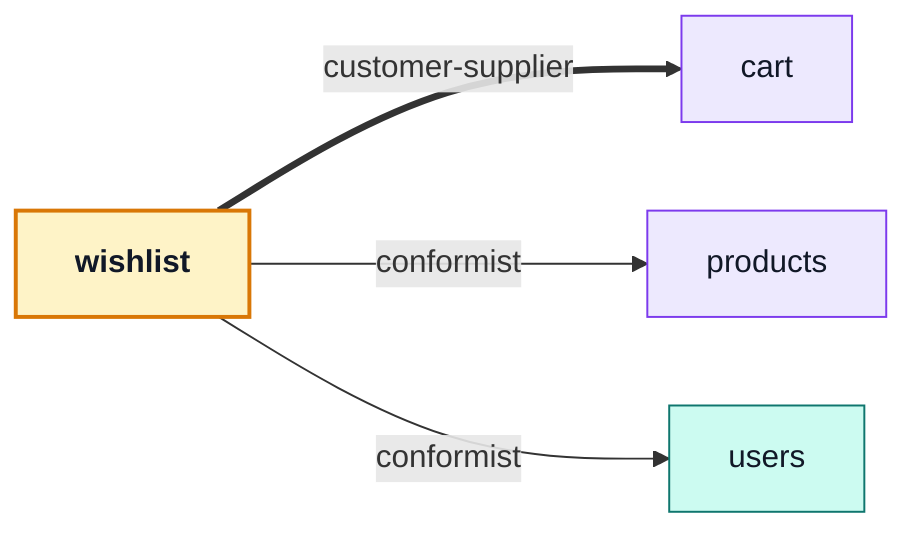

# wishlist

::: tip At a glance
**Owns** — one wishlist per user, holding product references and nothing else.
**Depends on** — [`products`](./products.md), [`users`](./users.md), [`cart`](./cart.md).
**Breaks if you change** — nothing outside this folder. No module depends on it.
:::

<!-- gen:identity:start -->

| Fact                     | This module                                                                    |
| ------------------------ | ------------------------------------------------------------------------------ |
| **Subdomain**            | `supporting` — Specific to this business but not a differentiator. Kept plain. |
| **Base path**            | `/wishlist`                                                                    |
| **Collection**           | `wishlists` (model `Wishlist`)                                                 |
| **Depends on**           | [`cart`](./cart.md) · [`products`](./products.md) · [`users`](./users.md)      |
| **Depended on by**       | _nothing_                                                                      |
| **Languages**            | `en` · `it`                                                                    |
| **Seeded**               | yes — `wishlists` as `stored`                                                  |
| **Frontend counterpart** | `wishlist` in `boilerplate-vue-frontend`                                       |

<!-- gen:identity:end -->

## The map

<!-- gen:map:start -->



- → `cart` **customer-supplier** — Move-to-cart asks the cart to add a line; this module never writes a cart document itself.
- → `products` **conformist** — Reads catalogue documents as they are — a saved line is meaningless without the product it points at.
- → `users` **conformist** — Reads the account the list belongs to, and listens for its destruction.

<!-- gen:map:end -->

## The story

The smallest domain in the repo, and a useful one to read first: it has the same shape as
[`cart`](./cart.md) — one document per user, product references, a unique index on `userId` — with
none of checkout's complexity.

Its three arrows are the same one-way arrows the cart declares, for the same reasons. A saved line
is meaningless without the product it points at; the list belongs to an account; and the
move-to-cart exit writes a cart line, which is a `customer-supplier` demand on the cart's store.

::: tip It is depended on by nothing
Which makes it the cheapest module in the repo to delete — `rm -rf` plus one line in
`src/modules.ts`, and nothing else notices. If you want to see the deletability claim hold, try it
here first.
:::

Products and users reach back the same way they reach the cart: a deleted product must leave every
wishlist, and a destroyed account must take its wishlist with it. Both arrive as domain events, so
the import graph stays acyclic even though the domains are mutually aware.

## Data

<!-- gen:data:start -->

#### `wishlists`

From model `Wishlist`. `_id` and `__v` are omitted — every document carries them.

| Field         | Type            | Flags            | Default | Reference / values |
| ------------- | --------------- | ---------------- | ------- | ------------------ |
| `userId`      | `ObjectId`      | required, unique | —       | → `User`           |
| `items`       | `Subdocument[]` | —                | []      | —                  |
| ↳ `productId` | `ObjectId`      | required         | —       | → `Product`        |
| `createdAt`   | `Date`          | —                | —       | —                  |
| `updatedAt`   | `Date`          | —                | —       | —                  |

**Declared indexes**

| Keys                 | Options |
| -------------------- | ------- |
| `userId: 1`          | unique  |
| `items.productId: 1` | —       |

<!-- gen:data:end -->

## Surface

<!-- gen:surface:start -->

| Endpoint                                  | Middlewares          | Controller           | What it does                       |
| ----------------------------------------- | -------------------- | -------------------- | ---------------------------------- |
| `GET /wishlist`                           | `getAuth` → `isAuth` | `getWishlist`        | Get wishlist                       |
| `POST /wishlist`                          | `getAuth` → `isAuth` | `postWishlist`       | Save a product                     |
| `DELETE /wishlist/{productId}`            | `getAuth` → `isAuth` | `deleteWishlistItem` | Remove a saved product             |
| `POST /wishlist/{productId}/move-to-cart` | `getAuth` → `isAuth` | `postMoveToCart`     | Move a saved product into the cart |

Middlewares run left to right; the controller is the last handler on the route. Summaries come from this module’s own `openapi.yaml`, which is where they are edited.

<!-- gen:surface:end -->

## Signals

<!-- gen:signals:start -->

#### Domain events

| Event             | Direction                    |
| ----------------- | ---------------------------- |
| `product.deleted` | subscribed to in `module.ts` |
| `user.deleted`    | subscribed to in `module.ts` |

#### Analytics events

| Constant                 | Event name               |
| ------------------------ | ------------------------ |
| `WISHLIST_ITEM_ADDED`    | `wishlist_item_added`    |
| `WISHLIST_ITEM_REMOVED`  | `wishlist_item_removed`  |
| `WISHLIST_MOVED_TO_CART` | `wishlist_moved_to_cart` |

#### Contract probes

Requests the contract cannot describe — the calls that prove this module refuses things.

| Call                                                       | Probe                                              |
| ---------------------------------------------------------- | -------------------------------------------------- |
| `POST /wishlist`                                           | Probe: save a product the storefront will not show |
| `POST /wishlist/{{seedSoftDeletedProductId}}/move-to-cart` | Probe: move a product that was never saved         |
| `DELETE /wishlist/000000000000000000000000`                | Probe: unsave a product that was never saved       |
| `DELETE /wishlist/not-an-object-id`                        | Probe: an id no ObjectId can be built from         |

<!-- gen:signals:end -->

## Files

<!-- gen:files:start -->

| File                                  | What it is                                                                                                                                                   | Explained in                              |
| ------------------------------------- | ------------------------------------------------------------------------------------------------------------------------------------------------------------ | ----------------------------------------- |
| `analytics.ts`                        | The product-analytics event names this module emits.                                                                                                         | [read](../tools/analytics.md)             |
| `controllers/delete-wishlist-item.ts` | One operation: reads inputs, calls the service, answers through the response envelope, and catches.                                                          | [read](../theory/request-flow.md)         |
| `controllers/get-wishlist.ts`         | One operation: reads inputs, calls the service, answers through the response envelope, and catches.                                                          | [read](../theory/request-flow.md)         |
| `controllers/post-move-to-cart.ts`    | One operation: reads inputs, calls the service, answers through the response envelope, and catches.                                                          | [read](../theory/request-flow.md)         |
| `controllers/post-wishlist.ts`        | One operation: reads inputs, calls the service, answers through the response envelope, and catches.                                                          | [read](../theory/request-flow.md)         |
| `demo.ts`                             | This module's seed fixtures, upserted through the shared seeding primitive.                                                                                  | [read](../tools/demo-profile.md)          |
| `factory.ts`                          | Fixture builders for tests, on top of the shared persistence factory.                                                                                        | [read](../tools/unit-testing.md)          |
| `locales/en.json`                     | This module's user-facing strings, one file per language.                                                                                                    | [read](../tools/i18n.md)                  |
| `locales/it.json`                     | This module's user-facing strings, one file per language.                                                                                                    | [read](../tools/i18n.md)                  |
| `model.ts`                            | The Mongoose schema, its indexes and its serialisation rules — the collection's shape.                                                                       | [read](../tools/mongodb-mongoose.md)      |
| `module.ts`                           | The manifest — the only file the application loads directly. Declares the name, base path, router, dependency edges, locales, seeds and event subscriptions. | [read](../theory/modules.md)              |
| `openapi.yaml`                        | This module's slice of the REST contract. The root `openapi.yaml` is bundled from these.                                                                     | [read](../api/contract-fragmentation.md)  |
| `probes.ts`                           | The requests the contract cannot describe — the calls that prove the API refuses things.                                                                     | [read](../tools/contract-request-data.md) |
| `repository.ts`                       | Every query this module makes, on the shared base repository. The only tier that talks to Mongoose.                                                          | [read](../tools/mongodb-mongoose.md)      |
| `routes.ts`                           | The URL surface — one line per endpoint, naming its middlewares, the role it requires and the controller it lands on.                                        | [read](../api/endpoints.md)               |
| `service.ts`                          | The domain decision, and the layer that owns status-code meaning.                                                                                            | [read](../theory/layers.md)               |
| `tests/contract/api.contract.test.ts` | Contract suite — the responses, against the fragment.                                                                                                        | [read](../tools/contract-testing.md)      |
| `tests/unit/service.test.ts`          | Unit suite — the rules, in isolation.                                                                                                                        | [read](../tools/unit-testing.md)          |

<!-- gen:files:end -->

## Working on it

<!-- gen:working:start -->

| Suite    | Files | Where                                  |
| -------- | ----- | -------------------------------------- |
| Unit     | 1     | `src/modules/wishlist/tests/unit/`     |
| Contract | 1     | `src/modules/wishlist/tests/contract/` |

```bash
# every suite this module carries
npm run test:module -- src/modules/wishlist

# after editing this module’s openapi.yaml
npm run contracts:bundle && npm run lint:openapi:modules

# after editing this module’s seeds
npm run db:seed && npm run check:seed-export
```

<!-- gen:working:end -->

## Deeper in

<!-- gen:subpages:start -->

Nothing in this domain needs a page of its own — the story above is the whole of it.

<!-- gen:subpages:end -->

## Related pages

- [`cart`](./cart.md) — the same shape, with the hard part attached
- [Adding & Removing a Module](../theory/module-lifecycle.md) — the deletability procedure
- [Events & Logging](../tools/events-and-logging.md) — the two events this module listens for
- [Product Analytics](../tools/analytics.md) — the save/move funnel
