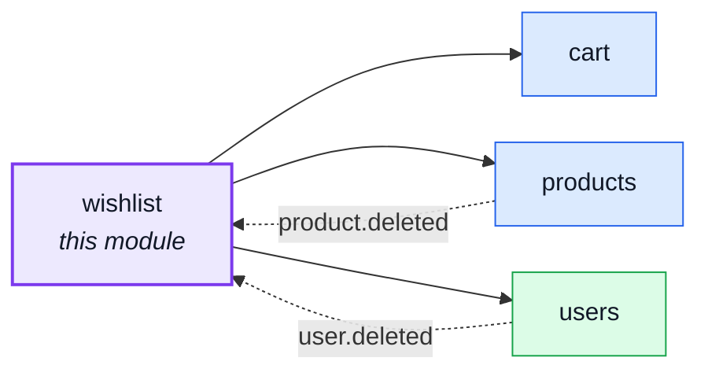
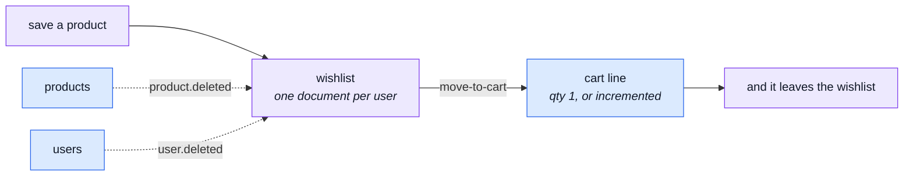

# wishlist

::: tip At a glance
**Owns** — one wishlist per user, holding product references and nothing else.
**Depends on** — [`products`](./products.md), [`users`](./users.md), [`cart`](./cart.md).
**Breaks if you change** — nothing outside this folder. No module depends on it.
:::

## Its neighbourhood

<!-- module-graph:wishlist:start -->

_Solid arrows are imports. Dotted arrows are domain events — the return path an import
graph cannot see._

<!-- module-graph:wishlist:end -->

## The story

The smallest domain in the repo, and a useful one to read first: it has the same shape as
[`cart`](./cart.md) — one document per user, product references, a unique index on `userId` — with
none of checkout's complexity.

Its three arrows are the same one-way arrows the cart declares, for the same reasons. A saved line
is meaningless without the product it points at; the list belongs to an account; and the
move-to-cart exit writes a cart line, which is a `customer-supplier` demand on the cart's store.

::: tip It is depended on by nothing
Which makes it the cheapest module in the repo to delete — `rm -rf` plus one line in
`src/modules.ts`, and nothing else notices. If you want to see the deletability claim hold, try it
here first.
:::

Products and users reach back the same way they reach the cart: a deleted product must leave every
wishlist, and a destroyed account must take its wishlist with it. Both arrive as domain events, so
the import graph stays acyclic even though the domains are mutually aware.

## The pipeline

The whole module. Three arrows out, two events in — and nothing at all pointing back at it.

## Related pages

- [`cart`](./cart.md) — the same shape, with the hard part attached
- [Adding & Removing a Module](../theory/module-lifecycle.md) — the deletability procedure
- [Events & Logging](../tools/events-and-logging.md) — the two events this module listens for
- [Product Analytics](../tools/analytics.md) — the save/move funnel
