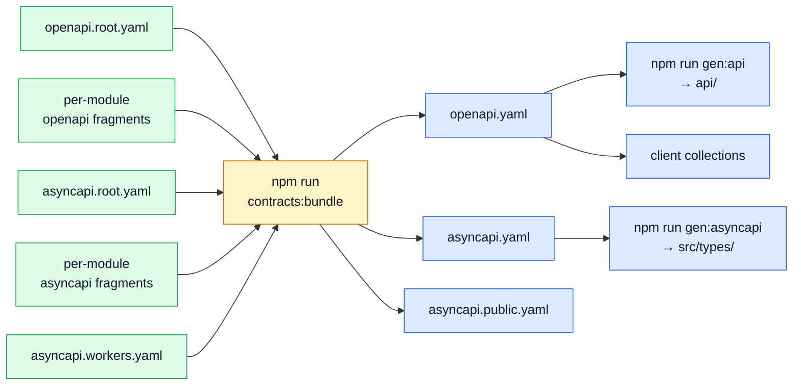

# Contracts

The contract is the source of truth: `openapi.yaml` for REST, `asyncapi.yaml` for events. Neither
is written by hand — both are **bundled** from a root preamble plus one fragment per module, and
everything downstream is generated from the result.

Read [Contract Ownership & Fragmentation](../api/contract-fragmentation.md) for who owns which
piece, and [Regenerating After a Change](../api/regenerating.md) for what to rerun.

---

## What is built from what

::: warning Everything on this page below the sources is generated
No file in the "bundled documents", "generated code" or "client collections" sections is ever
hand-edited. `npm run check:contracts-bundle` and `check:spec-identity` each fail when a committed
copy disagrees with a fresh run; `src/types/asyncapi.generated.ts` is gitignored and never
committed, regenerated by postinstall and the pre-commit hook instead.
:::

## The sources

| File                                     | What it is                                                                                                                                                                                     | Read next                                                              |
| ---------------------------------------- | ---------------------------------------------------------------------------------------------------------------------------------------------------------------------------------------------- | ---------------------------------------------------------------------- |
| `shared/contracts/openapi.root.yaml`     | The REST preamble: version, `info`, servers, tags, shared security schemes — everything true of the service rather than of a domain. Holds no path; those belong to the module that owns them. | [Contract Ownership & Fragmentation](../api/contract-fragmentation.md) |
| `shared/contracts/asyncapi.root.yaml`    | The same job for the async contract. Declares no channel: a channel belongs to a module, or to the workers document beside it.                                                                 | [AsyncAPI Workflow](../api/asyncapi-workflow.md)                       |
| `shared/contracts/asyncapi.workers.yaml` | The queues that belong to no domain. Sending an email and rendering a PDF are verbs, not domains — the producer is whichever module needs one, the consumer is an infrastructure worker.       | [RabbitMQ](../tools/rabbitmq.md)                                       |

The per-module fragments are catalogued on [Modules](./src-modules.md).

## The bundled documents

| File                   | What it is                                                                                                                                                                                                                               | Read next                                                                                                       |
| ---------------------- | ---------------------------------------------------------------------------------------------------------------------------------------------------------------------------------------------------------------------------------------- | --------------------------------------------------------------------------------------------------------------- |
| `openapi.yaml`         | **Generated.** The whole REST contract, assembled by `npm run contracts:bundle` and asserted byte-identical by `npm run check:contracts-bundle`. This is what Orval, Prism and the contract suites read. Edit a module fragment instead. | [OpenAPI Workflow](../api/openapi-workflow.md)                                                                  |
| `asyncapi.yaml`        | **Generated.** The whole async contract: every channel, internal ones included. The source for `src/types/asyncapi.generated.ts`.                                                                                                        | [AsyncAPI Workflow](../api/asyncapi-workflow.md)                                                                |
| `asyncapi.public.yaml` | **Generated.** The half of the async contract the frontend receives — the channels a browser can legitimately observe, with the internal queues removed. `npm run check:spec-identity` pins it against the copy in the paired repo.      | [AsyncAPI Workflow](../api/asyncapi-workflow.md) · [Frontend Observability](../tools/frontend-observability.md) |

## The generated code

| File                 | What it is                                                                                                                                                                                                                                                                                                                        | Read next                                                                                   |
| -------------------- | --------------------------------------------------------------------------------------------------------------------------------------------------------------------------------------------------------------------------------------------------------------------------------------------------------------------------------- | ------------------------------------------------------------------------------------------- |
| `api/schemas.zod.ts` | **Generated** by `npm run gen:api`. The Zod validators for every request and response shape in the contract — what the services validate against, so a payload can only be accepted if the spec allows it.                                                                                                                        | [Regenerating After a Change](../api/regenerating.md)                                       |
| `api/models/*.ts`    | **Generated, and excluded from this glossary by name.** One TypeScript interface per contract schema, plus a barrel. There are hundreds, `npm run gen:api` deletes and rewrites the directory wholesale, and a row per model would restate the spec — which the house rules forbid. Import them through `@types`, never directly. | [Regenerating After a Change](../api/regenerating.md) · [App, Kernel & Types](./src-app.md) |

## The Spectral rulesets

Three rulesets rather than one, because a fragment and a whole document cannot be linted by the
same rules — a fragment has no `info` block and no servers, and would fail every structural rule
a valid document must pass.

| File                             | What it is                                                                                                                                                       | Read next                                                              |
| -------------------------------- | ---------------------------------------------------------------------------------------------------------------------------------------------------------------- | ---------------------------------------------------------------------- |
| `spectral.yaml`                  | The rules for the bundled `openapi.yaml` — the whole-document lint that `npm run lint:openapi` runs.                                                             | [OpenAPI Workflow](../api/openapi-workflow.md)                         |
| `spectral.modules.yaml`          | The rules for a REST fragment. Checks what a fragment can be checked on: operation ids, tags, response shapes, the conventions this repo adds on top of OpenAPI. | [Contract Ownership & Fragmentation](../api/contract-fragmentation.md) |
| `spectral.asyncapi.modules.yaml` | The same for an async fragment, plus the shared workers document.                                                                                                | [AsyncAPI Workflow](../api/asyncapi-workflow.md)                       |

## The client collections

Four exports of the same contract, one per tool, so a reviewer can open the API in whatever they
already use. All four are written by the collection generator from `openapi.yaml` — never by hand,
and never edited to fix a request.

| File                     | What it is                                                                                                           | Read next                                                   |
| ------------------------ | -------------------------------------------------------------------------------------------------------------------- | ----------------------------------------------------------- |
| `contract.postman.json`  | The Postman collection.                                                                                              | [Contract Testing (Response)](../tools/contract-testing.md) |
| `contract.insomnia.json` | The Insomnia export.                                                                                                 | [Contract Testing (Response)](../tools/contract-testing.md) |
| `contract.bruno.yml`     | The Bruno collection.                                                                                                | [Contract Testing (Response)](../tools/contract-testing.md) |
| `contract.mockoon.json`  | The Mockoon environment — a mock server that answers from the contract, for a frontend working ahead of an endpoint. | [Contract Testing (Response)](../tools/contract-testing.md) |
