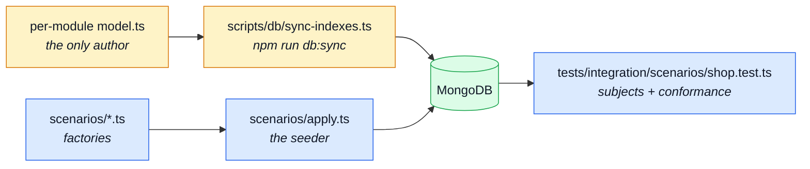
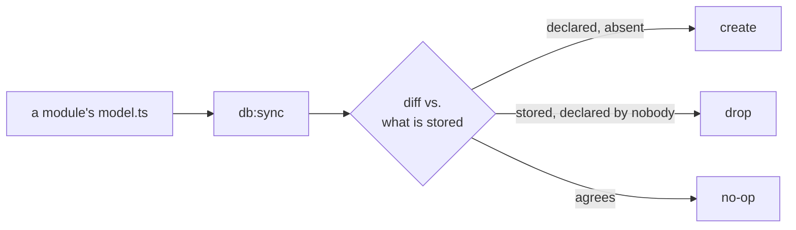

# Data

`scripts/db/` holds everything that shapes or fills a database, and the split is the point:
**`db:sync` owns SCHEMA, `scenario:apply` owns DATA.** `db:sync` makes a collection's indexes match
the schemas that declare them; `scenario:apply` fills a collection. Neither does the other's job.

Neither half is authored here. A module owns its indexes the same way it owns its `openapi.yaml`
fragment; its demo records live in `scenarios/<name>.ts` instead, outside the module folder — see
[The demo records](#the-demo-records) for why. `scripts/db/` is only where the schema runner lives; the
seed runner is `scenarios/apply.ts`.

There is no migration TOOL — no `migrate-mongo`, no `umzug` — and no ledger of what ran where. The
one thing a schema reconciliation cannot cover is a change to data that already exists, and that is
a one-off script under `scripts/ops/`, run by hand and deleted afterwards. Why it stops there is in
[Data: a one-off script under `scripts/ops/`](#data-a-one-off-script-under-scripts-ops).

---

## The two halves



## Schema: `db:sync`

An index is declared in one place — `schema.index(...)` in a module's `model.ts` — and nowhere
else. `npm run db:sync` reconciles the database with those declarations: it creates what is
missing and drops what no schema claims.

| File                         | What it is                                                                                                                                   |
| ---------------------------- | -------------------------------------------------------------------------------------------------------------------------------------------- |
| `scripts/db/index-sync.ts`   | The reconciliation itself, importable so tests can drive it: the duplicate pre-flight, `planIndexSync()` (a dry run) and `applyIndexSync()`. |
| `scripts/db/sync-indexes.ts` | The entry point `npm run db:sync` runs — connection, argument handling, and the report.                                                      |

```bash
npm run db:sync              # apply
npm run db:sync -- --check   # print the plan, change nothing, exit 1 if it is not empty
```

**Adding an index is one edit.** Declare it on the schema. The next `db:sync` builds it — in
development `db:bootstrap` runs on every container boot, so there is nothing else to do; in
production, `docker-compose.production.yml`'s one-shot `setup` service runs `db:sync` before `app`/
`cron` ever start.

### Why a reconciliation and not a migration

An index is **derivable from the domain model**. It is an invariant the aggregate owns, not an
event in the database's history, so it has no business carrying a version or a filename.

A migration tool models the opposite thing. `migrate-mongo` records what it has applied **by
filename**, which is correct for a backfill that must happen exactly once and wrong for a desired
state that must hold after every deploy. This repo previously generated a `…-baseline.js` from the
schemas and fed it to that runner, and the mismatch cost a file every time: regenerating the
baseline never re-ran it, so each newly declared index needed a second, hand-written migration
creating the same key under the same name. Two authors for one index, kept in sync by hand.

`syncIndexes()` has no such gap — there is one author, and convergence is re-applied rather than
recorded.



### It drops

An index no schema declares is drift, and `db:sync` removes it. That is the point — drift that
only ever accumulates is how a collection ends up carrying indexes whose purpose nobody can
reconstruct — but it is also why `--check` exists. Run that first against a database you cannot
rebuild.

`--check` is genuinely read-only, and that takes one deliberate line: the script turns `autoIndex`
OFF before connecting. It is on in development and the test suite, which is what gives them their
indexes for free — but here it would have Mongoose build every declared index during `connect()`,
so an inspection would silently write. Production turns it off too, for a different reason: see
"TTL windows" below.

### It refuses to build a constraint the data violates

A unique index over a collection that already holds duplicates cannot be created. `createIndex`
reports the **first** colliding value and nothing about the rest, so `db:sync` pre-flights every
unique index and reports every offending group at once, then stops. Which of two documents survives
a merge is a product decision, not one a script gets to make.

### TTL windows

`auditlogs`, `carts`, `feedbackrequests` and `idempotencyrecords` expire rows with a TTL index
whose `expireAfterSeconds` comes from an environment variable. Mongo will not modify an existing
index's window in place, so:

| Action after changing e.g. `NODE_AUDIT_RETENTION_DAYS` | In dev/test (`autoIndex` on)                                              | In production (`autoIndex` off)                       |
| ------------------------------------------------------ | ------------------------------------------------------------------------- | ----------------------------------------------------- |
| Restart the app                                        | **Fails to boot.** `autoIndex` asks for the new window; Mongo refuses it. | Boots fine — it never asks Mongo to rebuild anything. |
| `npm run db:sync`                                      | Drops the index and rebuilds it with the new window.                      | Same — this is what actually applies the new window.  |

So in development, `db:bootstrap` — which syncs before the server starts — is what makes a window
change restart-safe. In production, turning `autoIndex` off is what makes it restart-safe instead:
`docker-compose.production.yml`'s `setup` service runs `db:sync` before `app`/`cron` start, and a
later restart with no `setup` re-run simply keeps running on the index that is already there.

## Data: a one-off script under `scripts/ops/`

MongoDB is schemaless, so most schema changes need no data work at all. Adding a field, giving one
a default, removing one, making one optional, adding or dropping an index: all free. Old documents
simply lack the new key, and Mongoose applies a `default` when it reads them.

What is **not** derivable from a schema is a change to the shape of a value that already exists:

| Change                                                   | Needs a script? |
| -------------------------------------------------------- | --------------- |
| Add a field, with or without a default                   | No              |
| Remove a field, or make one optional                     | No              |
| Add, change or drop an index                             | No — `db:sync`  |
| Rename a field                                           | **Yes**         |
| Change a value's type (string → `Date`, cents → decimal) | **Yes**         |
| Split or merge fields                                    | **Yes**         |
| Derive a value for existing rows (a slug from a title)   | **Yes**         |
| De-duplicate before a unique index can be built          | **Yes**         |

Roughly: **the shape of the container is free; the shape of the value costs a script.**

Those are rare, and each one is a single run against a single database — so each is an ordinary
one-off script under `scripts/ops/`, run through the same wrapper as every scheduled job:

```ts
// scripts/ops/split-name.ts
import 'dotenv/config';
import mongoose from 'mongoose';
import { start, stopDatabase } from '@infrastructure/runtime/database';
import { runScript } from '../scripts/db/run-script';

/** Split `name` into `firstName` / `lastName` on rows written before the split. */
const main = (): Promise<void> =>
    start()
        .then(() =>
            mongoose.connection.db
                ?.collection('users')
                .updateMany(/* the affected rows, filtered so a second run is a no-op */)
        )
        .then(() => undefined);

void runScript(main, stopDatabase);
```

Three rules, and they are the same ones a migration tool would have imposed:

- **Idempotent.** Nothing records that it ran, so it must be safe to run twice — filter on the rows
  that still need the change, not on all of them.
- **Driver-level, never through a model.** The point of the script is that stored rows do not match
  today's schema; running today's hooks, defaults and validators over them is what corrupts them.
- **Deleted once it has run everywhere.** It describes one moment, and keeping it implies it is
  still part of the setup. Nothing enforces this — the script's own header should say which
  deployments it is still waiting on.

Run it before `db:sync` when it is clearing the way for a new constraint (a de-duplication), and
after when it needs an index to be fast.

::: tip Why there is no ledger

A changelog collection — which script ran, where, under what checksum, plus a `--check` that fails
a deploy that skipped one — is the obvious next step. This repo deliberately stops short of it.

Four gaps stay open as a result:

- **No record of what ran, where.** "Applied in production" and "nobody remembered" look identical.
- **No ordering.** Two scripts that must run in sequence have no way to say so.
- **No gate.** A deploy that skipped a required backfill passes every check in `complete`.
- **No pressure to delete.** The third rule above is enforced by memory alone.

They stay open because the machinery costs more than it returns at this size. Data scripts are
rare — rare enough that a ledger sits idle between them, and idle machinery is not maintained.

**Idempotency is what carries the weight instead**, which is why it is the load-bearing rule of the
three above rather than the first of them. A script safe to run twice needs no record that it ran
once.

Outgrow that — several databases, or a team where "did anyone run it?" is a real question — and the
answer is `migrate-mongo`, not a bespoke ledger.

:::

## The demo records

| File                                       | What it is                                                                                                                                                                                                                                                                                                                                                                                                                                                                                              | Read next                                                              |
| ------------------------------------------ | ------------------------------------------------------------------------------------------------------------------------------------------------------------------------------------------------------------------------------------------------------------------------------------------------------------------------------------------------------------------------------------------------------------------------------------------------------------------------------------------------------- | ---------------------------------------------------------------------- |
| `scenarios/index.ts`                       | The registry: `SCENARIOS` names every whole-database state this repo knows how to seed (`shop`, `blank`), and `shopModules` tables every module's `shop`-scenario fixture — the rows a shop starts with, before anybody uses it. `buildScenario` seeds a named scenario, then hands off to its flow-drive step.                                                                                                                                                                                         | [Modules](./src-modules.md) · [Demo profile](../tools/demo-profile.md) |
| `scenarios/apply.ts`                       | The seeder that `npm run scenario:apply` runs. Boots the application in-process and hands `buildScenario` a loopback listener: the catalogue is seeded from `shopModules`, and the order book is then produced by driving the real endpoints. A module absent from the table seeds nothing. Refuses a database that already holds anything unless `--reset` empties it first.                                                                                                                           | [Demo profile](../tools/demo-profile.md)                               |
| `scenarios/blank.ts`                       | The `blank` scenario: harness infrastructure only — the access model, the named accounts, and the fallback locale a product a spec creates still needs active. No catalogue, no orders, no carts.                                                                                                                                                                                                                                                                                                       | [Demo profile](../tools/demo-profile.md)                               |
| `scenarios/check.ts`                       | Holds a scenario's DECLARED guarantees (a module's `AppModule.scenario`) equal to the subjects it actually offers, in both directions — a guarantee with no row is a promise the backend cannot keep, and a subject no module declares is a name left behind after the module that wanted it was deleted.                                                                                                                                                                                               | [Contract Testing (Response)](../tools/contract-testing.md)            |
| `scenarios/flows/`                         | The `shop` scenario's order book, written by DRIVING the application rather than inserting rows — every order placed, paid, shipped and (where the story calls for it) declined, refunded, cancelled or deleted through the endpoint a person would use. Runs once per process; `src/app/demo.ts` keeps the result in memory and replays it on every restore.                                                                                                                                           | [Demo profile](../tools/demo-profile.md)                               |
| `scenarios/subjects.ts`                    | The named ids and credentials a consumer that cannot import module code still needs to point at a specific seeded row — a generated API client collection, and `GET /__test/scenario`'s `subjects`.                                                                                                                                                                                                                                                                                                     | [Contract Ownership & Fragmentation](../api/contract-fragmentation.md) |
| `tests/integration/scenarios/shop.test.ts` | BUILDS the `shop` scenario against a real database — seeded, then driven through the real checkout, payment, shipping and refund endpoints — and reads the rows back **through the real serializers**, checking each against the generated response schema for that entity. What makes the guarantee "the API would actually answer this" a test rather than a claim in a comment. Also holds every declared `scenario.shop` guarantee equal to the subject ids the build produced, in both directions. | [Contract Testing (Response)](../tools/contract-testing.md)            |

The records themselves are not in this table — each module's slice lives in `scenarios/<name>.ts`,
and the seed accounts are declared in `scenarios/accounts.ts`.

Two tests guard the schema half: `tests/integration/scripts/db/index-sync.test.ts` runs the reconciliation
against a real database — from nothing, against drift, and twice over — and
`tests/unit/scripts/db/host-scripts.test.ts` pins the URI resolution `npm run host -- db:sync` depends on.

## Tools

| File                        | What it is                                                                                                                                                                                                                                                                                                    | Read next                                      |
| --------------------------- | ------------------------------------------------------------------------------------------------------------------------------------------------------------------------------------------------------------------------------------------------------------------------------------------------------------- | ---------------------------------------------- |
| `scripts/db/cache-clear.ts` | Drops every cached response belonging to this app — `npm run db:cache:clear`. The API invalidates its own cache on every write it handles, so this is for the writes it did **not** handle: a `scripts/ops/` script, a manual edit, a restored dump.                                                          | [Redis Cache](../tools/redis-cache.md)         |
| `scripts/db/run-script.ts`  | The entry-point wrapper the one-shot scripts in `scripts/db/` and `scripts/ops/` run through. Gives them the three things a bare promise chain does not: a connection opened and closed around the work, a non-zero exit on failure, and the failure printed rather than swallowed as an unhandled rejection. | [Package Scripts](../tools/package-scripts.md) |
