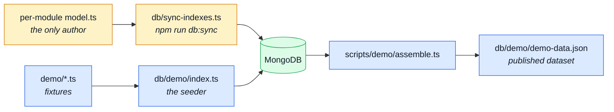
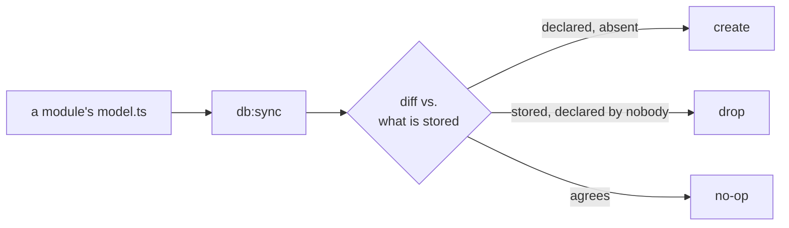

# Data

`db/` holds everything that shapes or fills a database, and the split inside it is the point:
**`db:sync` owns SCHEMA, `db:seed` owns DATA.** `db:sync` makes a collection's indexes match the
schemas that declare them; `db:seed` fills a collection. Neither does the other's job.

Neither half is authored here. A module owns its indexes the same way it owns its `openapi.yaml`
fragment; its demo fixtures live in `demo/<name>.ts` instead, outside the module folder — see
[The demo dataset](#the-demo-dataset) for why. `db/` is only where the runners live.

There is no migration TOOL — no `migrate-mongo`, no `umzug` — but there is a small, owned changelog
collection and timestamped files for the one thing a schema reconciliation cannot cover: data. What
replaced the tool, and why, is the whole of the next section.

---

## The two halves



## Schema: `db:sync`

An index is declared in one place — `schema.index(...)` in a module's `model.ts` — and nowhere
else. `npm run db:sync` reconciles the database with those declarations: it creates what is
missing and drops what no schema claims.

| File                 | What it is                                                                                                                                   |
| -------------------- | -------------------------------------------------------------------------------------------------------------------------------------------- |
| `db/index-sync.ts`   | The reconciliation itself, importable so tests can drive it: the duplicate pre-flight, `planIndexSync()` (a dry run) and `applyIndexSync()`. |
| `db/sync-indexes.ts` | The entry point `npm run db:sync` runs — connection, argument handling, and the report.                                                      |

```bash
npm run db:sync              # apply
npm run db:sync -- --check   # print the plan, change nothing, exit 1 if it is not empty
```

**Adding an index is one edit.** Declare it on the schema. The next `db:sync` builds it — and
`db:bootstrap` runs on every container boot, so in development there is nothing else to do.

### Why a reconciliation and not a migration

An index is **derivable from the domain model**. It is an invariant the aggregate owns, not an
event in the database's history, so it has no business carrying a version or a filename.

A migration tool models the opposite thing. `migrate-mongo` records what it has applied **by
filename**, which is correct for a backfill that must happen exactly once and wrong for a desired
state that must hold after every deploy. This repo previously generated a `…-baseline.js` from the
schemas and fed it to that runner, and the mismatch cost a file every time: regenerating the
baseline never re-ran it, so each newly declared index needed a second, hand-written migration
creating the same key under the same name. Two authors for one index, kept in sync by hand.

`syncIndexes()` has no such gap — there is one author, and convergence is re-applied rather than
recorded.



### It drops

An index no schema declares is drift, and `db:sync` removes it. That is the point — drift that
only ever accumulates is how a collection ends up carrying indexes whose purpose nobody can
reconstruct — but it is also why `--check` exists. Run that first against a database you cannot
rebuild.

`--check` is genuinely read-only, and that takes one deliberate line: the script turns `autoIndex`
OFF before connecting. It is on everywhere else, which is what gives the app and the test suite
their indexes for free — but here it would have Mongoose build every declared index during
`connect()`, so an inspection would silently write.

### It refuses to build a constraint the data violates

A unique index over a collection that already holds duplicates cannot be created. `createIndex`
reports the **first** colliding value and nothing about the rest, so `db:sync` pre-flights every
unique index and reports every offending group at once, then stops. Which of two documents survives
a merge is a product decision, not one a script gets to make.

### TTL windows

`auditlogs`, `carts`, `feedbackrequests` and `idempotencyrecords` expire rows with a TTL index
whose `expireAfterSeconds` comes from an environment variable. Mongo will not modify an existing
index's window in place, so:

| Action after changing e.g. `NODE_AUDIT_RETENTION_DAYS` | Result                                                                    |
| ------------------------------------------------------ | ------------------------------------------------------------------------- |
| Restart the app                                        | **Fails to boot.** `autoIndex` asks for the new window; Mongo refuses it. |
| `npm run db:sync`                                      | Drops the index and rebuilds it with the new window.                      |

So `db:bootstrap` — which syncs before the server starts — is what makes a window change a
restart-safe operation.

## Data: a one-off script under `ops/`

MongoDB is schemaless, so most schema changes need no data work at all. Adding a field, giving one
a default, removing one, making one optional, adding or dropping an index: all free. Old documents
simply lack the new key, and Mongoose applies a `default` when it reads them.

What is **not** derivable from a schema is a change to the shape of a value that already exists:

| Change                                                   | Needs a script? |
| -------------------------------------------------------- | --------------- |
| Add a field, with or without a default                   | No              |
| Remove a field, or make one optional                     | No              |
| Add, change or drop an index                             | No — `db:sync`  |
| Rename a field                                           | **Yes**         |
| Change a value's type (string → `Date`, cents → decimal) | **Yes**         |
| Split or merge fields                                    | **Yes**         |
| Derive a value for existing rows (a slug from a title)   | **Yes**         |
| De-duplicate before a unique index can be built          | **Yes**         |

Roughly: **the shape of the container is free; the shape of the value costs a script.**

Those are rare, and each one is a single run against a single database — so they are one-off
scripts under `ops/data/`, applied and recorded by the small ledger below rather than run bare:

```ts
// ops/data/20260101000000-split-name.ts
import type { Db } from 'mongodb';

/** Split `name` into `firstName` / `lastName` on rows written before the split. */
export const up = (db: Db): Promise<void> =>
    db
        .collection('users')
        .updateMany(/* the affected rows, filtered so a second run is a no-op */)
        .then(() => undefined);
```

Three rules, and they are the same ones a migration tool would have imposed:

- **Idempotent.** Nothing records that it ran, so it must be safe to run twice — filter on the rows
  that still need the change, not on all of them.
- **Driver-level, never through a model.** The point of the script is that stored rows do not match
  today's schema; running today's hooks, defaults and validators over them is what corrupts them.
- **Deleted once it has run everywhere.** It describes one moment, and keeping it implies it is
  still part of the setup.

Run it before `db:sync` when it is clearing the way for a new constraint (a de-duplication), and
after when it needs an index to be fast.

::: warning What the three rules alone do not give you

They are discipline, not machinery. Left on their own, four things stay unanswered:

- **No record of what ran, where.** "Applied in production" and "nobody remembered" look identical.
- **No ordering.** Two scripts that must run in sequence have no way to say so.
- **No gate.** Every other artefact in this repo has one; a deploy that skipped a required backfill
  passes every check.
- **No pressure to delete.** The third rule is enforced by memory alone.

Idempotency is what keeps a script safe even without the machinery below, so treat it as the
load-bearing rule rather than the first of three.

:::

## The ledger — `npm run db:data`

A cloner cannot inherit your memory of what ran where, so the four gaps above are closed by a small
ledger rather than left to discipline: `db/data-changelog.ts` (the logic — file discovery,
checksums, the diff, testable with no database connection) and `db/apply-data.ts` (the entry point).

```ts
export const up = (db: Db): Promise<void> => /* driver-level writes, idempotent */;
```

Each script under `ops/data/` — named `<timestamp>-<slug>.ts`, oldest first — exports exactly this.
No phases, no `down`: this repo has had one data script so far (deleted unrun — no real deployment
ever needed it), which is not enough of a pattern to justify either. See `ops/data/README.md`.

```bash
npm run db:data                    # apply every pending file, oldest first
npm run db:data -- --check         # list pending/changed, exit 1 if either is non-empty — the gate
npm run db:data -- --force <file>  # re-run one file deliberately, bypassing "already applied"
```

**A human runs this, never `db:bootstrap`.** An index sync is safely re-appliable on every
container boot; a data change is a `$unset` or a rename over real rows, and an irreversible write
belongs in front of a person deciding to run it, not a container starting up. Wire `-- --check`
into a deploy pipeline as the gate, and run the apply by hand once it fails.

What the ledger actually gives the four gaps:

| Gap              | Closed by                                                                           |
| ---------------- | ----------------------------------------------------------------------------------- |
| Record           | `datachangelog` stores `{ file, appliedAt, durationMs, checksum, host }` per script |
| Ordering         | The `<timestamp>-` filename prefix — `listMigrationFiles` sorts on it               |
| Gate             | `--check` exits 1 on anything pending, deliberately never wired into `db:bootstrap` |
| Edit-after-apply | A stored checksum that no longer matches the file on disk fails the run outright    |

`datachangelog` has no Mongoose model on purpose — `up(db: Db)`'s whole point is driver-level
access — so it is the one collection whose index `db:sync` never reaches;
`ensureLedgerIndex` creates it directly, each run, idempotently.

## The demo dataset

| File                       | What it is                                                                                                                                                                                                                                                                                                                                                                               | Read next                                                              |
| -------------------------- | ---------------------------------------------------------------------------------------------------------------------------------------------------------------------------------------------------------------------------------------------------------------------------------------------------------------------------------------------------------------------------------------- | ---------------------------------------------------------------------- |
| `db/demo/index.ts`         | The seeder that `npm run db:seed` runs. Walks `demo/index.ts`'s table and upserts each entry's fixtures through the shared seeding primitive — so seeding is idempotent, and a module absent from the table seeds nothing. A reset flag empties first.                                                                                                                                   | [Modules](./src-modules.md) · [Demo profile](../tools/demo-profile.md) |
| `scripts/demo/assemble.ts` | Reads the seeded rows back out **through the real serializers** and checks the result is what the API would actually answer. That is what makes the published dataset a record of the API's behaviour rather than of its storage.                                                                                                                                                        | [Contract Testing (Response)](../tools/contract-testing.md)            |
| `db/demo/demo-data.json`   | **Generated** by `npm run seed:export`. The demo dataset exactly as the API serves it. Published here and nowhere else: it is not in `SHARED_FILES`, so the paired frontend keeps no copy and reads this repo's API instead. `npm run check:seed-export` fails when the committed bytes differ from a fresh run, and Prettier is told to leave it alone so the two writers cannot fight. | [Contract Ownership & Fragmentation](../api/contract-fragmentation.md) |

The fixtures themselves are not here — each module's slice lives in `demo/<name>.ts`, and the two
demo accounts are declared in `src/kernel/seed-accounts.ts`.

Two tests guard the schema half: `tests/integration/db/index-sync.test.ts` runs the reconciliation
against a real database — from nothing, against drift, and twice over — and
`tests/unit/db/host-scripts.test.ts` pins the URI resolution `npm run host -- db:sync` depends on.

## Tools

| File                | What it is                                                                                                                                                                                                                                                                                    | Read next                                      |
| ------------------- | --------------------------------------------------------------------------------------------------------------------------------------------------------------------------------------------------------------------------------------------------------------------------------------------- | ---------------------------------------------- |
| `db/cache-clear.ts` | Drops every cached response belonging to this app — `npm run db:cache:clear`. The API invalidates its own cache on every write it handles, so this is for the writes it did **not** handle: an `ops/` script, a manual edit, a restored dump.                                                 | [Redis Cache](../tools/redis-cache.md)         |
| `db/run-script.ts`  | The entry-point wrapper the one-shot scripts in `db/` and `ops/` run through. Gives them the three things a bare promise chain does not: a connection opened and closed around the work, a non-zero exit on failure, and the failure printed rather than swallowed as an unhandled rejection. | [Package Scripts](../tools/package-scripts.md) |
