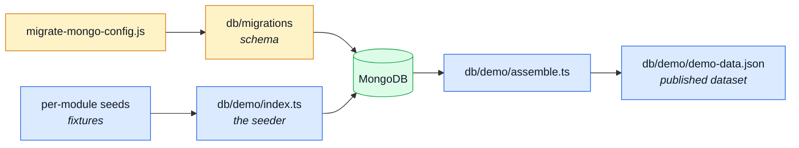

# Data

`db/` holds everything that puts rows in a database, and the split inside it is the point:
**`migrate-mongo` owns schema, `db:seed` owns data.** A migration changes the shape of a
collection; a seed fills one. Neither does the other's job.

---

## The two halves

## Migrations

| Pattern              | What it is                                                                                                                                                                                                                                                                                                                                                                                                                               | Read next                                                                         |
| -------------------- | ---------------------------------------------------------------------------------------------------------------------------------------------------------------------------------------------------------------------------------------------------------------------------------------------------------------------------------------------------------------------------------------------------------------------------------------- | --------------------------------------------------------------------------------- |
| `db/migrations/*.js` | One file per schema change, named with a leading timestamp, each exporting an up and a down. Applied in timestamp order and recorded in a changelog collection, so a migration runs exactly once per database. Plain JavaScript because `migrate-mongo` loads them through its own CommonJS resolver with no TypeScript in the chain — the same reason `migrate-mongo-config.js` is a `.js` file. Run them with `npm run db:migrate:up`. | [MongoDB & Mongoose](../tools/mongodb-mongoose.md) · [Repository Root](./root.md) |

The baseline is GENERATED. `npm run gen:migration` reads the indexes each module's schema declares
and rewrites `db/migrations/…-baseline.js` from them, so an index has one author — the schema —
exactly as `openapi.yaml` has one author in the per-module fragments. `check:migration` fails the
`complete` gate when the two have diverged. Data migrations are still written by hand: a rename or
a backfill cannot be derived from a schema.

Two tests guard the set: `tests/integration/db/migration-model-indexes.test.ts` runs the migrations
against a real database and checks the indexes that land against the ones the models declare, and
`tests/integration/db/migration-demo-data.test.ts` checks a migration against the dataset it has to
keep loadable.

## The demo dataset

| File                     | What it is                                                                                                                                                                                                                                                                                            | Read next                                                              |
| ------------------------ | ----------------------------------------------------------------------------------------------------------------------------------------------------------------------------------------------------------------------------------------------------------------------------------------------------- | ---------------------------------------------------------------------- |
| `db/demo/index.ts`       | The seeder that `npm run db:seed` runs. Walks every enabled module's seed file and upserts its fixtures through the shared seeding primitive — so seeding is idempotent, and a module that is disabled seeds nothing. A reset flag empties first.                                                     | [Modules](./src-modules.md) · [Demo profile](../tools/demo-profile.md) |
| `db/demo/assemble.ts`    | Reads the seeded rows back out **through the real serializers** and checks the result is what the API would actually answer. That is what makes the published dataset a record of the API's behaviour rather than of its storage.                                                                     | [Contract Testing (Response)](../tools/contract-testing.md)            |
| `db/demo/demo-data.json` | **Generated** by `npm run seed:export`. The demo dataset exactly as the API serves it, published for the paired frontend to mock against. `npm run check:seed-export` fails when the committed bytes differ from a fresh run, and Prettier is told to leave it alone so the two writers cannot fight. | [Contract Ownership & Fragmentation](../api/contract-fragmentation.md) |

The fixtures themselves are not here — each module owns its own slice, and the two demo accounts
are declared in `src/kernel/seed-accounts.ts`.

## Tools

| File                | What it is                                                                                                                                                                                                                                                                         | Read next                                      |
| ------------------- | ---------------------------------------------------------------------------------------------------------------------------------------------------------------------------------------------------------------------------------------------------------------------------------- | ---------------------------------------------- |
| `db/cache-clear.ts` | Drops every cached response belonging to this app — `npm run db:cache:clear`. The API invalidates its own cache on every write it handles, so this is for the writes it did **not** handle: a migration, a manual edit, a restored dump.                                           | [Redis Cache](../tools/redis-cache.md)         |
| `db/run-script.ts`  | The entry-point wrapper the one-shot scripts in `db/` run through. Gives them the three things a bare promise chain does not: a connection opened and closed around the work, a non-zero exit on failure, and the failure printed rather than swallowed as an unhandled rejection. | [Package Scripts](../tools/package-scripts.md) |
