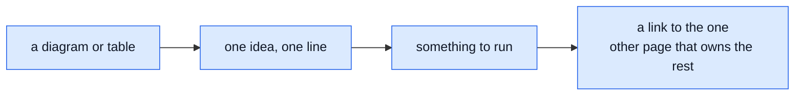
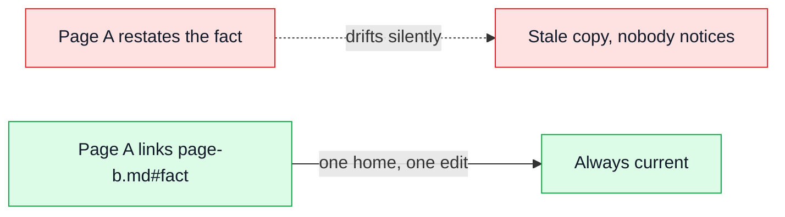

# Writing These Docs

The site calls itself "ADHD-friendly docs" in `docs/.vitepress/config.mts`'s own description. That
claim is a page shape, not a slogan — this is the shape, written down once so the rest of the site
can follow it mechanically instead of by feel.



That loop, repeated per section, is most of this page.

## The five rules

| Rule                                                 | What it looks like                                                                                           |
| ---------------------------------------------------- | ------------------------------------------------------------------------------------------------------------ |
| A diagram or table before the prose                  | The reader gets the shape before the explanation, not after it                                               |
| One idea per line, short lines                       | A sentence that needs "and" twice is two sentences                                                           |
| A worked example that can be copy-pasted             | A command, a config block, a curl call — something a reader runs rather than imagines                        |
| A "try it yourself" block, where the subject can run | Not every page has one — a theory page about a trade-off has nothing to run                                  |
| Tables over paragraphs, always                       | If a paragraph is comparing two or more things, it is a table that hasn't been formatted yet                 |
| One home per fact, reached by anchor                 | State a fact once; every other page **links** `page.md#anchor` to it rather than restating a shorter version |

## Try it yourself

Take any paragraph in a draft that compares two or more things and turn it into a table:

**Before:**

> Dev bind-mounts the source and has no auth on Mongo; production bakes the image and runs Mongo
> with a scoped app user behind a root account.

**After:**

| Dev                 | Production                                                 |
| ------------------- | ---------------------------------------------------------- |
| Source bind-mounted | Source baked into the image                                |
| Mongo has no auth   | Mongo runs a scoped `readWrite` user behind a root account |

Same facts, and the reader compares columns instead of re-parsing a sentence to find the pairing.

## One home per fact

The rule that keeps a big site from drifting: when two pages would otherwise say the same thing,
one of them says it and the other links to `page.md#anchor`. A fact stated twice is a fact that
goes stale in only one of the two places, silently.



Verify an anchor link before shipping it — `npm run check:docs-references` resolves every internal
link and anchor against the built site and fails the build if one doesn't exist.

```bash
npm run check:docs-references
```

## What this page is not

**Advisory, not enforced.** No linter checks a page's shape, on purpose: a rule that penalises a
too-prose paragraph polices the author, not a real defect, and the two pages this site trusts most
(`theory/clustering.md`, `theory/modules.md`) earn that trust by following these rules well, not by
passing a check. Judgement stays with whoever writes the page.

## Exemplars to copy

| Page                                             | Diagrams | Why it works                                                         |
| ------------------------------------------------ | -------- | -------------------------------------------------------------------- |
| [Clustering & Shutdown](../theory/clustering.md) | 3        | The model for a SMALL page: diagram → env table → diagram → sequence |
| [Modules](../theory/modules.md)                  | 8        | The model for a LONG page                                            |
| [Tactical DDD](../theory/tactical-ddd.md)        | 8        | Concept-heavy material kept visual throughout                        |
| [Mutation Testing](../tools/mutation-testing.md) | 7        | The most worked, copy-pasteable examples in the repo                 |

## Where to go next

| You want to                             | Read                            |
| --------------------------------------- | ------------------------------- |
| See the file glossary these docs index  | [File Glossary](./)             |
| Find every internal link/anchor checker | `npm run check:docs-references` |
