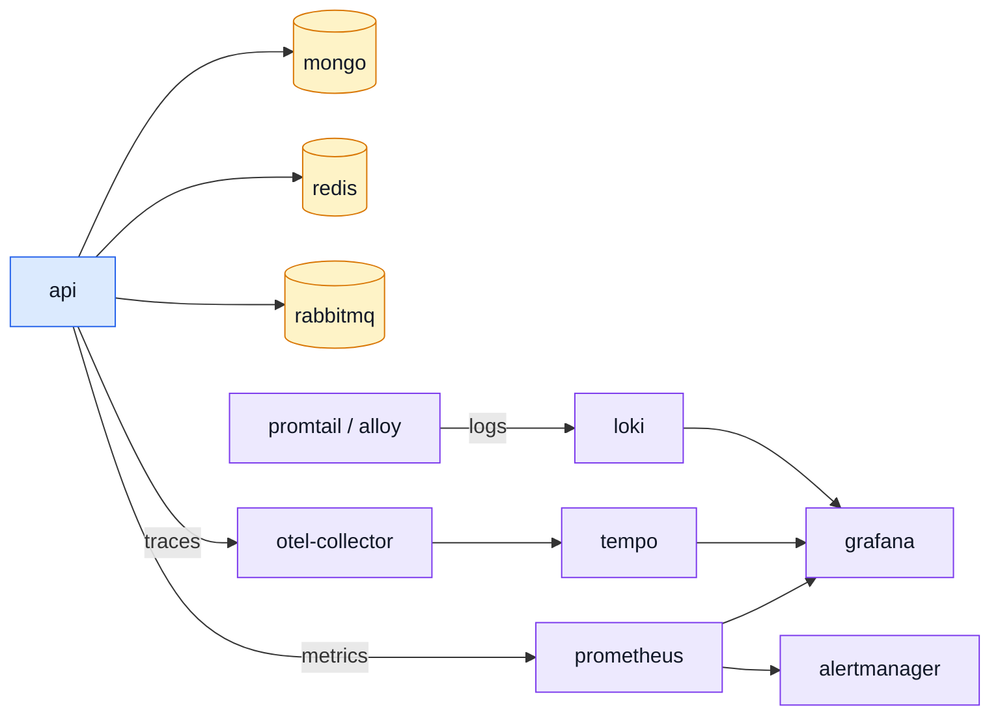

# Ops & Assets

Everything that is not application code: the images the app runs in, the observability stack that
watches it, the CI that gates it, the templates it renders and the files it serves.

---

## The compose stack

| File                            | What it is                                                                                                                                                                              | Read next                                                                                                           |
| ------------------------------- | --------------------------------------------------------------------------------------------------------------------------------------------------------------------------------------- | ------------------------------------------------------------------------------------------------------------------- |
| `docker-compose.yml`            | The development stack: the API plus every backing service and the whole observability chain. What `npm run compose -- up -d` starts. Podman by default, Docker by environment override. | [Docker & Podman](../tools/docker-and-podman.md) · [Pairing & Ports](../tools/pairing-and-ports.md)                 |
| `docker-compose.production.yml` | The production shape of the same stack — the built image instead of a bind mount, no dev tooling.                                                                                       | [Getting Started — Production](../getting-started-production.md) · [Docker & Podman](../tools/docker-and-podman.md) |
| `docker/mongo-init.js`          | Runs once, against an empty Mongo volume: creates the app's own `readWrite` user, scoped to its database, so it never authenticates as the container's root account.                    | [Getting Started — Production](../getting-started-production.md)                                                    |
| `.dockerignore`                 | What never enters the build context. The reports directory alone is tens of megabytes of mutation HTML, copied on every build otherwise.                                                | [Docker & Podman](../tools/docker-and-podman.md)                                                                    |

## Images

| File                           | What it is                                                                                          | Read next                                          |
| ------------------------------ | --------------------------------------------------------------------------------------------------- | -------------------------------------------------- |
| `docker/Dockerfile`            | The development image: source bind-mounted, the TypeScript runner watching.                         | [Docker & Podman](../tools/docker-and-podman.md)   |
| `docker/Dockerfile.production` | The production image — a multi-stage build that installs, compiles and ships without the toolchain. | [Docker & Podman](../tools/docker-and-podman.md)   |
| `docker/Dockerfile.docs`       | Builds the VitePress site and serves it with nginx, so the docs deploy like any other service.      | [Testing (overview)](../tools/testing-and-docs.md) |
| `docker/nginx.docs.conf`       | The nginx config behind that image.                                                                 | —                                                  |

## The observability stack

One config per service in the chain. Each is mounted into its container by the compose file.

| File                                                      | What it is                                                                                                                 | Read next                                        |
| --------------------------------------------------------- | -------------------------------------------------------------------------------------------------------------------------- | ------------------------------------------------ |
| `docker/observability/otel-collector.config.yaml`         | Receivers, processors and exporters for the OpenTelemetry Collector — where the app's spans arrive and where they go next. | [OpenTelemetry](../tools/opentelemetry.md)       |
| `docker/observability/tempo.config.yaml`                  | Tempo's storage and retention for the traces the collector forwards.                                                       | [Tempo](../tools/tempo.md)                       |
| `docker/observability/prometheus.config.yaml`             | The scrape configuration: which targets, how often, with which credentials.                                                | [Prometheus](../tools/prometheus.md)             |
| `docker/observability/prometheus.alert-rules.yaml`        | The alerting rules evaluated against those metrics.                                                                        | [Prometheus](../tools/prometheus.md)             |
| `docker/observability/alertmanager.config.yaml`           | What happens to a firing alert — routing, grouping, silencing.                                                             | [Prometheus](../tools/prometheus.md)             |
| `docker/observability/loki.config.yaml`                   | Loki's storage, schema and retention for logs.                                                                             | [Loki](../tools/loki.md)                         |
| `docker/observability/promtail.config.yaml`               | The log shipper: which files and container streams reach Loki, and how they are labelled.                                  | [Loki](../tools/loki.md)                         |
| `docker/observability/promtail.podman.config.yaml`        | The same under Podman, whose container log paths and socket differ from Docker's.                                          | [Docker & Podman](../tools/docker-and-podman.md) |
| `docker/observability/alloy.config.alloy`                 | The Grafana Alloy alternative to promtail, in Alloy's own configuration language.                                          | [Loki](../tools/loki.md)                         |
| `docker/observability/grafana.datasources.yaml`           | Provisions Grafana's data sources — Prometheus, Loki, Tempo — so a fresh stack comes up already wired.                     | [Grafana](../tools/grafana.md)                   |
| `docker/observability/grafana.dashboard-providers.yaml`   | Tells Grafana where to load dashboards from on startup.                                                                    | [Grafana](../tools/grafana.md)                   |
| `docker/observability/grafana/dashboards/api-traces.json` | The provisioned dashboard itself: request rates, latencies and the trace links into Tempo.                                 | [Grafana](../tools/grafana.md)                   |
| `docker/observability/umami-init.sh`                      | Initialises the Umami analytics database on first start.                                                                   | [Product Analytics](../tools/analytics.md)       |

## Scheduled jobs

The `cron` service in both compose files — busybox `crond` reading `docker/crontab` — is an
external scheduler: the schedule is deployment configuration instead of code, and the shape
survives a move off compose unchanged (a `CronJob` on Kubernetes, a systemd timer on a VM). It runs
the same `ops/reap-*`/`sweep:*` entry points every one of them already documents as "meant to run
periodically", via `db/run-script.ts`.

| Job                              | Schedule (UTC) | What it does                                                                                            |
| -------------------------------- | -------------- | ------------------------------------------------------------------------------------------------------- |
| `npm run reap:quarantine`        | 02:00 nightly  | Deletes quarantined upload files past their retention window.                                           |
| `npm run reap:inactive-accounts` | 02:05 nightly  | Warns, then soft-, then hard-deletes an account inactive past the threshold. Disabled by default.       |
| `npm run reap:orders`            | 02:10 nightly  | Anonymizes an order's remaining PII once its retention window has passed.                               |
| `npm run reap:payments`          | 02:15 nightly  | Deletes abandoned (never-settled) payment attempts past their retention window.                         |
| `npm run sweep:order-effects`    | 02:20 nightly  | Re-announces `ORDER_CANCELLED` for a refund the event bus's one delivery attempt did not carry through. |

`docker/crontab` and this list are staggered five minutes apart so five jobs opening their own
Mongo connection do not all land on the connection pool at once — each job's own header in `ops/`
has the full reasoning. `tests/cross-cutting/scheduled-jobs.test.ts` asserts `docker/crontab` and
`package.json`'s `reap:*`/`sweep:*` scripts agree in both directions — a script renamed in one and
not the other is either a job that fails every night or cleanup that silently stops running.

**Mutual exclusion.** `deploy: replicas: 1` on the `cron` service is what actually stops two passes
racing over the same collection — nothing here is meant to scale. `withLease`
(`src/infrastructure/persistence/lease.ts`) is the backstop if it ever is: an atomic Mongo upsert
that only one caller can hold at a time, TTL-bounded so a crashed holder's lease still expires.
None of the five jobs above call it yet — they are correct today under `replicas: 1` alone — but any
future scheduled job that would NOT be safe to run twice concurrently should wrap its work in it.

**Observability.** Every `withLease` call stamps its lease document's `lastSuccessAt` on success and
`lastError` on a throw, and `GET /observability/health`'s `jobs` array reports the set — so a job
that silently stopped running is visible on the probe an operator already looks at, without a
Pushgateway or a second UI. See `docs/tools/observability-layer.md`.

## Data retention

Four collections delete their own rows on a timer, via a Mongo TTL index rather than a scheduled
job — that is cleanup with no scheduler involved at all, the cheapest form there is, and it stays
right for state with no retry story (a cart, an audit entry, a feedback ticket, an abandoned lease
never need a second attempt at expiring). The five jobs above are the other half: retention and
periodic work that DOES need to run as a step, with a real success/failure outcome — see Scheduled
jobs above.

| Collection         | Window                         | Default | Read next                                   |
| ------------------ | ------------------------------ | ------- | ------------------------------------------- |
| `auditlogs`        | `NODE_AUDIT_RETENTION_DAYS`    | 90      | [Winston & Audit Logs](../tools/winston.md) |
| `feedbackrequests` | `NODE_FEEDBACK_RETENTION_DAYS` | 730     | [feedback](../modules/feedback.md)          |
| `carts`            | `NODE_CART_RETENTION_DAYS`     | 365     | [cart](../modules/cart.md)                  |
| `leases`           | `NODE_LEASE_RETENTION_DAYS`    | 30      | Scheduled jobs, above                       |

All four share one caveat, worth stating once rather than four times: **Mongo will not modify an
existing TTL index's `expireAfterSeconds` in place.** Raising or lowering any of these variables and
RESTARTING fails the boot — `autoIndex` asks for the new window and Mongo refuses the conflicting
options. `npm run db:sync` is what applies it: it drops the index and rebuilds it, which is why
`db:bootstrap` syncs before the server starts. `feedback`'s window
is the longest on purpose: a contact request can be evidence in a commercial dispute, and 24 months
sits inside the common limitation periods. `carts` and `leases` both tie to `updatedAt`, so any
edit — a cart line changed, a lease re-acquired — restarts the clock; only a genuinely abandoned row
is ever removed. For `leases` that window is unrelated to the mutual-exclusion lease a job actually
holds (`withLease`'s own `ttlMs` argument, typically minutes): it is garbage collection for a job
retired from the crontab entirely, not the lock a running job holds.

`orders` and a SETTLED `payments` row must NOT be removed on a timer — both are invoices, kept for
tax and commercial-law reasons. `orders` carries PII (shipping name/address, email) that survives
an account's erasure, so `npm run reap:orders` scrubs it in place past
`NODE_ORDER_PII_RETENTION_DAYS` (default 3650 days) — see the script's own header. `payments`
carries none: `cardLast4` is not a PAN, and `amount`/`currency`/`provider` were never personal
data, so a settled payment is never touched by any timer.

A payment that never settled is a different case, not a PII one: `npm run reap:payments` DELETES
an attempt (never `succeeded`/`refunded`) once it has sat untouched for
`NODE_PAYMENT_ABANDONED_RETENTION_DAYS` (default 30 days) — an abandoned checkout is not an
invoice, so there is nothing there worth keeping. See the script's own header, and
[payments](../modules/payments.md)'s retention section for the full reasoning.

`users` has no TTL either — `npm run reap:inactive-accounts` warns, then soft-deletes, then
hard-deletes an account after `NODE_INACTIVE_ACCOUNT_DAYS` of no login, **disabled by default**
(`0`). See the script's own header for the three-stage design.

`npm run sweep:order-effects` is a different kind of periodic job: not retention, but the retry
behind a cancel's consequences. A cancel announces `ORDER_CANCELLED` and `payments` refunds off
that announcement, and the domain event bus has no retry — so a provider unreachable for the length
of one call would leave the order cancelled and the refund lost. `cancelById` writes the intent to
refund in the same document write that decides the cancel, and this sweep re-announces for whatever
is still owed past `NODE_ORDER_EFFECT_RETRY_MINUTES` (default 5). Run it on the same schedule as the
`reap:*` jobs; it is safe to repeat, since a second pass over a settled order refunds nothing.

The stock half of a cancel is deliberately NOT covered here — a hold keeps its `expiresAt` and the
reservation sweep reclaims it, so it heals on its own.

Log lines are Loki's retention, not Mongo's: `docker/observability/loki.config.yaml` sets
`retention_period: 168h` (7 days) for the local stack. A production deployment tunes this
independently — it is the one retention window this repo does not read from `.env`.

The lawful basis behind each of these windows, and the subject-request and breach runbooks that
sit on top of them, are in [Data Protection](../theory/data-protection.md).

## CI

| File                              | What it is                                                                                                                                                             | Read next                                                |
| --------------------------------- | ---------------------------------------------------------------------------------------------------------------------------------------------------------------------- | -------------------------------------------------------- |
| `.github/workflows/ci.yml`        | The gate on every push and pull request: build, lint, the contract checks and the test suites. Checks out the paired frontend first, so the cross-repo checks can run. | [Package Scripts](../tools/package-scripts.md)           |
| `.github/workflows/mutation.yml`  | The nightly mutation run and the ratchet comparison — too slow for the push gate, too valuable to skip.                                                                | [Mutation Testing](../tools/mutation-testing.md)         |
| `.github/workflows/fuzz.yml`      | The scheduled fuzz run, which walks the whole contract with generated hostile input.                                                                                   | [Fuzz Testing](../tools/fuzz-testing.md)                 |
| `.github/workflows/codeql.yml`    | GitHub's static security analysis.                                                                                                                                     | [Security](../tools/security.md)                         |
| `.github/dependabot.yml`          | The dependency update schedule.                                                                                                                                        | [Package Dependencies](../tools/package-dependencies.md) |
| `.github/copilot-instructions.md` | The house rules, written for an assistant and equally readable by a person: the code brain, the docs brain and the change brain in three short lists.                  | [Reading Path](../theory/reading-path.md)                |

## Rendered templates

| Pattern                            | What it is                                                                                                                                                     | Read next                                                                              |
| ---------------------------------- | -------------------------------------------------------------------------------------------------------------------------------------------------------------- | -------------------------------------------------------------------------------------- |
| `shared/templates/emails/*.ejs`    | One template per email the app sends, named for the module and the event that sends it — so an orphaned template is visible at a glance.                       | [Email & PDF Rendering](../tools/email-and-rendering.md) · [Modules](./src-modules.md) |
| `shared/templates/documents/*.ejs` | The same for documents rendered to PDF rather than sent — today, the order invoice.                                                                            | [Email & PDF Rendering](../tools/email-and-rendering.md)                               |
| `shared/templates/layouts/*.ejs`   | The shared wrappers those templates include: the email head, the PDF head, and the common footer. Styling lives here so a template holds only its own content. | [Email & PDF Rendering](../tools/email-and-rendering.md)                               |

## Served assets

`public/` is served by the static handler, which is also why `.gitignore` excludes uploads from it
— anything a user uploads lands in a tracked directory.

| Pattern                        | What it is                                                                                                                                                                                                             | Read next         |
| ------------------------------ | ---------------------------------------------------------------------------------------------------------------------------------------------------------------------------------------------------------------------- | ----------------- |
| `public/favicon/*`             | The favicon set and its manifests — every size and format a browser or mobile launcher asks for.                                                                                                                       | —                 |
| `public/images/seed/*.jpg`     | The demo product images, named by content hash and referenced from the seed fixtures. Committed on purpose, unlike the rest of the images directory, because they are repository content rather than someone's upload. | [Data](./data.md) |
| `public/images/seed/README.md` | What those hashed filenames are and where they came from.                                                                                                                                                              | [Data](./data.md) |

## The docs site itself

The site you are reading. Its pages are not listed here one by one — the sidebar already is that
list, and a row per page would be a second copy of it to keep in sync.

| Pattern              | What it is                                                                                                                                                                                                              | Read next                                                  |
| -------------------- | ----------------------------------------------------------------------------------------------------------------------------------------------------------------------------------------------------------------------- | ---------------------------------------------------------- |
| `docs/*.md`          | The two pages outside a section: the home page and [Getting Started](../getting-started.md).                                                                                                                            | —                                                          |
| `docs/*/*.md`        | Every section page — Theory, Tools, API and this Reference section. Use the sidebar.                                                                                                                                    | [Theory](../theory/) · [Tools](../tools/) · [API](../api/) |
| `docs/.vitepress/**` | The site's own configuration and theme: the config holds the nav and every sidebar group, and the theme directory holds the custom CSS. Adding a page means adding it here too, or it exists without a way to reach it. | —                                                          |
