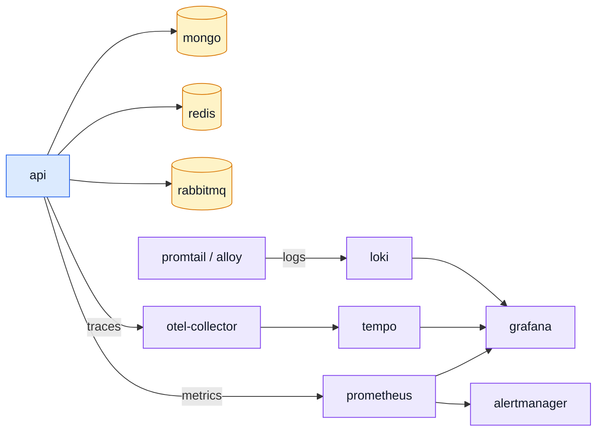

# Ops & Assets

Everything that is not application code: the images the app runs in, the observability stack that
watches it, the CI that gates it, the templates it renders and the files it serves.

---

## The compose stack

| File                            | What it is                                                                                                                                                                              | Read next                                                                                                           |
| ------------------------------- | --------------------------------------------------------------------------------------------------------------------------------------------------------------------------------------- | ------------------------------------------------------------------------------------------------------------------- |
| `docker-compose.yml`            | The development stack: the API plus every backing service and the whole observability chain. What `npm run compose -- up -d` starts. Podman by default, Docker by environment override. | [Docker & Podman](../tools/docker-and-podman.md) · [Pairing & Ports](../tools/pairing-and-ports.md)                 |
| `docker-compose.production.yml` | The production shape of the same stack — the built image instead of a bind mount, no dev tooling.                                                                                       | [Getting Started — Production](../getting-started-production.md) · [Docker & Podman](../tools/docker-and-podman.md) |
| `.dockerignore`                 | What never enters the build context. The reports directory alone is tens of megabytes of mutation HTML, copied on every build otherwise.                                                | [Docker & Podman](../tools/docker-and-podman.md)                                                                    |

## Images

| File                            | What it is                                                                                          | Read next                                          |
| ------------------------------- | --------------------------------------------------------------------------------------------------- | -------------------------------------------------- |
| `.docker/Dockerfile`            | The development image: source bind-mounted, the TypeScript runner watching.                         | [Docker & Podman](../tools/docker-and-podman.md)   |
| `.docker/Dockerfile.production` | The production image — a multi-stage build that installs, compiles and ships without the toolchain. | [Docker & Podman](../tools/docker-and-podman.md)   |
| `.docker/Dockerfile.docs`       | Builds the VitePress site and serves it with nginx, so the docs deploy like any other service.      | [Testing (overview)](../tools/testing-and-docs.md) |
| `.docker/nginx.docs.conf`       | The nginx config behind that image.                                                                 | —                                                  |

## The observability stack

One config per service in the chain. Each is mounted into its container by the compose file.

| File                                                       | What it is                                                                                                                 | Read next                                        |
| ---------------------------------------------------------- | -------------------------------------------------------------------------------------------------------------------------- | ------------------------------------------------ |
| `.docker/observability/otel-collector.config.yaml`         | Receivers, processors and exporters for the OpenTelemetry Collector — where the app's spans arrive and where they go next. | [OpenTelemetry](../tools/opentelemetry.md)       |
| `.docker/observability/tempo.config.yaml`                  | Tempo's storage and retention for the traces the collector forwards.                                                       | [Tempo](../tools/tempo.md)                       |
| `.docker/observability/prometheus.config.yaml`             | The scrape configuration: which targets, how often, with which credentials.                                                | [Prometheus](../tools/prometheus.md)             |
| `.docker/observability/prometheus.alert-rules.yaml`        | The alerting rules evaluated against those metrics.                                                                        | [Prometheus](../tools/prometheus.md)             |
| `.docker/observability/alertmanager.config.yaml`           | What happens to a firing alert — routing, grouping, silencing.                                                             | [Prometheus](../tools/prometheus.md)             |
| `.docker/observability/loki.config.yaml`                   | Loki's storage, schema and retention for logs.                                                                             | [Loki](../tools/loki.md)                         |
| `.docker/observability/promtail.config.yaml`               | The log shipper: which files and container streams reach Loki, and how they are labelled.                                  | [Loki](../tools/loki.md)                         |
| `.docker/observability/promtail.podman.config.yaml`        | The same under Podman, whose container log paths and socket differ from Docker's.                                          | [Docker & Podman](../tools/docker-and-podman.md) |
| `.docker/observability/alloy.config.alloy`                 | The Grafana Alloy alternative to promtail, in Alloy's own configuration language.                                          | [Loki](../tools/loki.md)                         |
| `.docker/observability/grafana.datasources.yaml`           | Provisions Grafana's data sources — Prometheus, Loki, Tempo — so a fresh stack comes up already wired.                     | [Grafana](../tools/grafana.md)                   |
| `.docker/observability/grafana.dashboard-providers.yaml`   | Tells Grafana where to load dashboards from on startup.                                                                    | [Grafana](../tools/grafana.md)                   |
| `.docker/observability/grafana/dashboards/api-traces.json` | The provisioned dashboard itself: request rates, latencies and the trace links into Tempo.                                 | [Grafana](../tools/grafana.md)                   |
| `.docker/observability/umami-init.sh`                      | Initialises the Umami analytics database on first start.                                                                   | [Product Analytics](../tools/analytics.md)       |

## Data retention

Three collections delete their own rows on a timer, via a Mongo TTL index rather than a scheduled
job — this repo has no scheduler, so a TTL index is the one form of cleanup that costs nothing to
run.

| Collection         | Window                         | Default | Read next                                   |
| ------------------ | ------------------------------ | ------- | ------------------------------------------- |
| `auditlogs`        | `NODE_AUDIT_RETENTION_DAYS`    | 90      | [Winston & Audit Logs](../tools/winston.md) |
| `feedbackrequests` | `NODE_FEEDBACK_RETENTION_DAYS` | 730     | [feedback](../modules/feedback.md)          |
| `carts`            | `NODE_CART_RETENTION_DAYS`     | 365     | [cart](../modules/cart.md)                  |

All three share one caveat, worth stating once rather than three times: **Mongo will not modify an
existing TTL index's `expireAfterSeconds` when the value changes.** Raising or lowering any of
these variables on a database that already holds the index does nothing until the index is dropped
and recreated — a migration under `db/migrations/` (`collMod`), not a restart. `feedback`'s window
is the longest on purpose: a contact request can be evidence in a commercial dispute, and 24 months
sits inside the common limitation periods. `carts` ties to `updatedAt`, so any edit restarts the
clock — only a genuinely abandoned cart is ever removed.

Two collections that must NOT be removed on a timer — `orders` and `payments` are invoices, kept
for tax and commercial-law reasons — instead have their PII scrubbed in place by
`npm run reap:orders` past `NODE_ORDER_PII_RETENTION_DAYS` (default 3650 days). See GDPR_FIX.md G2.

`users` has no TTL either — `npm run reap:inactive-accounts` warns, then soft-deletes, then
hard-deletes an account after `NODE_INACTIVE_ACCOUNT_DAYS` of no login, **disabled by default**
(`0`). See GDPR_FIX.md G5 and the script's own header for the three-stage design.

Log lines are Loki's retention, not Mongo's: `.docker/observability/loki.config.yaml` sets
`retention_period: 168h` (7 days) for the local stack. A production deployment tunes this
independently — it is the one retention window this repo does not read from `.env`.

## CI

| File                              | What it is                                                                                                                                                             | Read next                                                |
| --------------------------------- | ---------------------------------------------------------------------------------------------------------------------------------------------------------------------- | -------------------------------------------------------- |
| `.github/workflows/ci.yml`        | The gate on every push and pull request: build, lint, the contract checks and the test suites. Checks out the paired frontend first, so the cross-repo checks can run. | [Package Scripts](../tools/package-scripts.md)           |
| `.github/workflows/mutation.yml`  | The nightly mutation run and the ratchet comparison — too slow for the push gate, too valuable to skip.                                                                | [Mutation Testing](../tools/mutation-testing.md)         |
| `.github/workflows/fuzz.yml`      | The scheduled fuzz run, which walks the whole contract with generated hostile input.                                                                                   | [Fuzz Testing](../tools/fuzz-testing.md)                 |
| `.github/workflows/codeql.yml`    | GitHub's static security analysis.                                                                                                                                     | [Security](../tools/security.md)                         |
| `.github/dependabot.yml`          | The dependency update schedule.                                                                                                                                        | [Package Dependencies](../tools/package-dependencies.md) |
| `.github/copilot-instructions.md` | The house rules, written for an assistant and equally readable by a person: the code brain, the docs brain and the change brain in three short lists.                  | [Reading Path](../theory/reading-path.md)                |

## Rendered templates

| Pattern                               | What it is                                                                                                                                                     | Read next                                                                              |
| ------------------------------------- | -------------------------------------------------------------------------------------------------------------------------------------------------------------- | -------------------------------------------------------------------------------------- |
| `shared/views/templates-emails/*.ejs` | One template per email the app sends, named for the module and the event that sends it — so an orphaned template is visible at a glance.                       | [Email & PDF Rendering](../tools/email-and-rendering.md) · [Modules](./src-modules.md) |
| `shared/views/templates-files/*.ejs`  | The same for documents rendered to PDF rather than sent — today, the order invoice.                                                                            | [Email & PDF Rendering](../tools/email-and-rendering.md)                               |
| `shared/views/layouts/*.ejs`          | The shared wrappers those templates include: the email head, the PDF head, and the common footer. Styling lives here so a template holds only its own content. | [Email & PDF Rendering](../tools/email-and-rendering.md)                               |

## Served assets

`public/` is served by the static handler, which is also why `.gitignore` excludes uploads from it
— anything a user uploads lands in a tracked directory.

| Pattern                        | What it is                                                                                                                                                                                                             | Read next         |
| ------------------------------ | ---------------------------------------------------------------------------------------------------------------------------------------------------------------------------------------------------------------------- | ----------------- |
| `public/css/*.css`             | Stylesheets for the server-rendered pages, one per screen.                                                                                                                                                             | —                 |
| `public/favicon/*`             | The favicon set and its manifests — every size and format a browser or mobile launcher asks for.                                                                                                                       | —                 |
| `public/images/seed/*.jpg`     | The demo product images, named by content hash and referenced from the seed fixtures. Committed on purpose, unlike the rest of the images directory, because they are repository content rather than someone's upload. | [Data](./data.md) |
| `public/images/seed/README.md` | What those hashed filenames are and where they came from.                                                                                                                                                              | [Data](./data.md) |

## The docs site itself

The site you are reading. Its pages are not listed here one by one — the sidebar already is that
list, and a row per page would be a second copy of it to keep in sync.

| Pattern              | What it is                                                                                                                                                                                                              | Read next                                                  |
| -------------------- | ----------------------------------------------------------------------------------------------------------------------------------------------------------------------------------------------------------------------- | ---------------------------------------------------------- |
| `docs/*.md`          | The two pages outside a section: the home page and [Getting Started](../getting-started.md).                                                                                                                            | —                                                          |
| `docs/*/*.md`        | Every section page — Theory, Tools, API and this Reference section. Use the sidebar.                                                                                                                                    | [Theory](../theory/) · [Tools](../tools/) · [API](../api/) |
| `docs/.vitepress/**` | The site's own configuration and theme: the config holds the nav and every sidebar group, and the theme directory holds the custom CSS. Adding a page means adding it here too, or it exists without a way to reach it. | —                                                          |
