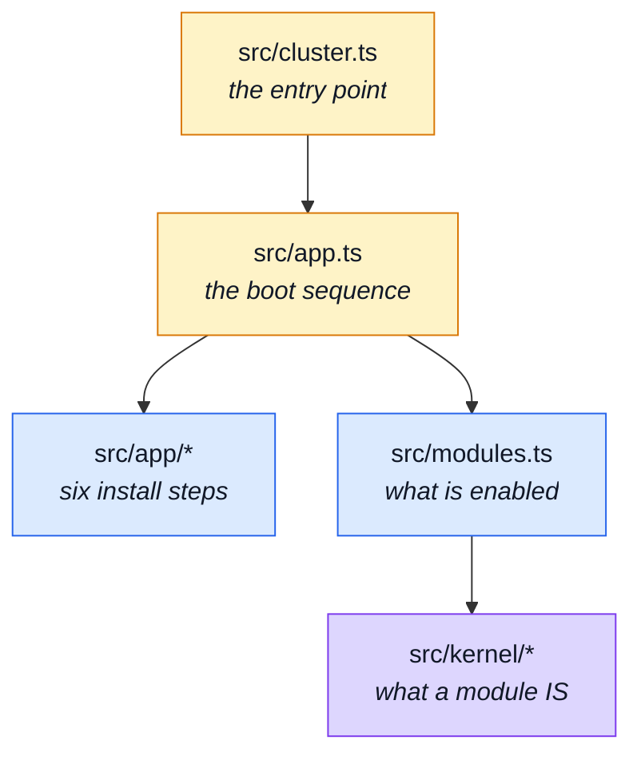

# App, Kernel & Types

The three files at the top of `src/`, the assembly layer under `src/app/`, the module system under
`src/kernel/`, and the two supporting directories.

Read [Architecture](../theory/architecture.md) first if the four tiers are new: dependencies run
one way — `infrastructure` → `kernel` → `modules` → `app` — and `eslint.config.ts` enforces it.

---

## Where these sit

## The top of `src/`

| File               | What it is                                                                                                                                                                                                                                                    | Read next                                                                                     |
| ------------------ | ------------------------------------------------------------------------------------------------------------------------------------------------------------------------------------------------------------------------------------------------------------- | --------------------------------------------------------------------------------------------- |
| `src/cluster.ts`   | The process entry point named by `package.json`, and what `npm start` runs. Forks one worker per core and restarts a worker that dies. Point `main` at `src/app.ts` instead to run single-process.                                                            | [Clustering & Shutdown](../theory/clustering.md)                                              |
| `src/app.ts`       | The boot sequence, and the only file that knows the order. Tracing starts before anything instrumented is imported, then environment validation, database, cache and queue, then the six `install*` calls that **are** the middleware stack in request order. | [Reading Path](../theory/reading-path.md) · [Request Flow](../theory/request-flow.md)         |
| `src/modules.ts`   | The list of domains this build serves: one import and one array entry each, kept alphabetical. Enabling or disabling a domain is one line here — there is no filesystem discovery and no auto-registration.                                                   | [Modules](../theory/modules.md) · [Adding & Removing a Module](../theory/module-lifecycle.md) |
| `src/globals.d.ts` | The ambient declarations that widen Express's `Request` — the per-request additions (uploaded image URLs, locale, translator, observability handle) that middlewares attach and controllers read. Without it those reads are type errors.                     | [Request Input](../theory/request-input.md)                                                   |

## `src/app/` — assembly

One file per install step. Each is grouped by _when_ it runs, not by what it touches, because the
order is behaviour: security before context, context before telemetry, routes before error
handling.

| File                         | What it is                                                                                                                                                                                                                             | Read next                                          |
| ---------------------------- | -------------------------------------------------------------------------------------------------------------------------------------------------------------------------------------------------------------------------------------- | -------------------------------------------------- |
| `src/app/security.ts`        | Transport-level protection and body parsing: `trust proxy`, Helmet, CORS, rate limits. The order inside is load-bearing — `trust proxy` must be set before anything reads a client IP, or every request rate-limits against the proxy. | [Security](../tools/security.md)                   |
| `src/app/request-context.ts` | Everything attached per request: the correlation id, the access log, the observability handle, the negotiated locale. One group because everything here writes something the rest of the request reads.                                | [Request Flow](../theory/request-flow.md)          |
| `src/app/telemetry.ts`       | The Prometheus HTTP metrics middleware. Mounted before the routes so the timer wraps the handler; the `route` label is read on `finish`, from the template Express matched, so an unserved path cannot mint a time series of its own.  | [Prometheus](../tools/prometheus.md)               |
| `src/app/static-assets.ts`   | Serves `public/` over `express.static` — uploads, CSS and favicons.                                                                                                                                                                    | [Ops & Assets](./ops.md)                           |
| `src/app/routes.ts`          | Mounts every enabled module's router at the `basePath` its manifest declares. Modules mount themselves; this file only walks the registry.                                                                                             | [Modules](../theory/modules.md)                    |
| `src/app/system-routes.ts`   | The routes that belong to no module: the `GET /` liveness ping, and the other process-level endpoints.                                                                                                                                 | [Observability Endpoints](../api/observability.md) |
| `src/app/error-handling.ts`  | The global Express error handler plus the process-level `uncaughtException` / `unhandledRejection` handlers. Grouped because all three answer the same question: what happens to a failure nobody else handled.                        | [Request Flow](../theory/request-flow.md)          |
| `src/app/workers.ts`         | Registers every queue consumer at startup. A no-op when RabbitMQ is disabled, so a machine without a broker still boots.                                                                                                               | [RabbitMQ](../tools/rabbitmq.md)                   |
| `src/app/demo.ts`            | The demo profile's control surface — two routes, mounted only when `NODE_DEMO=true`. Consumed by the paired frontend's e2e suite, and fenced off by the `eslint-plugin-boundaries` element graph in `eslint.config.ts`.                | [Demo profile](../tools/demo-profile.md)           |

## `src/kernel/` — the module system

The kernel knows what a module _is_. It never knows which modules exist.

| File                                       | What it is                                                                                                                                                                                                                                                                                        | Read next                                                                                        |
| ------------------------------------------ | ------------------------------------------------------------------------------------------------------------------------------------------------------------------------------------------------------------------------------------------------------------------------------------------------- | ------------------------------------------------------------------------------------------------ |
| `src/kernel/registry.ts`                   | The thesis of the repository: a module is a typed value, not a folder convention. Defines `AppModule` — name, `basePath`, router, dependencies, locales, seeds, event subscriptions — and validates the set at boot.                                                                              | [Modules](../theory/modules.md) · [Strategic DDD](../theory/strategic-ddd.md)                    |
| `src/kernel/authentication.ts`             | The seam for "who is making this request": the kernel asks, a module answers. Lets the guard protect every module's routes without the kernel importing the module that owns users.                                                                                                               | [Security](../tools/security.md)                                                                 |
| `src/kernel/middlewares/authorizations.ts` | The route guard: reads the bearer token, resolves the caller, and enforces the role a route declares. Every protected route in every module passes through here.                                                                                                                                  | [Security](../tools/security.md) · [Request Flow](../theory/request-flow.md)                     |
| `src/kernel/authorization.ts`              | The other half of the route guard: once a caller is through, which ROWS may they read. `createCallerScope` builds a module's `callerScope` from its repository's owner scope — admins get no restriction, everyone else gets their own rows, and a caller with no id throws rather than widening. | [Security](../tools/security.md)                                                                 |
| `src/kernel/events.ts`                     | Domain events — the sanctioned way two modules talk when neither can own the other. A module publishes; subscribers are declared in manifests and wired by the registry.                                                                                                                          | [Events & Logging](../tools/events-and-logging.md) · [Strategic DDD](../theory/strategic-ddd.md) |
| `src/kernel/seed-accounts.ts`              | Who the two demo accounts are — their ids and credentials. In the kernel rather than in `users` because the seeding of several modules needs them and none of those modules should import another's fixtures.                                                                                     | [Data](./data.md) · [Demo profile](../tools/demo-profile.md)                                     |

## `src/types/`

| File                              | What it is                                                                                                                                                                                                                                                                        | Read next                                             |
| --------------------------------- | --------------------------------------------------------------------------------------------------------------------------------------------------------------------------------------------------------------------------------------------------------------------------------- | ----------------------------------------------------- |
| `src/types/index.ts`              | The single import path for contract types: re-exports the Orval models from `api/models` and the generated AsyncAPI types, plus the auth DTO. Import from `@types`, never from the generated files directly — `tests/cross-cutting/generated-type-shadowing.test.ts` enforces it. | [Regenerating After a Change](../api/regenerating.md) |
| `src/types/asyncapi.generated.ts` | **Generated** by `npm run gen:asyncapi` from `asyncapi.yaml`. Never hand-edited, and never committed — it's gitignored, regenerated by postinstall and the pre-commit hook before anything else runs.                                                                             | [AsyncAPI Workflow](../api/asyncapi-workflow.md)      |
| `src/types/auth-context.ts`       | The transport-safe representation of the caller. Keeps the HTTP and auth flow free of Mongoose document internals, so a controller never holds a live document it might accidentally save.                                                                                        | [Layers](../theory/layers.md)                         |

## `src/locales/`

| Pattern              | What it is                                                                                                                                                                                                                                                                                                        | Read next                                                              |
| -------------------- | ----------------------------------------------------------------------------------------------------------------------------------------------------------------------------------------------------------------------------------------------------------------------------------------------------------------- | ---------------------------------------------------------------------- |
| `src/locales/*.json` | App-level translation bundles — the strings that belong to no module: validation defaults, transport errors, the shared envelope. One file per language. Module-owned strings live in `src/modules/*/locales/*.json` instead, and `tests/cross-cutting/locale-namespaces.test.ts` keeps the two from overlapping. | [Internationalisation](../tools/i18n.md) · [Modules](./src-modules.md) |
