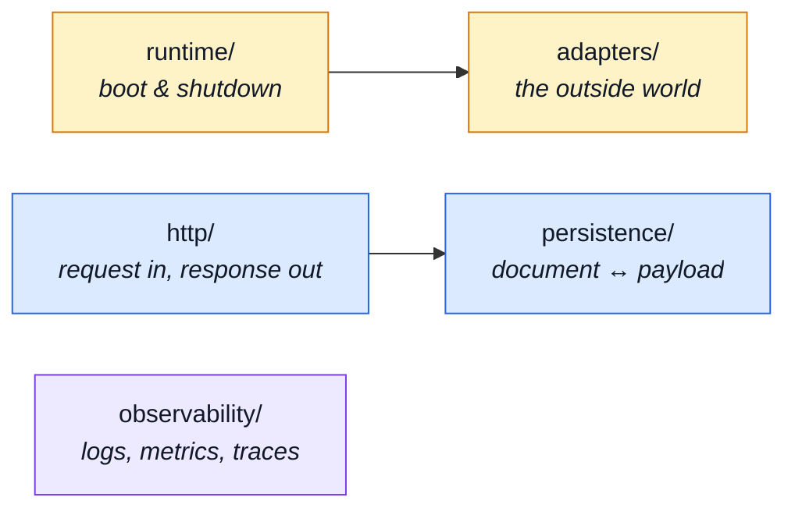

# Infrastructure

`src/infrastructure/` is the substrate: everything the application runs _on_, and nothing about
any domain. It is the bottom tier — it never knows modules exist, and `eslint.config.ts` stops it
finding out.

Five subdirectories, each a different kind of "outside the app".

---

## The five groups

## `runtime/` — boot and shutdown

| File                                               | What it is                                                                                                                                                                                                                       | Read next                                                                 |
| -------------------------------------------------- | -------------------------------------------------------------------------------------------------------------------------------------------------------------------------------------------------------------------------------- | ------------------------------------------------------------------------- |
| `src/infrastructure/runtime/otel-sdk.ts`           | Starts the OpenTelemetry SDK. Imported _first_ in `src/app.ts`, before express, mongoose or redis — auto-instrumentation patches those libraries as they load, so an import out of order silently produces no spans.             | [OpenTelemetry](../tools/opentelemetry.md)                                |
| `src/infrastructure/runtime/environment.ts`        | Validates the environment at boot and refuses to start without it. Only _hard_ requirements live here — a variable with a sane default is not one.                                                                               | [Runtime](../tools/runtime.md)                                            |
| `src/infrastructure/runtime/database.ts`           | The MongoDB connection lifecycle: URI resolution, the connect-retry loop, and `stopDatabase`. The URI logic is mirrored in `migrate-mongo-config.js`, and a test pins the two together.                                          | [MongoDB & Mongoose](../tools/mongodb-mongoose.md)                        |
| `src/infrastructure/runtime/server-lifecycle.ts`   | Graceful startup sequencing and shutdown: signal handlers, draining in-flight requests, closing infrastructure in the reverse of the order it opened.                                                                            | [Clustering & Shutdown](../theory/clustering.md)                          |
| `src/infrastructure/runtime/managed-connection.ts` | One optional connection's lifecycle, stated once: memoise the handle, share the in-flight connect, warn once per outage, resolve `undefined` rather than reject, report a `DependencyStatus`. Redis and RabbitMQ both run on it. | [Redis Cache](../tools/redis-cache.md) · [RabbitMQ](../tools/rabbitmq.md) |

## `adapters/` — the outside world

Every adapter here degrades rather than throws. Redis down, broker down, SMTP down: the API keeps
answering, with the feature that needed it off.

| File                                              | What it is                                                                                                                                                                                              | Read next                                                |
| ------------------------------------------------- | ------------------------------------------------------------------------------------------------------------------------------------------------------------------------------------------------------- | -------------------------------------------------------- |
| `src/infrastructure/adapters/cache.ts`            | The Redis adapter: a byte store with tags. Every function **fails open** — an unreachable Redis means a cache miss, never a failed request. What a cached value MEANS is the caller's business.         | [Redis Cache](../tools/redis-cache.md)                   |
| `src/infrastructure/adapters/queue.ts`            | The RabbitMQ (AMQP 0-9-1) adapter. Like the cache, every function becomes a no-op when the broker is absent, so a machine without one still boots and serves.                                           | [RabbitMQ](../tools/rabbitmq.md)                         |
| `src/infrastructure/adapters/logger.ts`           | Structured logging: the Winston instance, its transports and the log shape everything else writes through.                                                                                              | [Winston & Audit Logs](../tools/winston.md)              |
| `src/infrastructure/adapters/mailer.ts`           | Email: EJS template rendering plus SMTP delivery, optionally handed to the queue instead of sent inline.                                                                                                | [Email & PDF Rendering](../tools/email-and-rendering.md) |
| `src/infrastructure/adapters/email.worker.ts`     | The consumer for one queued email job. Returns true to ack, false to dead-letter — a permanent failure must not be retried forever.                                                                     | [RabbitMQ](../tools/rabbitmq.md)                         |
| `src/infrastructure/adapters/pdf.ts`              | HTML → PDF rendering through Puppeteer, for invoices and reports.                                                                                                                                       | [Email & PDF Rendering](../tools/email-and-rendering.md) |
| `src/infrastructure/adapters/pdf.worker.ts`       | The consumer for one queued PDF job: renders an EJS template to HTML, then drives Puppeteer over it.                                                                                                    | [Email & PDF Rendering](../tools/email-and-rendering.md) |
| `src/infrastructure/adapters/storage.ts`          | Where uploads land, what they are renamed to, and which MIME types are accepted — the multer write side.                                                                                                | [Security](../tools/security.md)                         |
| `src/infrastructure/adapters/image-store.ts`      | Image storage — the port every caller outside this file uses. Nothing else may turn an `imageUrl` into a filesystem path; that rule is what keeps upload handling in one auditable place.               | [Security](../tools/security.md)                         |
| `src/infrastructure/adapters/image-signatures.ts` | Identifies an image by its bytes rather than its declared content type, which is whatever the client typed. The defence against an HTML file uploaded as an image.                                      | [Security](../tools/security.md)                         |
| `src/infrastructure/adapters/filesystem.ts`       | Small filesystem helpers. `moveFile` is the one an upload cannot survive getting wrong: `rename` cannot cross a device boundary, and uploads stage on a different filesystem from the public directory. | [Security](../tools/security.md)                         |
| `src/infrastructure/adapters/demo-outbox.ts`      | The demo profile's email sink. Under `npm run demo` there is no SMTP server and no broker, but the e2e suite still has to read what would have been sent.                                               | [Demo profile](../tools/demo-profile.md)                 |

## `http/` — request in, response out

| File                                                    | What it is                                                                                                                                                                                    | Read next                                                                                  |
| ------------------------------------------------------- | --------------------------------------------------------------------------------------------------------------------------------------------------------------------------------------------- | ------------------------------------------------------------------------------------------ |
| `src/infrastructure/http/request.ts`                    | Reads one input wherever it arrives — route param, query string or body field — so a controller names the value instead of the transport.                                                     | [Request Input](../theory/request-input.md)                                                |
| `src/infrastructure/http/schemas.ts`                    | Decodes contract scalars as they arrive over HTTP. Deliberately does not validate: a value it cannot decode is passed on for the schema to reject with a real message.                        | [Contract-Derived Request Data](../tools/contract-request-data.md)                         |
| `src/infrastructure/http/response.ts`                   | The response envelope. Every endpoint answers the same top-level shape, so a client branches on `success` rather than on status-code trivia.                                                  | [Endpoints](../api/endpoints.md)                                                           |
| `src/infrastructure/http/errors.ts`                     | The HTTP error types, each carrying the status it maps to, and `databaseErrorInterpreter` — the single place deciding which driver failures describe the request rather than the server.      | [The database error interpreter](../theory/request-flow.md#the-database-error-interpreter) |
| `src/infrastructure/http/uploads.ts`                    | The read side of uploads — what a handler is allowed to see of a multipart request. The write side is `src/infrastructure/adapters/storage.ts`.                                               | [Security](../tools/security.md)                                                           |
| `src/infrastructure/http/middlewares/security.ts`       | Rate limiting and the credential check on the metrics endpoint, plus the default window and per-IP budget used when the rate-limit variables are unset.                                       | [Security](../tools/security.md)                                                           |
| `src/infrastructure/http/middlewares/locale.ts`         | Negotiates the request's language and runs the rest of the chain inside it, so translation works without every handler passing a locale down.                                                 | [Internationalisation](../tools/i18n.md)                                                   |
| `src/infrastructure/http/middlewares/cache.ts`          | HTTP response caching: the cache key (built from the query parameters an endpoint's answer actually depends on), the stored envelope, the development TTL clamp and the per-entry size limit. | [Redis Cache](../tools/redis-cache.md)                                                     |
| `src/infrastructure/http/middlewares/request-logger.ts` | One access-log entry per request, timed with `hrtime`; WARN for 4xx, ERROR for 5xx.                                                                                                           | [Winston & Audit Logs](../tools/winston.md)                                                |
| `src/infrastructure/http/middlewares/route-flag.ts`     | Lets a route state its own meaning as a param the controller reads like any other — so a hard-delete path and a hard-delete query reach one handler.                                          | [Endpoints](../api/endpoints.md)                                                           |

## `persistence/` — document ↔ payload

| File                                                | What it is                                                                                                                                                                 | Read next                                                                          |
| --------------------------------------------------- | -------------------------------------------------------------------------------------------------------------------------------------------------------------------------- | ---------------------------------------------------------------------------------- |
| `src/infrastructure/persistence/base-repository.ts` | The repository base: filter keys expressed as data, mapping what a caller sends to the Mongo path it targets. Every module's repository builds on it.                      | [MongoDB & Mongoose](../tools/mongodb-mongoose.md) · [Layers](../theory/layers.md) |
| `src/infrastructure/persistence/search.ts`          | Shared pagination and filter helpers, so a new filter convention is added once rather than per module.                                                                     | [MongoDB & Mongoose](../tools/mongodb-mongoose.md)                                 |
| `src/infrastructure/persistence/serialize.ts`       | The one place a stored document becomes a wire payload: `_id` renamed, the version key dropped, dates normalised. Bypassing it is how internal fields leak into responses. | [Endpoints](../api/endpoints.md)                                                   |
| `src/infrastructure/persistence/fixtures.ts`        | The part every module's fixture builder would otherwise repeat — an id, a pair of timestamps, and the typing of the overrides bag.                                         | [Unit Testing](../tools/unit-testing.md)                                           |
| `src/infrastructure/persistence/seed.ts`            | The upsert primitive every module's seed file goes through. Knows a repository shape and a fixture, and nothing about any domain.                                          | [Data](./data.md)                                                                  |

## `observability/`

| File                                                            | What it is                                                                                                                                                                 | Read next                                                                                  |
| --------------------------------------------------------------- | -------------------------------------------------------------------------------------------------------------------------------------------------------------------------- | ------------------------------------------------------------------------------------------ |
| `src/infrastructure/observability/tracer.ts`                    | A thin wrapper over the OpenTelemetry API, so application code starts a span without importing the SDK.                                                                    | [OpenTelemetry](../tools/opentelemetry.md) · [Tempo](../tools/tempo.md)                    |
| `src/infrastructure/observability/metrics-http.ts`              | The HTTP and process metrics: counters, histograms and the registry the scrape endpoint serves.                                                                            | [Prometheus](../tools/prometheus.md)                                                       |
| `src/infrastructure/observability/process-snapshot.ts`          | One reading of this process in the units the process reports — the source the SSE frame and the two REST payloads are all built from.                                      | [Observability Endpoints](../api/observability.md)                                         |
| `src/infrastructure/observability/stream.ts`                    | The live-metrics Server-Sent Events hub. SSE rather than WebSockets: the data flows one way and it is plain HTTP, so proxies and curl both work.                           | [Observability Endpoints](../api/observability.md)                                         |
| `src/infrastructure/observability/dependency-health.ts`         | What every backing service is doing right now — the readiness answer, as distinct from the liveness ping on `GET /`.                                                       | [The Observability Layer](../tools/observability-layer.md)                                 |
| `src/infrastructure/observability/audit.ts`                     | The audit trail: who did what to which resource, and whether it worked. Deliberately separate from application logging — this is a compliance record, not a debugging aid. | [Winston & Audit Logs](../tools/winston.md)                                                |
| `src/infrastructure/observability/analytics/index.ts`           | The product-analytics port and the registry of providers behind it. Distinct from metrics and traces: this answers product questions, not operational ones.                | [Product Analytics](../tools/analytics.md)                                                 |
| `src/infrastructure/observability/analytics/umami.ts`           | The default provider. Umami is what the compose stack already runs for the paired frontend.                                                                                | [Product Analytics](../tools/analytics.md)                                                 |
| `src/infrastructure/observability/analytics/posthog.ts`         | The alternative provider, for funnels that are identity-shaped.                                                                                                            | [Product Analytics](../tools/analytics.md)                                                 |
| `src/infrastructure/observability/analytics/none.ts`            | The no-op provider, so "this deployment collects nothing" is a configuration rather than a code change.                                                                    | [Product Analytics](../tools/analytics.md)                                                 |
| `src/infrastructure/observability/analytics-events.frontend.ts` | **Generated.** The analytics event names this app emits, published for the paired frontend and byte-identical there. Written by `npm run contracts:bundle`.                | [Frontend Observability](../tools/frontend-observability.md) · [Contracts](./contracts.md) |

## `i18n/` — one language per request

Four change drivers, four files, one barrel. Every caller imports `@infrastructure/i18n` and does
not care which file answers; the only edge inside the directory is `overrides` → `catalog`.

| File                                   | What it is                                                                                                                                                                                           | Read next                                 |
| -------------------------------------- | ---------------------------------------------------------------------------------------------------------------------------------------------------------------------------------------------------- | ----------------------------------------- |
| `src/infrastructure/i18n/index.ts`     | The barrel — the whole published surface of the module, so the four files below can be rearranged without touching an import site.                                                                   | [Internationalisation](../tools/i18n.md)  |
| `src/infrastructure/i18n/catalog.ts`   | Where translations come from: which languages exist, the per-module dictionary merge, and the resources `i18next.init()` is handed at boot.                                                          | [Internationalisation](../tools/i18n.md)  |
| `src/infrastructure/i18n/overrides.ts` | The admin-editable database overlay on top of the deployed files, and the timer that re-reads it. Deletable as a unit — nothing imports it back.                                                     | [Internationalisation](../tools/i18n.md)  |
| `src/infrastructure/i18n/context.ts`   | The `AsyncLocalStorage` carrying one request's translator, and the ambient `t` everything else imports. The concurrency-critical part: a global "current language" answers one request in another's. | [Request Flow](../theory/request-flow.md) |
| `src/infrastructure/i18n/negotiate.ts` | Turns an `Accept-Language` header into one supported locale — q-weights, region tags, and a fallback that never throws on a malformed header.                                                        | [Request Flow](../theory/request-flow.md) |
