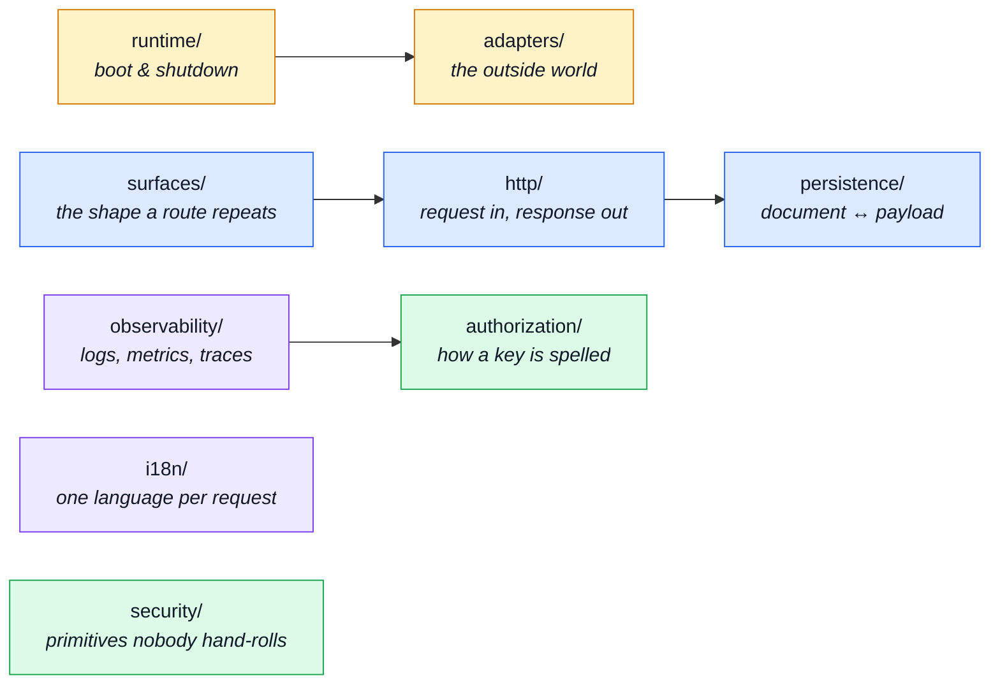

# Infrastructure

`src/infrastructure/` is the substrate: everything the application runs _on_, and nothing about
any domain. It is the bottom tier — it never knows modules exist, and `eslint.config.ts` stops it
finding out.

Nine subdirectories, each a different kind of substrate.

Rows group files that serve one feature, so a row may name several.

---

## The nine groups

## `runtime/` — boot and shutdown

| File                                             | What it is                                                                                                                                                                                                                       | Read next                                                                                              |
| ------------------------------------------------ | -------------------------------------------------------------------------------------------------------------------------------------------------------------------------------------------------------------------------------- | ------------------------------------------------------------------------------------------------------ |
| `src/infrastructure/runtime/otel-sdk.ts`         | Starts the OpenTelemetry SDK. Imported _first_ in `src/app.ts`, before express, mongoose or redis — auto-instrumentation patches those libraries as they load, so an import out of order silently produces no spans.             | [OpenTelemetry](../tools/opentelemetry.md)                                                             |
| `src/infrastructure/runtime/environment.ts`      | The coercions every environment reader shares — integers, decimals, boolean switches — so a variable is parsed the same way everywhere it's read. Boot-time validation itself is `kernel/required-config.ts`.                    | [Runtime](../tools/runtime.md)                                                                         |
| `src/infrastructure/runtime/database.ts`         | The MongoDB connection lifecycle: URI resolution, the connect-retry loop, and `stopDatabase`. `npm run host` depends on its empty-URI fallthrough, and a test pins that.                                                         | [MongoDB & Mongoose](../tools/mongodb-mongoose.md)                                                     |
| `src/infrastructure/runtime/ephemeral-mongo.ts`  | Where a test suite or the demo profile gets its Mongo: a configured URI first, `mongodb-memory-server` second. Only the branching — the caller supplies the in-process start, because a devDependency may not ship under `src/`. | [Testing — Quick Start](../tools/testing-quickstart.md) · [The demo profile](../tools/demo-profile.md) |
| `src/infrastructure/runtime/server-lifecycle.ts` | Graceful startup sequencing and shutdown: signal handlers, draining in-flight requests, closing infrastructure in the reverse of the order it opened.                                                                            | [Clustering & Shutdown](../theory/clustering.md)                                                       |

## `adapters/` — the outside world

Every adapter here degrades rather than throws. Redis down, broker down, SMTP down: the API keeps
answering, with the feature that needed it off.

| File                                                                                                                                             | What it is                                                                                                                                                                                                                                                                                                                                       | Read next                                                                                                                    |
| ------------------------------------------------------------------------------------------------------------------------------------------------ | ------------------------------------------------------------------------------------------------------------------------------------------------------------------------------------------------------------------------------------------------------------------------------------------------------------------------------------------------ | ---------------------------------------------------------------------------------------------------------------------------- |
| `src/infrastructure/adapters/managed-connection.ts`                                                                                              | One optional connection's lifecycle, stated once: memoise the handle, share the in-flight connect, warn once per outage, resolve `undefined` rather than reject, report a `DependencyStatus`. Redis and RabbitMQ both run on it.                                                                                                                 | [Redis Cache](../tools/redis-cache.md) · [RabbitMQ](../tools/rabbitmq.md)                                                    |
| `src/infrastructure/adapters/cache.ts`                                                                                                           | The Redis adapter: a byte store with tags. Every function **fails open** — an unreachable Redis means a cache miss, never a failed request. What a cached value MEANS is the caller's business.                                                                                                                                                  | [Redis Cache](../tools/redis-cache.md)                                                                                       |
| `src/infrastructure/adapters/queue.ts`                                                                                                           | The RabbitMQ (AMQP 0-9-1) adapter. Like the cache, every function becomes a no-op when the broker is absent, so a machine without one still boots and serves.                                                                                                                                                                                    | [RabbitMQ](../tools/rabbitmq.md)                                                                                             |
| `src/infrastructure/adapters/logger.ts`                                                                                                          | Structured logging: the Winston instance, its transports and the log shape everything else writes through.                                                                                                                                                                                                                                       | [Winston & Audit Logs](../tools/winston.md)                                                                                  |
| `src/infrastructure/adapters/mailer.ts`                                                                                                          | Email: EJS template rendering plus SMTP delivery, optionally handed to the queue instead of sent inline.                                                                                                                                                                                                                                         | [Email & PDF Rendering](../tools/email-and-rendering.md)                                                                     |
| `src/infrastructure/adapters/email.worker.ts`                                                                                                    | The consumer for one queued email job. Returns true to ack, false to dead-letter — a permanent failure must not be retried forever.                                                                                                                                                                                                              | [RabbitMQ](../tools/rabbitmq.md)                                                                                             |
| `src/infrastructure/adapters/pdf.ts`                                                                                                             | HTML → PDF rendering through Puppeteer, for invoices and reports.                                                                                                                                                                                                                                                                                | [Email & PDF Rendering](../tools/email-and-rendering.md)                                                                     |
| `src/infrastructure/adapters/pdf.worker.ts`                                                                                                      | The consumer for one queued PDF job: renders an EJS template to HTML, then drives Puppeteer over it.                                                                                                                                                                                                                                             | [Email & PDF Rendering](../tools/email-and-rendering.md)                                                                     |
| `src/infrastructure/adapters/storage.ts`                                                                                                         | Where uploads land, what they are renamed to, and which MIME types are accepted — the multer write side.                                                                                                                                                                                                                                         | [Security](../tools/security.md)                                                                                             |
| `src/infrastructure/adapters/image-store.ts`                                                                                                     | Image storage — the port every caller outside this file uses. Nothing else may turn an `imageUrl` into a filesystem path; that rule is what keeps upload handling in one auditable place.                                                                                                                                                        | [Security](../tools/security.md)                                                                                             |
| `src/infrastructure/adapters/image-signatures.ts`                                                                                                | Identifies an image by its bytes rather than its declared content type, which is whatever the client typed. The defence against an HTML file uploaded as an image.                                                                                                                                                                               | [Security](../tools/security.md)                                                                                             |
| `src/infrastructure/adapters/filesystem.ts`                                                                                                      | Small filesystem helpers. `moveFile` is the one an upload cannot survive getting wrong: `rename` cannot cross a device boundary, and uploads stage on a different filesystem from the public directory.                                                                                                                                          | [Security](../tools/security.md)                                                                                             |
| `src/infrastructure/adapters/image.ts` `src/infrastructure/adapters/image.worker.ts`                                                          | Image digesting behind sharp: two Buffer → Buffer transforms, and the one pipeline that promotes a quarantined upload to an original plus a thumbnail. The writeback is a port registered at boot, because this tier cannot import the module that owns the document.                                                                            | [Image processing](../tools/image-processing.md)                                                                             |
| `src/infrastructure/adapters/ssrf-guard.ts`                                                                                                      | A generic "is this URL safe to call?" tool: resolves a hostname, refuses private/loopback/link-local/CGNAT ranges, and pins the connection to the address it just validated. `webhooks` is its only caller today (`transport/webhook-delivery.ts`, module-owned); the worker, the signing and the delivery attempt itself live there, not here.  | [webhooks](../modules/webhooks.md#the-delivery-path) · [Server-side request forgery](../theory/defences/ssrf.md)             |
| `src/infrastructure/adapters/antibot.ts` `src/infrastructure/adapters/antibot-verdict.ts` `src/infrastructure/adapters/antibot-providers/` | Rungs 2 and 3 of the anti-automation ladder. `antibot.ts` is the disposable-email policy; `antibot-providers/` is the human-challenge port with its `none`, `altcha` and `turnstile` providers, plus the single-use store that stops one ALTCHA solution being spent twice. Both rungs answer with the `ok` / `refused` of `antibot-verdict.ts`. | [antibot](../modules/antibot.md) · [External Services](../tools/external-services.md)                                        |
| `src/infrastructure/adapters/bank-transfer.ts`                                                                                                   | Bank-transfer deployment config: the beneficiary, IBAN and BIC, and how long checkout holds stock for that method. Infrastructure because `orders` renders the same transfer instructions and may not depend on `payments`.                                                                                                                      | [payments](../modules/payments.md) · [The infrastructure / kernel line](../theory/modules.md#the-infrastructure-kernel-line) |
| `src/infrastructure/adapters/demo-outbox.ts`                                                                                                     | The demo profile's email sink. Under `npm run demo` there is no SMTP server and no broker, but the e2e suite still has to read what would have been sent.                                                                                                                                                                                        | [Demo profile](../tools/demo-profile.md)                                                                                     |

## `http/` — request in, response out

| File                                                                                                               | What it is                                                                                                                                                                                                                                                                                                                                                                                         | Read next                                                                                                |
| ------------------------------------------------------------------------------------------------------------------ | -------------------------------------------------------------------------------------------------------------------------------------------------------------------------------------------------------------------------------------------------------------------------------------------------------------------------------------------------------------------------------------------------- | -------------------------------------------------------------------------------------------------------- |
| `src/infrastructure/http/request.ts`                                                                               | Reads one input wherever it arrives — route param, query string or body field — so a controller names the value instead of the transport.                                                                                                                                                                                                                                                          | [Request Input](../theory/request-input.md)                                                              |
| `src/infrastructure/http/schemas.ts`                                                                               | Decodes contract scalars as they arrive over HTTP. Deliberately does not validate: a value it cannot decode is passed on for the schema to reject with a real message.                                                                                                                                                                                                                             | [Contract-Derived Request Data](../tools/contract-request-data.md)                                       |
| `src/infrastructure/http/response.ts`                                                                              | The response envelope. Every endpoint answers the same top-level shape, so a client branches on `success` rather than on status-code trivia.                                                                                                                                                                                                                                                       | [Endpoints](../api/endpoints.md)                                                                         |
| `src/infrastructure/http/errors.ts`                                                                                | The HTTP error types, each carrying the status it maps to, and `databaseErrorInterpreter` — the single place deciding which driver failures describe the request rather than the server.                                                                                                                                                                                                           | [The database error interpreter](../theory/request-flow.md#the-database-error-interpreter)               |
| `src/infrastructure/http/uploads.ts`                                                                               | The read side of uploads — what a handler is allowed to see of a multipart request. The write side is `src/infrastructure/adapters/storage.ts`.                                                                                                                                                                                                                                                    | [Security](../tools/security.md)                                                                         |
| `src/infrastructure/http/controller.ts`                                                                            | The steps every controller repeats — read input, validate, call one service method, branch on the envelope, catch — as helpers rather than a wrapper, so the `.catch()` a lint rule looks for stays visible in the handler.                                                                                                                                                                        | [Request Flow](../theory/request-flow.md)                                                                |
| `src/infrastructure/http/validation-messages.ts`                                                                   | Zod's global error map: every schema's refusals, generated ones included, answered in the request's language. One message key per constraint, not per field.                                                                                                                                                                                                                                       | [Internationalisation](../tools/i18n.md)                                                                 |
| `src/infrastructure/http/middlewares/rate-limit.ts` `src/infrastructure/http/middlewares/rate-limit-store.ts`   | `buildRateLimiter` and the three budgets no module owns; every domain budget lives on the owning module instead (`modules/{account,feedback,payments}/rate-limits.ts`). The store keeps counters in Redis, so a budget stays one budget across `cluster.ts`'s workers instead of multiplying by them — falling back to an in-process store, and one budget per worker, when Redis is unconfigured. | [Security](../tools/security.md#the-rate-limit-budgets) · [Cluster testing](../tools/cluster-testing.md) |
| `src/infrastructure/http/middlewares/human-challenge.ts` `src/infrastructure/http/middlewares/antibot-log.ts`   | The HTTP side of anti-automation: the gate that asks the active human-challenge provider about a request's token, and the one log line and refusal envelope every rung shares.                                                                                                                                                                                                                     | [antibot](../modules/antibot.md)                                                                         |
| `src/infrastructure/http/middlewares/idempotency.ts` `src/infrastructure/http/middlewares/idempotency-model.ts` | `Idempotency-Key` replay protection, mounted per route. The ledger lives in Mongo: Redis's LRU eviction would turn a lost record into a silent duplicate write.                                                                                                                                                                                                                                    | [Idempotency](../tools/idempotency.md)                                                                   |
| `src/infrastructure/http/middlewares/locale.ts`                                                                    | Negotiates the request's language and runs the rest of the chain inside it, so translation works without every handler passing a locale down.                                                                                                                                                                                                                                                      | [Internationalisation](../tools/i18n.md)                                                                 |
| `src/infrastructure/http/middlewares/cache.ts`                                                                     | HTTP response caching: the cache key (built from the query parameters an endpoint's answer actually depends on), the stored envelope, the development TTL clamp and the per-entry size limit.                                                                                                                                                                                                      | [Redis Cache](../tools/redis-cache.md)                                                                   |
| `src/infrastructure/http/middlewares/request-logger.ts`                                                            | One access-log entry per request, timed with `hrtime`; WARN for 4xx, ERROR for 5xx.                                                                                                                                                                                                                                                                                                                | [Winston & Audit Logs](../tools/winston.md)                                                              |
| `src/infrastructure/http/middlewares/route-flag.ts`                                                                | Lets a route state its own meaning as a param the controller reads like any other — so a hard-delete path and a hard-delete query reach one handler.                                                                                                                                                                                                                                               | [Endpoints](../api/endpoints.md)                                                                         |

## `surfaces/` — the shape a route repeats

Split out of `http/` on 2026-08-30. These are the only files under `src/infrastructure/` that know
a service envelope, an audit action or a not-found key — which is why they are not in `http/`,
whose stated job stops at the protocol. A module's own controller becomes a short spec of what
differs per entity; the surface holds everything the entity does not change.

| File                                                      | What it is                                                                                                                                                                       | Read next                                   |
| --------------------------------------------------------- | -------------------------------------------------------------------------------------------------------------------------------------------------------------------------------- | ------------------------------------------- |
| `src/infrastructure/surfaces/create-delete-controller.ts` | The soft/hard delete triplet — `DELETE /x`, `DELETE /x/:id`, `DELETE /x/:id/hard` — including the audit event each one emits.                                                    | [Endpoints](../api/endpoints.md)            |
| `src/infrastructure/surfaces/create-item-controller.ts`   | The read-one: fetch by path id, and the decision that a malformed id is the module's own 404 rather than a 500.                                                                  | [Request Flow](../theory/request-flow.md)   |
| `src/infrastructure/surfaces/create-list-controller.ts`   | The paged list. Separate from search because a list has no body to read, and folding them would put a `surface` knob on a factory whose whole subject is where input comes from. | [Request Input](../theory/request-input.md) |
| `src/infrastructure/surfaces/create-search-controller.ts` | `GET /x` and `POST /x/search` behind one controller, with a per-module overlay for query fields a plain field list cannot express.                                               | [Request Input](../theory/request-input.md) |

## `persistence/` — document ↔ payload

| File                                                  | What it is                                                                                                                                                                                         | Read next                                                                          |
| ----------------------------------------------------- | -------------------------------------------------------------------------------------------------------------------------------------------------------------------------------------------------- | ---------------------------------------------------------------------------------- |
| `src/infrastructure/persistence/create-repository.ts` | The repository base: filter keys expressed as data, mapping what a caller sends to the Mongo path it targets. Every module's repository builds on it.                                              | [MongoDB & Mongoose](../tools/mongodb-mongoose.md) · [Layers](../theory/layers.md) |
| `src/infrastructure/persistence/search.ts`            | Shared pagination and filter helpers, so a new filter convention is added once rather than per module.                                                                                             | [MongoDB & Mongoose](../tools/mongodb-mongoose.md)                                 |
| `src/infrastructure/persistence/serialize.ts`         | The one place a stored document becomes a wire payload: `_id` renamed, the version key dropped, dates normalised. Bypassing it is how internal fields leak into responses.                         | [Endpoints](../api/endpoints.md)                                                   |
| `src/infrastructure/persistence/metrics.ts`           | The database query and error counters, and `trackDatabaseQuery`, the wrapper `createRepository` puts around every Mongoose call.                                                                   | [Prometheus](../tools/prometheus.md)                                               |
| `src/infrastructure/persistence/lease.ts`             | A Mongo-backed lease: one atomic upsert decides who runs a periodic job, so a scaled-up cron container cannot run it twice. No fencing token — every lease-guarded job must be idempotent instead. | [Scheduled jobs](./ops.md#scheduled-jobs)                                          |
| `src/infrastructure/persistence/factories.ts`         | The part every module's factory would otherwise repeat — an id, a pair of timestamps, and the typing of the overrides bag.                                                                         | [Unit Testing](../tools/unit-testing.md)                                           |

## `observability/`

| File                                                                                                        | What it is                                                                                                                                                                                                                                            | Read next                                                                                              |
| ----------------------------------------------------------------------------------------------------------- | ----------------------------------------------------------------------------------------------------------------------------------------------------------------------------------------------------------------------------------------------------- | ------------------------------------------------------------------------------------------------------ |
| `src/infrastructure/observability/tracer.ts`                                                                | A thin wrapper over the OpenTelemetry API, so application code starts a span without importing the SDK.                                                                                                                                               | [OpenTelemetry](../tools/opentelemetry.md) · [Tempo](../tools/tempo.md)                                |
| `src/infrastructure/observability/metrics-http.ts` `src/infrastructure/observability/metrics-cache.ts`   | The HTTP and process metrics: counters, histograms and the registry the scrape endpoint serves. The cache registers its own counter on that registry, because a log line is not alertable.                                                            | [Prometheus](../tools/prometheus.md) · [Redis Cache](../tools/redis-cache.md)                          |
| `src/infrastructure/observability/process-snapshot.ts`                                                      | One reading of this process in the units the process reports — the source the SSE frame and the two REST payloads are all built from.                                                                                                                 | [Observability Endpoints](../api/observability.md)                                                     |
| `src/infrastructure/observability/stream.ts`                                                                | The live-metrics Server-Sent Events hub. SSE rather than WebSockets: the data flows one way and it is plain HTTP, so proxies and curl both work.                                                                                                      | [Observability Endpoints](../api/observability.md)                                                     |
| `src/infrastructure/observability/dependency-health.ts` `src/infrastructure/observability/job-health.ts` | What every backing service is doing right now — the readiness answer, as distinct from the liveness ping on `GET /`. Its job half reads each lease-guarded job's last outcome off its lease document, the one health check that queries the database. | [The Observability Layer](../tools/observability-layer.md) · [Scheduled jobs](./ops.md#scheduled-jobs) |
| `src/infrastructure/observability/audit.ts`                                                                 | The audit trail: who did what to which resource, and whether it worked. Deliberately separate from application logging — this is a compliance record, not a debugging aid.                                                                            | [Winston & Audit Logs](../tools/winston.md)                                                            |
| `src/infrastructure/observability/analytics/index.ts`                                                       | The product-analytics port and the registry of providers behind it. Distinct from metrics and traces: this answers product questions, not operational ones.                                                                                           | [Product Analytics](../tools/analytics.md)                                                             |
| `src/infrastructure/observability/analytics/umami.ts`                                                       | The default provider. Umami is what the compose stack already runs for the paired frontend.                                                                                                                                                           | [Product Analytics](../tools/analytics.md)                                                             |
| `src/infrastructure/observability/analytics/posthog.ts`                                                     | The alternative provider, for funnels that are identity-shaped.                                                                                                                                                                                       | [Product Analytics](../tools/analytics.md)                                                             |
| `src/infrastructure/observability/analytics/none.ts`                                                        | The no-op provider, so "this deployment collects nothing" is a configuration rather than a code change.                                                                                                                                               | [Product Analytics](../tools/analytics.md)                                                             |

## `i18n/` — one language per request

Five change drivers, five files, one barrel. Every caller imports `@infrastructure/i18n` and does
not care which file answers. Inside the directory, `overrides` and `negotiate` each read `catalog`;
`context` reads `catalog`; `translation` reads `catalog` and `context`.

| File                                     | What it is                                                                                                                                                                                                                             | Read next                                 |
| ---------------------------------------- | -------------------------------------------------------------------------------------------------------------------------------------------------------------------------------------------------------------------------------------- | ----------------------------------------- |
| `src/infrastructure/i18n/index.ts`       | The barrel — the whole published surface of the module, so the files below can be rearranged without touching an import site.                                                                                                          | [Internationalisation](../tools/i18n.md)  |
| `src/infrastructure/i18n/catalog.ts`     | Where translations come from: which languages exist, the per-module dictionary merge, and the resources `i18next.init()` is handed at boot.                                                                                            | [Internationalisation](../tools/i18n.md)  |
| `src/infrastructure/i18n/overrides.ts`   | The admin-editable database overlay on top of the deployed files, and the timer that re-reads it. Deletable as a unit — nothing imports it back.                                                                                       | [Internationalisation](../tools/i18n.md)  |
| `src/infrastructure/i18n/context.ts`     | The `AsyncLocalStorage` carrying one request's translator, and the ambient `t` everything else imports. The concurrency-critical part: a global "current language" answers one request in another's.                                   | [Request Flow](../theory/request-flow.md) |
| `src/infrastructure/i18n/negotiate.ts`   | Turns an `Accept-Language` header into one supported locale — q-weights, region tags, and a fallback that never throws on a malformed header.                                                                                          | [Request Flow](../theory/request-flow.md) |
| `src/infrastructure/i18n/translation.ts` | The translation port for user-authored content — a product's title in the caller's language — and the cascade that takes those rows with a hard delete. `modules/locales` registers the implementation, so this tier never imports it. | [Internationalisation](../tools/i18n.md)  |

## `authorization/` — how a key is spelled

The one part of the authorization model that is pure string logic. It sits here rather than in
`src/kernel/` because the audit trail needs it, and infrastructure may not reach the kernel.

| File                                       | What it is                                                                                                                                                                                                                                          | Read next                                                                                     |
| ------------------------------------------ | --------------------------------------------------------------------------------------------------------------------------------------------------------------------------------------------------------------------------------------------------- | --------------------------------------------------------------------------------------------- |
| `src/infrastructure/authorization/keys.ts` | The `<subject>.<action>` grammar: which scope a key belongs to, read from its spelling, and the wildcard key for each scope. `kernel/permissions.ts` asserts at load that `shared/authorization-keys.yaml` still spells its wildcards the same way. | [The key grammar](../theory/authorization.md#the-key-grammar-and-the-invariant-it-exists-for) |

## `security/` — primitives nobody hand-rolls

| File                                              | What it is                                                                                                                                                                                                               | Read next                                                                                                                                           |
| ------------------------------------------------- | ------------------------------------------------------------------------------------------------------------------------------------------------------------------------------------------------------------------------ | --------------------------------------------------------------------------------------------------------------------------------------------------- |
| `src/infrastructure/security/breached-passwords/` | Refuses a breached password when it is SET, never when it is proved at login. Two rungs, both failing open: the bundled `list.txt`, rebuilt by `ops/refresh-breached-passwords.ts`, then the HIBP k-anonymity range API. | [Authentication](../theory/defences/authentication.md)                                                                                              |
| `src/infrastructure/security/constant-time.ts`    | Constant-time string comparison for every static-credential check — a metrics scraper token, an api-key hash — where `===` would leak the matching prefix through timing.                                                | [Cryptography, secrets and transport](../theory/defences/crypto-and-secrets.md)                                                                     |
| `src/infrastructure/security/versioned-secret.ts` | AES-256-GCM for secrets at rest, stamped with a key version so a rotation can still decrypt old rows. Shared by TOTP device secrets and webhook signing secrets: same format, different keys.                            | [Security](../tools/security.md#storage-is-asymmetric-per-method) · [Cryptography, secrets and transport](../theory/defences/crypto-and-secrets.md) |
