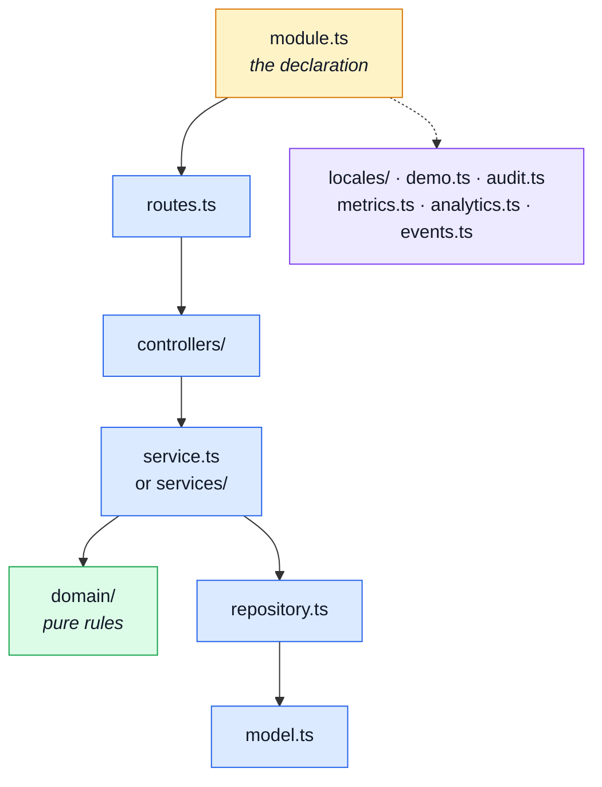

# Modules

`src/modules/` is most of the repository, and almost none of it is unique. Thirteen domains are
built from the same two dozen file shapes, so this page explains each **shape** once and then says
which module carries which.

A module is a typed value declared in its manifest, not a folder convention — see
[Modules](../theory/modules.md) for what that buys and
[Adding & Removing a Module](../theory/module-lifecycle.md) for the lifecycle.

---

## The shape of one module



## The core shape

Every module has these, and a reader who knows them knows twelve of the thirteen.

| Pattern                          | What it is                                                                                                                                                                                                                                                                                     | Read next                                                                                                               |
| -------------------------------- | ---------------------------------------------------------------------------------------------------------------------------------------------------------------------------------------------------------------------------------------------------------------------------------------------- | ----------------------------------------------------------------------------------------------------------------------- |
| `src/modules/*/module.ts`        | The manifest, and the only file the application loads directly. Declares the module's name, base path, router, dependency edges, locales, seeds and event subscriptions. Everything else in the folder is reached through it.                                                                  | [Modules](../theory/modules.md) · [Strategic DDD](../theory/strategic-ddd.md)                                           |
| `src/modules/*/routes.ts`        | The URL surface: one line per endpoint, naming its middlewares, the role it requires and the controller it lands on. Reading it top to bottom is reading the module's API.                                                                                                                     | [Endpoints](../api/endpoints.md)                                                                                        |
| `src/modules/*/controllers/*.ts` | One file per operation, named for the verb it serves. Reads inputs, calls the service, answers through the response envelope — and catches, which `tests/cross-cutting/every-controller-catches.test.ts` enforces. Naming is enforced too, by `tests/cross-cutting/controller-naming.test.ts`. | [Layers](../theory/layers.md) · [Request Flow](../theory/request-flow.md)                                               |
| `src/modules/*/service.ts`       | The domain decision, and the layer that owns status-code meaning. Past roughly 300 lines it becomes a services directory with a barrel.                                                                                                                                                        | [Layers](../theory/layers.md)                                                                                           |
| `src/modules/*/services/*.ts`    | The same tier once it outgrew one file, split by what the operations do rather than by which route reaches them.                                                                                                                                                                               | [Layers](../theory/layers.md)                                                                                           |
| `src/modules/*/repository.ts`    | Every query this module makes, built on the shared base repository. The only tier that talks to Mongoose.                                                                                                                                                                                      | [MongoDB & Mongoose](../tools/mongodb-mongoose.md) · [Layers](../theory/layers.md)                                      |
| `src/modules/*/model.ts`         | The Mongoose schema, its indexes and its serialisation rules — the collection's shape.                                                                                                                                                                                                         | [MongoDB & Mongoose](../tools/mongodb-mongoose.md)                                                                      |
| `src/modules/*/openapi.yaml`     | This module's slice of the REST contract. The root `openapi.yaml` is bundled from these; a fragment is never edited to match code, code is written to match it.                                                                                                                                | [Contract Ownership & Fragmentation](../api/contract-fragmentation.md) · [OpenAPI Workflow](../api/openapi-workflow.md) |
| `src/modules/*/locales/*.json`   | This module's user-facing strings, one file per language. `eslint/rules/no-hardcoded-user-text.ts` is what keeps them from being written inline.                                                                                                                                               | [App, Kernel & Types](./src-app.md)                                                                                     |

## The optional shape

Present when the domain needs it. A module that has none of these is not incomplete; it is small.

| Pattern                       | What it is                                                                                                                                                                  | Read next                                                                             |
| ----------------------------- | --------------------------------------------------------------------------------------------------------------------------------------------------------------------------- | ------------------------------------------------------------------------------------- |
| `src/modules/*/index.ts`      | The public barrel: what siblings are allowed to import. Reaching past it into a module's internals is a lint error, so this file _is_ the module's published surface.       | [Strategic DDD](../theory/strategic-ddd.md)                                           |
| `src/modules/*/domain/*.ts`   | Pure rules over plain data — no Mongoose, no Express, and lint-guaranteed free of both. A rule returns a verdict and the service maps it to a status code.                  | [Domain Layer](../theory/domain-layer.md) · [Tactical DDD](../theory/tactical-ddd.md) |
| `src/modules/*/events.ts`     | The domain events this module publishes and subscribes to — the sanctioned channel between two modules that cannot own each other.                                          | [Events & Logging](../tools/events-and-logging.md)                                    |
| `src/modules/*/audit.ts`      | Which of this module's operations are written to the audit trail, and under what action names. `tests/cross-cutting/audit-actions.test.ts` holds the vocabulary together.   | [Winston & Audit Logs](../tools/winston.md)                                           |
| `src/modules/*/metrics.ts`    | The domain counters and histograms this module registers with Prometheus, beyond the HTTP metrics every route already gets.                                                 | [Prometheus](../tools/prometheus.md)                                                  |
| `src/modules/*/analytics.ts`  | The product-analytics events this module emits. Also a contract fragment: `npm run contracts:bundle` publishes the names to the paired frontend.                            | [Product Analytics](../tools/analytics.md)                                            |
| `src/modules/*/emails.ts`     | Which templates this module sends and what they are given. The templates themselves are EJS files under `shared/views/`.                                                    | [Email & PDF Rendering](../tools/email-and-rendering.md)                              |
| `src/modules/*/probes.ts`     | The module's contribution to the readiness answer — what "this domain is healthy" means beyond the process being up.                                                        | [The Observability Layer](../tools/observability-layer.md)                            |
| `src/modules/*/demo.ts`       | The module's seed fixtures, upserted through the shared seeding primitive. What `npm run db:seed` and the demo profile put in the database.                                 | [Data](./data.md) · [Demo profile](../tools/demo-profile.md)                          |
| `src/modules/*/factory.ts`    | Fixture builders for tests, on top of the shared persistence factory. Production code, deliberately — a sibling's contract suite may need to build this module's documents. | [Unit Testing](../tools/unit-testing.md)                                              |
| `src/modules/*/asyncapi.yaml` | This module's slice of the realtime contract, bundled into the root `asyncapi.yaml` the same way the REST fragments are.                                                    | [AsyncAPI Workflow](../api/asyncapi-workflow.md)                                      |

## The one-offs

Three shapes exist in exactly one module each. They are genuine one-offs rather than a naming
drift — each is a piece of a domain no other domain has.

| Pattern                        | What it is                                                                                                                                         | Read next                        |
| ------------------------------ | -------------------------------------------------------------------------------------------------------------------------------------------------- | -------------------------------- |
| `src/modules/*/session/*.ts`   | `account` only. The session mechanics kept out of the services: JWT signing and verification, cookie shape and flags, and the lifetimes both read. | [Security](../tools/security.md) |
| `src/modules/*/providers/*.ts` | `payments` only. The payment provider port and the fake implementation behind it, so nothing above the port knows which processor is wired in.     | [Layers](../theory/layers.md)    |
| `src/modules/*/config.ts`      | `inventory` only. The reservation and threshold settings, in one place because several of its transitions read the same numbers.                   | —                                |

::: tip Where the tests are
Every module also carries its own unit, contract and factory files. They are catalogued on
[Tests](./tests.md), with the rest of the suite.
:::

## The thirteen modules

**Extras** lists the optional shapes above that each module carries. Nothing asserts it, so it is
the row most likely to go quietly wrong — a module that gains a metrics file and does not gain the
word here simply reads as not having one. Re-derive it rather than trusting it:

```bash
ls src/modules/<name>
```

| Module                                | What it owns                                                                                                                                                                                       | Extras                                                                                      |
| ------------------------------------- | -------------------------------------------------------------------------------------------------------------------------------------------------------------------------------------------------- | ------------------------------------------------------------------------------------------- |
| `src/modules/account/module.ts`       | Authentication and the account lifecycle: signup, login, refresh, password reset, logout-everywhere, and the two-step deletion. A second service over the `users` record.                          | index · services · demo · factory · audit · metrics · analytics · emails · probes · session |
| `src/modules/audit-logs/module.ts`    | The queryable audit trail, kept for the retention window a TTL index enforces. Declares no router — the headless half of the manifest — and the endpoint that reads it belongs to `observability`. | index · metrics                                                                             |
| `src/modules/cart/module.ts`          | One cart document per user, priced against the live catalogue.                                                                                                                                     | index · services · domain · demo · factory · audit · metrics · analytics · probes           |
| `src/modules/delivery/module.ts`      | Shipping rates, shipments and the fake courier. Rates live in the domain layer as pure functions.                                                                                                  | index · domain · audit · emails                                                             |
| `src/modules/feedback/module.ts`      | Contact requests: anyone may file one, admins triage them. Records an email address rather than a user, because the form is open to people with no account.                                        | audit · emails                                                                              |
| `src/modules/inventory/module.ts`     | The two stock counters, the reservation lifecycle, and the ledger that explains both. The counters sit on the product document, but only this module writes them.                                  | index · domain · audit · metrics · events · config                                          |
| `src/modules/locales/module.ts`       | Which languages this deployment speaks, and the dictionaries a client downloads. Distinct from the API's own bundles, which never merge with these.                                                | demo · factory · audit                                                                      |
| `src/modules/observability/module.ts` | The operator-facing view: health, the metrics overview, the live SSE stream, the Prometheus scrape endpoint and the audit read. Owns no collection, which is why it has no model or repository.    | asyncapi                                                                                    |
| `src/modules/orders/module.ts`        | Placed orders — admin write and soft delete, each account reading back its own. Embeds the catalogue row as it stood at purchase time, so a later product edit cannot rewrite history.             | index · domain · demo · factory · audit · metrics · analytics · events · emails · probes    |
| `src/modules/payments/module.ts`      | An order's money, behind a provider port. The intent freezes a total, the confirm moves the order to paid.                                                                                         | audit · metrics · analytics · providers                                                     |
| `src/modules/products/module.ts`      | The catalogue: public read, admin write, soft delete with restore. Depends on nothing.                                                                                                             | index · demo · factory · audit · analytics · events · probes                                |
| `src/modules/users/module.ts`         | The user record: admin-facing search, read, write and soft delete. Depends on nothing.                                                                                                             | index · demo · factory · audit · events                                                     |
| `src/modules/wishlist/module.ts`      | One wishlist per user, holding product references and nothing else.                                                                                                                                | demo · factory · analytics                                                                  |
