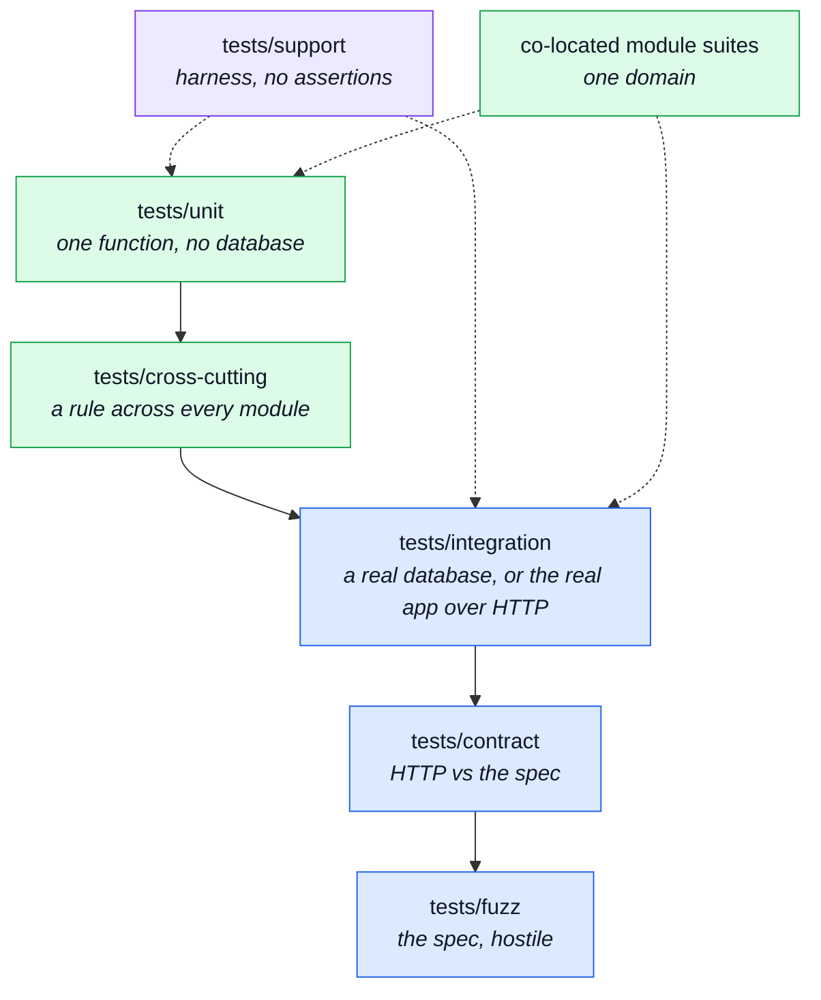

# Tests

Every file here is a distinct guarantee, which is why this page names them one at a time: knowing
_which_ test covers a rule is most of the value of having it.

Tests live in two places, and the split is by scope rather than by taste. A test about **one
module** lives inside that module. A test about **the system** — infrastructure, the kernel, or a
rule that holds across all thirteen modules — lives in `tests/`.
`eslint-plugin-boundaries` enforces the line, at the offending import rather than by naming a
file — see `eslint.config.ts`.

---

## The suites

## `tests/cross-cutting/` — rules that hold across every module

The house speciality: one file per architectural rule, asserted over all thirteen modules at once.
A new module is covered the day it is added, without anyone writing a test for it.

| File                                                      | What it guarantees                                                                                                                                                                                                                              | Read next                                                                                                                  |
| --------------------------------------------------------- | ----------------------------------------------------------------------------------------------------------------------------------------------------------------------------------------------------------------------------------------------- | -------------------------------------------------------------------------------------------------------------------------- |
| `tests/cross-cutting/context-map.test.ts`                 | Every declared dependency edge is imported, every cross-module import is declared, and shared-kernel edges stay on their allowlist.                                                                                                             | [Strategic DDD](../theory/strategic-ddd.md)                                                                                |
| `tests/cross-cutting/subdomain-discipline.test.ts`        | Modelling effort goes where the business is: a module's subdomain classification matches what it actually contains.                                                                                                                             | [Strategic DDD](../theory/strategic-ddd.md)                                                                                |
| `tests/cross-cutting/published-language.test.ts`          | A module's barrel publishes exactly what its siblings import — no more, no less.                                                                                                                                                                | [Modules](../theory/modules.md)                                                                                            |
| `tests/cross-cutting/service-namespaces.test.ts`          | Every module's service is reached through exactly one namespace, and that namespace is complete.                                                                                                                                                | [Layers](../theory/layers.md)                                                                                              |
| `tests/cross-cutting/controller-naming.test.ts`           | Every controller file is named for the HTTP verbs it serves.                                                                                                                                                                                    | [Modules](./src-modules.md)                                                                                                |
| `tests/cross-cutting/locale-namespaces.test.ts`           | Locale ownership: a module's keys stay in its own namespace and never collide with the app bundle.                                                                                                                                              | [App, Kernel & Types](./src-app.md)                                                                                        |
| `tests/cross-cutting/locale-parity.test.ts`               | Every language declares the same keys, across the shared file and every module at once.                                                                                                                                                         | [Modules](./src-modules.md)                                                                                                |
| `tests/cross-cutting/audit-actions.test.ts`               | The audit vocabulary is consistent across every module that writes to the trail.                                                                                                                                                                | [Winston & Audit Logs](../tools/winston.md)                                                                                |
| `tests/cross-cutting/contract-bundles.test.ts`            | Every bundled document is exactly what its fragments say it is built from.                                                                                                                                                                      | [Contracts](./contracts.md)                                                                                                |
| `tests/cross-cutting/contract-scalars.test.ts`            | The shared scalars in infrastructure still match every operation in the contract.                                                                                                                                                               | [Contract-Derived Request Data](../tools/contract-request-data.md)                                                         |
| `tests/cross-cutting/generated-type-shadowing.test.ts`    | A contract schema is declared once, in `openapi.yaml`, and never restated by hand in TypeScript.                                                                                                                                                | [Regenerating After a Change](../api/regenerating.md)                                                                      |
| `tests/cross-cutting/seed-conformance.test.ts`            | The exported demo dataset still conforms to the contract it is a specimen of.                                                                                                                                                                   | [Data](./data.md)                                                                                                          |
| `tests/cross-cutting/process-snapshot.test.ts`            | The process is read in exactly one place and published in exactly one shape, so the SSE frame and the REST payloads cannot drift.                                                                                                               | [Observability Endpoints](../api/observability.md)                                                                         |
| `tests/cross-cutting/authenticated-controllers.test.ts`   | A controller reading the caller through `authContextOf` is mounted behind `isAuth` — the half no type can carry, including the mid-file `router.use` hazard.                                                                                    | [Request Flow](../theory/request-flow.md)                                                                                  |
| `tests/cross-cutting/ci-covers-the-gate.test.ts`          | Every check `npm run complete` runs has a CI job behind it, so `--no-verify` or a fork PR cannot bypass one silently.                                                                                                                           | [Scripts & Hooks](./scripts.md)                                                                                            |
| `tests/cross-cutting/probes-are-wired.test.ts`            | A module that declares `probes.ts` is wired into the generated collections, so adding one cannot leave four bundles quietly short.                                                                                                              | [Contracts](./contracts.md)                                                                                                |
| `tests/cross-cutting/module-shape.test.ts`                | A module's manifest, its folder and the registry describe the same domain — and every module has a docs page, every page a module.                                                                                                              | [Modules](./src-modules.md)                                                                                                |
| `tests/cross-cutting/module-file-shapes.test.ts`          | Every file inside a module folder matches a named shape, and every named shape still matches something.                                                                                                                                         | [Modules](./src-modules.md)                                                                                                |
| `tests/cross-cutting/frontend-pairing.test.ts`            | Every domain names its counterpart in the paired frontend, and — when that checkout is present — the names still resolve on both sides.                                                                                                         | [Pairing & Ports](../tools/pairing-and-ports.md)                                                                           |
| `tests/cross-cutting/metric-names.test.ts`                | A metric name is an identifier three places agree on, and only one of them is type-checked.                                                                                                                                                     | [Prometheus](../tools/prometheus.md)                                                                                       |
| `tests/cross-cutting/outbox-names.test.ts`                | Every mail names itself the way the PHP twin does — engine-neutral, and still resolving to a real template.                                                                                                                                     | [Email & PDF Rendering](../tools/email-and-rendering.md)                                                                   |
| `tests/cross-cutting/credential-fields.test.ts`           | Nothing credential-shaped survives serialization, on any model.                                                                                                                                                                                 | [Security](../tools/security.md)                                                                                           |
| `tests/cross-cutting/contract-aliases.test.ts`            | Which spelling of an operation a caller should reach for, and that both spellings agree.                                                                                                                                                        | [Contracts](./contracts.md)                                                                                                |
| `tests/cross-cutting/contract-error-declarations.test.ts` | Every status the error interpreter can answer is a status the contract describes.                                                                                                                                                               | [Contracts](./contracts.md)                                                                                                |
| `tests/cross-cutting/contract-search-parity.test.ts`      | The two spellings of one search accept the same thing.                                                                                                                                                                                          | [Contracts](./contracts.md)                                                                                                |
| `tests/cross-cutting/paginated-sort-is-total.test.ts`     | Every `$sort` a `$skip` pages through ends in a unique key, so a page boundary cannot show one document twice and another not at all.                                                                                                           | [MongoDB & Mongoose](../tools/mongodb-mongoose.md)                                                                         |
| `tests/cross-cutting/search-pagination.test.ts`           | Pagination normalisation is the single authority on page defaults.                                                                                                                                                                              | [MongoDB & Mongoose](../tools/mongodb-mongoose.md)                                                                         |
| `tests/cross-cutting/search-regex.test.ts`                | Client text reaching MongoDB's regex operator is escaped — the server evaluates the pattern, so an unescaped one is a denial of service.                                                                                                        | [Security](../tools/security.md)                                                                                           |
| `tests/cross-cutting/search.property.test.ts`             | The same, as **properties** over generated inputs rather than examples.                                                                                                                                                                         | [Property Testing](../tools/property-testing.md)                                                                           |
| `tests/cross-cutting/serialize.property.test.ts`          | The universal guarantees of serialisation, over generated documents: the public id present and the internal fields gone, whatever the input.                                                                                                    | [Property Testing](../tools/property-testing.md)                                                                           |
| `tests/cross-cutting/coverage-thresholds.test.ts`         | Every coverage floor in `jest.config.js` is attached to code that exists: a key that matches no file, or whose every match is excluded from coverage, is ignored in silence while reading like a gate. That is how three keys detached at once. | [Unit Testing](../tools/unit-testing.md) · [Mutation Testing](../tools/mutation-testing.md) · [Repository Root](./root.md) |

## `tests/unit/`

One function, no database, no HTTP. Fast enough to run from the pre-commit hook.

| File                                                    | What it guarantees                                                                                                                                                          | Read next                                                |
| ------------------------------------------------------- | --------------------------------------------------------------------------------------------------------------------------------------------------------------------------- | -------------------------------------------------------- |
| `tests/unit/db/host-scripts.test.ts`                    | The `host` script and the two URI resolvers agree over the whole environment matrix — the pin that keeps `migrate-mongo-config.js` honest against the app's own resolution. | [Repository Root](./root.md)                             |
| `tests/unit/db/run-script.test.ts`                      | The `db/` entry-point wrapper opens, closes and exits non-zero on failure.                                                                                                  | [Data](./data.md)                                        |
| `tests/unit/db/seed-fixtures.test.ts`                   | Every module's seed fixtures are internally consistent — image URLs included.                                                                                               | [Data](./data.md)                                        |
| `tests/unit/eslint/controller-chain-must-catch.test.ts` | The repo's own lint rule fires on the code it is meant to catch and stays quiet otherwise.                                                                                  | [Scripts & Hooks](./scripts.md)                          |
| `tests/unit/eslint/no-hardcoded-user-text.test.ts`      | The same for the hardcoded-copy rule.                                                                                                                                       | [Scripts & Hooks](./scripts.md)                          |
| `tests/unit/i18n/email-locale.test.ts`                  | Where an email's language is decided — the producer resolves the copy before publishing, so a queued job cannot be rendered in the worker's locale.                         | [Email & PDF Rendering](../tools/email-and-rendering.md) |
| `tests/unit/infrastructure/i18n/negotiate.test.ts`      | Locale negotiation: what a request gets from its headers, a stored preference, and the fallback.                                                                            | [Request Flow](../theory/request-flow.md)                |
| `tests/unit/infrastructure/i18n/context.test.ts`        | The request-scoped `t`: that two overlapping scopes stay apart, and that code outside any scope still resolves.                                                             | [Request Flow](../theory/request-flow.md)                |
| `tests/unit/infrastructure/i18n/catalog.test.ts`        | Which languages exist, the per-module dictionary merge, and why the supported list is cached rather than re-read.                                                           | [Internationalisation](../tools/i18n.md)                 |
| `tests/unit/infrastructure/i18n/overrides.test.ts`      | The database overlay: a stored edit wins, a deleted one stops answering, a failed read keeps the last good copy — plus the timer that spreads an edit across workers.       | [Internationalisation](../tools/i18n.md)                 |
| `tests/unit/kernel/registry.test.ts`                    | Module validation fails loudly — the registry decides what "this build" means, so a bad manifest must not boot.                                                             | [Modules](../theory/modules.md)                          |
| `tests/unit/kernel/events.test.ts`                      | The event bus breaks the cycle it exists for: a deleted product empties out of every cart without the two modules importing each other.                                     | [Events & Logging](../tools/events-and-logging.md)       |
| `tests/unit/kernel/authorizations.test.ts`              | Token extraction and the role guard.                                                                                                                                        | [Security](../tools/security.md)                         |
| `tests/unit/kernel/authorization.test.ts`               | The shared read-scoping rule — who may see whose records.                                                                                                                   | [Security](../tools/security.md)                         |
| `tests/unit/scripts/mutation-baseline.test.ts`          | The ratchet reads a Stryker report into per-file scores correctly.                                                                                                          | [Mutation Testing](../tools/mutation-testing.md)         |
| `tests/unit/scripts/spec-identity.test.ts`              | The cross-repo shared-file list and its comparison.                                                                                                                         | [Pairing & Ports](../tools/pairing-and-ports.md)         |

### `tests/unit/infrastructure/runtime/` and `persistence/`

| File                                                           | What it guarantees                                                                                                                                             | Read next                              |
| -------------------------------------------------------------- | -------------------------------------------------------------------------------------------------------------------------------------------------------------- | -------------------------------------- |
| `tests/unit/infrastructure/runtime/environment.test.ts`        | The fail-fast boot check, tested exhaustively because it is small and because it decides whether the process starts at all.                                    | [Runtime](../tools/runtime.md)         |
| `tests/unit/infrastructure/runtime/managed-connection.test.ts` | The lifecycle Redis and RabbitMQ share, against a fake handle: never rejecting, never opening a second connection, warning once, closing an in-flight connect. | [Redis Cache](../tools/redis-cache.md) |
| `tests/unit/infrastructure/persistence/seed.test.ts`           | The upsert policy every module seeder goes through — both arms, because the skip arm is what makes seeding idempotent on every container start.                | [Data](./data.md)                      |

### `tests/unit/infrastructure/adapters/`

| File                                                                  | What it guarantees                                                                                                                                               | Read next                                                |
| --------------------------------------------------------------------- | ---------------------------------------------------------------------------------------------------------------------------------------------------------------- | -------------------------------------------------------- |
| `tests/unit/infrastructure/adapters/cache.test.ts`                    | The fail-open behaviour the whole cache depends on, the tag index behind group invalidation, and `clearCache` telling "nothing to clear" from "could not clear". | [Redis Cache](../tools/redis-cache.md)                   |
| `tests/unit/infrastructure/adapters/queue.test.ts`                    | Whether the queue is enabled, and what every function does when it is not.                                                                                       | [RabbitMQ](../tools/rabbitmq.md)                         |
| `tests/unit/app/process-error-handlers.test.ts`                       | The process-level handlers: an uncaught exception is always audited and always exits, and no handler is installed under a test runner.                           | [Winston & Audit Logs](../tools/winston.md)              |
| `tests/unit/infrastructure/adapters/workers.test.ts`                  | The two consumers: queue names, ack on success, dead-letter on a permanent refusal, and a rejection left to escape so the broker requeues a transient failure.   | [RabbitMQ](../tools/rabbitmq.md)                         |
| `tests/unit/infrastructure/adapters/logger.test.ts`                   | Redaction and error serialization — that a password never reaches a log line.                                                                                    | [Winston & Audit Logs](../tools/winston.md)              |
| `tests/unit/infrastructure/adapters/mailer-dispatch.test.ts`          | The queue-or-send-inline dispatch: queue when a broker exists, send inline when it does not.                                                                     | [Email & PDF Rendering](../tools/email-and-rendering.md) |
| `tests/unit/infrastructure/adapters/mailer-templates.test.ts`         | Every template referenced by a module resolves and renders.                                                                                                      | [Email & PDF Rendering](../tools/email-and-rendering.md) |
| `tests/unit/infrastructure/adapters/mailer-transport.test.ts`         | The transport configuration — and that the test environment uses one that sends nothing.                                                                         | [Email & PDF Rendering](../tools/email-and-rendering.md) |
| `tests/unit/infrastructure/adapters/pdf.test.ts`                      | The HTML to PDF adapter's contract with its caller.                                                                                                              | [Email & PDF Rendering](../tools/email-and-rendering.md) |
| `tests/unit/infrastructure/adapters/demo-outbox.test.ts`              | The demo profile's email sink — what the paired frontend's password-reset and verification specs are ultimately reading.                                         | [Demo profile](../tools/demo-profile.md)                 |
| `tests/unit/infrastructure/adapters/storage.test.ts`                  | The upload callbacks: where a file lands, what it is renamed to, which types are refused.                                                                        | [Security](../tools/security.md)                         |
| `tests/unit/infrastructure/adapters/image-signatures.test.ts`         | An image is identified by its bytes, and only as many bytes as needed are read.                                                                                  | [Security](../tools/security.md)                         |
| `tests/unit/infrastructure/adapters/image-store.test.ts`              | The filesystem image store's put, resolve and delete.                                                                                                            | [Security](../tools/security.md)                         |
| `tests/unit/infrastructure/adapters/store-uploaded-images.test.ts`    | The step between "multer wrote a file" and "the API has an image".                                                                                               | [Security](../tools/security.md)                         |
| `tests/unit/infrastructure/adapters/filesystem.test.ts`               | The one filesystem operation an upload cannot survive getting wrong.                                                                                             | —                                                        |
| `tests/unit/infrastructure/http/middlewares/rate-limit-store.test.ts` | One connection needs one `connect()` — the shared limiter store.                                                                                                 | [Security](../tools/security.md)                         |

### `tests/unit/infrastructure/http/`

| File                                                                | What it guarantees                                                                                                              | Read next                                                          |
| ------------------------------------------------------------------- | ------------------------------------------------------------------------------------------------------------------------------- | ------------------------------------------------------------------ |
| `tests/unit/infrastructure/http/request.test.ts`                    | Input reading finds a value in a param, a query string or a body, and reports honestly when it cannot.                          | [Request Input](../theory/request-input.md)                        |
| `tests/unit/infrastructure/http/schemas.test.ts`                    | The contract scalars more than one endpoint accepts.                                                                            | [Contract-Derived Request Data](../tools/contract-request-data.md) |
| `tests/unit/infrastructure/http/response.test.ts`                   | The success and error envelopes are the shape every client branches on.                                                         | [Endpoints](../api/endpoints.md)                                   |
| `tests/unit/infrastructure/http/errors.test.ts`                     | Each error type carries the status it maps to.                                                                                  | [Request Flow](../theory/request-flow.md)                          |
| `tests/unit/infrastructure/http/uploads.test.ts`                    | What a handler is allowed to see of a multipart request.                                                                        | [Security](../tools/security.md)                                   |
| `tests/unit/infrastructure/http/middlewares/security.test.ts`       | The two rate-limit budgets and the metrics scrape guard.                                                                        | [Security](../tools/security.md)                                   |
| `tests/unit/infrastructure/http/middlewares/locale.test.ts`         | Locale attachment fixes the translator for the rest of the chain.                                                               | [Request Flow](../theory/request-flow.md)                          |
| `tests/unit/infrastructure/http/middlewares/cache.test.ts`          | The cache key depends on the query parameters the answer actually depends on — plus the TTL clamp and the per-entry size limit. | [Redis Cache](../tools/redis-cache.md)                             |
| `tests/unit/infrastructure/http/middlewares/request-logger.test.ts` | One access-log line per request, at the right level for the status.                                                             | [Winston & Audit Logs](../tools/winston.md)                        |
| `tests/unit/infrastructure/http/middlewares/route-flag.test.ts`     | A route's own meaning reaches the controller as an ordinary param.                                                              | [Endpoints](../api/endpoints.md)                                   |

### `tests/unit/infrastructure/observability/`

| File                                                                | What it guarantees                                                                    | Read next                                                  |
| ------------------------------------------------------------------- | ------------------------------------------------------------------------------------- | ---------------------------------------------------------- |
| `tests/unit/infrastructure/observability/metrics-http.test.ts`      | Route labels are normalised, so an id in a URL cannot explode the metric cardinality. | [Prometheus](../tools/prometheus.md)                       |
| `tests/unit/infrastructure/observability/stream.test.ts`            | The SSE hub: subscribe, broadcast, and clean up a disconnected client.                | [Observability Endpoints](../api/observability.md)         |
| `tests/unit/infrastructure/observability/dependency-health.test.ts` | The readiness fold, with every dependency's state controlled.                         | [The Observability Layer](../tools/observability-layer.md) |
| `tests/unit/infrastructure/observability/audit.test.ts`             | The core audit actions and the shape of an entry.                                     | [Winston & Audit Logs](../tools/winston.md)                |
| `tests/unit/infrastructure/observability/analytics.test.ts`         | Provider resolution and all three implementations behind the port.                    | [Product Analytics](../tools/analytics.md)                 |
| `tests/unit/infrastructure/observability/tracer.test.ts`            | The tracing helpers over the OpenTelemetry API.                                       | [OpenTelemetry](../tools/opentelemetry.md)                 |

## `tests/integration/` — the real app over HTTP

Boots the application against an in-memory MongoDB and drives it as a client would. Run serially.

| File                                                   | What it guarantees                                                                                                         | Read next                                              |
| ------------------------------------------------------ | -------------------------------------------------------------------------------------------------------------------------- | ------------------------------------------------------ |
| `tests/integration/app-health.test.ts`                 | The system routes and the observability endpoints answer as documented.                                                    | [Observability Endpoints](../api/observability.md)     |
| `tests/integration/observability-auth.test.ts`         | The two observability endpoints, and exactly which credentials reach them.                                                 | [Security](../tools/security.md)                       |
| `tests/integration/auth-hardening.test.ts`             | Two properties invisible until someone attacks them — credential endpoints rate-limited on their own budget, and the rest. | [Security](../tools/security.md)                       |
| `tests/integration/upload-security.test.ts`            | What actually reaches the disk when a hostile file is uploaded.                                                            | [Security](../tools/security.md)                       |
| `tests/integration/product-multipart-write.test.ts`    | Writing a product through a multipart body — the only way to send one with an image.                                       | [Endpoints](../api/endpoints.md)                       |
| `tests/integration/locale.test.ts`                     | Per-request language negotiation, end to end.                                                                              | [Request Flow](../theory/request-flow.md)              |
| `tests/integration/locale-cache-invalidation.test.ts`  | An admin edit reaches the next anonymous reader — the cached public dictionary is invalidated.                             | [Redis Cache](../tools/redis-cache.md)                 |
| `tests/integration/concurrency/auth-races.test.ts`     | The account endpoints under simultaneous callers: concurrent signups for one address, and the rest of the race table.      | [Concurrency Testing](../tools/concurrency-testing.md) |
| `tests/integration/concurrency/cart-races.test.ts`     | The cart and checkout endpoints under simultaneous writes of the same product.                                             | [Concurrency Testing](../tools/concurrency-testing.md) |
| `tests/integration/concurrency/wishlist-races.test.ts` | The wishlist endpoints under concurrent writes — the same shape as the cart's races.                                       | [Unit Testing](../tools/unit-testing.md)               |
| `tests/integration/db/migration-model-indexes.test.ts` | The indexes the migrations create match the ones the models declare — needs a real, migrated database.                     | [Data](./data.md)                                      |
| `tests/integration/db/migration-demo-data.test.ts`     | A migrated database still holds the dataset the published artefact describes.                                              | [Data](./data.md)                                      |

## `tests/cluster/` — more than one worker

One process is not the deployment. These boot real workers, because the bugs they look for cannot
happen in a single process.

| File                               | What it asserts                                               | Read next                                      |
| ---------------------------------- | ------------------------------------------------------------- | ---------------------------------------------- |
| `tests/cluster/rate-limit.test.ts` | One budget means one budget — across workers, not per worker. | [Cluster Testing](../tools/cluster-testing.md) |

## `tests/contract/` and `tests/fuzz/`

| File                                      | What it guarantees                                                                                                                                                         | Read next                                                          |
| ----------------------------------------- | -------------------------------------------------------------------------------------------------------------------------------------------------------------------------- | ------------------------------------------------------------------ |
| `tests/contract/system.test.ts`           | The system routes and the shared error envelopes match the contract.                                                                                                       | [Contract Testing (Response)](../tools/contract-testing.md)        |
| `tests/contract/request-contract.test.ts` | For every write endpoint: the API accepts every payload the contract permits and rejects the rest — with the payloads generated _from_ the contract.                       | [Contract-Derived Request Data](../tools/contract-request-data.md) |
| `tests/contract/request-sources.test.ts`  | Every controller reads only the request sources its own contract declares — no undocumented query parameter.                                                               | [Contract-Derived Request Data](../tools/contract-request-data.md) |
| `tests/fuzz/endpoints.fuzz.test.ts`       | Spec-driven fuzzing: every operation in `openapi.yaml` walked with generated hostile input, asserting the API never answers with something the contract does not describe. | [Fuzz Testing](../tools/fuzz-testing.md)                           |

## `tests/support/` — the harness

No assertions live here. These are what the suites are built from.

| File                                | What it is                                                                                                                                     | Read next                                                          |
| ----------------------------------- | ---------------------------------------------------------------------------------------------------------------------------------------------- | ------------------------------------------------------------------ |
| `tests/support/setup.ts`            | Jest's per-worker bootstrap — runs before any test, and raises the rate limits so a concurrency suite does not answer 429 to its own fixtures. | [Unit Testing](../tools/unit-testing.md)                           |
| `tests/support/global-setup.ts`     | Starts the shared in-memory Mongo for the jest instance.                                                                                       | [Integration Testing](../tools/integration-testing.md)             |
| `tests/support/global-teardown.ts`  | Stops it, once, after the last worker exits.                                                                                                   | [Integration Testing](../tools/integration-testing.md)             |
| `tests/support/setup-test-db.ts`    | The database lifecycle for one suite. Called at the top level of any file that touches Mongo.                                                  | [Integration Testing](../tools/integration-testing.md)             |
| `tests/support/database.ts`         | Connects one test file to the instance's shared in-memory Mongo.                                                                               | [Integration Testing](../tools/integration-testing.md)             |
| `tests/support/http.ts`             | The HTTP-level harness — booting the app and driving it as a client.                                                                           | [Integration Testing](../tools/integration-testing.md)             |
| `tests/support/express.ts`          | Express request and response stubs, for a unit test that needs a middleware and not a server.                                                  | [Unit Testing](../tools/unit-testing.md)                           |
| `tests/support/stub.ts`             | The one sanctioned cast for a hand-built stub, and the reason double casts can be banned everywhere else.                                      | [Repository Root](./root.md)                                       |
| `tests/support/contract.ts`         | Compares a real HTTP response against `openapi.yaml`.                                                                                          | [Contract Testing (Response)](../tools/contract-testing.md)        |
| `tests/support/contract-data.ts`    | Generates request bodies from the contract's own Zod schemas.                                                                                  | [Contract-Derived Request Data](../tools/contract-request-data.md) |
| `tests/support/spec-walk.ts`        | Enumerates every operation in `openapi.yaml` — what makes a suite cover new endpoints automatically.                                           | [Fuzz Testing](../tools/fuzz-testing.md)                           |
| `tests/support/spec-arbitraries.ts` | Turns a JSON Schema node from the contract into a property-testing arbitrary.                                                                  | [Property Testing](../tools/property-testing.md)                   |
| `tests/support/race.ts`             | The concurrency harness: fire N requests at one instant and assert on the whole set of outcomes.                                               | [Concurrency Testing](../tools/concurrency-testing.md)             |
| `tests/support/i18n-boot.ts`        | Reproduces the import ordering the app forces — module first, i18next second — so a test hits the same initialisation the app does.            | [Request Flow](../theory/request-flow.md)                          |

## Co-located module tests

A module's own suites live inside it. Same runner, same conventions; `npm run test:unit`,
`npm run test:integration` and `npm run test:contract` each pick up both locations.

| Pattern                                     | What it is                                                                                                                                                                                                                                                                                                     | Read next                                                                                   |
| ------------------------------------------- | -------------------------------------------------------------------------------------------------------------------------------------------------------------------------------------------------------------------------------------------------------------------------------------------------------------- | ------------------------------------------------------------------------------------------- |
| `src/modules/*/tests/unit/*.test.ts`        | The module's unit suites, one file per subject rather than per source file. A name carrying `property` before the test extension is generated-input rather than example-based. No database — see `tests/cross-cutting/unit-layer-is-framework-free.test.ts`.                                                   | [Unit Testing](../tools/unit-testing.md) · [Property Testing](../tools/property-testing.md) |
| `src/modules/*/tests/integration/*.test.ts` | Specs of the same module that DO need a real database — calling `setupTestDb()` and exercising the repository or service directly, no HTTP. Excluded from `stryker.config.json`'s mutation run: Stryker reruns `tests/unit` once per mutant, and a database connection paid that cost thousands of times over. | [Integration Testing](../tools/integration-testing.md)                                      |
| `src/modules/*/tests/contract/*.test.ts`    | The module's endpoints driven over HTTP and checked against its slice of `openapi.yaml`. One per module that has routes.                                                                                                                                                                                       | [Contract Testing (Response)](../tools/contract-testing.md)                                 |
| `src/modules/*/tests/factory.ts`            | Test-only fixture builders too specific to belong in the module's published factory.                                                                                                                                                                                                                           | [Unit Testing](../tools/unit-testing.md)                                                    |

## Load testing

Not part of any gate — these are run by hand against a running instance.

| File             | What it is                                                                                                                                       | Read next                                |
| ---------------- | ------------------------------------------------------------------------------------------------------------------------------------------------ | ---------------------------------------- |
| `k6/browse.js`   | The read path under load: the storefront as an anonymous visitor sees it. Where autocannon hammers one URL at a flat rate, this walks a journey. | [Load Testing](../tools/load-testing.md) |
| `k6/checkout.js` | The write path: log in, fill a cart, check out. The scenario worth having, and the reason k6 earns its place beside autocannon.                  | [Load Testing](../tools/load-testing.md) |
