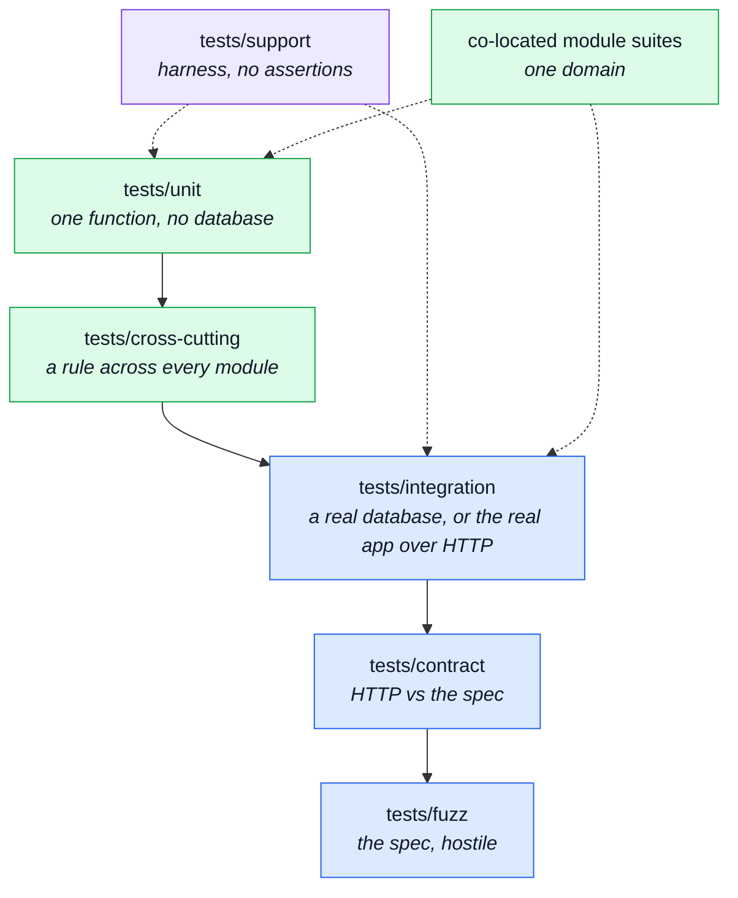
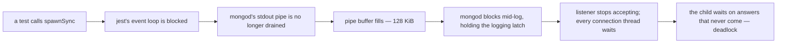
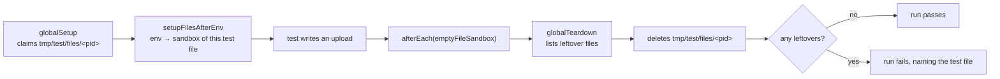

# Tests

Every file here is a distinct guarantee, which is why this page names them one at a time: knowing
_which_ test covers a rule is most of the value of having it.

Tests live in two places, and the split is by scope rather than by taste. A test about **one
module** lives inside that module. A test about **the system** — infrastructure, the kernel, or a
rule that holds across every module — lives in `tests/`.
`eslint-plugin-boundaries` enforces the line, at the offending import rather than by naming a
file — see `eslint.config.ts`.

---

## The suites

## Order-dependence

`--runInBand` runs `tests/integration`, `tests/contract` and `tests/fuzz` in one process, in
whatever order Jest discovers the files — deterministic, but not meaningful: a suite that only
passes because an earlier file left state behind (a fixture, a cached module) looks identical to
one that doesn't, until the file order changes.

`npm run test:order-random` runs the same three suites shuffled (`--randomize --showSeed`) instead
of gating on it. Not part of `npm run test` or CI — cheap enough to run by hand after touching
shared test fixtures or module-level state, and `--showSeed` prints the seed a red run needs to
reproduce.

## Three numbers, and they are not the same question

This trips people up, so it is stated before anything else on this page.

**Tests passing is 100%, always.** Every one of the ~3,100 tests here must pass. One failing test
is a red build — no threshold, no percentage, no "most of them". A test that fails is fixed or it
is deleted; nothing in this repo tolerates a known-failing test. Everything below is about a
different question, and none of it softens this one.

The other two numbers are measurements of the SUITE rather than of the code, and they are ranked:

|                    | The question it answers                      | Verdict on a low number                      |
| ------------------ | -------------------------------------------- | -------------------------------------------- |
| **Pass rate**      | did every assertion hold                     | something is **broken** — fix it now         |
| **Mutation score** | would a test **notice** if this line changed | the suite is **weak here** — the real signal |
| **Coverage**       | did this line **execute** during that suite  | that suite did not **reach** this code       |

### Mutation testing is the instrument; coverage is the proxy

Coverage is the weaker of the two and it is worth being blunt about why. It asks only whether a
line ran. A line can be executed by a test that asserts nothing whatever about it, and coverage
will call that 100%.

Mutation testing asks the question you actually care about: **Stryker edits the code — flips a
comparison, drops a call, changes a constant — and checks that some test goes red.** A test that
does not notice the change did not really test the line, and the mutant "survives".

That relationship is one-directional, which is what makes the ranking real: an uncovered line
cannot possibly kill a mutant, so **every coverage gap shows up as surviving mutants, while the
converse is false**. Mutation score subsumes coverage. Where the two disagree, the mutation score
is the one telling the truth.

So the honest framing of this repository's tooling:

- **`npm run mutation` / `npm run mutation:full` are the primary judgement of test quality.** Their
  per-file scores in `mutation-baseline.json` are what "is this actually tested" means here.
- **`npm run test:unit:coverage` is a fast proxy, and nothing more.** It runs in seconds where a
  mutation run takes far longer, so it is the smoke alarm rather than the inspection. Its floors are
  a ratchet — "do not get worse" — never a target. See `jest.config.js`, which says so at length.

### Why the unit coverage numbers look so low

`test:unit:coverage` runs `tests/unit`, `tests/cross-cutting` and each module's own `tests/unit` —
and deliberately not the integration or contract suites. A module spec that calls `setupTestDb()`
belongs in that module's `tests/integration/`, not its `tests/unit/`: `unit-layer-stays-database-free`
in `.dependency-cruiser.cjs` refuses a spec under `tests/unit` that can reach a database at all,
regardless of what any test runner executes.

Moving them was right. What was missed is that the code they cover stopped being _counted_ by the
unit coverage job while the floors stayed put, so that job failed on 89 thresholds until
2026-08-29 — and a gate that is red for months is a gate nobody reads. The floors were re-fitted
then, downward, and `jest.config.js` records what that does and does not buy.

`orders/services/crud.ts` reporting **37% statements on the unit run** therefore means: not 63% failing,
not 63% untested — 63% covered by a suite this particular run does not execute.

::: warning A wider blind spot used to apply to Stryker, and no longer does
Until 2026-09-20, `stryker.config.json` mutated `src/modules/*/**/*.ts`, services and repositories <!-- doc-paths:ignore -->
included, while its `testPathIgnorePatterns` excluded `tests/integration/`, `tests/contract/` and
the co-located equivalents. It mutated code whose killing tests it never ran, and 153 of 254 files
in that ruler's baseline scored 0% for exactly that reason — a file could read 100% coverage and 0%
mutation score at once, a combination only possible when no eligible spec ran against it.

`stryker.json` is the only config now, and it always runs `tests/integration/` too — see
[one ruler](../tools/mutation-testing.md#one-ruler). A 0% in `mutation-baseline.json` is a real
finding again, once the baseline is reseeded under the merged ruler. Read the ratchet against its
own recorded history, not as an absolute grade, either way.
:::

### A combined coverage run was tried, and abandoned

Running every suite under one instrumented process to get a single honest coverage number does not
work here, and the record is kept so nobody spends the afternoon again: with the fuzz suite it dies
on a V8 fatal assertion, and without it on `FATAL ERROR: JavaScript heap out of memory` at ~4 GB
after roughly eight minutes. Making it work needs an enlarged heap or per-suite runs with merged
reports — real machinery, for the weaker of the two instruments, duplicating a question mutation
testing already answers better.

| Command                      | Runs                        | Answers                                      |
| ---------------------------- | --------------------------- | -------------------------------------------- |
| `npm run test`               | every suite, no coverage    | does everything pass — **the one that must** |
| `npm run mutation:full`      | unit + integration, mutated | **would the tests notice a change**          |
| `npm run test:unit:coverage` | unit + cross-cutting        | did the unit layer lose reach (fast proxy)   |

See [Mutation Testing](../tools/mutation-testing.md) for the run itself, its baseline ratchet and
what the `high`/`low`/`break` thresholds mean.

---

## `tests/cross-cutting/` — rules that hold across every module

The house speciality: one file per architectural rule, asserted over every module at once.
A new module is covered the day it is added, without anyone writing a test for it.

| File                                                        | What it guarantees                                                                                                                                                                                                                              | Read next                                                                                                                  |
| ----------------------------------------------------------- | ----------------------------------------------------------------------------------------------------------------------------------------------------------------------------------------------------------------------------------------------- | -------------------------------------------------------------------------------------------------------------------------- |
| `tests/cross-cutting/locale-namespaces.test.ts`             | Locale ownership: a module's keys stay in its own namespace and never collide with the app bundle.                                                                                                                                              | [App, Kernel & Types](./src-app.md)                                                                                        |
| `tests/cross-cutting/locale-parity.test.ts`                 | Every language declares the same keys, across the shared file and every module at once.                                                                                                                                                         | [Modules](./src-modules.md)                                                                                                |
| `tests/cross-cutting/audit-actions.test.ts`                 | The audit vocabulary is consistent across every module that writes to the trail.                                                                                                                                                                | [Winston & Audit Logs](../tools/winston.md)                                                                                |
| `tests/cross-cutting/contract-bundles.test.ts`              | Every bundled document is exactly what its fragments say it is built from.                                                                                                                                                                      | [Contracts](./contracts.md)                                                                                                |
| `tests/cross-cutting/contract-scalars.test.ts`              | The shared scalars in infrastructure still match every operation in the contract.                                                                                                                                                               | [Contract-Derived Request Data](../tools/contract-request-data.md)                                                         |
| `tests/cross-cutting/scenario-fixtures.test.ts`             | The three claims about the demo fixtures no index, build sweep or contract suite already makes.                                                                                                                                                 | [Data](./data.md)                                                                                                          |
| `tests/cross-cutting/process-snapshot.test.ts`              | The process is read in exactly one place and published in exactly one shape, so the SSE frame and the REST payloads cannot drift.                                                                                                               | [Observability Endpoints](../api/observability.md)                                                                         |
| `tests/cross-cutting/authenticated-controllers.test.ts`     | A controller asserting the caller with `request.authContext!` is mounted behind `isAuth` — not `isAuthOrCredential`, which resolves no context — the half no type can carry, including the mid-file `router.use` hazard.                        | [Request Flow](../theory/request-flow.md)                                                                                  |
| `tests/cross-cutting/api-key-authentication.test.ts`        | An `sk_...` credential reaches the routes its keys cover over the real chain, and no module mounts both identity guards.                                                                                                                        | [Security](../tools/security.md#machine-to-machine-credentials)                                                            |
| `tests/cross-cutting/ci-covers-the-gate.test.ts`            | Every check `npm run complete` runs has a CI job behind it, so `--no-verify` or a fork PR cannot bypass one silently.                                                                                                                           | [Scripts & Hooks](./scripts.md)                                                                                            |
| `tests/cross-cutting/probes-are-wired.test.ts`              | A module that declares `probes.ts` is wired into the generated collections, so adding one cannot leave four bundles quietly short.                                                                                                              | [Contracts](./contracts.md)                                                                                                |
| `tests/cross-cutting/frontend-pairing.test.ts`              | Every domain names its counterpart in the paired frontend, and — when that checkout is present — the names still resolve on both sides.                                                                                                         | [Pairing & Ports](../tools/pairing-and-ports.md)                                                                           |
| `tests/cross-cutting/metric-names.test.ts`                  | A metric name is an identifier three places agree on, and only one of them is type-checked.                                                                                                                                                     | [Prometheus](../tools/prometheus.md)                                                                                       |
| `tests/cross-cutting/outbox-names.test.ts`                  | Every mail names itself the way the PHP twin does — engine-neutral, and still resolving to a real template.                                                                                                                                     | [Email & PDF Rendering](../tools/email-and-rendering.md)                                                                   |
| `tests/cross-cutting/credential-fields.test.ts`             | Nothing credential-shaped survives serialization, on any model.                                                                                                                                                                                 | [Security](../tools/security.md)                                                                                           |
| `tests/cross-cutting/contract-aliases.test.ts`              | Which spelling of an operation a caller should reach for, and that both spellings agree.                                                                                                                                                        | [Contracts](./contracts.md)                                                                                                |
| `tests/cross-cutting/contract-error-declarations.test.ts`   | Every status the error interpreter can answer is a status the contract describes.                                                                                                                                                               | [Contracts](./contracts.md)                                                                                                |
| `tests/cross-cutting/contract-search-parity.test.ts`        | The two spellings of one search accept the same thing.                                                                                                                                                                                          | [Contracts](./contracts.md)                                                                                                |
| `tests/cross-cutting/paginated-sort-is-total.test.ts`       | Every `$sort` a `$skip` pages through ends in a unique key, so a page boundary cannot show one document twice and another not at all.                                                                                                           | [MongoDB & Mongoose](../tools/mongodb-mongoose.md)                                                                         |
| `tests/cross-cutting/search-pagination.test.ts`             | Pagination normalisation is the single authority on page defaults.                                                                                                                                                                              | [MongoDB & Mongoose](../tools/mongodb-mongoose.md)                                                                         |
| `tests/cross-cutting/search-regex.test.ts`                  | Client text reaching MongoDB's regex operator is escaped — the server evaluates the pattern, so an unescaped one is a denial of service.                                                                                                        | [Security](../tools/security.md)                                                                                           |
| `tests/cross-cutting/search.property.test.ts`               | The same, as **properties** over generated inputs rather than examples.                                                                                                                                                                         | [Property Testing](../tools/property-testing.md)                                                                           |
| `tests/cross-cutting/serialize.property.test.ts`            | The universal guarantees of serialisation, over generated documents: the public id present and the internal fields gone, whatever the input.                                                                                                    | [Property Testing](../tools/property-testing.md)                                                                           |
| `tests/cross-cutting/money-reconciliation.property.test.ts` | The composition `orders.orderTotal` + `delivery.priceShipping` that cart, payments and the confirmation email each perform themselves: reconciling lines and shipping never invents or drops a cent.                                            | [Property Testing](../tools/property-testing.md)                                                                           |
| `tests/cross-cutting/coverage-thresholds.test.ts`           | Every coverage floor in `jest.config.js` is attached to code that exists: a key that matches no file, or whose every match is excluded from coverage, is ignored in silence while reading like a gate. That is how three keys detached at once. | [Unit Testing](../tools/unit-testing.md) · [Mutation Testing](../tools/mutation-testing.md) · [Repository Root](./root.md) |
| `tests/cross-cutting/production-topology.test.ts`           | The deployment's four invisible decisions: containers read-only with no capabilities, no data port published to the host, no debugger flag, no dependency lifecycle script run during the image build.                                          | [Docker & Podman](../tools/docker-and-podman.md) · [Security](../tools/security.md)                                        |

## `tests/unit/`

One function, no database, no HTTP. Fast enough to run from the pre-commit hook.

| File                                                            | What it guarantees                                                                                                                                                    | Read next                                                |
| --------------------------------------------------------------- | --------------------------------------------------------------------------------------------------------------------------------------------------------------------- | -------------------------------------------------------- |
| `tests/unit/scripts/db/host-scripts.test.ts`                    | The `host` script and the URI resolver agree over the whole environment matrix — the pin that keeps `npm run host -- <script>` reaching the database `.env` names.    | [Repository Root](./root.md)                             |
| `tests/unit/scripts/run-script.test.ts`                         | The entry-point wrapper opens, closes and exits non-zero on failure.                                                                                                  | [Data](./data.md)                                        |
| `tests/unit/scenarios/scenario-images.test.ts`                  | Every seed row's `imageUrl` is a real file under `public/images/seed/`, addressed as the static mount would serve it.                                                 | [Data](./data.md)                                        |
| `tests/unit/scenarios/check.test.ts`                            | `findUnmetGuarantees` catches a guarantee with no matching subject and a subject no module declared, fed a hand-made map — no database, no real scenario built.       | [Data](./data.md)                                        |
| `tests/unit/scenarios/accounts.test.ts`                         | The named demo identities and the env vars that override their passwords, reloading the module per case since the overrides are read at module scope.                 | [Demo profile](../tools/demo-profile.md)                 |
| `tests/unit/scripts/eslint/controller-chain-must-catch.test.ts` | The repo's own lint rule fires on the code it is meant to catch and stays quiet otherwise.                                                                            | [Scripts & Hooks](./scripts.md)                          |
| `tests/unit/scripts/eslint/no-hardcoded-user-text.test.ts`      | The same for the hardcoded-copy rule.                                                                                                                                 | [Scripts & Hooks](./scripts.md)                          |
| `tests/unit/i18n/email-locale.test.ts`                          | Where an email's language is decided — the producer resolves the copy before publishing, so a queued job cannot be rendered in the worker's locale.                   | [Email & PDF Rendering](../tools/email-and-rendering.md) |
| `tests/unit/infrastructure/i18n/context.test.ts`                | The request-scoped `t`: that two overlapping scopes stay apart, and that code outside any scope still resolves.                                                       | [Request Flow](../theory/request-flow.md)                |
| `tests/unit/infrastructure/i18n/catalog.test.ts`                | Which languages exist, the per-module dictionary merge, and why the supported list is cached rather than re-read.                                                     | [Internationalisation](../tools/i18n.md)                 |
| `tests/unit/infrastructure/i18n/overrides.test.ts`              | The database overlay: a stored edit wins, a deleted one stops answering, a failed read keeps the last good copy — plus the timer that spreads an edit across workers. | [Internationalisation](../tools/i18n.md)                 |
| `tests/unit/kernel/registry.test.ts`                            | `registerModules` calls every declared `subscribe` hook, and treats a module without one as ordinary.                                                                 | [Modules](../theory/modules.md)                          |
| `tests/unit/kernel/events.test.ts`                              | The event bus breaks the cycle it exists for: a deleted product empties out of every cart without the two modules importing each other.                               | [Events & Logging](../tools/events-and-logging.md)       |
| `tests/unit/kernel/authorizations.test.ts`                      | Token extraction and the role guard.                                                                                                                                  | [Security](../tools/security.md)                         |
| `tests/unit/kernel/access-query.test.ts`                        | The shared read-scoping rule — the caller's rules, compiled into the filter a collection is read with.                                                                | [Authorization](../theory/authorization.md)              |
| `tests/unit/kernel/step-up.test.ts`                             | Step-up demanded by the KEY: refused before challenged, and the demand recorded.                                                                                      | [Authorization](../theory/authorization.md)              |
| `tests/cross-cutting/module-permissions.test.ts`                | Every key belongs to a module that exists, and every module claims exactly the keys attributed to it.                                                                 | [Authorization](../theory/authorization.md)              |
| `tests/unit/scripts/mutation/baseline.test.ts`                  | The ratchet reads a Stryker report into per-file scores correctly.                                                                                                    | [Mutation Testing](../tools/mutation-testing.md)         |
| `tests/unit/scripts/testing/machine-budget.test.ts`             | The sizing arithmetic behind `npm run test:*` — worker counts, shard counts and heap caps, bounded by cores and by free memory rather than total.                     | [Weak Machines](../tools/weak-machines.md)               |
| `tests/unit/support/file-sandbox.test.ts`                       | The file sandbox redirects every file-writing setting, refuses to run or delete outside its root, and attributes a leftover file to the test file that left it.       | [Test layout](#a-test-leaves-no-files-behind)            |
| `tests/unit/scripts/pairing/spec-identity.test.ts`              | The cross-repo shared-file list and its comparison.                                                                                                                   | [Pairing & Ports](../tools/pairing-and-ports.md)         |

### `tests/unit/infrastructure/runtime/` and `persistence/`

| File                                                     | What it guarantees                                                                                                          | Read next                                |
| -------------------------------------------------------- | --------------------------------------------------------------------------------------------------------------------------- | ---------------------------------------- |
| `tests/unit/infrastructure/runtime/environment.test.ts`  | The fail-fast boot check, tested exhaustively because it is small and because it decides whether the process starts at all. | [Runtime](../tools/runtime.md)           |
| `tests/unit/infrastructure/runtime/demo-profile.test.ts` | Demo mode is exactly `enableDemoProfile()` having been called, and production refuses it even then.                         | [Demo profile](../tools/demo-profile.md) |

### `tests/unit/infrastructure/adapters/`

| File                                                                  | What it guarantees                                                                                                                                                                                       | Read next                                                |
| --------------------------------------------------------------------- | -------------------------------------------------------------------------------------------------------------------------------------------------------------------------------------------------------- | -------------------------------------------------------- |
| `tests/unit/infrastructure/adapters/managed-connection.test.ts`       | The lifecycle Redis and RabbitMQ share, against a fake handle: never rejecting, never opening a second connection, warning once, closing an in-flight connect.                                           | [Redis Cache](../tools/redis-cache.md)                   |
| `tests/unit/infrastructure/adapters/cache.test.ts`                    | The fail-open behaviour the whole cache depends on, the tag index behind group invalidation, and `clearCache` telling "nothing to clear" from "could not clear".                                         | [Redis Cache](../tools/redis-cache.md)                   |
| `tests/unit/infrastructure/adapters/queue.test.ts`                    | Whether the queue is enabled, and what every function does when it is not.                                                                                                                               | [RabbitMQ](../tools/rabbitmq.md)                         |
| `tests/unit/app/process-error-handlers.test.ts`                       | The process-level handlers: an uncaught exception is always audited and always exits, and no handler is installed under a test runner.                                                                   | [Winston & Audit Logs](../tools/winston.md)              |
| `tests/unit/infrastructure/adapters/email.worker.test.ts`             | The email consumer: queue name, ack on success, dead-letter on a permanent refusal, and a rejection left to escape so `<queue>.retry`'s TTL, not an immediate broker requeue, saves a transient failure. | [RabbitMQ](../tools/rabbitmq.md)                         |
| `tests/unit/infrastructure/adapters/logger.test.ts`                   | Redaction and error serialization — that a password never reaches a log line.                                                                                                                            | [Winston & Audit Logs](../tools/winston.md)              |
| `tests/unit/infrastructure/adapters/mailer-dispatch.test.ts`          | The queue-or-send-inline dispatch: queue when a broker exists, send inline when it does not.                                                                                                             | [Email & PDF Rendering](../tools/email-and-rendering.md) |
| `tests/unit/infrastructure/adapters/mailer-templates.test.ts`         | Every template referenced by a module resolves and renders.                                                                                                                                              | [Email & PDF Rendering](../tools/email-and-rendering.md) |
| `tests/unit/infrastructure/adapters/mailer-transport.test.ts`         | The transport configuration — and that the test environment uses one that sends nothing.                                                                                                                 | [Email & PDF Rendering](../tools/email-and-rendering.md) |
| `tests/unit/infrastructure/adapters/pdf.test.ts`                      | The HTML to PDF adapter's contract with its caller.                                                                                                                                                      | [Email & PDF Rendering](../tools/email-and-rendering.md) |
| `tests/unit/infrastructure/adapters/demo-outbox.test.ts`              | The demo profile's email sink — what the paired frontend's password-reset and verification specs are ultimately reading.                                                                                 | [Demo profile](../tools/demo-profile.md)                 |
| `tests/unit/infrastructure/http/middlewares/upload.test.ts`           | The upload callbacks: where a file lands, what it is renamed to, which types are refused.                                                                                                                | [Security](../tools/security.md)                         |
| `tests/unit/infrastructure/adapters/image-signatures.test.ts`         | An image is identified by its bytes, and only as many bytes as needed are read.                                                                                                                          | [Security](../tools/security.md)                         |
| `tests/unit/infrastructure/adapters/image-store.test.ts`              | The filesystem image store's put, resolve and delete.                                                                                                                                                    | [Security](../tools/security.md)                         |
| `tests/unit/infrastructure/adapters/image-store.test.ts`              | The step between "multer wrote a file" and "the API has an image".                                                                                                                                       | [Security](../tools/security.md)                         |
| `tests/unit/infrastructure/adapters/filesystem.test.ts`               | The one filesystem operation an upload cannot survive getting wrong.                                                                                                                                     | —                                                        |
| `tests/unit/infrastructure/http/middlewares/rate-limit-store.test.ts` | One connection needs one `connect()` — the shared limiter store.                                                                                                                                         | [Security](../tools/security.md)                         |

### `tests/unit/infrastructure/http/`

| File                                                                | What it guarantees                                                                                                                                                                                  | Read next                                                          |
| ------------------------------------------------------------------- | --------------------------------------------------------------------------------------------------------------------------------------------------------------------------------------------------- | ------------------------------------------------------------------ |
| `tests/unit/infrastructure/http/request.test.ts`                    | Input reading finds a value in a param, a query string or a body, and reports honestly when it cannot.                                                                                              | [Request Input](../theory/request-input.md)                        |
| `tests/unit/infrastructure/http/schemas.test.ts`                    | The contract scalars more than one endpoint accepts.                                                                                                                                                | [Contract-Derived Request Data](../tools/contract-request-data.md) |
| `tests/unit/infrastructure/http/response.test.ts`                   | The success and error envelopes are the shape every client branches on.                                                                                                                             | [Endpoints](../api/endpoints.md)                                   |
| `tests/unit/infrastructure/http/errors.test.ts`                     | `databaseErrorInterpreter` maps a duplicate key and a bad ObjectId to the status each documents, an ordinary `Error` to 500.                                                                        | [Request Flow](../theory/request-flow.md)                          |
| `tests/unit/infrastructure/http/uploads.test.ts`                    | What a handler is allowed to see of a multipart request.                                                                                                                                            | [Security](../tools/security.md)                                   |
| `tests/unit/infrastructure/http/middlewares/rate-limit.test.ts`     | The two rate-limit budgets and the metrics scrape guard.                                                                                                                                            | [Security](../tools/security.md)                                   |
| `tests/unit/infrastructure/http/middlewares/locale.test.ts`         | Locale attachment fixes the translator for the rest of the chain; negotiation itself (q-weights, region tags, the fallback, and Express's own `acceptsLanguages` in place of a hand-rolled parser). | [Request Flow](../theory/request-flow.md)                          |
| `tests/unit/infrastructure/http/middlewares/cache.test.ts`          | The cache key depends on the query parameters the answer actually depends on — plus the TTL clamp and the per-entry size limit.                                                                     | [Redis Cache](../tools/redis-cache.md)                             |
| `tests/unit/infrastructure/http/middlewares/request-logger.test.ts` | One access-log line per request, at the right level for the status.                                                                                                                                 | [Winston & Audit Logs](../tools/winston.md)                        |
| `tests/unit/infrastructure/http/middlewares/route-flag.test.ts`     | A route's own meaning reaches the controller as an ordinary param.                                                                                                                                  | [Endpoints](../api/endpoints.md)                                   |

### `tests/unit/infrastructure/observability/`

| File                                                               | What it guarantees                                                                    | Read next                                   |
| ------------------------------------------------------------------ | ------------------------------------------------------------------------------------- | ------------------------------------------- |
| `tests/unit/infrastructure/observability/metrics-http.test.ts`     | Route labels are normalised, so an id in a URL cannot explode the metric cardinality. | [Prometheus](../tools/prometheus.md)        |
| `tests/unit/infrastructure/observability/metrics-registry.test.ts` | The scrape endpoint's exposition includes the standard process families.              | [Prometheus](../tools/prometheus.md)        |
| `tests/unit/infrastructure/observability/audit.test.ts`            | The core audit actions and the shape of an entry.                                     | [Winston & Audit Logs](../tools/winston.md) |
| `tests/unit/infrastructure/observability/analytics.test.ts`        | Provider resolution and all three implementations behind the port.                    | [Product Analytics](../tools/analytics.md)  |
| `tests/unit/infrastructure/observability/tracer.test.ts`           | The tracing helpers over the OpenTelemetry API.                                       | [OpenTelemetry](../tools/opentelemetry.md)  |

## `tests/integration/` — the real app over HTTP

Boots the application against an in-memory MongoDB and drives it as a client would. Run serially.

| File                                                   | What it guarantees                                                                                                                                                                                               | Read next                                              |
| ------------------------------------------------------ | ---------------------------------------------------------------------------------------------------------------------------------------------------------------------------------------------------------------- | ------------------------------------------------------ |
| `tests/integration/app-health.test.ts`                 | The system routes and the observability endpoints answer as documented.                                                                                                                                          | [Observability Endpoints](../api/observability.md)     |
| `tests/integration/observability-auth.test.ts`         | The two observability endpoints, and exactly which credentials reach them.                                                                                                                                       | [Security](../tools/security.md)                       |
| `tests/integration/auth-hardening.test.ts`             | Two properties invisible until someone attacks them — credential endpoints rate-limited on their own budget, and the rest.                                                                                       | [Security](../tools/security.md)                       |
| `tests/integration/upload-security.test.ts`            | What actually reaches the disk when a hostile file is uploaded.                                                                                                                                                  | [Security](../tools/security.md)                       |
| `tests/integration/product-multipart-write.test.ts`    | Writing a product through a multipart body — the only way to send one with an image.                                                                                                                             | [Endpoints](../api/endpoints.md)                       |
| `tests/integration/locale.test.ts`                     | Per-request language negotiation, end to end.                                                                                                                                                                    | [Request Flow](../theory/request-flow.md)              |
| `tests/integration/locale-cache-invalidation.test.ts`  | An admin edit reaches the next anonymous reader — the cached public dictionary is invalidated.                                                                                                                   | [Redis Cache](../tools/redis-cache.md)                 |
| `tests/integration/concurrency/auth-races.test.ts`     | The account endpoints under simultaneous callers: concurrent signups for one address, and the rest of the race table.                                                                                            | [Concurrency Testing](../tools/concurrency-testing.md) |
| `tests/integration/concurrency/cart-races.test.ts`     | The cart and checkout endpoints under simultaneous writes of the same product.                                                                                                                                   | [Concurrency Testing](../tools/concurrency-testing.md) |
| `tests/integration/concurrency/wishlist-races.test.ts` | The wishlist endpoints under concurrent writes — the same shape as the cart's races.                                                                                                                             | [Unit Testing](../tools/unit-testing.md)               |
| `tests/integration/scripts/db/index-sync.test.ts`      | `db:sync` builds every declared index, drops every undeclared one, converges on a second run, and refuses a unique constraint the rows already violate.                                                          | [Data](./data.md)                                      |
| `tests/integration/app/demo-restore.test.ts`           | `restoreScenario`'s `blank` path against a real database, plus two real-HTTP cases proving the defects `emptyDatabase()` and the pinned tenant id exist to close.                                                | [Demo profile](../tools/demo-profile.md)               |
| `tests/integration/scenarios/shop.test.ts`             | Builds the `shop` scenario for real, then reads every row back through the real serializers against the generated response schemas, and holds every declared guarantee equal to the subjects the build produced. | [Demo profile](../tools/demo-profile.md)               |

## `tests/cluster/` — more than one worker

One process is not the deployment. These boot real workers, because the bugs they look for cannot
happen in a single process.

| File                               | What it asserts                                               | Read next                                      |
| ---------------------------------- | ------------------------------------------------------------- | ---------------------------------------------- |
| `tests/cluster/rate-limit.test.ts` | One budget means one budget — across workers, not per worker. | [Cluster Testing](../tools/cluster-testing.md) |

## `tests/contract/` and `tests/fuzz/`

| File                                      | What it guarantees                                                                                                                                                         | Read next                                                          |
| ----------------------------------------- | -------------------------------------------------------------------------------------------------------------------------------------------------------------------------- | ------------------------------------------------------------------ |
| `tests/contract/system.test.ts`           | The system routes and the shared error envelopes match the contract.                                                                                                       | [Contract Testing (Response)](../tools/contract-testing.md)        |
| `tests/contract/request-contract.test.ts` | For every write endpoint: the API accepts every payload the contract permits and rejects the rest — with the payloads generated _from_ the contract.                       | [Contract-Derived Request Data](../tools/contract-request-data.md) |
| `tests/contract/request-sources.test.ts`  | Every controller reads only the request sources its own contract declares — no undocumented query parameter.                                                               | [Contract-Derived Request Data](../tools/contract-request-data.md) |
| `tests/fuzz/endpoints.fuzz.test.ts`       | Spec-driven fuzzing: every operation in `openapi.yaml` walked with generated hostile input, asserting the API never answers with something the contract does not describe. | [Fuzz Testing](../tools/fuzz-testing.md)                           |

## `tests/support/` — the harness

No assertions live here. These are what the suites are built from.

| File                                  | What it is                                                                                                                                              | Read next                                                                |
| ------------------------------------- | ------------------------------------------------------------------------------------------------------------------------------------------------------- | ------------------------------------------------------------------------ |
| `tests/support/setup.ts`              | Jest's per-worker bootstrap — runs before any test, and raises the rate limits so a concurrency suite does not answer 429 to its own fixtures.          | [Unit Testing](../tools/unit-testing.md)                                 |
| `tests/support/test-environment.ts`   | The jest environment every file runs in: `node`, plus clearing every timer and performance observer a file left running, so the file's memory is freed. | [Mutation Testing](../tools/mutation-testing.md#one-process-per-dry-run) |
| `tests/support/global-setup.ts`       | Starts the shared in-memory Mongo for the jest instance.                                                                                                | [Integration Testing](../tools/integration-testing.md)                   |
| `tests/support/global-teardown.ts`    | Stops it, once, after the last worker exits — and fails the run if any test file left files in its sandbox.                                             | [Integration Testing](../tools/integration-testing.md)                   |
| `tests/support/file-sandbox.ts`       | The per-test-file directory that uploads, quarantine and staging are redirected into.                                                                   | [Below](#a-test-leaves-no-files-behind)                                  |
| `tests/support/setup-file-sandbox.ts` | Points one test file at its sandbox, before the file loads.                                                                                             | [Below](#a-test-leaves-no-files-behind)                                  |
| `tests/support/setup-test-db.ts`      | The database lifecycle for one suite. Called at the top level of any file that touches Mongo.                                                           | [Integration Testing](../tools/integration-testing.md)                   |
| `tests/support/database.ts`           | Connects one test file to the instance's shared in-memory Mongo.                                                                                        | [Integration Testing](../tools/integration-testing.md)                   |
| `tests/support/http.ts`               | The HTTP-level harness — booting the app and driving it as a client.                                                                                    | [Integration Testing](../tools/integration-testing.md)                   |
| `tests/support/express.ts`            | Express request and response stubs, for a unit test that needs a middleware and not a server.                                                           | [Unit Testing](../tools/unit-testing.md)                                 |
| `tests/support/stub.ts`               | The one sanctioned cast for a hand-built stub, and the reason double casts can be banned everywhere else.                                               | [Repository Root](./root.md)                                             |
| `tests/support/contract.ts`           | Compares a real HTTP response against `openapi.yaml`.                                                                                                   | [Contract Testing (Response)](../tools/contract-testing.md)              |
| `tests/support/contract-data.ts`      | Generates request bodies from the contract's own Zod schemas.                                                                                           | [Contract-Derived Request Data](../tools/contract-request-data.md)       |
| `tests/support/pattern-samples.ts`    | Known-good strings for `pattern`s no generator can build a value for — one table, read by both generators.                                              | [Fuzz Testing](../tools/fuzz-testing.md)                                 |
| `tests/support/spec-walk.ts`          | Enumerates every operation in `openapi.yaml` — what makes a suite cover new endpoints automatically.                                                    | [Fuzz Testing](../tools/fuzz-testing.md)                                 |
| `tests/support/spec-arbitraries.ts`   | Turns a JSON Schema node from the contract into a property-testing arbitrary.                                                                           | [Property Testing](../tools/property-testing.md)                         |
| `tests/support/knobs.ts`              | The GENERATIVE suites' depth knobs — how many cases a property explores, how many participants a race fires — each floored against a vacuous run.       | [Weak Machines](../tools/weak-machines.md)                               |
| `tests/support/race.ts`               | The concurrency harness: fire N requests at one instant and assert on the whole set of outcomes.                                                        | [Concurrency Testing](../tools/concurrency-testing.md)                   |
| `tests/support/i18n-boot.ts`          | Reproduces the import ordering the app forces — module first, i18next second — so a test hits the same initialisation the app does.                     | [Request Flow](../theory/request-flow.md)                                |

### Never block the event loop in a test

A test may not call `spawnSync`, `execSync`, or anything else that blocks jest's event loop, and
this is not a style preference.

`tests/support/global-setup.ts` starts one `mongod` per jest instance and pipes its stdout into
**jest's own main process**. Nothing else reads it. A blocking call stops that reading, the pipe
buffer fills, and `mongod` blocks part-way through writing a log line while it holds its logging
latch — at which point the server stops answering anyone, its listener included.

A seed or a boot logs enough for this to happen within seconds. Spawn asynchronously and `await`
the result: `tests/integration/scenarios/apply.test.ts` is the worked example.

### A test leaves no files behind

A test run must not write onto the machine it runs on. The application writes files in three
places, and each defaults to a real directory:

| Setting                    | Default outside tests             | In tests                                      |
| -------------------------- | --------------------------------- | --------------------------------------------- |
| `NODE_PUBLIC_PATH`         | `public/` — uploads, thumbnails   | `tmp/test/files/<pid>/<test file>/public`     |
| `NODE_QUARANTINE_PATH`     | `tmp/quarantine/`                 | `tmp/test/files/<pid>/<test file>/quarantine` |
| `NODE_UPLOAD_STAGING_PATH` | `<system temp>/node-api-uploads/` | `tmp/test/files/<pid>/<test file>/uploads`    |

Two rules, both enforced:

- **Redirected.** `tests/support/setup-file-sandbox.ts` assigns all three before a test file loads,
  overriding `.env` and the shell. Without `globalSetup` it refuses to run rather than fall back.
- **Removed.** A test that writes a file for real deletes it — `afterEach(emptyFileSandbox)` is
  the whole idiom. Teardown lists what is left, deletes the sandbox anyway, then fails the run
  naming each offending test file.

A killed run never reaches teardown; the next run sweeps a dead instance's directory, exactly as it
does for the in-memory Mongo data.

## `tests/audit/` — prompts, not tests

The one directory here Jest never runs. These are markdown prompts driven by hand against an LLM,
covering the question no deterministic tool can reach: does the code do what the **docs** promise?
They write reports to `tmp/reports/audit/` and never touch source.

| File                                 | What it is                                                                                               | Read next                              |
| ------------------------------------ | -------------------------------------------------------------------------------------------------------- | -------------------------------------- |
| `tests/audit/spec-drift.md`          | The two-pass audit: freeze spec-derived expectations, then hunt tests that assert the code instead.      | [AI Auditing](../tools/ai-auditing.md) |
| `tests/audit/spec-gaps.md`           | Business rules and security boundaries with zero coverage.                                               | [AI Auditing](../tools/ai-auditing.md) |
| `tests/audit/suite-bloat.md`         | Near-duplicate tests that cost CI time and discriminate nothing.                                         | [AI Auditing](../tools/ai-auditing.md) |
| `tests/audit/compliance-backend.md`  | This backend against `compliance-rules.yaml`'s backend-responsibility rules (consent, data security, …). | [AI Auditing](../tools/ai-auditing.md) |
| `tests/audit/compliance-frontend.md` | The paired frontend against the same registry's frontend-responsibility rules.                           | [AI Auditing](../tools/ai-auditing.md) |
| `tests/audit/reachability.md`        | Defences that are correct where tested and unreachable through the real mounted path.                    | [AI Auditing](../tools/ai-auditing.md) |
| `tests/audit/rate-limit-keys.md`     | Rate-limit budgets bucketed on something the attacker supplies or rotates for free.                      | [AI Auditing](../tools/ai-auditing.md) |

## Co-located module tests

A module's own suites live inside it. Same runner, same conventions; `npm run test:unit`,
`npm run test:integration` and `npm run test:contract` each pick up both locations.

| Pattern                                     | What it is                                                                                                                                                                                                                                                      | Read next                                                                                   |
| ------------------------------------------- | --------------------------------------------------------------------------------------------------------------------------------------------------------------------------------------------------------------------------------------------------------------- | ------------------------------------------------------------------------------------------- |
| `src/modules/*/tests/unit/*.test.ts`        | The module's unit suites, one file per subject rather than per source file. A name carrying `property` before the test extension is generated-input rather than example-based. No database — see `unit-layer-stays-database-free` in `.dependency-cruiser.cjs`. | [Unit Testing](../tools/unit-testing.md) · [Property Testing](../tools/property-testing.md) |
| `src/modules/*/tests/integration/*.test.ts` | Specs of the same module that DO need a real database — calling `setupTestDb()` and exercising the repository or service directly, no HTTP. `stryker.json`'s mutation run includes this tier — it is what covers the service and repository layers at all.      | [Integration Testing](../tools/integration-testing.md)                                      |
| `src/modules/*/tests/contract/*.test.ts`    | The module's endpoints driven over HTTP and checked against its slice of `openapi.yaml`. One per module that has routes.                                                                                                                                        | [Contract Testing (Response)](../tools/contract-testing.md)                                 |
| `src/modules/*/tests/factories.ts`          | Test-only factories too specific to belong in the module's published factory.                                                                                                                                                                                   | [Unit Testing](../tools/unit-testing.md)                                                    |

## Load testing

Not part of any gate — these are run by hand against a running instance.

`tests/load/` is the one directory under `tests/` that is **not** a jest suite. These are k6
scripts: JavaScript for the k6 Go runtime, not this project's TypeScript. Jest's `testMatch` wants
`*.test.ts` and never sees them, and `eslint.config.ts` ignores the directory outright, because
they import from `k6/http` — a specifier that resolves only inside k6.

| File                     | What it is                                                                                                                                       | Read next                                |
| ------------------------ | ------------------------------------------------------------------------------------------------------------------------------------------------ | ---------------------------------------- |
| `tests/load/browse.js`   | The read path under load: the storefront as an anonymous visitor sees it. Where autocannon hammers one URL at a flat rate, this walks a journey. | [Load Testing](../tools/load-testing.md) |
| `tests/load/checkout.js` | The write path: log in, fill a cart, check out. The scenario worth having, and the reason k6 earns its place beside autocannon.                  | [Load Testing](../tools/load-testing.md) |
