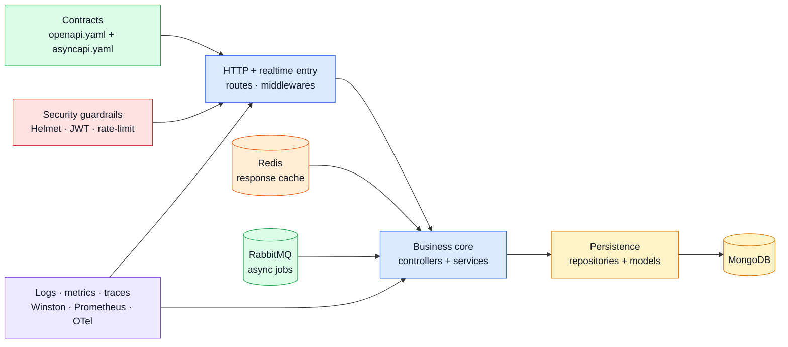

# Architecture

Use this page for the **big blocks and their boundaries**.
If you want the exact folder order, jump to [Layers](./layers.md).

## Architecture frame

## What each block owns

| Block               | Owns                                                                                                                                                                        | Avoids                  |
| ------------------- | --------------------------------------------------------------------------------------------------------------------------------------------------------------------------- | ----------------------- |
| Contract layer      | public request/event shapes and source-of-truth docs — see [OpenAPI Workflow](../api/openapi-workflow.md)                                                                   | hidden behavior drift   |
| Entry layer         | routes, middlewares, protocol glue, [auth](../tools/security.md) gates                                                                                                      | deep business decisions |
| Business core       | orchestration, validation ([Zod](../tools/runtime.md)), reusable rules                                                                                                      | Express or AMQP details |
| Persistence         | query shape, [schema mapping](../tools/mongodb-mongoose.md), storage access                                                                                                 | HTTP response logic     |
| Cross-cutting tools | [logs](../tools/winston.md), [traces](../tools/opentelemetry.md), [metrics](../tools/prometheus.md), [queues](../tools/rabbitmq.md), [cache](../tools/redis-cache.md) hooks | owning product rules    |

## Why this page exists next to Layers

- **Architecture** answers: “which major blocks talk to each other?”
- **Layers** answers: “which folder/file path do I open next?”

Keeping those separate reduces repetition and makes scanning faster.

## Why this matters in a boilerplate

A boilerplate should be easy to copy, swap piece by piece, test in isolation, and extend without turning one file into a giant blob.
That is why the repo favors **clear ownership lines** instead of controller-heavy code.
The [Layers](./layers.md) page maps each block to an exact folder.

## Design rules used here

- **SOLID**: each layer should have one main reason to change.
- **DRY**: shared logic belongs in services, repositories, or utilities.
- **KISS**: keep flows boring and predictable.
- **Future proof**: prefer seams where a database or framework could be swapped later.

## Related pages

- See [Layers](./layers.md) for the exact folder stack.
- See [Request Flow](./request-flow.md) for the live path of one endpoint.
- See [Runtime](../tools/runtime.md) and [MongoDB & Mongoose](../tools/mongodb-mongoose.md) for the libraries enabling this shape.
- See [OpenAPI Workflow](../api/openapi-workflow.md) for how the contract drives implementation.
