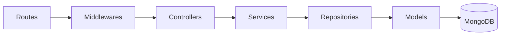
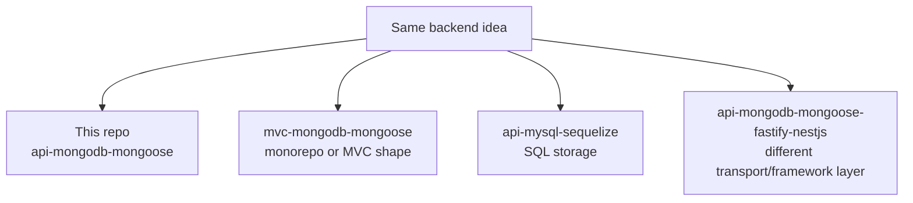

# Architecture

## The shape

## What each layer owns

| Layer        | Owns                                          | Avoids              |
| ------------ | --------------------------------------------- | ------------------- |
| Routes       | URL map, middleware order                     | business logic      |
| Middlewares  | auth, rate limits, request guards             | database queries    |
| Controllers  | request/response mapping                      | deep business rules |
| Services     | business decisions, orchestration, validation | Express details     |
| Repositories | query shape, persistence access               | HTTP concerns       |
| Models       | schema and persistence metadata               | route logic         |

## Why this matters in a boilerplate

A boilerplate should be easy to:

- copy into a new project,
- swap piece by piece,
- test in isolation,
- and extend without turning one file into a giant blob.

That is why the repo favors **small layers with clear ownership** instead of controller-heavy code.

## Repo family context

The point is not the exact example entities.
The point is that the **architecture stays recognizable even when the stack changes**.

## Design rules used here

- **SOLID**: each layer should have one main reason to change.
- **DRY**: shared logic belongs in services, repositories, or utilities.
- **KISS**: keep flows boring and predictable.
- **Future proof**: prefer seams where a database or framework could be swapped later.

## Related pages

- See [Request Flow](./request-flow.md) for the live path of one endpoint.
- See [Runtime & Security](../tools/runtime-and-security.md) for the libraries enabling this shape.
- See [OpenAPI Workflow](../api/openapi-workflow.md) for how the contract drives implementation.
