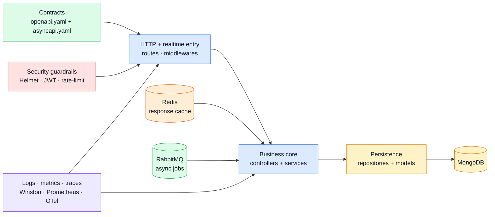

# Architecture

Use this page for the **big blocks and their boundaries**.
If you want the exact folder order, jump to [Layers](./layers.md).

::: warning This page describes one axis of two
The blocks below are **layers** — what a file does on the way from a request to the database. They
are real, but none of them is a directory. The repo is divided first by **domain**: thirteen module
folders, each containing all of these blocks top to bottom, and `src/controllers`, `src/services`
and `src/models` were deleted with the last domain that was migrated out of them. Read
[Modules](./modules.md) for the axis that actually decides where a file lives, and
[Layers](./layers.md) for how the two compose.
:::

## Architecture frame

```mermaid
%%{init: {'flowchart': {'nodeSpacing': 55, 'rankSpacing': 75}}}%%
flowchart LR
    Contract["Contracts\nopenapi.yaml + asyncapi.yaml"] --> Entry["HTTP + realtime entry\nroutes · middlewares"]
    Entry --> Core["Business core\ncontrollers + services"]
    Core --> Data["Persistence\nrepositories + models"]
    Data --> Storage[("MongoDB")]

    Security["Security guardrails\nHelmet · JWT · rate-limit"] --> Entry
    Cache[("Redis\nresponse cache")] --> Core
    Queue[("RabbitMQ\nasync jobs")] --> Core
    Observability["Logs · metrics · traces\nWinston · Prometheus · OTel"] --> Entry
    Observability --> Core

    classDef contract fill:#dcfce7,stroke:#16a34a,color:#111827;
    classDef app fill:#dbeafe,stroke:#2563eb,color:#111827;
    classDef data fill:#fef3c7,stroke:#d97706,color:#111827;
    classDef cache fill:#ffedd5,stroke:#ea580c,color:#111827;
    classDef queue fill:#dcfce7,stroke:#16a34a,color:#111827;
    classDef ops fill:#ede9fe,stroke:#7c3aed,color:#111827;
    classDef security fill:#fee2e2,stroke:#dc2626,color:#111827;

    class Contract contract;
    class Entry,Core app;
    class Data,Storage data;
    class Cache cache;
    class Queue queue;
    class Security security;
    class Observability ops;
```

## What each block owns

| Block               | Owns                                                                                                                                                                        | Avoids                  |
| ------------------- | --------------------------------------------------------------------------------------------------------------------------------------------------------------------------- | ----------------------- |
| Contract layer      | public request/event shapes and source-of-truth docs — see [OpenAPI Workflow](../api/openapi-workflow.md)                                                                   | hidden behavior drift   |
| Entry layer         | routes, middlewares, protocol glue, [auth](../tools/security.md) gates                                                                                                      | deep business decisions |
| Business core       | orchestration, validation ([Zod](../tools/runtime.md)), reusable rules                                                                                                      | Express or AMQP details |
| Persistence         | query shape, [schema mapping](../tools/mongodb-mongoose.md), storage access                                                                                                 | HTTP response logic     |
| Cross-cutting tools | [logs](../tools/winston.md), [traces](../tools/opentelemetry.md), [metrics](../tools/prometheus.md), [queues](../tools/rabbitmq.md), [cache](../tools/redis-cache.md) hooks | owning product rules    |

## Why this page exists next to Layers

- **Architecture** answers: “which major blocks talk to each other?”
- **Layers** answers: “which folder/file path do I open next?”

Keeping those separate reduces repetition and makes scanning faster.

## Why this matters in a boilerplate

A boilerplate should be easy to copy, swap piece by piece, test in isolation, and extend without turning one file into a giant blob.
That is why the repo favors **clear ownership lines** instead of controller-heavy code.
The [Layers](./layers.md) page maps each block to an exact folder.

## Design rules used here

- **SOLID**: each layer should have one main reason to change.
- **DRY**: shared logic belongs to whichever **domain owns it**, exported through that module's
  barrel — never to a shared `utils/`. Two modules needing a rule is not a reason to push it
  downward; see the `infrastructure` / `kernel` line in [Modules](./modules.md).
- **KISS**: keep flows boring and predictable.
- **Future proof**: prefer seams where a database or framework could be swapped later — and note
  that a seam does not have to be substrate-tier: `payments/providers/` is a port owned by the
  domain whose business it is.

## Related pages

- See [Layers](./layers.md) for the exact folder stack.
- See [Request Flow](./request-flow.md) for the live path of one endpoint.
- See [Runtime](../tools/runtime.md) and [MongoDB & Mongoose](../tools/mongodb-mongoose.md) for the libraries enabling this shape.
- See [OpenAPI Workflow](../api/openapi-workflow.md) for how the contract drives implementation.
