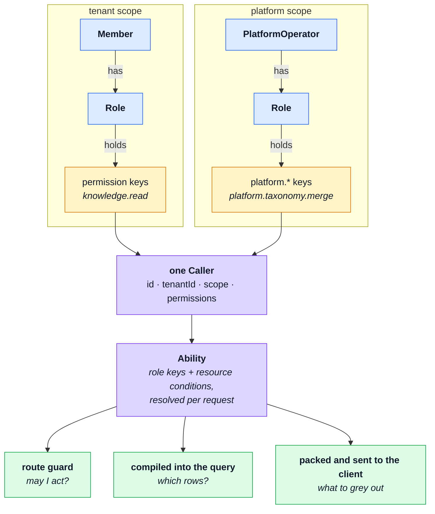

# Authorization

**Who may act, how strongly they proved it, and which rows they see.** Three separate questions.
Two of them are already answered in this repository; the third is a boolean that is about to stop
being enough.

[Web attack defences](./web-attack-defences.md) covers keeping the wrong person out.
This page is about what the right person is allowed to do once they are in.

## The three axes

Authorization is usually discussed as one axis. There are three, and confusing them is how systems
end up with forty roles.

| Axis                            | Answers                             | Where it lives today                                   |
| ------------------------------- | ----------------------------------- | ------------------------------------------------------ |
| **Who they are**                | may this caller act at all?         | `caller.admin` — one boolean                           |
| **How strongly they proved it** | did they prove it _recently_?       | `amr` on the token + the freshness guards              |
| **Which rows**                  | of the things they may read, which? | `kernel/authorization.ts` — the caller scope factories |

The middle axis is the one most applications never build. This one has it: `requireFreshAuth` and
the `amr` claim (RFC 8176) mean a high-risk action can demand a recently proved session rather than
merely a valid one. Nothing on this page changes it.

## The rule that everything else is arranged around

> The restriction has to ride **IN** the read.

Fetching a row and _then_ checking its owner is how a scoped find turns into a leak. It opens a
window between the check and whatever uses the document, and it lets _"not yours"_ and _"does not
exist"_ answer differently — which is a disclosure on its own, because a 403 confirms the row is
there.

So `createOwnerScope` and `createVisibilityScope` return a **query fragment**, not a verdict. Every
model of authorization this repository will ever adopt has to preserve that property, and most of
them cannot: anything that answers yes/no about an object already in memory is a downgrade.

The fail-closed detail is worth ten seconds. A caller with no id yields an empty string, which is
not a valid ObjectId, so the repository's scope builder throws. That is deliberate: the alternative
— omitting the owner clause — fails no test and quietly widens the query to every user's data. **A
bug here becomes a 500, never a disclosure.**

## Where this is going

`admin: boolean` fails on the first product that has more than one customer in one database. Two
callers can be admins of _different_ things, and one boolean cannot say which. The replacement is
**RBAC scoped by tenant, with conditions on the resource** — roles decide whether you may act,
conditions decide which rows, and the conditions compile into the query so the rule above survives.



Read it as one sentence: **a role is a bundle of keys, a caller is one scope's worth of keys, and
the ability those keys produce is used in three places that can never disagree — because there is
only one of it.**

The third arrow is the one people miss. The frontend gets the _same_ rules the server enforces, so
"what to grey out" stops being a hand-maintained duplicate that drifts. It still has no authority:
it decides what to render, never what is allowed, and every request is re-evaluated server-side.

### The key grammar, and the invariant it exists for

```
tenant scope     <subject>.<action>            knowledge.read · tasks.write · members.invite
platform scope   platform.<subject>.<action>   platform.taxonomy.merge
wildcards        <subject>.manage              any action on that subject
                 all.manage                    everything in this scope — never both scopes
```

**Tenant keys are bare; platform keys are always prefixed.** That asymmetry is the whole safety
property:

> A bare key can never be satisfied by a platform-scope caller, and a `platform.` key can never be
> satisfied by a tenant-scope caller.

A platform operator administers shared reference data and is **not** a super-member — they cannot
read one tenant's content. Mapping that person onto `caller.admin` is one line to write, passes
every test that exists today, and is a total confidentiality failure. The grammar makes it
unrepresentable rather than discouraged.

Three supporting rules: keys are lower-case, dotted and **stable** (renaming one is a migration); a
**module declares its own keys in its manifest**, so deleting a module deletes its keys; and
**roles are data, permissions are code** — a deployment may create roles at runtime and may never
invent a key, because a key nothing checks grants nothing while looking like it grants something.

## What is built

All of it. `admin: boolean` is gone; the model is stored, evaluated, compiled into every scoped
read, published to the client and enforced per key.

- **`shared/authorization-keys.yaml`** — every key, its subject, scope, conditions and step-up
  tier. **`-roles.yaml`** — the presets both seeders read. **`-conformance.yaml`** — 44 deny cases
  both backends run. All three byte-identical in the PHP twin.
- **`kernel/permissions.ts`** turns an account's two role names into the keys for ONE scope;
  **`kernel/ability.ts`** builds the CASL ability and answers `holdsKey`.
- **`kernel/access/`** stores it: tenants, roles and memberships, with the invariants as refusals —
  the last administrator cannot be removed, a granter cannot hand over what they do not hold, a
  deleted role's members go somewhere named.
- **`kernel/access/query.ts`** compiles the rules into the Mongo filter every scoped read spreads,
  so a key that grants more returns more without anybody editing a fragment.
- **`GET /account/abilities`** publishes the packed rules; the frontend evaluates _those_, not a
  copy of them.
- Route guards take a KEY. `users.delete` and `payments.update` carry `stepUp: critical`, and the
  guard demands the fresh session and audits that it did.

**Where the boilerplate stops short, on purpose.** It ships one shop, so no collection carries a
`tenantId` column and `accessibleFilter` drops that condition — the model is tenant-aware and its
conformance cases prove it, while these tables are not partitioned. A multi-tenant deployment adds
the column and empties one list; the rules, the guards and the caller already carry the tenant.

## The twins

The PHP backend answers all of this **identically** — same roles, same scopes, same key grammar,
same wire format — with different tools, because the idiomatic library on each side is different
and forcing one abstraction over both makes both worse.

| Same in both, on purpose                                                               | Allowed to differ                              |
| -------------------------------------------------------------------------------------- | ---------------------------------------------- |
| The vocabulary: `action`, `subject`, `conditions`, `fields`, `manage`, `all`, `Caller` | The library doing the evaluating               |
| The permission keys, and the preset roles seeded on day one                            | How rules become a query                       |
| The scope model: `tenant` \| `platform`, never both, never derived from a flag         | `guard_name`, which only the PHP package needs |
| The wire format of `GET /me/abilities`                                                 | Everything else about the implementation       |
| The conformance suite — one fixture file, identical bytes, run by both                 | —                                              |

Here that is `@casl/ability`, whose rules compile straight into a Mongo query and can be shipped to
the browser as the same rules. There it is `spatie/laravel-permission` registered with Laravel's
native `Gate`, with conditions in Policies and Eloquent scopes for the query half.

The suite is what keeps them honest, and it holds the **deny** cases rather than the happy path: a
widened scope does not fail a test that only checks the right thing is allowed.

`BE_ROLES_AND_PERMISSIONS_PLAN.md`, beside this repo in the workspace, has the work items, the <!-- doc-paths:ignore -->
rejected options and the abort point.
