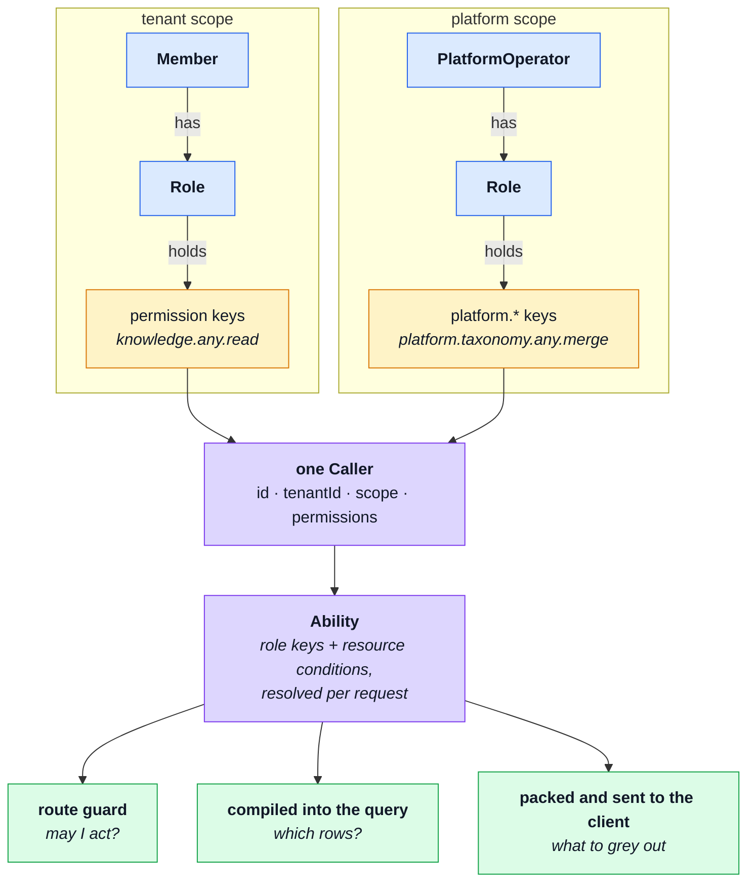
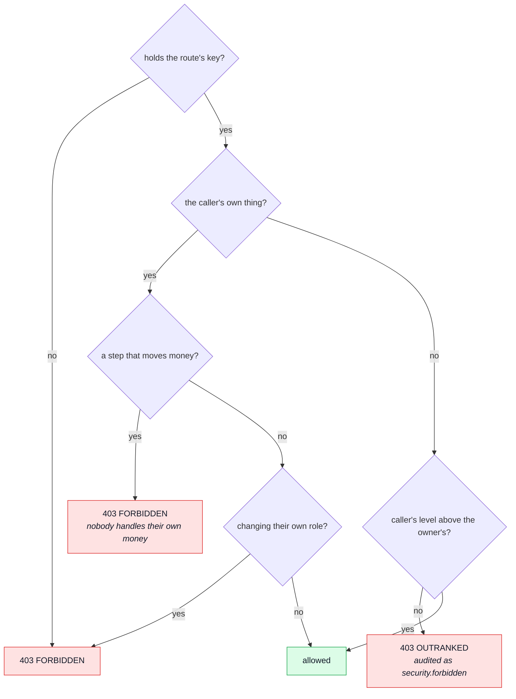

# Authorization

**Who may act, how strongly they proved it, and which rows they see.** Three separate questions,
answered by three separate things — and confusing them is how a system ends up with forty roles.

[Web attack defences](./defences/) covers keeping the wrong person out.
This page is about what the right person is allowed to do once they are in.

## The three axes

| Axis                            | Answers                             | Where it lives                                                      |
| ------------------------------- | ----------------------------------- | ------------------------------------------------------------------- |
| **Who they are**                | may this caller act at all?         | the keys their role holds — `holdsKey`, behind `requirePermission`  |
| **How strongly they proved it** | did they prove it _recently_?       | `amr` on the token + the freshness guards                           |
| **Which rows**                  | of the things they may read, which? | `kernel/access/query.ts` — the same rules, compiled into the filter |

The middle axis is the one most applications never build. This one has it: the `amr` claim
(RFC 8176) and a `stepUp` tier let a high-risk action demand a recently proved session rather than
merely a valid one. The tier is declared on the KEY, so a new route guarding that key inherits it
instead of having to remember it.

## The rule that everything else is arranged around

> The restriction has to ride **IN** the read.

Fetching a row and _then_ checking its owner is how a scoped find turns into a leak. It opens a
window between the check and whatever uses the document, and it lets _"not yours"_ and _"does not
exist"_ answer differently — which is a disclosure on its own, because a 403 confirms the row is
there.

So `accessibleFilter` returns a **query fragment**, not a verdict, and every scoped read spreads it
into its own find. That property is what picks the library: `@casl/ability` rules compile straight
into a Mongo query, and anything that answers yes/no about a document already in memory is a
downgrade.

The fail-closed detail is worth ten seconds. Rules that match nothing compile to CASL's
`EMPTY_RESULT_QUERY` — a filter matching no row — never to an absent filter, which every caller
downstream would read as "unrestricted". **A gap here returns an empty list, never somebody else's
data.**

## The model

**RBAC scoped by tenant, with conditions on the resource.** The role decides whether you may act,
the conditions its keys carry decide which rows, and those conditions compile into the query so the
rule above survives. One boolean cannot do that job: two callers can be administrators of
_different_ things, and `admin: true` cannot say which.


```mermaid
%%{init: {'flowchart': {'nodeSpacing': 40, 'rankSpacing': 50}}}%%
flowchart TD
    accTitle: How a caller becomes an authorization decision
    accDescr: A member holds a role in one tenant, or a platform operator holds a role with platform-prefixed keys. Either way the request resolves to a single caller, which resolves to one ability, which is used in three places - the route guard, the database query, and the rule set sent to the client.

    subgraph TENANT["tenant scope"]
        M["<b>Member</b>"] -->|has| RT["<b>Role</b>"]
        RT -->|holds| KT["permission keys<br/><i>knowledge.any.read</i>"]
    end
    subgraph PLATFORM["platform scope"]
        PO["<b>PlatformOperator</b>"] -->|has| RP["<b>Role</b>"]
        RP -->|holds| KP["platform.* keys<br/><i>platform.taxonomy.any.merge</i>"]
    end

    KT --> C["<b>one Caller</b><br/>id · tenantId · scope · permissions"]
    KP --> C
    C --> A["<b>Ability</b><br/><i>role keys + resource conditions,<br/>resolved per request</i>"]

    A --> G["<b>route guard</b><br/><i>may I act?</i>"]
    A --> Q["<b>compiled into the query</b><br/><i>which rows?</i>"]
    A --> W["<b>packed and sent to the client</b><br/><i>what to grey out</i>"]

    classDef actor fill:#dbeafe,stroke:#2563eb,color:#111827;
    classDef key fill:#fef3c7,stroke:#d97706,color:#111827;
    classDef core fill:#ddd6fe,stroke:#7c3aed,color:#111827;
    classDef use fill:#dcfce7,stroke:#16a34a,color:#111827;
    class M,PO,RT,RP actor;
    class KT,KP key;
    class C,A core;
    class G,Q,W use;
```

Read it as one sentence: **a role is a bundle of keys, a caller is one scope's worth of keys, and
the ability those keys produce is used in three places that can never disagree — because there is
only one of it.**

The third arrow is the one people miss. The frontend gets the _same_ rules the server enforces, so
"what to grey out" stops being a hand-maintained duplicate that drifts. It still has no authority:
it decides what to render, never what is allowed, and every request is re-evaluated server-side.

### The key grammar, and the invariant it exists for

```
tenant scope     <family>.<breadth>.<action>             knowledge.any.read · tasks.self.update
platform scope   platform.<family>.<breadth>.<action>    platform.taxonomy.any.merge
```

**Breadth is always written, never implied.** `orders.self.read` is the caller's own orders,
`orders.any.read` is everyone's, `products.any.create` has no owner to scope by and still says so.
A key you can grep for by shape beats a key you have to know the default of — the tradeoff is that
`any` is noise on most of the file, since most families have no owner to be `self` about in the
first place.

**There is no wildcard of any kind.** A per-family `manage` used to expand to "every action a
family declares", which made a wide read reachable only by also handing out delete — the fix this
model exists to demonstrate, on `orders`/`payments`: the support desk needed to read an order that
was never its own, and the only way to say that was `orders.manage`, which also grants deleting
it. Breadth on the key itself says "read everyone's, change nothing" directly, with no wildcard
involved. A SCOPE wildcard, `all.manage`, survived longer as `admin`'s one shortcut for "every
declared key in this scope" — it is gone too. `admin` now holds every declared tenant key **by
name**, spelled out in `shared/authorization-roles.yaml` exactly like every other role, so a key a
new route needs is a line added to that file, not an assumption the wildcard was already covering
it — see that file's own closing note for why.

**A family needs a concrete key for every action a route asks about.** `apikeys` once declared
only a read and a `manage`, so "holds every concrete key in the family" reduced to "holds the
read" — a read-only role satisfied a guard meant for a minter. The fix generalised: `manage` is
gone, so every action a route can gate on is its own declared key. One collapse remains, on
purpose: `holdsKey` (`kernel/ability.ts`) answers `can(action, subject)`, so `orders.self.read` and
`orders.any.read` are the same question to a guard. Use `heldKeys` to enumerate what a caller holds.

**Tenant keys are bare; platform keys are always prefixed.** That asymmetry is the whole safety
property:

> A bare key can never be satisfied by a platform-scope caller, and a `platform.` key can never be
> satisfied by a tenant-scope caller.

A platform operator administers shared reference data and is **not** a super-member — they cannot
read one tenant's content. Mapping that person onto a single `admin` flag is one line to write, passes
every test that exists today, and is a total confidentiality failure. The grammar makes it
unrepresentable rather than discouraged.

Three supporting rules: keys are lower-case, dotted and **stable** (renaming one is a migration); a
**module declares its own keys in its manifest**, so deleting a module deletes its keys; and
**roles are data, permissions are code** — a role's permissions live in `shared/authorization-roles.yaml`
alone, the one definition every deployment and the PHP twin share, and a deployment may never
invent a key, because a key nothing checks grants nothing while looking like it grants something.
A role's ASSIGNMENT — who holds it, where — is the one thing the database stores; see
[Where it lives](#where-it-lives).

## Acting on someone else's things

A key says _what kind_ of thing you may touch. It does not say _whose_. Without a second rule, a
support agent who holds `users.any.update` may edit the administrator's account, which is a
privilege escalation with extra steps. So every role has a **level**, and a write on another
person's thing must clear it.

| Level   | Roles                                                    | Why                                      |
| ------- | -------------------------------------------------------- | ---------------------------------------- |
| `admin` | `admin`, `operator`, `system`                            | runs the shop, or the installation       |
| `staff` | `manager`, `warehouse`, `support`, `editor`, `moderator` | works in the shop under an administrator |
| `user`  | `customer`, `unverified`, and a visitor                  | shops                                    |

> **R1.** After the route's key is held, a write on someone else's thing needs the owner to rank
> strictly **below** the caller. Otherwise the answer is `403 OUTRANKED`.

Four details carry the rule:

- **Your own things are exempt** from the comparison, so an administrator still edits their own
  account. Two exceptions: nobody changes their **own role** (promotion is somebody else's act),
  and nobody handles **their own money** ([below](#nobody-handles-their-own-money)).
- **Two roles count at the higher one**: an account that is a `support` agent and the platform
  `operator` is an `admin`-level owner.
- **An API key acts at its minter's level**, re-read on every request, so demoting the minter
  lowers the key with them.
- **No one outranks an administrator**, and an administrator does not outrank one. Switching an
  administrator off, or back on, is therefore not something the app does; it is a technician's
  edit of the database, by decision.


```mermaid
%%{init: {'flowchart': {'nodeSpacing': 40, 'rankSpacing': 45}}}%%
flowchart TD
    accTitle: How a write on someone else's thing is decided
    accDescr: The route first requires the key. A write on the caller's own thing is allowed, except changing their own role and the four steps that move money, which answer FORBIDDEN. Otherwise the owner's level is read from the database and compared with the caller's, and a caller who does not rank strictly above the owner is refused with OUTRANKED.

    K{"holds the route's key?"} -- no --> F403["403 FORBIDDEN"]
    K -- yes --> O{"the caller's own thing?"}
    O -- yes --> M{"a step that moves money?"}
    M -- yes --> OWN["403 FORBIDDEN<br/><i>nobody handles their own money</i>"]
    M -- no --> R{"changing their own role?"}
    R -- yes --> F403
    R -- no --> OK["allowed"]
    O -- no --> L{"caller's level above the owner's?"}
    L -- no --> OUT["403 OUTRANKED<br/><i>audited as security.forbidden</i>"]
    L -- yes --> OK

    classDef good fill:#dcfce7,stroke:#16a34a,color:#111827;
    classDef bad fill:#fee2e2,stroke:#dc2626,color:#111827;
    class OK good;
    class F403,OUT,OWN bad;
```

**Where it is applied.** `canActOn` and `outrankedRefusal` in `@modules/access` answer it; each
service that writes on a person's behalf asks before it changes anything — before it reads the
row where the owner is a known id, after the scoped read where the owner is on the row (`example`):

| Writes on  | Asked in                                                          |
| ---------- | ----------------------------------------------------------------- |
| a user     | `users`: edit, delete, restore                                    |
| an order   | `orders`: cancel, edit, delete, override; `delivery`: start, ship |
| a payment  | `payments`: record by hand, refund                                |
| a return   | `returns`: decide, receive                                        |
| an example | `example`: edit, replace, delete, cover — the pattern to copy     |

Revoking someone else's API key is **not** ranked: it only takes access away, so any administrator
may revoke a fellow administrator's leaked key (Stripe and GitHub work the same way). Banning a
compromised administrator stays the technician's edit of the database.

The owner of an order, payment or return is its buyer. The read side tells a client the same
thing: the `actions` block on a user, order, payment or return already has the rank applied, so a
screen renders only what would be accepted, and never counts levels itself.

**Credentials belong to their owner.** A password, a second factor and a sign-in email are never
written by anyone else, whatever their key or level: `POST /users` takes no password and always
mails a setup link, and there is no admin reset of a second factor. Switching an account off is
its own key (`users.any.ban`), because a role that edits a customer's phone should not by that
alone lock them out.

**Staff do not shop.** `cart.self.update` and `cart.self.checkout` are held by shoppers only,
and are flagged `shopperOnly` so that an administrator still counts as holding every _other_ key.
An order a staff member could place would be one only an administrator may handle, so the demo
shop's history has none.

Every door into a basket asks the shopper key: the cart routes, a reorder, a wishlist's move into
the cart (`cart.self.update`), and the three card steps, which ask it _before_ `cart.self.checkout`
so a staff caller gets a plain `403 FORBIDDEN` rather than the checkout key's "confirm your email".
An order's `actions.pay` is offered only to a caller who holds the checkout key.

## Nobody handles their own money

The rank rule frees a person's own things, so alone it would let a customer who is later promoted to
staff, or an administrator who raised an order for themselves, pay, refund and return that order
without a second pair of eyes. Separation of duties closes it: **the person an order belongs to is
never the one who moves its money.** The rule on top of R1 is `ownMoneyRefusal` in `@modules/access`,
asked through `orders` (`ownMoneyRefusalFor`) by:

| Step                      | Asked in                           |
| ------------------------- | ---------------------------------- |
| record a payment by hand  | `payments`: `recordOfflinePayment` |
| refund an order's payment | `payments`: `refundByOrder`        |
| approve a return          | `returns`: `approveReturn`         |
| receive a return's goods  | `returns`: `receiveReturn`         |

- **The answer is a plain `403 FORBIDDEN`** with its own message, audited as `security.forbidden` with
  `reason: own` (and no `ownerId`, since it is the caller). It is not `OUTRANKED`, whose contract text
  makes the caller's own thing the exception.
- **Declining a return stays R1 only**: refusing your own return gives nothing away.
- **`POST /orders` is ranked by `userId`** (R1 only): an administrator may raise an order for
  themselves, and the four steps then stop them paying, refunding or returning it alone.
- **`actions` follows.** `recordPayment`, a payment's `refund`, and a return's `approve` and
  `receive` are false on one's own order, so a client never offers what would be refused.
- **An administrator's own order is then handled by nobody**: no one outranks an administrator and
  they may not handle their own. Fixing one is the technician's edit of the database, by decision.

Standard: OWASP's
[Business Logic Security Cheat Sheet](https://cheatsheetseries.owasp.org/cheatsheets/Business_Logic_Security_Cheat_Sheet.html)
and the maker-checker (four-eyes) rule of payment practice.

## Where it lives

The model is stored, evaluated, compiled into every scoped read, published to the client and
enforced per key.

- **`shared/authorization-keys.yaml`** — every key, its subject, scope, conditions and step-up
  tier. **`-roles.yaml`** — the presets both seeders read. **`-conformance.yaml`** — dozens of
  cases, most of them denials, run by both backends. All three byte-identical in the PHP twin.
- **`kernel/permissions.ts`** turns an account's two role names into the keys for ONE scope;
  **`kernel/ability.ts`** builds the CASL ability and answers `holdsKey`.
- **`@modules/access`** stores the ASSIGNMENT half — tenants and memberships, never a role's own
  permissions — with the invariants as refusals: a granter cannot hand over what they do not
  hold, self-service signup can grant nothing but the default role. Removing a shop's last
  administrator is allowed. It also answers the rank rule (`canActOn`), reading an owner's level
  from their memberships. Routeless — `account`, `api-keys`, `users` and the modules that write
  on a buyer's behalf are its consumers.
- **`kernel/access/query.ts`** compiles the rules into the Mongo filter every scoped read spreads,
  so a key that grants more returns more without anybody editing a fragment.
- **`GET /account/abilities`** publishes the packed rules; the frontend evaluates _those_, not a
  copy of them.
- Route guards take a KEY. `users.any.delete` and `payments.any.update` carry `stepUp: critical`, and the
  guard demands the fresh session and audits that it did.

**Where the boilerplate stops short, on purpose.** It ships one shop, so most collections carry no
`tenantId` column and `accessibleFilter` drops that condition — the model is tenant-aware and its
conformance cases prove it, while these tables are not partitioned. See
[Tenancy](./tenancy.md) for why, and what a pooled deployment would actually have to change.

## The twins

The PHP backend answers all of this **identically** — same roles, same scopes, same key grammar,
same wire format — with different tools, because the idiomatic library on each side is different
and forcing one abstraction over both makes both worse.

| Same in both, on purpose                                                               | Allowed to differ                              |
| -------------------------------------------------------------------------------------- | ---------------------------------------------- |
| The vocabulary: `action`, `subject`, `conditions`, `fields`, `manage`, `all`, `Caller` | The library doing the evaluating               |
| The permission keys, and the preset roles seeded on day one                            | How rules become a query                       |
| The scope model: `tenant` \| `platform`, never both, never derived from a flag         | `guard_name`, which only the PHP package needs |
| The wire format of `GET /account/abilities`                                            | Everything else about the implementation       |
| The conformance suite — one fixture file, identical bytes, run by both                 | —                                              |

Here that is `@casl/ability`, whose rules compile straight into a Mongo query and can be shipped to
the browser as the same rules. There it is `spatie/laravel-permission` for the storage half only —
which roles exist and who holds them, in which shop — with the evaluation and the query fragment
hand-written over it, because a package that answers "does this name appear" cannot answer "in this
scope, on rows matching these conditions".

The suite is what keeps them honest, and it holds the **deny** cases rather than the happy path: a
widened scope does not fail a test that only checks the right thing is allowed.
