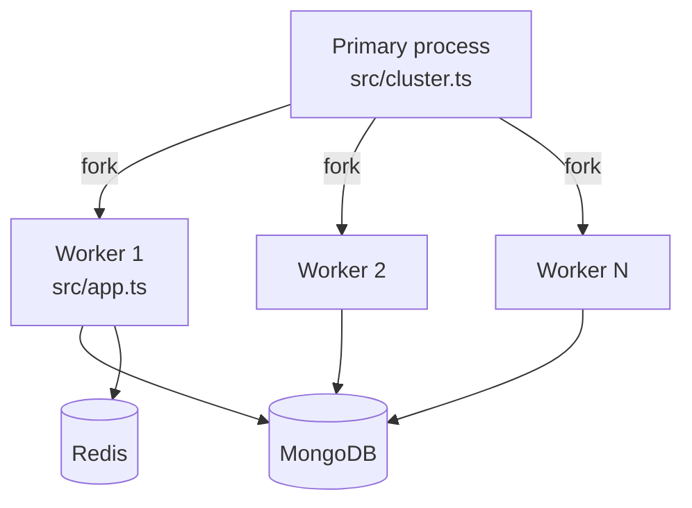
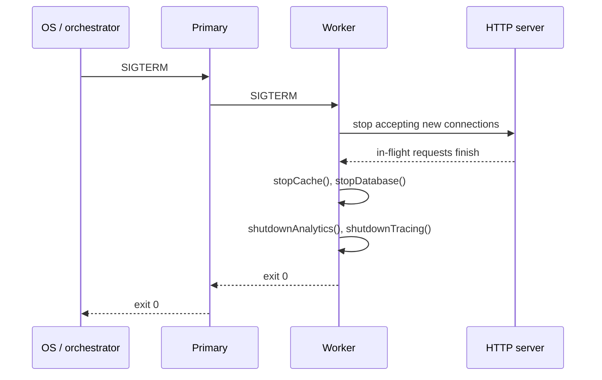

# Clustering & Graceful Shutdown

This page explains how the app boots, scales across CPU cores, and shuts down cleanly.
The relevant files are `src/cluster.ts` (process supervisor) and `src/app.ts` (HTTP app + lifecycle).

## Why a primary + workers

- One **primary** supervises the cluster: forks workers, watches exits, and coordinates shutdown.
- One **worker per CPU core** by default (`os.cpus().length`), each running the full Express app.
- Workers are independent processes; they do not share memory. State must live in Mongo or Redis.

## Configuration

| Env var                              | Effect                                                                          |
| ------------------------------------ | ------------------------------------------------------------------------------- |
| `NODE_ENABLE_CLUSTERING`             | `1` enables the primary/worker mode. Anything else loads `src/app.ts` directly. |
| `NODE_CLUSTER_WORKERS`               | Number of workers (default: CPU count, minimum 1).                              |
| `NODE_CLUSTER_CRASH_WINDOW_MS`       | Sliding window for counting crashes (default 60 000 ms).                        |
| `NODE_CLUSTER_CRASH_BACKOFF_BASE_MS` | Base delay before respawning after a crash (default 500 ms, doubled per crash). |
| `NODE_CLUSTER_CRASH_BACKOFF_MAX_MS`  | Maximum respawn delay (default 30 000 ms).                                      |
| `NODE_CLUSTER_SHUTDOWN_TIMEOUT_MS`   | Hard kill timeout during shutdown (default 15 000 ms).                          |
| `NODE_GRACEFUL_SHUTDOWN_TIMEOUT_MS`  | Worker-side hard exit timeout used by `src/app.ts`.                             |

## Crash backoff

When a worker exits unexpectedly the primary respawns it with **exponential backoff**, capped at `NODE_CLUSTER_CRASH_BACKOFF_MAX_MS`. This avoids tight crash loops when something is broken at startup (bad config, missing DB, …).

## Graceful shutdown

Each worker's shutdown sequence lives in `stopServer` (`src/app.ts`):

1. Close the HTTP server (no new connections; in-flight requests drain).
2. `stopCache()` — disconnect Redis if it was started.
3. `stopDatabase()` — disconnect Mongoose.
4. `shutdownAnalytics()` — flush PostHog if configured.
5. `shutdownTracing()` — flush remaining OTel spans to Tempo.

If shutdown takes longer than the timeout, the worker (or the primary) force-exits.

## Why this matters

- Workers are stateless: anything you store in memory dies on the next deploy or crash.
- Background timers must be cleared in `stopServer`/`stopCache`/etc., otherwise the process never exits.
- OTel must be initialised **before** any other import; that is why both `src/cluster.ts` and `src/app.ts` call `startTracing()` first.

## Useful links

- [Node.js `cluster` module](https://nodejs.org/api/cluster.html)
- [Node.js `process` events (`SIGTERM`, `SIGINT`)](https://nodejs.org/api/process.html#signal-events)
- [Graceful shutdown best practices (DigitalOcean)](https://www.digitalocean.com/community/tutorials/how-to-scale-node-js-applications-with-clustering)
- [The Twelve-Factor App — Disposability](https://12factor.net/disposability)

## Related pages

- [Architecture](./architecture.md)
- [Request Flow](./request-flow.md)
- [Runtime](../tools/runtime.md)
- [OpenTelemetry](../tools/opentelemetry.md)
