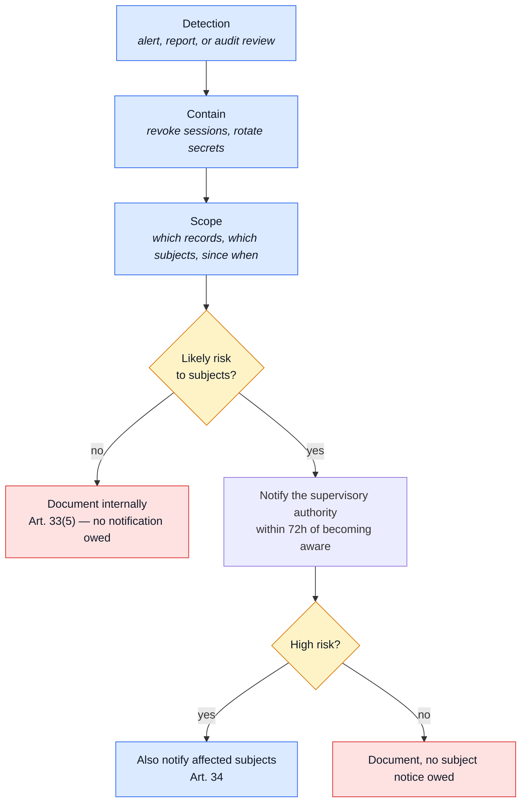

# Data Protection

GDPR binds a **controller** — whoever deploys this, decides why data is processed, and answers to
a supervisory authority — not a repository. So this page is not a compliance certificate; it is
the record a controller needs to have, assembled from what the code actually does. Every row below
is derived from a specific file, not aspirational.

Any deployment serving people in the EU/EEA is in scope from its first signup: this processes
email, username, phone, postal addresses with names and phone numbers, IP addresses, user-agents,
order history, and payment metadata.

## Processing register (Art. 30)

One row per collection that carries personal data.

| Collection         | Personal data                                                           | Purpose                                               | Lawful basis (Art. 6)                                                        | Retention                                                                                                                    | What erases or anonymises it                                                                                                                                  |
| ------------------ | ----------------------------------------------------------------------- | ----------------------------------------------------- | ---------------------------------------------------------------------------- | ---------------------------------------------------------------------------------------------------------------------------- | ------------------------------------------------------------------------------------------------------------------------------------------------------------- |
| `users`            | email, username, phone, website, profile image, `analyticsConsent`      | account identity and authentication                   | Contract (6.1.b)                                                             | until deletion, or `NODE_INACTIVE_ACCOUNT_DAYS` of no login (disabled by default)                                            | `DELETE /account` (self), admin `?hardDelete=true`, `npm run reap:inactive-accounts`                                                                          |
| `orders`           | email, `shippingAddress` (name, street, phone)                          | fulfilling and evidencing a sale                      | Contract (6.1.b); tax records (6.1.c)                                        | row kept indefinitely (invoice); `NODE_ORDER_PII_RETENTION_DAYS` after account erasure                                       | `userId` detached immediately on erasure; `npm run reap:orders` scrubs email/name/street once due                                                             |
| `payments`         | `userId`, truncated card (`cardLast4` only — no full PAN ever stored)   | payment record for the sale                           | Contract (6.1.b); legal obligation (6.1.c)                                   | tied to the owning order                                                                                                     | `userId` detached immediately on erasure, alongside the order                                                                                                 |
| `carts`            | `userId`, line items                                                    | resuming an in-progress session                       | Contract / legitimate interest (6.1.b/f)                                     | `NODE_CART_RETENTION_DAYS` (365d), TTL restarts on every edit                                                                | Mongo TTL index; cascades on account deletion                                                                                                                 |
| `wishlists`        | `userId`, line items                                                    | saved-items convenience                               | Legitimate interest (6.1.f)                                                  | kept until deleted                                                                                                           | cascades on account deletion                                                                                                                                  |
| `shipments`        | none directly — `orderId`, carrier tracking code, status                | fulfilment tracking                                   | Contract (6.1.b)                                                             | tied to the owning order                                                                                                     | reachable only through its order; nothing to scrub on its own                                                                                                 |
| `feedbackrequests` | name, email, message                                                    | responding to a contact/support request               | Legitimate interest (6.1.f) — often pre-account, so consent is not the basis | `NODE_FEEDBACK_RETENTION_DAYS` (730d)                                                                                        | Mongo TTL index. **Deliberately not cascaded** on account deletion — a ticket can predate the account that later claims the same email (`feedback/module.ts`) |
| `auditlogs`        | `actor_user_id`, `actor_role`, `ip`, `user_agent`, free-form `metadata` | security monitoring, accountability, breach forensics | Legal obligation / legitimate interest (6.1.c/f), integrity (5.1.f)          | `NODE_AUDIT_RETENTION_DAYS` (90d) for the queryable collection; Loki's own `retention_period` (7d locally) for the log lines | Mongo TTL index (collection); Loki retention (log lines); personal fields hashed at rest per `NODE_LOG_PERSONAL_FIELDS`                                       |
| analytics events   | `distinctId`, coarsened or full event properties depending on consent   | product usage patterns                                | Consent (6.1.a)                                                              | the provider's own retention (Umami/PostHog), outside this database                                                          | `analyticsConsent: false` stops capture; unset or pre-login traffic is coarsened, never identified                                                            |

Full mechanics for each retention window: [ops: Data retention](../reference/ops.md#data-retention).

## Sub-processor list

Every third party in the data path a controller signs a DPA with, or decides not to because it
stays inside their own infrastructure.

| Sub-processor                                  | Role                | Data it receives                                                               | DPA needed?                                                                                                                                                                                                |
| ---------------------------------------------- | ------------------- | ------------------------------------------------------------------------------ | ---------------------------------------------------------------------------------------------------------------------------------------------------------------------------------------------------------- |
| Analytics provider (`NODE_ANALYTICS_PROVIDER`) | Product analytics   | `distinctId`, event properties, coarsened per the consent gate below           | Self-hosted Umami (the default) stays inside the controller's own infra. Hosted PostHog is a genuine third party — its region (`NODE_POSTHOG_HOST`, EU vs. US) is a real decision, not a default to accept |
| SMTP provider (`NODE_SMTP_HOST`)               | Transactional email | recipient address, message content                                             | Yes                                                                                                                                                                                                        |
| Loki                                           | Log aggregation     | request metadata; personal fields already hashed by `NODE_LOG_PERSONAL_FIELDS` | Only if hosted externally — the shipped `docker-compose` stack runs it in the controller's own infra                                                                                                       |

No object storage sub-processor: uploaded images are written under `NODE_PUBLIC_PATH` on the app
server's own disk, not a third-party bucket. A deployment that adds one (S3, R2, …) adds a row
here.

## Subject-request runbook (Art. 15–21)

| Right                  | Article | Endpoint                                                                                    | Who may call it                       | What it does not cover                                                                                                                                                                                                                                         |
| ---------------------- | ------- | ------------------------------------------------------------------------------------------- | ------------------------------------- | -------------------------------------------------------------------------------------------------------------------------------------------------------------------------------------------------------------------------------------------------------------- |
| Access & portability   | 15, 20  | `POST /account/export`                                                                      | the subject only, fresh-auth guarded  | feedback tickets, opt-in via `NODE_EXPORT_INCLUDE_FEEDBACK` (a shared email is a guess, not a proven match)                                                                                                                                                    |
| Erasure                | 17      | `DELETE /account` (self, emailed confirmation) or admin `DELETE /users/:id?hardDelete=true` | the subject, or an admin              | `orders`/`payments` are anonymised on a delay (`NODE_ORDER_PII_RETENTION_DAYS`), not deleted — invoices are kept for tax law. A **soft** delete (`hardDelete` unset) is reversible and does **not** discharge an erasure request — only `hardDelete=true` does |
| Rectification          | 16      | `PUT /account`                                                                              | the subject only                      | —                                                                                                                                                                                                                                                              |
| Objection to profiling | 21      | `analyticsConsent: false` via `PUT /account`, or the `X-Analytics-Consent` header pre-login | the subject, or anonymous per-request | does not retroactively delete events already sent to the provider — that is the provider's own deletion tooling                                                                                                                                                |

## Breach runbook (Art. 33 — 72 hours)

**Scoping the incident** — the queries that establish who and what, both already indexed for
exactly this:

- `GET /observability/audit?actor_user_id=<id>` — everything one account did or had done to it.
- `GET /observability/audit?action=<action>` — every occurrence of one action across accounts, for
  the audit vocabulary each module owns (`account/audit.ts`, `users/audit.ts`, …). `auth.login`,
  `admin.user.erased` and `auth.data_export.completed` are usually the first three worth checking.
- The Winston log lines in Loki, same actor or time window, once the queryable collection's
  90-day window (`NODE_AUDIT_RETENTION_DAYS`) is not enough — Loki's own retention is longer or
  shorter depending on how the stack is configured, see [ops: Data retention](../reference/ops.md#data-retention).

The clock in Art. 33 starts at **becoming aware**, not at confirming scope — contain and notify in
parallel, don't wait for a complete picture.

## Deployer's checklist

Environment variables this plan introduces or depends on. **Bold** rows must be set to a real,
non-placeholder value before serving EU/EEA traffic; the rest ship safe defaults.

| Variable                             | Default        | What it governs                                                                                                              |
| ------------------------------------ | -------------- | ---------------------------------------------------------------------------------------------------------------------------- |
| **`NODE_TOKEN_ACCESS`**              | —              | Access-token signing secret. The app refuses to boot on the shipped placeholder                                              |
| **`NODE_TOKEN_REFRESH`**             | —              | Refresh-token signing secret. Same boot-time check                                                                           |
| `NODE_TOKEN_ROTATION_GRACE_MS`       | `10000`        | Refresh-token rotation grace window                                                                                          |
| `NODE_REAUTH_TIME_CRITICAL`          | `300`          | Step-up freshness window for money/destructive routes                                                                        |
| `NODE_REAUTH_TIME_SENSITIVE`         | `900`          | Step-up freshness window for identity/session/export routes                                                                  |
| `NODE_LOG_PERSONAL_FIELDS`           | `hash`         | How `email`/`ip`/`phone`/etc. are treated on the way into logs                                                               |
| `NODE_AUDIT_RETENTION_DAYS`          | `90`           | TTL for the queryable `auditlogs` collection                                                                                 |
| `NODE_FEEDBACK_RETENTION_DAYS`       | `730`          | TTL for `feedbackrequests`                                                                                                   |
| `NODE_CART_RETENTION_DAYS`           | `365`          | TTL for abandoned carts                                                                                                      |
| `NODE_INACTIVE_ACCOUNT_DAYS`         | `0` (disabled) | Warn → soft-delete → hard-delete an account with no login                                                                    |
| `NODE_ORDER_PII_RETENTION_DAYS`      | `3650`         | Delay before an anonymised order's remaining PII is scrubbed                                                                 |
| `NODE_EXPORT_INCLUDE_FEEDBACK`       | `false`        | Whether `POST /account/export` guesses at feedback tickets by email                                                          |
| **`NODE_ANALYTICS_REQUIRE_CONSENT`** | `true`         | Whether analytics capture is gated on `analyticsConsent`. Turning this off is a decision to document, not a default to relax |

## What this page is not

- Not legal advice. It states what the code does; whether that satisfies a specific controller's
  obligations is a question for that controller's own counsel.
- Not complete forever. A new collection that stores personal data, or a new sub-processor, earns
  a row here in the same commit that adds it — the same habit [the file glossary](../reference/index.md#keeping-this-page-true) asks for.
