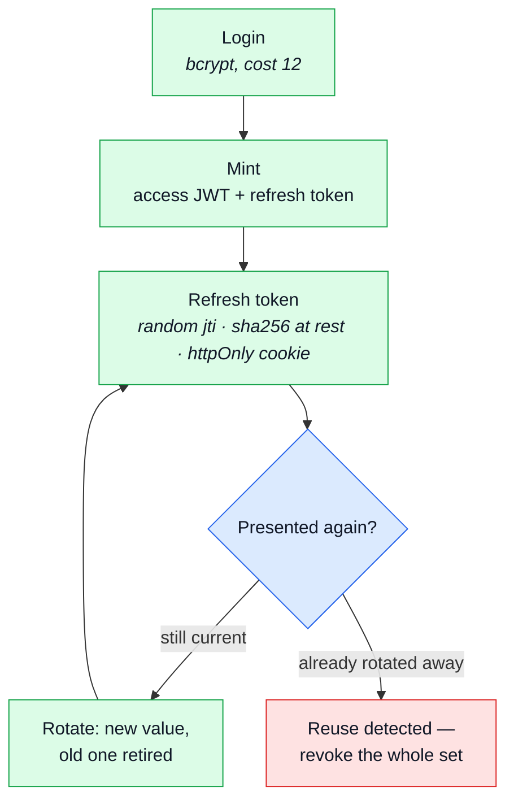

# Authentication

Proving who you are. Mostly flaws — missing controls — and the attacks are the ways credentials
and sessions get taken. This is the largest family in the catalog and the one this codebase has
spent the most on, so it is grouped by **what the attacker is after**: the credential, the
session, the recovery path, or the second factor.

## How a session is held, and why that shape

The access token is stateless and short-lived; the refresh token is **stored**, so it can be
revoked. That single asymmetry is what closes most of the JWT rows below.

## Guessing the credential

| Attack                           | How it works                                                          | This boilerplate                                                                                                                                                                                                                                                            |
| -------------------------------- | --------------------------------------------------------------------- | --------------------------------------------------------------------------------------------------------------------------------------------------------------------------------------------------------------------------------------------------------------------------- |
| Brute force                      | no lockout, no rate limit, no MFA                                     | `credentialLimiters` — two independent budgets, per account and per address, spent only by FAILURES, so an honest user never pays — `infrastructure/http/middlewares/rate-limit.ts#credentialLimiters`                                                                      |
| Credential stuffing              | leaked pairs replayed at scale                                        | The same budgets, plus `loginChallengeGate`: once the identity budget is half spent, login demands a human challenge — see [Automation and abuse](automation-and-abuse.md#the-ladder)                                                                                       |
| Password spraying                | one common password across many accounts, evading per-account lockout | The per-ADDRESS budget is the one that bites here, since a spray is many accounts from few sources. The block-keyed rung above it is the real answer — see [the ladder](automation-and-abuse.md#the-ladder)                                                                 |
| Default / hard-coded credentials | `admin/admin`, demo users, credentials in the repo                    | The seed interlock refuses production outright, and refuses everywhere else too when any seed account is still logging in with its committed, public fallback password — `scenarios/apply.ts`, `kernel/seed-accounts.ts`                                                    |
| Weak password policy             | short, common or breached passwords accepted                          | `PasswordNew` in the contract: minimum 8, and a lowercase letter, an uppercase letter, a digit and a symbol, enforced server-side by the generated schema — `shared/contracts/openapi.root.yaml#PasswordNew`. A breached-password check (HIBP range API) is 🚧 coming soon. |
| Account lockout as DoS           | the attacker locks victims out by guessing at their username          | There is no lockout to trigger — the budgets throttle, they do not disable. That is the deliberate trade: a throttled account still logs in a minute later.                                                                                                                 |

## Knowing an account exists

| Attack                      | How it works                                                        | This boilerplate                                                                                                                                                                                                                            |
| --------------------------- | ------------------------------------------------------------------- | ------------------------------------------------------------------------------------------------------------------------------------------------------------------------------------------------------------------------------------------- |
| User / account enumeration  | different messages, status codes or timing on login, signup, reset  | One answer shape for "no such email" and "wrong password", and the reset endpoint answers the same whether or not the address exists.                                                                                                       |
| Timing attack on comparison | a non-constant-time compare leaks a secret byte by byte             | A login miss compares against a dummy bcrypt hash computed once at import, so an unknown email costs the same as a wrong password — `account/services/authentication.ts#DUMMY_PASSWORD_HASH`                                                |
| Credential leakage          | passwords or tokens in URLs, logs, error pages, analytics, referrer | Password hashes, live tokens and (configurably) personal fields are redacted or hashed before a log line is written — `infrastructure/adapters/logger.ts#SENSITIVE_FIELDS`. See [Information disclosure](disclosure.md#logs-and-telemetry). |

## Taking the session

| Attack                          | How it works                                                         | This boilerplate                                                                                                                                                                                                                                                  |
| ------------------------------- | -------------------------------------------------------------------- | ----------------------------------------------------------------------------------------------------------------------------------------------------------------------------------------------------------------------------------------------------------------- |
| Session fixation                | an id accepted from the URL or a cookie and not rotated at login     | No session id is ever accepted from the caller. A session exists only as a token this server minted.                                                                                                                                                              |
| Session hijacking / sidejacking | XSS, network sniffing, log exposure, malware                         | Rotating the refresh token's value on every exchange makes a stolen cookie DETECTABLE on its next presentation rather than silently reusable for the rest of its life — `account/session/jwt.ts#rotateRefreshToken`                                               |
| Predictable session tokens      | sequential, timestamp-based or weak-PRNG identifiers                 | A random `jti` per mint, from `node:crypto`, so two logins in the same second cannot collide into one revocable session — `account/session/jwt.ts#createRefreshToken`                                                                                             |
| Insufficient session expiry     | no idle timeout, no absolute timeout, no server-side revocation      | A deactivated or soft-deleted account stops authenticating on its very NEXT request, not at its next login — `users/repository.ts#findAuthenticatableById`, `account/module.ts#resolve`                                                                           |
| Missing invalidation            | logout, password change or role change do not revoke existing tokens | Password change, deactivation and soft-delete each revoke every refresh token — `account/services/authentication.ts`, `users/service.ts#update`                                                                                                                   |
| Cookie flag omissions           | missing `HttpOnly`, `Secure`, `SameSite`; over-broad `Domain`/`Path` | The refresh cookie (`jwt`) is `httpOnly`, `sameSite: 'lax'`, and `secure` in production. The `isAuth` UI hint set alongside it is deliberately none of those — it carries no credential — `account/session/cookies.ts#createRefreshCookie`, `#createLoggedCookie` |
| Cookie tossing                  | an attacker-controlled subdomain sets a cookie the parent trusts     | The refresh cookie is verified by SIGNATURE and by presence on the user document, so a tossed value is not merely wrong, it is unknown — `account/session/jwt.ts#verifyRefreshToken`                                                                              |
| Insecure "keep me logged in"    | `isLoggedIn=true` or a role in a cookie, trusted by the server       | `isAuth` is read by the frontend to decide what to render and by nothing on this server. Authorization reads the verified token, never a cookie flag.                                                                                                             |
| Remember-me token flaws         | predictable, non-rotating, not revoked                               | The "remember me" tiers set the refresh cookie's own LIFETIME only. They do not exempt a sensitive action from the freshness check — a long-lived session still has to step up — `account/session/config.ts#RefreshTokenExpiryTime`                               |

## JWT specifically

| Attack                          | How it works                                                | This boilerplate                                                                                                                                                                                                                                           |
| ------------------------------- | ----------------------------------------------------------- | ---------------------------------------------------------------------------------------------------------------------------------------------------------------------------------------------------------------------------------------------------------- |
| `alg: none`                     | the library accepts an unsigned token                       | `{ algorithms: ['HS256'] }` pinned on every verify — `account/session/jwt.ts`                                                                                                                                                                              |
| Key confusion                   | an RS256 public key used as an HMAC secret                  | Same pin. One algorithm is accepted, and it is symmetric, so there is no public key to confuse with a secret.                                                                                                                                              |
| Weak secret                     | a short or dictionary HMAC key brute-forced offline         | The app refuses to start if `NODE_TOKEN_ACCESS` / `NODE_TOKEN_REFRESH` are unset, too short, or still the shipped placeholder — `kernel/required-config.ts`                                                                                                |
| `kid` / `jku` / `x5u` injection | the verifier fetches attacker-controlled key material       | No surface: the secret is read from config, never from the token's own header.                                                                                                                                                                             |
| Missing claims validation       | `exp`, `aud`, `iss`, `nbf` not checked                      | `jsonwebtoken` verifies `exp` by default; `auth_time` and `amr` are carried claims read by the freshness guard.                                                                                                                                            |
| No revocation                   | a stolen stateless token stays valid until it expires       | Refresh tokens are checked against the live, stored set on every use, not merely signature-verified — `account/session/jwt.ts#verifyRefreshToken`, `users/repository.ts`. The access token is short-lived by design; revocation lands on the refresh side. |
| Refresh-token misuse — reuse    | stored accessibly, not rotated, family not revoked on reuse | A refresh token replayed after it was rotated away revokes the account's ENTIRE refresh set — `account/session/jwt.ts#rotateRefreshToken`, `TokenReuseError`                                                                                               |
| Cross-purpose key use           | one key for access and refresh, signing and encryption      | Three separate secrets: `NODE_TOKEN_ACCESS`, `NODE_TOKEN_REFRESH`, `NODE_TOTP_ENCRYPTION_KEY`, each required at boot.                                                                                                                                      |

## Recovery, and changing the credential

| Attack                               | How it works                                                     | This boilerplate                                                                                                                                                         |
| ------------------------------------ | ---------------------------------------------------------------- | ------------------------------------------------------------------------------------------------------------------------------------------------------------------------ |
| Password-reset poisoning             | the link is built from `Host` / `X-Forwarded-Host`               | Every link is `NODE_URL` plus a route and a token; no header is read — `account/emails.ts`. Same answer as [Host header injection](injection.md#into-a-path-or-a-model). |
| Weak reset tokens                    | short, predictable, non-expiring, not single-use                 | 16 random bytes from `node:crypto`, stored as a sha256 digest, time-boxed, and SPENT on use — `users/model.ts#tokenAdd`, `account/services/tokens.ts#spendLiveToken`     |
| Reset via security questions         | knowledge-based recovery with guessable answers                  | No surface: there are no security questions.                                                                                                                             |
| Email-change without re-verification | the address is swapped without confirming old and new            | Changing the email demands proof of a RECENT session, not merely a valid one — `kernel/middlewares/authorizations.ts#requireFreshAuth`, mounted in `account/routes.ts`   |
| Magic-link flaws                     | reusable, long-lived, leaked through referrer, no device binding | No surface: there is no magic-link login. The same single-use token mechanism backs reset and the 2FA challenge instead.                                                 |

### Step-up authentication

The freshness guard is the reason several rows above are one line. Changing the email, deleting
the account, managing sessions, checking out and confirming a payment all demand a session that
proved itself RECENTLY.

`auth_time` and `amr` are carried claims, never derived from the clock — so a token minted before
step-up existed reads as infinitely old and is asked to re-prove itself, rather than sliding
through a guard that was not there when it was issued.

Mounted per-route in `account/routes.ts`, `cart/routes.ts` and `payments/routes.ts`; enumerated by
`tests/cross-cutting/step-up-auth-routes.test.ts` so a new sensitive route cannot quietly skip it.

## The second factor

| Attack                                | How it works                                            | This boilerplate                                                                                                                                                                                                                                                             |
| ------------------------------------- | ------------------------------------------------------- | ---------------------------------------------------------------------------------------------------------------------------------------------------------------------------------------------------------------------------------------------------------------------------- |
| OTP / 2FA bypass — attempt cap        | no rate limit on code guesses                           | A dedicated limiter bounds guesses against ONE still-live login challenge, independent of the account and address budgets — `infrastructure/http/middlewares/rate-limit.ts#mfaChallengeLimiter`                                                                              |
| OTP / 2FA bypass — response tampering | rewriting a client-visible `{"ok":false}` into `true`   | The challenge is server-verified end to end; there is no intermediate answer a caller could rewrite — `account/services/two-factor.ts#verifyLoginChallenge`                                                                                                                  |
| OTP / 2FA bypass — replay             | the same code accepted twice                            | The RFC 6238 time step of the last accepted code is tracked per account, so an identical code cannot verify twice; a delivered code is deleted the moment it is spent — `account/two-factor/totp.ts#verifyTotpCode`                                                          |
| OTP / 2FA bypass — step skipping      | calling the post-2FA step directly                      | The login challenge is not a JWT at all — it is a single-use, revocable, hashed-at-rest token, so it fails ordinary token verification outright, and a right code SPENDS it before a session is minted — proven by the bypass test in `tests/integration/two-factor.test.ts` |
| Secrets at rest in plaintext          | a database dump hands over every device secret          | A device secret is AES-256-GCM encrypted under a versioned key; a delivered code is an HMAC under the same key, since six digits fall to a bare digest; backup codes are hashed like refresh tokens — `account/two-factor/`                                                  |
| MFA fatigue / push bombing            | repeated push prompts until one is approved             | Out of reach by construction: there is no push factor to bomb.                                                                                                                                                                                                               |
| SIM swap                              | the carrier is social-engineered into moving the number | Out of reach by construction: there is no SMS factor. Email and SMS codes mostly re-verify a channel an attacker may already hold — the mailbox especially, since it is already the reset path.                                                                              |

**What 2FA newly exposes.** A defence that lists only what it stops is marketing. Adding TOTP
makes "OTP / 2FA bypass" a real row against this codebase in the way it is against any TOTP
implementation — the attempt cap and the replay tracking above are what keep it closed, not what
makes it not apply. WebAuthn / passkeys is the acknowledged next step, and the reason `amr` is
carried as an ARRAY rather than a boolean: a future `amr: ['hwk']` is a new value, not a new guard.

## Federated login

| Attack                              | How it works                                                        | This boilerplate                                                                                                                                                                                                     |
| ----------------------------------- | ------------------------------------------------------------------- | -------------------------------------------------------------------------------------------------------------------------------------------------------------------------------------------------------------------- |
| OAuth — missing `state`             | the attacker's code delivered to the victim's callback (login CSRF) | A double-submit `state` cookie, minted and set in the same response that hands it to the provider; the callback rejects a mismatch with 400 — `account/oauth/state.ts`, `account/controllers/get-oauth-callback.ts`  |
| OAuth — `redirect_uri` manipulation | loose matching, an open redirect on an allowed domain, traversal    | The redirect URI and the post-login frontend URL are both derived from server config (`NODE_URL`, `NODE_FRONTEND_URL`), never from the request or the provider's answer — `account/oauth/config.ts#oauthRedirectUri` |
| OAuth — implicit flow token leakage | an access token in the URL fragment leaks via referrer and history  | No surface: the authorization-code flow is the only one implemented.                                                                                                                                                 |
| OAuth — missing PKCE                | an intercepted authorization code is redeemable                     | 🚧 Coming soon. The flow is server-side with a client secret, which is what PKCE substitutes for in a public client — but it is still worth adding.                                                                  |
| OAuth — scope / consent abuse       | scope upgrade, or consent phishing with a look-alike app            | This application is the OAuth CLIENT, never the provider, so there is no consent screen here to phish. The requested scopes are fixed in `account/oauth/providers/`.                                                 |
| OAuth — account linking confusion   | an unverified email from the provider trusted for matching          | A provider identity is linked to an existing email only once the provider reports that address as VERIFIED; an unverified match is rejected rather than linked — `account/services/oauth.ts#loginOrCreateFromOAuth`  |
| SAML — signature wrapping           | an assertion altered yet still "valid"                              | No surface: no SAML.                                                                                                                                                                                                 |
| SSO misconfiguration                | issuer or audience not pinned, so any tenant's users are accepted   | Each provider's token and profile endpoints are hard-coded — `account/oauth/providers/`. See [SSRF](ssrf.md#making-the-server-fetch).                                                                                |
| Pre-account-takeover                | the attacker registers the victim's address before they do          | 🚧 Coming soon — nothing enforces `verified` on the ordinary signup path today.                                                                                                                                      |

## Related

- [Authorization](authorization.md) — what a proven identity is then allowed to do
- [Crypto and secrets](crypto-and-secrets.md) — the hashing and randomness these controls rest on
- [Email](email.md) — the channel every recovery flow runs through
- [Automation and abuse](automation-and-abuse.md) — the limits that bound guessing
