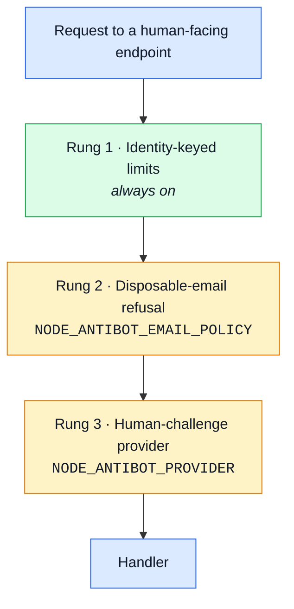

# Automation and abuse

Legitimate features at machine scale. Nothing is broken: signup works, the contact form works, the
catalogue is public because it is meant to be. The flaw is that a feature designed for one person
doing it once is available to one script doing it a million times.

This family has no "fix" in the sense the other pages use the word. Every control is a **cost**
imposed on the attacker, and the honest question is only ever "how much, and what does it cost
everyone else?"

## Accounts and content at scale

| Attack                           | How it works                                                                      | This boilerplate                                                                                                                                                                                                                                                                                                                              |
| -------------------------------- | --------------------------------------------------------------------------------- | --------------------------------------------------------------------------------------------------------------------------------------------------------------------------------------------------------------------------------------------------------------------------------------------------------------------------------------------- |
| Spam via forms                   | contact or invite features relay attacker text                                    | A honeypot field (`website`) the contract declares and nothing persists: a non-empty value writes the row as `spam` and skips the notification — and the bot still gets its 201, so it learns nothing. The frontend builds the field itself, `aria-hidden` and `tabindex="-1"`, invisible to a sighted visitor — `feedback/service.ts#create` |
| Fake account creation            | signup without friction; disposable emails                                        | `credentialLimiters` on signup — a per-address and a per-identity budget — `account/routes.ts`. Disposable-address refusal is rung 2 of the ladder below.                                                                                                                                                                                     |
| Scraping                         | no bot management; the public API mirrored                                        | Every listing is paginated and capped at 100 rows per page, with `page` capped too, so there is no ONE call that returns the catalogue — `infrastructure/http/schemas.ts`                                                                                                                                                                     |
| API scraping via mobile app keys | a key extracted from a mobile bundle is reused to mirror the API at machine speed | No surface: there is no mobile client and no shipped API key to extract — every caller authenticates as a user. See [API key leakage](api-surface.md#bulk-access-and-quotas).                                                                                                                                                                 |
| Credential stuffing              | leaked pairs replayed at scale                                                    | See [Guessing the credential](authentication.md#guessing-the-credential), plus the conditional challenge described below.                                                                                                                                                                                                                     |
| CAPTCHA bypass                   | solver farms, ML solvers, replayed tokens                                         | Assumed, not denied: rung 3 below buys an attacker's TIME and MONEY, not immunity. A challenge that claims to stop solver farms is selling something.                                                                                                                                                                                         |
| Review / vote manipulation       | no proof of purchase, no velocity checks                                          | No surface: there are no ratings, reviews or votes.                                                                                                                                                                                                                                                                                           |
| Click / ad fraud                 | fake impressions and clicks                                                       | No surface: nothing here is monetised by impressions.                                                                                                                                                                                                                                                                                         |
| SMS pumping                      | toll fraud through an SMS endpoint                                                | No surface: no SMS factor exists — see [The second factor](authentication.md#the-second-factor).                                                                                                                                                                                                                                              |
| Scalping / inventory hoarding    | stock reserved and never bought                                                   | See [Abuse of a legitimate feature](business-logic.md#abuse-of-a-legitimate-feature) — reservations expire.                                                                                                                                                                                                                                   |

## Why the table above is weaker than it looks

Every limit in it is keyed on an **IP address**, and that is the section's weakness rather than a
detail of it. Residential proxy pools cost about $20 for millions of addresses, and one IPv6
customer is handed 18 quintillion of them. So these bound one person on one connection, and bound
almost nothing about someone who is actually trying.

Saying so is the point. A rate limit that is presented as anti-automation, and is really
anti-accident, is worse than none — it is a control someone will trust.

## The ladder

Closing that gap is not one control but a ladder: each rung independent, off by default, switched
on by one environment variable, so a deployment climbs only as far as its abuse actually justifies.
Rung 1 is always on; the other two are off until a deployment says otherwise.

| Rung                         | What it costs an attacker                                                                                                                          | Why it isn't on by default                                                                                                                         |
| ---------------------------- | -------------------------------------------------------------------------------------------------------------------------------------------------- | -------------------------------------------------------------------------------------------------------------------------------------------------- |
| 1 — identity-keyed limits    | keying signup, contact and reset on the SUBMITTED address, not only the caller's, plus a per-block budget (a /64, a /24) above the per-address one | it isn't off — no switch, no dependency, this is what the limits should already do                                                                 |
| 2 — refuse disposable email  | a blocklist, optionally backed by an MX check, on signup                                                                                           | a blocklist is upkeep, and an aggressive one refuses real people using forwarding services                                                         |
| 3 — human-challenge provider | an actual solve, though solver farms exist to pass it                                                                                              | a third-party script in the pages, a data-protection question, an accessibility cost — a deployment's decision, not a boilerplate's to make for it |

Rung 3 follows the same port shape as `PaymentProvider` (`payments/providers/index.ts`): a `none`
no-op ships in the box and always passes — what every test and the demo run through — a real
vendor is a name away behind `NODE_ANTIBOT_PROVIDER`, and its public parameters (site key and so
on) are read from `GET /antibot/config` so the frontend knows whether to render a challenge at all.
Turnstile ships as the worked example; a deployment that wants no third party at all plugs a
self-hosted proof-of-work implementation into the same registry — see
[antibot](../../modules/antibot.md#choosing-a-provider).

## Login's conditional challenge

Login carries a **conditional** form of rung 3 rather than the unconditional one signup, reset and
contact use: `loginChallengeGate` delegates to `humanChallengeGate` only once `credentialLimiters`'
identity budget is at least half spent.

So an honest first try never sees a challenge, and a credential-stuffing run meets one before it
exhausts the budget rung 1 already bounds. That is the whole design goal of this family stated in
one rule: **put the cost on the behaviour, not on the person.**

## Related

- [Authentication](authentication.md#guessing-the-credential) — the budgets rung 1 extends
- [Denial of service](denial-of-service.md) — the availability side of the same limits
- [Business logic](business-logic.md#abuse-of-a-legitimate-feature) — abuse that needs no automation
- [antibot](../../modules/antibot.md) — the module, and how to choose a provider
