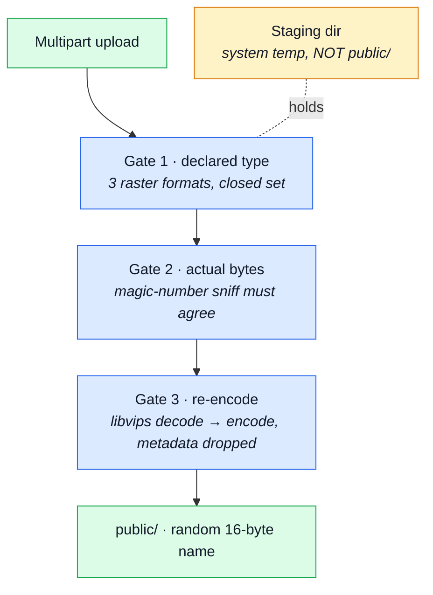
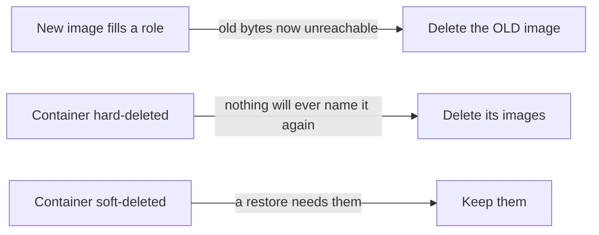

# Files, uploads and paths

Reading or writing where you should not. Two directions, and they fail differently: **reading**
(traversal, inclusion, source exposure) is about a path built from input; **writing** (uploads) is
about bytes you accepted and then serve back from your own origin.

## The upload pipeline

Three gates in a fixed order, composed in one place so a route cannot mount half of it.

Nothing is world-reachable between "multer wrote it" and "the checks passed": staging lives under
`NODE_UPLOAD_STAGING_PATH` (system temp by default), never under `public/`.

## What gets stored

| Attack                             | How it works                                                        | This boilerplate                                                                                                                                                                                                                                          |
| ---------------------------------- | ------------------------------------------------------------------- | --------------------------------------------------------------------------------------------------------------------------------------------------------------------------------------------------------------------------------------------------------- |
| Unrestricted file upload           | no type, size or name checks; a web shell, HTML, or SVG with script | Three raster formats only, and the pipeline is composed by `wrapUpload` rather than assembled per route — `infrastructure/adapters/storage.ts#upload`                                                                                                     |
| Content-type / extension confusion | `shell.php.jpg`, `.phtml`, `.htaccess`, polyglot files              | The declared MIME decides the stored extension; the BYTES are then read and must identify as that same type, so `shell.php.jpg` and a PNG stored as `.jpg` both fail — `infrastructure/adapters/image-signatures.ts`, `storage.ts#validateUploadedImages` |
| Filename injection                 | traversal or shell metacharacters in the original filename          | The client's `originalname` is discarded whole: the stored name is 16 random bytes of hex plus an extension from the closed set — `storage.ts#resolveUploadFilename`                                                                                      |
| Insecure temp files                | predictable temp names; a race to replace the file before use       | Uploads stage under `NODE_UPLOAD_STAGING_PATH`, not under `public/`, and the name is already random at that point — `storage.ts#uploadStagingPath`                                                                                                        |

## Where it gets stored, and where it is read from

| Attack                      | How it works                                                       | This boilerplate                                                                                                                                                                                                                    |
| --------------------------- | ------------------------------------------------------------------ | ----------------------------------------------------------------------------------------------------------------------------------------------------------------------------------------------------------------------------------- |
| Path traversal              | `../../etc/passwd`, encoded variants, null bytes                   | No path is ever built from request input. `toPosixPath` is the one normalisation, and it is safe only because the names it sees are random hex — which is stated where it is written — `infrastructure/http/uploads.ts#toPosixPath` |
| Local file inclusion (LFI)  | `?page=../../log` in an `include`-style loader                     | No surface: no include-style loader.                                                                                                                                                                                                |
| Remote file inclusion (RFI) | `?page=http://evil/shell`                                          | No surface, same reason — and no outbound fetch takes a caller-supplied URL, see [SSRF](ssrf.md).                                                                                                                                   |
| Zip slip                    | `../` inside an archive entry name                                 | No surface: nothing extracts an archive.                                                                                                                                                                                            |
| Symlink / hardlink tricks   | an attacker-controlled path on shared storage resolved to a target | No surface: nothing follows a client-named path.                                                                                                                                                                                    |
| Insecure direct file access | uploads served by a guessable path                                 | Same answer as [Insecure direct file access](authorization.md#object-level-whose-row-is-it) — 128 bits of randomness in the name.                                                                                                   |

## What the bytes do once accepted

An image is not data; it is a program for a decoder. Every row here is about the decoder.

| Attack                    | How it works                                                          | This boilerplate                                                                                                                                                                                                                                        |
| ------------------------- | --------------------------------------------------------------------- | ------------------------------------------------------------------------------------------------------------------------------------------------------------------------------------------------------------------------------------------------------- |
| Decompression bomb        | a tiny archive or a pixel flood expands to fill disk or RAM           | `limitInputPixels` caps the DECODED pixel count at 50 M before any resize runs, which the 5 MB byte ceiling on its own does not — `infrastructure/adapters/image.ts`                                                                                    |
| XML bomb (billion laughs) | recursive entity definitions exhaust memory                           | No surface: nothing parses XML — see [XXE](injection.md#into-a-protocol-or-a-document).                                                                                                                                                                 |
| Image-processing exploits | ImageMagick / libpng / libjpeg CVEs; SVG with script or external refs | Every accepted image is decoded and re-encoded through libvips into the same format, so a payload smuggled in an ancillary chunk does not survive the round trip — `image.ts#digestImage`. SVG is refused by name, so the XML decoder is never reached. |
| Metadata leakage          | EXIF GPS, author names, revision history                              | EXIF/ICC/XMP are dropped on re-encode; orientation is baked into the pixels FIRST so the strip does not rotate the photo — `image.ts#decode`                                                                                                            |

## What gets served back

Serving an upload from your own origin is what turns a stored file into stored XSS. The answer is
not to sanitise the file — it is to make the response's content type un-negotiable.

| Attack                                | How it works                                                   | This boilerplate                                                                                                                                                                                                                                                                         |
| ------------------------------------- | -------------------------------------------------------------- | ---------------------------------------------------------------------------------------------------------------------------------------------------------------------------------------------------------------------------------------------------------------------------------------- |
| Stored file served with wrong headers | HTML or SVG served as `text/html` on the main origin           | SVG is refused BY NAME — it is XML that browsers execute — so `express.static`, which types by extension, can never answer `text/html` or `image/svg+xml` from an upload path — `image-signatures.ts#SUPPORTED_IMAGE_FORMATS`. `helmet()` sets `X-Content-Type-Options: nosniff` on top. |
| Directory listing                     | autoindex enabled on an upload or static directory             | `index: false` on the static mount — `app/static-assets.ts`                                                                                                                                                                                                                              |
| Backup / source exposure              | `.git/`, `.env`, `*.bak`, `*.swp`, `*.orig`, editor temp files | `dotfiles: 'ignore'` — a stray `.env` under `public/` is a 404, not a disclosure; `.dockerignore` keeps `.git`, `.env`, coverage and reports out of the image — `app/static-assets.ts`, `.dockerignore`                                                                                  |

## Bounds on the upload route itself

A dedicated, tighter rate-limit budget applies to routes that accept an image, separate from the
general burst brake — `infrastructure/http/middlewares/rate-limit.ts#uploadLimiter`. The byte
ceiling is `NODE_MAX_UPLOAD_BYTES` (5 MB), and `requestTimeout` bounds how long a client may take
to send it — see [Denial of service](denial-of-service.md#holding-a-resource).

## Stored file lifetime

An unbounded upload route isn't the only way to fill a disk — a bounded one still leaks if nothing
ever deletes what it replaces. Lifetime follows the DOCUMENT that references the file, not a
counter: three rules, applied identically to a product's `imageUrl` and a user's avatar.

| Attack                         | How it works                                                          | This boilerplate                                                                                                                                                                                                                                                                                   |
| ------------------------------ | --------------------------------------------------------------------- | -------------------------------------------------------------------------------------------------------------------------------------------------------------------------------------------------------------------------------------------------------------------------------------------------- |
| Orphaned files never reclaimed | replacing an image forever, or deleting the row, leaves the old bytes | `imageStore.remove(old)` runs after the save that overwrote a role's `imageUrl`, and again on a HARD delete — never on a soft delete, which is a restore waiting to happen. Bounds one account to its one CURRENT image, not every image it ever held — `products/service.ts`, `users/service.ts`. |

`imageStore.remove` also refuses anything it did not write as a main image — a remote url, a path
outside the public root, or any path in a subdirectory of `images/` — which is what keeps it from
ever deleting the shared placeholder or a committed demo fixture by the same call. A crash between
the save and the unlink leaks one file; rare enough, and bounded enough by the rule above, that no
reconciliation sweep exists for it.

An order line does not participate in any of this: it never stored an image to begin with. It
keeps the catalogue product's id and resolves the picture LIVE, `null` once that product is gone —
so a hard delete can free a product's image without leaving a broken link in someone's order
history. See `orders/services/current.ts`.

## Related

- [Injection](injection.md) — the path-building half of this family
- [Client-side](client-side.md) — what a served file can do in a browser
- [Denial of service](denial-of-service.md) — bombs and storage exhaustion
- [Information disclosure](disclosure.md) — source and backup exposure
