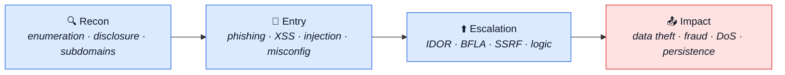

# Web attacks and defences

Every kind of flaw a website can have, and what this codebase does about each one.

One page per attack family. Each page is the same shape: **what the attack is**, in theory and
independent of any codebase — then **how this boilerplate answers it**, with the code and the tools
named. A row that says "no surface" says why, and a row with nothing behind it yet says
🚧 **coming soon** rather than quietly not appearing.

Use it two ways: as a **checklist** when threat-modelling a feature — walk the families and ask
"could this one apply here?" — or as a **lookup**, when you have a name and want to know whether
it is handled. The [alphabetical index](#every-attack-a-to-z) at the bottom is for the second.

## The attack surface in one picture

```mermaid
%%{init: {'flowchart': {'nodeSpacing': 40, 'rankSpacing': 55}}}%%
flowchart LR
    H["🧑 Human<br/><i>phishing · social engineering</i>"]
    B["🌐 Browser<br/><i>XSS · CSRF · clickjacking · XS-Leaks</i>"]
    N["🔌 Transport<br/><i>TLS · smuggling · cache poisoning · DoS</i>"]
    A["⚙️ Application<br/><i>injection · auth · authz · logic · files · SSRF</i>"]
    D["🗄️ Data & infra<br/><i>DB exposure · secrets · misconfig · supply chain</i>"]

    H --> B --> N --> A --> D

    classDef human fill:#fef3c7,stroke:#d97706,color:#111827;
    classDef client fill:#ddd6fe,stroke:#7c3aed,color:#111827;
    classDef net fill:#dbeafe,stroke:#2563eb,color:#111827;
    classDef app fill:#fee2e2,stroke:#dc2626,color:#111827;
    classDef data fill:#dcfce7,stroke:#16a34a,color:#111827;
    class H human;
    class B client;
    class N net;
    class A app;
    class D data;
```

Every family below sits on one of those five boxes. An attacker rarely stays in one: a phishing
mail (human) leads to an open redirect (browser) that lands on an IDOR (application) that dumps a
collection (data). **Chains are the norm**, which is why a "low" finding is rarely low on its own.

Information disclosure feeds entry, entry feeds escalation, escalation feeds impact. Fixing the
"boring" recon-stage items is what turns a chain into a dead end.

## The families

| Family                                                  | What lands there                                                       | Where this repo stands                                     |
| ------------------------------------------------------- | ---------------------------------------------------------------------- | ---------------------------------------------------------- |
| [Injection](injection.md)                               | untrusted data interpreted as code — SQL, NoSQL, shell, template, CRLF | closed by one type gate at the boundary                    |
| [Client-side](client-side.md)                           | XSS, CSRF, clickjacking, open redirect — attacks in the browser        | mostly the frontend's; the shared rows are here            |
| [Authentication](authentication.md)                     | credentials, sessions, JWTs, 2FA, OAuth                                | the most-invested family in the repo                       |
| [Authorization](authorization.md)                       | IDOR, privilege escalation, forced browsing, workflow bypass           | one app-wide assertion, not twelve local ones              |
| [Business logic, money and payments](business-logic.md) | price manipulation, races, refunds, the PSP                            | closed, except what needs a real processor                 |
| [Files, uploads and paths](files-and-uploads.md)        | traversal, unrestricted upload, image bombs, stored XSS                | three gates in a fixed order                               |
| [Server-side request forgery](ssrf.md)                  | the server made to fetch an attacker's URL                             | no surface — every outbound host is hard-coded             |
| [HTTP, proxies and caches](http-and-caches.md)          | smuggling, cache poisoning, trusted-proxy mistakes                     | the cache is owned here; the proxy is the deployment's     |
| [Cryptography and secrets](crypto-and-secrets.md)       | TLS, password hashing, randomness, secrets at rest                     | never implement a primitive                                |
| [Information disclosure](disclosure.md)                 | verbose errors, excessive data, logs, metrics                          | the recon stage, and why the boring rows matter            |
| [Denial of service](denial-of-service.md)               | floods, slow HTTP, ReDoS, unbounded queries                            | bounded here; volumetric is the edge's                     |
| [The data layer](data-layer.md)                         | exposed stores, missing owner scope, cache and queue poisoning         | the filter is compiled, not appended                       |
| [Infrastructure and configuration](infrastructure.md)   | misconfiguration, headers, containers, the platform                    | a dangerous default stops the boot                         |
| [Supply chain](supply-chain.md)                         | vulnerable and malicious packages, install scripts, base images        | fewer dependencies is the primary defence                  |
| [The API surface](api-surface.md)                       | zombie routes, bulk export, webhooks, GraphQL                          | the contract IS the API                                    |
| [Real-time and messaging](real-time.md)                 | unauthenticated upgrades, broadcast leakage, brokers                   | one-way SSE closes half the family by construction         |
| [Email and notifications](email.md)                     | template and header injection, spoofing, bombing                       | closed, except enforcing a verified address                |
| [Human and social](human-and-social.md)                 | phishing, pretexting, insider threat                                   | no row is closed by code; all of it is blast radius        |
| [Runtime and language level](runtime.md)                | crashes, `eval`, native memory bugs, env trust                         | bound what reaches native code, and exit on the unknown    |
| [Automation and abuse](automation-and-abuse.md)         | scraping, fake accounts, form spam, CAPTCHA                            | a ladder, off by default, because every rung costs someone |

## How to read a row

| Cell                       | Means                                                                 |
| -------------------------- | --------------------------------------------------------------------- |
| a control plus a file path | closed, and here is the code that does it                             |
| **No surface: …**          | the feature this attacks does not exist here, and the row says which  |
| **Not this layer — …**     | real, and closed by something outside this repo; the owner is named   |
| 🚧 **Coming soon**         | genuinely open. Not overlooked, not dressed up as mitigated           |
| **Same answer as …**       | one home per control; the link goes to where it is actually explained |

That last one is the rule the whole section is built on: a defence is written down **once**, at the
attack it primarily answers, and every other attack it happens to close links to it. A control
described in four places is a control that will be wrong in three of them.

## Every attack, A to Z

| Attack                                         | Answered in                                                                                                |
| ---------------------------------------------- | ---------------------------------------------------------------------------------------------------------- |
| 3-D Secure bypass                              | [Business logic, money and payments](business-logic.md#the-payment-provider)                               |
| Account lockout as DoS                         | [Authentication](authentication.md#guessing-the-credential)                                                |
| Account lockout DoS                            | [Denial of service](denial-of-service.md#holding-a-resource)                                               |
| Address parser differentials                   | [Email and notifications](email.md#mail-this-app-sends)                                                    |
| Admin functionality in client bundle           | [Authorization](authorization.md#function-level-may-you-call-this-at-all)                                  |
| Aggregation / pipeline injection               | [Injection](injection.md#into-a-database-query)                                                            |
| alg: none                                      | [Authentication](authentication.md#jwt-specifically)                                                       |
| Algorithmic complexity                         | [Denial of service](denial-of-service.md#expensive-work-from-a-cheap-request)                              |
| Alias / nesting abuse                          | [The API surface](api-surface.md#graphql)                                                                  |
| Amount sign / unit tricks                      | [Business logic, money and payments](business-logic.md#arithmetic-and-money)                               |
| API documentation exposure                     | [Information disclosure](disclosure.md#the-response-saying-more-than-the-ui-shows)                         |
| API key leakage                                | [The API surface](api-surface.md#bulk-access-and-quotas)                                                   |
| API scraping via mobile app keys               | [Automation and abuse](automation-and-abuse.md#accounts-and-content-at-scale)                              |
| Application-layer DoS (L7)                     | [Denial of service](denial-of-service.md#volume)                                                           |
| Argument injection                             | [Injection](injection.md#into-the-operating-system-or-the-runtime)                                         |
| Authorization per message missing              | [Real-time and messaging](real-time.md#what-travels-on-it)                                                 |
| Autocomplete on sensitive fields               | [Information disclosure](disclosure.md#the-response-saying-more-than-the-ui-shows)                         |
| Backup and disaster-recovery gaps              | [Infrastructure, configuration and deployment](infrastructure.md#the-network-and-the-platform)             |
| Backup exposure                                | [The data layer](data-layer.md#reaching-the-store)                                                         |
| Backup / source exposure                       | [Files, uploads and paths](files-and-uploads.md#what-gets-served-back)                                     |
| Baiting / malvertising                         | [Human and social](human-and-social.md#getting-the-credential-from-the-person)                             |
| Base-image vulnerabilities                     | [Infrastructure, configuration and deployment](infrastructure.md#the-container-and-the-image)              |
| Base-image vulnerabilities                     | [Supply chain](supply-chain.md#the-build-and-the-image)                                                    |
| Batching brute force                           | [The API surface](api-surface.md#graphql)                                                                  |
| Bleichenbacher / ROBOT                         | [Cryptography, secrets and transport](crypto-and-secrets.md#using-a-primitive-wrongly)                     |
| Broadcast leakage                              | [Real-time and messaging](real-time.md#what-travels-on-it)                                                 |
| Broken function-level authorization (BFLA)     | [Authorization](authorization.md#function-level-may-you-call-this-at-all)                                  |
| Broken object-property-level authorization     | [Authorization](authorization.md#object-level-whose-row-is-it)                                             |
| Browser cache poisoning                        | [Client-side](client-side.md#data-the-browser-holds)                                                       |
| Browser cache poisoning                        | [HTTP, proxies and caches](http-and-caches.md#caches)                                                      |
| Browser extension abuse                        | [Supply chain](supply-chain.md#things-served-from-elsewhere)                                               |
| Browser fingerprinting                         | [Client-side](client-side.md#data-the-browser-holds)                                                       |
| Brute force                                    | [Authentication](authentication.md#guessing-the-credential)                                                |
| Buffer overflow / use-after-free               | [Runtime and language level](runtime.md#native-code)                                                       |
| Buffer over-read / uninitialised memory        | [Runtime and language level](runtime.md#native-code)                                                       |
| Build-pipeline compromise                      | [Supply chain](supply-chain.md#the-build-and-the-image)                                                    |
| Bulk / export endpoints                        | [The API surface](api-surface.md#bulk-access-and-quotas)                                                   |
| Cached sensitive responses                     | [Information disclosure](disclosure.md#the-response-saying-more-than-the-ui-shows)                         |
| Cache-key confusion                            | [HTTP, proxies and caches](http-and-caches.md#caches)                                                      |
| Cache poisoning (application cache)            | [The data layer](data-layer.md#the-cache)                                                                  |
| Cache poisoning by size                        | [HTTP, proxies and caches](http-and-caches.md#caches)                                                      |
| Cache stampede                                 | [Denial of service](denial-of-service.md#holding-a-resource)                                               |
| Cache stampede                                 | [HTTP, proxies and caches](http-and-caches.md#caches)                                                      |
| Callback replay                                | [Business logic, money and payments](business-logic.md#the-payment-provider)                               |
| CAPTCHA bypass                                 | [Automation and abuse](automation-and-abuse.md#accounts-and-content-at-scale)                              |
| Card testing / carding                         | [Business logic, money and payments](business-logic.md#abuse-of-a-legitimate-feature)                      |
| Case-insensitive / Unicode filesystem          | [Runtime and language level](runtime.md#the-language-s-own-sharp-edges)                                    |
| CDN compromise                                 | [Supply chain](supply-chain.md#things-served-from-elsewhere)                                               |
| Certificate / key exposure                     | [Cryptography, secrets and transport](crypto-and-secrets.md#transport)                                     |
| Certificate validation disabled                | [Cryptography, secrets and transport](crypto-and-secrets.md#transport)                                     |
| Chargeback fraud                               | [Business logic, money and payments](business-logic.md#the-payment-provider)                               |
| Checkout race                                  | [Business logic, money and payments](business-logic.md#concurrency)                                        |
| child_process misuse                           | [Runtime and language level](runtime.md#the-language-s-own-sharp-edges)                                    |
| Click / ad fraud                               | [Automation and abuse](automation-and-abuse.md#accounts-and-content-at-scale)                              |
| Clickjacking / UI redress                      | [Client-side](client-side.md#rows-that-need-both-halves)                                                   |
| Client-side path traversal                     | [Client-side](client-side.md#data-the-browser-holds)                                                       |
| Client-side prototype pollution                | [Client-side](client-side.md#data-the-browser-holds)                                                       |
| Client-side template injection                 | [Client-side](client-side.md#script-execution-in-the-origin)                                               |
| Client-side template injection                 | [Injection](injection.md#into-a-template)                                                                  |
| Clipboard / autofill abuse                     | [Client-side](client-side.md#data-the-browser-holds)                                                       |
| Cloud metadata access                          | [Server-side request forgery](ssrf.md#what-an-ssrf-primitive-would-reach)                                  |
| Code injection / eval                          | [Injection](injection.md#into-the-operating-system-or-the-runtime)                                         |
| Compression side channel                       | [Cryptography, secrets and transport](crypto-and-secrets.md#using-a-primitive-wrongly)                     |
| Compromised maintainer                         | [Supply chain](supply-chain.md#the-package-itself)                                                         |
| Confused deputy                                | [Authorization](authorization.md#bypassing-the-check-rather-than-passing-it)                               |
| Connection / pool exhaustion                   | [Denial of service](denial-of-service.md#holding-a-resource)                                               |
| Consent phishing                               | [Human and social](human-and-social.md#getting-the-credential-from-the-person)                             |
| Container escape                               | [Infrastructure, configuration and deployment](infrastructure.md#the-container-and-the-image)              |
| Container running as root                      | [Infrastructure, configuration and deployment](infrastructure.md#the-container-and-the-image)              |
| Content negotiation confusion                  | [The API surface](api-surface.md#shapes-and-parsers)                                                       |
| Content-type / extension confusion             | [Files, uploads and paths](files-and-uploads.md#what-gets-stored)                                          |
| Content-type sniffing                          | [The API surface](api-surface.md#shapes-and-parsers)                                                       |
| Context-dependent authorization gaps           | [Authorization](authorization.md#order-and-state)                                                          |
| Cookie flag omissions                          | [Authentication](authentication.md#taking-the-session)                                                     |
| Cookie flag omissions                          | [Client-side](client-side.md#rows-that-need-both-halves)                                                   |
| Cookie tossing                                 | [Authentication](authentication.md#taking-the-session)                                                     |
| CORS misconfiguration                          | [Client-side](client-side.md#rows-that-need-both-halves)                                                   |
| Coupon / voucher reuse                         | [Business logic, money and payments](business-logic.md#concurrency)                                        |
| Credential leakage                             | [Authentication](authentication.md#knowing-an-account-exists)                                              |
| Credential stuffing                            | [Authentication](authentication.md#guessing-the-credential)                                                |
| Credential stuffing                            | [Automation and abuse](automation-and-abuse.md#accounts-and-content-at-scale)                              |
| CRLF injection                                 | [Injection](injection.md#into-a-protocol-or-a-document)                                                    |
| Cross-purpose key use                          | [Authentication](authentication.md#jwt-specifically)                                                       |
| Cross-purpose key use                          | [Cryptography, secrets and transport](crypto-and-secrets.md#randomness-and-keys)                           |
| Cross-site leaks (XS-Leaks)                    | [Client-side](client-side.md#cross-origin-reading-and-navigation)                                          |
| Cross-site request forgery (CSRF)              | [Client-side](client-side.md#rows-that-need-both-halves)                                                   |
| Cross-site script inclusion (XSSI)             | [Client-side](client-side.md#cross-origin-reading-and-navigation)                                          |
| Cross-site WebSocket hijacking                 | [Client-side](client-side.md#cross-origin-reading-and-navigation)                                          |
| Cross-site WebSocket hijacking                 | [Real-time and messaging](real-time.md#opening-the-stream)                                                 |
| CSP bypass                                     | [Client-side](client-side.md#policy-and-delivery)                                                          |
| CSV / formula injection                        | [Injection](injection.md#into-a-protocol-or-a-document)                                                    |
| Currency confusion                             | [Business logic, money and payments](business-logic.md#arithmetic-and-money)                               |
| Dangling markup injection                      | [Client-side](client-side.md#script-execution-in-the-origin)                                               |
| Debug / diagnostic endpoints                   | [Information disclosure](disclosure.md#the-server-talking-about-itself)                                    |
| Debugger / inspector exposed                   | [Runtime and language level](runtime.md#configuration-from-the-environment)                                |
| Decompression bomb                             | [Files, uploads and paths](files-and-uploads.md#what-the-bytes-do-once-accepted)                           |
| Default / hard-coded credentials               | [Authentication](authentication.md#guessing-the-credential)                                                |
| Default / weak DB credentials                  | [The data layer](data-layer.md#reaching-the-store)                                                         |
| Denial of inventory / wallet                   | [Business logic, money and payments](business-logic.md#abuse-of-a-legitimate-feature)                      |
| Dependency confusion                           | [Supply chain](supply-chain.md#the-package-itself)                                                         |
| Directory listing                              | [Information disclosure](disclosure.md#outside-the-application)                                            |
| Directory listing                              | [Files, uploads and paths](files-and-uploads.md#what-gets-served-back)                                     |
| DNS hijacking / registrar compromise           | [Infrastructure, configuration and deployment](infrastructure.md#the-network-and-the-platform)             |
| DNS zone transfer                              | [Information disclosure](disclosure.md#outside-the-application)                                            |
| DOM clobbering                                 | [Client-side](client-side.md#script-execution-in-the-origin)                                               |
| Drag-and-drop / cursorjacking                  | [Client-side](client-side.md#rows-that-need-both-halves)                                                   |
| Drive-by download                              | [Client-side](client-side.md#policy-and-delivery)                                                          |
| Early hints / 103 confusion                    | [HTTP, proxies and caches](http-and-caches.md#cheap-request-expensive-server)                              |
| ECB mode                                       | [Cryptography, secrets and transport](crypto-and-secrets.md#using-a-primitive-wrongly)                     |
| Email bombing / resend abuse                   | [Email and notifications](email.md#how-much-mail)                                                          |
| Email-change without re-verification           | [Authentication](authentication.md#recovery-and-changing-the-credential)                                   |
| Email header injection                         | [Injection](injection.md#into-a-protocol-or-a-document)                                                    |
| Email / SMS bombing                            | [Denial of service](denial-of-service.md#making-the-server-do-the-work-outward)                            |
| Email spoofing                                 | [Email and notifications](email.md#mail-claiming-to-be-this-app)                                           |
| Encryption without authentication              | [Cryptography, secrets and transport](crypto-and-secrets.md#using-a-primitive-wrongly)                     |
| Enumeration via responses                      | [Information disclosure](disclosure.md#the-response-saying-more-than-the-ui-shows)                         |
| Environment-variable trust                     | [Runtime and language level](runtime.md#configuration-from-the-environment)                                |
| Error-based schema leakage                     | [Information disclosure](disclosure.md#the-server-talking-about-itself)                                    |
| Event-loop blocking                            | [Denial of service](denial-of-service.md#expensive-work-from-a-cheap-request)                              |
| Event-loop blocking                            | [Runtime and language level](runtime.md#the-process-staying-up)                                            |
| Event replay                                   | [The data layer](data-layer.md#the-broker)                                                                 |
| Excessive data exposure                        | [Information disclosure](disclosure.md#the-response-saying-more-than-the-ui-shows)                         |
| Exposed CI/CD                                  | [Infrastructure, configuration and deployment](infrastructure.md#the-network-and-the-platform)             |
| Exposed database                               | [The data layer](data-layer.md#reaching-the-store)                                                         |
| Exposed Kubernetes / orchestration APIs        | [Infrastructure, configuration and deployment](infrastructure.md#the-network-and-the-platform)             |
| Exposed management interfaces                  | [Infrastructure, configuration and deployment](infrastructure.md#the-container-and-the-image)              |
| Exposed message broker                         | [The data layer](data-layer.md#reaching-the-store)                                                         |
| Expression-language injection                  | [Injection](injection.md#into-a-template)                                                                  |
| Fake account creation                          | [Automation and abuse](automation-and-abuse.md#accounts-and-content-at-scale)                              |
| Fake browser updates / tech support            | [Human and social](human-and-social.md#getting-the-credential-from-the-person)                             |
| Feature-flag / config exposure                 | [Business logic, money and payments](business-logic.md#who-the-server-derives-and-who-the-client-supplies) |
| Field suggestions                              | [The API surface](api-surface.md#graphql)                                                                  |
| Filename injection                             | [Files, uploads and paths](files-and-uploads.md#what-gets-stored)                                          |
| Forced browsing                                | [The API surface](api-surface.md#which-routes-exist)                                                       |
| Forced browsing                                | [Authorization](authorization.md#function-level-may-you-call-this-at-all)                                  |
| Format-string bugs                             | [Runtime and language level](runtime.md#native-code)                                                       |
| Formjacking / Magecart                         | [Client-side](client-side.md#script-execution-in-the-origin)                                               |
| Gift-card / wallet enumeration                 | [Business logic, money and payments](business-logic.md#abuse-of-a-legitimate-feature)                      |
| GraphQL depth / breadth abuse                  | [Denial of service](denial-of-service.md#expensive-work-from-a-cheap-request)                              |
| GraphQL field-level authorization              | [Authorization](authorization.md#object-level-whose-row-is-it)                                             |
| GraphQL injection                              | [Injection](injection.md#into-a-database-query)                                                            |
| Hard-coded / shared keys                       | [Cryptography, secrets and transport](crypto-and-secrets.md#randomness-and-keys)                           |
| Header injection                               | [Email and notifications](email.md#mail-this-app-sends)                                                    |
| Header parsing leniency                        | [HTTP, proxies and caches](http-and-caches.md#two-parsers-disagreeing)                                     |
| Header parsing leniency                        | [Runtime and language level](runtime.md#native-code)                                                       |
| Header size / count abuse                      | [HTTP, proxies and caches](http-and-caches.md#headers-and-the-proxy)                                       |
| History sniffing                               | [Client-side](client-side.md#data-the-browser-holds)                                                       |
| Homegrown crypto                               | [Cryptography, secrets and transport](crypto-and-secrets.md#using-a-primitive-wrongly)                     |
| Homograph / IDN attack                         | [Human and social](human-and-social.md#getting-the-credential-from-the-person)                             |
| Hop-by-hop header abuse                        | [HTTP, proxies and caches](http-and-caches.md#headers-and-the-proxy)                                       |
| Horizontal privilege escalation                | [Authorization](authorization.md#object-level-whose-row-is-it)                                             |
| Host header attacks                            | [HTTP, proxies and caches](http-and-caches.md#headers-and-the-proxy)                                       |
| Host header injection                          | [Injection](injection.md#into-a-path-or-a-model)                                                           |
| HTML comments and dead code                    | [Information disclosure](disclosure.md#the-server-talking-about-itself)                                    |
| HTML / CSS injection                           | [Client-side](client-side.md#script-execution-in-the-origin)                                               |
| HTTP/2 pseudo-header / CONTINUATION attacks    | [HTTP, proxies and caches](http-and-caches.md#cheap-request-expensive-server)                              |
| HTTP/2 rapid reset                             | [Denial of service](denial-of-service.md#what-no-rate-limiter-can-bound)                                   |
| HTTP/2 rapid reset                             | [HTTP, proxies and caches](http-and-caches.md#cheap-request-expensive-server)                              |
| HTTP desync / connection poisoning             | [HTTP, proxies and caches](http-and-caches.md#two-parsers-disagreeing)                                     |
| HTTP header injection                          | [Injection](injection.md#into-a-protocol-or-a-document)                                                    |
| HTTP parameter pollution (HPP)                 | [HTTP, proxies and caches](http-and-caches.md#two-parsers-disagreeing)                                     |
| HTTP request smuggling                         | [HTTP, proxies and caches](http-and-caches.md#two-parsers-disagreeing)                                     |
| HTTP response splitting                        | [Injection](injection.md#into-a-protocol-or-a-document)                                                    |
| HTTP verb tampering                            | [Authorization](authorization.md#bypassing-the-check-rather-than-passing-it)                               |
| Image-processing exploits                      | [Files, uploads and paths](files-and-uploads.md#what-the-bytes-do-once-accepted)                           |
| Improper inventory management                  | [The API surface](api-surface.md#which-routes-exist)                                                       |
| Inconsistent validation across channels        | [Business logic, money and payments](business-logic.md#who-the-server-derives-and-who-the-client-supplies) |
| Infrastructure-as-code drift                   | [Infrastructure, configuration and deployment](infrastructure.md#the-network-and-the-platform)             |
| Insecure API gateway rules                     | [The API surface](api-surface.md#which-routes-exist)                                                       |
| Insecure defaults of frameworks                | [Infrastructure, configuration and deployment](infrastructure.md#a-boot-that-refuses)                      |
| Insecure deserialization                       | [Injection](injection.md#into-the-operating-system-or-the-runtime)                                         |
| Insecure direct file access                    | [Authorization](authorization.md#object-level-whose-row-is-it)                                             |
| Insecure direct file access                    | [Files, uploads and paths](files-and-uploads.md#where-it-gets-stored-and-where-it-is-read-from)            |
| Insecure direct object reference (IDOR) / BOLA | [Authorization](authorization.md#object-level-whose-row-is-it)                                             |
| Insecure "keep me logged in"                   | [Authentication](authentication.md#taking-the-session)                                                     |
| Insecure randomness                            | [Cryptography, secrets and transport](crypto-and-secrets.md#randomness-and-keys)                           |
| Insecure temp files                            | [Files, uploads and paths](files-and-uploads.md#what-gets-stored)                                          |
| Insider threat                                 | [Human and social](human-and-social.md#getting-it-from-the-staff)                                          |
| Install scripts                                | [Supply chain](supply-chain.md#the-install)                                                                |
| Insufficient anti-automation                   | [Business logic, money and payments](business-logic.md#abuse-of-a-legitimate-feature)                      |
| Insufficient logging and monitoring            | [Infrastructure, configuration and deployment](infrastructure.md#seeing-it-happen)                         |
| Insufficient session expiry                    | [Authentication](authentication.md#taking-the-session)                                                     |
| Insufficient work factor                       | [Cryptography, secrets and transport](crypto-and-secrets.md#hashing-passwords)                             |
| Integer overflow in native code                | [Runtime and language level](runtime.md#native-code)                                                       |
| Integer overflow / precision loss              | [Business logic, money and payments](business-logic.md#arithmetic-and-money)                               |
| Internal service reach                         | [Server-side request forgery](ssrf.md#what-an-ssrf-primitive-would-reach)                                  |
| Introspection exposure                         | [The API surface](api-surface.md#graphql)                                                                  |
| Inventory reservation abuse                    | [Business logic, money and payments](business-logic.md#abuse-of-a-legitimate-feature)                      |
| IP-based trust                                 | [Authorization](authorization.md#trusting-something-the-client-controls)                                   |
| IV / nonce reuse                               | [Cryptography, secrets and transport](crypto-and-secrets.md#using-a-primitive-wrongly)                     |
| JNDI / lookup injection                        | [Injection](injection.md#into-the-operating-system-or-the-runtime)                                         |
| Key confusion                                  | [Authentication](authentication.md#jwt-specifically)                                                       |
| Key confusion / algorithm confusion            | [Cryptography, secrets and transport](crypto-and-secrets.md#using-a-primitive-wrongly)                     |
| kid / jku / x5u injection                      | [Authentication](authentication.md#jwt-specifically)                                                       |
| Lack of network segmentation                   | [Infrastructure, configuration and deployment](infrastructure.md#the-network-and-the-platform)             |
| Large request bodies                           | [Denial of service](denial-of-service.md#expensive-work-from-a-cheap-request)                              |
| LDAP injection                                 | [Injection](injection.md#into-a-database-query)                                                            |
| Length-extension                               | [Cryptography, secrets and transport](crypto-and-secrets.md#using-a-primitive-wrongly)                     |
| Link poisoning                                 | [Email and notifications](email.md#mail-this-app-sends)                                                    |
| Local file inclusion (LFI)                     | [Files, uploads and paths](files-and-uploads.md#where-it-gets-stored-and-where-it-is-read-from)            |
| Lockfile tampering                             | [Supply chain](supply-chain.md#the-install)                                                                |
| Log exposure                                   | [Information disclosure](disclosure.md#logs-and-telemetry)                                                 |
| Login CSRF                                     | [Client-side](client-side.md#rows-that-need-both-halves)                                                   |
| Log injection / forging                        | [Injection](injection.md#into-a-protocol-or-a-document)                                                    |
| Magic-link flaws                               | [Authentication](authentication.md#recovery-and-changing-the-credential)                                   |
| Malicious packages                             | [Supply chain](supply-chain.md#the-package-itself)                                                         |
| Mass assignment / autobinding                  | [Injection](injection.md#into-a-path-or-a-model)                                                           |
| Mass assignment on write                       | [The API surface](api-surface.md#shapes-and-parsers)                                                       |
| Mass assignment — privilege fields             | [Injection](injection.md#into-a-path-or-a-model)                                                           |
| Memory disclosure                              | [Information disclosure](disclosure.md#logs-and-telemetry)                                                 |
| Memory disclosure                              | [Runtime and language level](runtime.md#native-code)                                                       |
| Message flood                                  | [Real-time and messaging](real-time.md#what-travels-on-it)                                                 |
| Message injection                              | [Real-time and messaging](real-time.md#what-travels-on-it)                                                 |
| Metadata files                                 | [Information disclosure](disclosure.md#outside-the-application)                                            |
| Metadata leakage                               | [Files, uploads and paths](files-and-uploads.md#what-the-bytes-do-once-accepted)                           |
| Method override abuse                          | [HTTP, proxies and caches](http-and-caches.md#headers-and-the-proxy)                                       |
| Metrics / health endpoints exposed             | [Information disclosure](disclosure.md#logs-and-telemetry)                                                 |
| MFA fatigue                                    | [Human and social](human-and-social.md#getting-it-from-the-staff)                                          |
| MFA fatigue / push bombing                     | [Authentication](authentication.md#the-second-factor)                                                      |
| Missing claims validation                      | [Authentication](authentication.md#jwt-specifically)                                                       |
| Missing egress controls                        | [Infrastructure, configuration and deployment](infrastructure.md#the-network-and-the-platform)             |
| Missing invalidation                           | [Authentication](authentication.md#taking-the-session)                                                     |
| Missing origin check                           | [Real-time and messaging](real-time.md#opening-the-stream)                                                 |
| Missing or optional TLS                        | [Cryptography, secrets and transport](crypto-and-secrets.md#transport)                                     |
| Missing rate limit on sensitive functions      | [Authorization](authorization.md#function-level-may-you-call-this-at-all)                                  |
| Missing rate limits per key / user             | [The API surface](api-surface.md#bulk-access-and-quotas)                                                   |
| Missing security headers                       | [Client-side](client-side.md#rows-that-need-both-halves)                                                   |
| Missing security headers                       | [Infrastructure, configuration and deployment](infrastructure.md#headers-the-browser-acts-on)              |
| Missing tenant / owner scope                   | [The data layer](data-layer.md#the-query)                                                                  |
| Mixed content                                  | [Client-side](client-side.md#policy-and-delivery)                                                          |
| Mixed content                                  | [Cryptography, secrets and transport](crypto-and-secrets.md#transport)                                     |
| Multi-step / workflow bypass                   | [Authorization](authorization.md#order-and-state)                                                          |
| Mutation without CSRF protection               | [The API surface](api-surface.md#graphql)                                                                  |
| Negative or zero quantities                    | [Business logic, money and payments](business-logic.md#arithmetic-and-money)                               |
| No revocation                                  | [Authentication](authentication.md#jwt-specifically)                                                       |
| NoSQL injection                                | [Injection](injection.md#into-a-database-query)                                                            |
| Notification content leakage                   | [Email and notifications](email.md#mail-this-app-sends)                                                    |
| Notification / webhook floods                  | [Denial of service](denial-of-service.md#making-the-server-do-the-work-outward)                            |
| No WAF / rate limiting at the edge             | [Infrastructure, configuration and deployment](infrastructure.md#the-network-and-the-platform)             |
| OAuth — account linking confusion              | [Authentication](authentication.md#federated-login)                                                        |
| OAuth — implicit flow token leakage            | [Authentication](authentication.md#federated-login)                                                        |
| OAuth — missing PKCE                           | [Authentication](authentication.md#federated-login)                                                        |
| OAuth — missing state                          | [Authentication](authentication.md#federated-login)                                                        |
| OAuth — redirect_uri manipulation              | [Authentication](authentication.md#federated-login)                                                        |
| OAuth — scope / consent abuse                  | [Authentication](authentication.md#federated-login)                                                        |
| ObjectId / UUID v1 leakage                     | [The data layer](data-layer.md#the-query)                                                                  |
| Open redirect                                  | [Client-side](client-side.md#cross-origin-reading-and-navigation)                                          |
| Open-redirect-assisted phishing                | [Human and social](human-and-social.md#getting-the-credential-from-the-person)                             |
| Open relay                                     | [Email and notifications](email.md#mail-claiming-to-be-this-app)                                           |
| Operator injection                             | [The data layer](data-layer.md#the-query)                                                                  |
| ORM / query-builder injection                  | [Injection](injection.md#into-a-database-query)                                                            |
| Orphaned / residual data                       | [The data layer](data-layer.md#the-query)                                                                  |
| OS command injection                           | [Injection](injection.md#into-the-operating-system-or-the-runtime)                                         |
| OTP / 2FA bypass — attempt cap                 | [Authentication](authentication.md#the-second-factor)                                                      |
| OTP / 2FA bypass — replay                      | [Authentication](authentication.md#the-second-factor)                                                      |
| OTP / 2FA bypass — response tampering          | [Authentication](authentication.md#the-second-factor)                                                      |
| OTP / 2FA bypass — step skipping               | [Authentication](authentication.md#the-second-factor)                                                      |
| Outdated / vulnerable components               | [Infrastructure, configuration and deployment](infrastructure.md#seeing-it-happen)                         |
| Over-permissive cloud IAM                      | [Infrastructure, configuration and deployment](infrastructure.md#the-network-and-the-platform)             |
| Over-privileged DB account                     | [The data layer](data-layer.md#reaching-the-store)                                                         |
| Padding oracle                                 | [Cryptography, secrets and transport](crypto-and-secrets.md#using-a-primitive-wrongly)                     |
| Parameter tampering                            | [Authorization](authorization.md#trusting-something-the-client-controls)                                   |
| Password-reset poisoning                       | [Authentication](authentication.md#recovery-and-changing-the-credential)                                   |
| Password spraying                              | [Authentication](authentication.md#guessing-the-credential)                                                |
| Path normalisation bypass                      | [Authorization](authorization.md#bypassing-the-check-rather-than-passing-it)                               |
| Path resolution quirks                         | [Runtime and language level](runtime.md#the-language-s-own-sharp-edges)                                    |
| Path traversal                                 | [Files, uploads and paths](files-and-uploads.md#where-it-gets-stored-and-where-it-is-read-from)            |
| Path / URL parameter injection                 | [Injection](injection.md#into-a-path-or-a-model)                                                           |
| Payment callback forgery                       | [Business logic, money and payments](business-logic.md#the-payment-provider)                               |
| Permissive CORS                                | [Infrastructure, configuration and deployment](infrastructure.md#headers-the-browser-acts-on)              |
| Phishing                                       | [Human and social](human-and-social.md#getting-the-credential-from-the-person)                             |
| postMessage abuse                              | [Client-side](client-side.md#cross-origin-reading-and-navigation)                                          |
| Pre-account-takeover                           | [Authentication](authentication.md#federated-login)                                                        |
| Pre-account-takeover                           | [Email and notifications](email.md#the-address-itself)                                                     |
| Predictable session tokens                     | [Authentication](authentication.md#taking-the-session)                                                     |
| Pretexting support                             | [Human and social](human-and-social.md#getting-it-from-the-staff)                                          |
| Price manipulation                             | [Business logic, money and payments](business-logic.md#arithmetic-and-money)                               |
| Protocol DoS (L3/L4)                           | [Denial of service](denial-of-service.md#volume)                                                           |
| Protocol smuggling via SSRF                    | [Server-side request forgery](ssrf.md#making-the-server-fetch)                                             |
| Prototype pollution                            | [Injection](injection.md#into-the-operating-system-or-the-runtime)                                         |
| Prototype pollution                            | [Runtime and language level](runtime.md#the-language-s-own-sharp-edges)                                    |
| Public object storage                          | [Infrastructure, configuration and deployment](infrastructure.md#the-network-and-the-platform)             |
| Queue / event poisoning                        | [The data layer](data-layer.md#the-broker)                                                                 |
| Race condition / double spend                  | [Business logic, money and payments](business-logic.md#concurrency)                                        |
| Range header abuse                             | [HTTP, proxies and caches](http-and-caches.md#cheap-request-expensive-server)                              |
| Range / partial-content leaks                  | [HTTP, proxies and caches](http-and-caches.md#cheap-request-expensive-server)                              |
| Redirect / recursion loops                     | [Denial of service](denial-of-service.md#making-the-server-do-the-work-outward)                            |
| ReDoS                                          | [Denial of service](denial-of-service.md#expensive-work-from-a-cheap-request)                              |
| ReDoS                                          | [Injection](injection.md#into-a-pattern)                                                                   |
| ReDoS                                          | [Runtime and language level](runtime.md#the-language-s-own-sharp-edges)                                    |
| Referer / origin-based access control          | [Authorization](authorization.md#trusting-something-the-client-controls)                                   |
| Referral / promo abuse                         | [Business logic, money and payments](business-logic.md#abuse-of-a-legitimate-feature)                      |
| Referrer leakage                               | [Information disclosure](disclosure.md#identifiers-and-urls)                                               |
| Refresh-token misuse — reuse                   | [Authentication](authentication.md#jwt-specifically)                                                       |
| Refund / return abuse                          | [Business logic, money and payments](business-logic.md#abuse-of-a-legitimate-feature)                      |
| Regex injection                                | [Injection](injection.md#into-a-pattern)                                                                   |
| Remember-me token flaws                        | [Authentication](authentication.md#taking-the-session)                                                     |
| Remote file inclusion (RFI)                    | [Files, uploads and paths](files-and-uploads.md#where-it-gets-stored-and-where-it-is-read-from)            |
| Replay of one-time actions                     | [Business logic, money and payments](business-logic.md#order-of-operations)                                |
| Replication-lag inconsistencies                | [The data layer](data-layer.md#the-query)                                                                  |
| Request tunnelling                             | [HTTP, proxies and caches](http-and-caches.md#two-parsers-disagreeing)                                     |
| Reset via security questions                   | [Authentication](authentication.md#recovery-and-changing-the-credential)                                   |
| Resource-limit misconfiguration                | [Denial of service](denial-of-service.md#what-no-rate-limiter-can-bound)                                   |
| Retry storms                                   | [Denial of service](denial-of-service.md#volume)                                                           |
| Reverse-proxy path confusion                   | [Authorization](authorization.md#bypassing-the-check-rather-than-passing-it)                               |
| Reverse-proxy path confusion                   | [HTTP, proxies and caches](http-and-caches.md#two-parsers-disagreeing)                                     |
| Review / vote manipulation                     | [Automation and abuse](automation-and-abuse.md#accounts-and-content-at-scale)                              |
| Rounding and precision                         | [Business logic, money and payments](business-logic.md#arithmetic-and-money)                               |
| SAML — signature wrapping                      | [Authentication](authentication.md#federated-login)                                                        |
| Scalping / inventory hoarding                  | [Automation and abuse](automation-and-abuse.md#accounts-and-content-at-scale)                              |
| Scraping                                       | [Automation and abuse](automation-and-abuse.md#accounts-and-content-at-scale)                              |
| Second-order SQLi                              | [Injection](injection.md#into-a-database-query)                                                            |
| Secrets at rest in plaintext                   | [Authentication](authentication.md#the-second-factor)                                                      |
| Secrets at rest in plaintext                   | [Cryptography, secrets and transport](crypto-and-secrets.md#secrets-at-rest)                               |
| Secrets in database                            | [The data layer](data-layer.md#secrets-stored-with-the-data)                                               |
| Secrets in environment                         | [Cryptography, secrets and transport](crypto-and-secrets.md#secrets-at-rest)                               |
| Secrets in environment / images                | [Infrastructure, configuration and deployment](infrastructure.md#a-boot-that-refuses)                      |
| Security misconfiguration                      | [Infrastructure, configuration and deployment](infrastructure.md#a-boot-that-refuses)                      |
| Sensitive data in client storage               | [Client-side](client-side.md#data-the-browser-holds)                                                       |
| Sensitive data in logs                         | [Information disclosure](disclosure.md#logs-and-telemetry)                                                 |
| Sensitive data in URLs                         | [Information disclosure](disclosure.md#identifiers-and-urls)                                               |
| Sequential / guessable identifiers             | [Information disclosure](disclosure.md#the-response-saying-more-than-the-ui-shows)                         |
| Server-side includes (SSI) injection           | [Injection](injection.md#into-a-template)                                                                  |
| Server-side template injection (SSTI)          | [Injection](injection.md#into-a-template)                                                                  |
| Service-worker abuse                           | [Client-side](client-side.md#script-execution-in-the-origin)                                               |
| Session fixation                               | [Authentication](authentication.md#taking-the-session)                                                     |
| Session hijacking / sidejacking                | [Authentication](authentication.md#taking-the-session)                                                     |
| Shoulder surfing / device theft                | [Human and social](human-and-social.md#getting-it-from-the-staff)                                          |
| Side-channel timing                            | [Information disclosure](disclosure.md#the-response-saying-more-than-the-ui-shows)                         |
| SIM swap                                       | [Authentication](authentication.md#the-second-factor)                                                      |
| SIM swap                                       | [Human and social](human-and-social.md#getting-it-from-the-staff)                                          |
| Slow HTTP                                      | [Denial of service](denial-of-service.md#holding-a-resource)                                               |
| Slow HTTP (Slowloris, slow POST, slow read)    | [HTTP, proxies and caches](http-and-caches.md#cheap-request-expensive-server)                              |
| Smishing / vishing / quishing                  | [Human and social](human-and-social.md#getting-the-credential-from-the-person)                             |
| SMS pumping                                    | [Automation and abuse](automation-and-abuse.md#accounts-and-content-at-scale)                              |
| SMS pumping                                    | [Email and notifications](email.md#how-much-mail)                                                          |
| Source code disclosure                         | [Information disclosure](disclosure.md#the-server-talking-about-itself)                                    |
| Source maps in production                      | [Information disclosure](disclosure.md#the-server-talking-about-itself)                                    |
| Spam via forms                                 | [Automation and abuse](automation-and-abuse.md#accounts-and-content-at-scale)                              |
| Spam via forms                                 | [Email and notifications](email.md#how-much-mail)                                                          |
| Spam via forms (honeypot)                      | [Client-side](client-side.md#rows-that-need-both-halves)                                                   |
| Spear phishing / whaling                       | [Human and social](human-and-social.md#getting-the-credential-from-the-person)                             |
| SQL injection (SQLi)                           | [Injection](injection.md#into-a-database-query)                                                            |
| SSL stripping / downgrade                      | [Cryptography, secrets and transport](crypto-and-secrets.md#transport)                                     |
| SSO misconfiguration                           | [Authentication](authentication.md#federated-login)                                                        |
| SSRF — basic                                   | [Server-side request forgery](ssrf.md#making-the-server-fetch)                                             |
| SSRF — blind                                   | [Server-side request forgery](ssrf.md#making-the-server-fetch)                                             |
| SSRF — DNS rebinding                           | [Server-side request forgery](ssrf.md#making-the-server-fetch)                                             |
| SSRF — parser confusion                        | [Server-side request forgery](ssrf.md#making-the-server-fetch)                                             |
| SSRF — via redirect                            | [Server-side request forgery](ssrf.md#making-the-server-fetch)                                             |
| Stale authorization in cache                   | [The data layer](data-layer.md#the-cache)                                                                  |
| Stale connection authorization                 | [Real-time and messaging](real-time.md#what-travels-on-it)                                                 |
| State-machine violations                       | [Authorization](authorization.md#order-and-state)                                                          |
| State-machine violations                       | [Business logic, money and payments](business-logic.md#order-of-operations)                                |
| Storage exhaustion                             | [Denial of service](denial-of-service.md#holding-a-resource)                                               |
| Stored card data                               | [Business logic, money and payments](business-logic.md#the-payment-provider)                               |
| Stored file served with wrong headers          | [Files, uploads and paths](files-and-uploads.md#what-gets-served-back)                                     |
| Subdomain / asset enumeration                  | [Information disclosure](disclosure.md#outside-the-application)                                            |
| Subdomain takeover                             | [Infrastructure, configuration and deployment](infrastructure.md#the-network-and-the-platform)             |
| Subresource without integrity                  | [Client-side](client-side.md#policy-and-delivery)                                                          |
| Symlink / hardlink tricks                      | [Files, uploads and paths](files-and-uploads.md#where-it-gets-stored-and-where-it-is-read-from)            |
| Tabnabbing (reverse)                           | [Client-side](client-side.md#cross-origin-reading-and-navigation)                                          |
| Tamperable audit logs                          | [Infrastructure, configuration and deployment](infrastructure.md#seeing-it-happen)                         |
| Template injection in email                    | [Email and notifications](email.md#mail-this-app-sends)                                                    |
| Tenant isolation failure                       | [Authorization](authorization.md#object-level-whose-row-is-it)                                             |
| Third-party analytics leakage                  | [Information disclosure](disclosure.md#logs-and-telemetry)                                                 |
| Third-party dependency outage                  | [Denial of service](denial-of-service.md#making-the-server-do-the-work-outward)                            |
| Third-party scripts                            | [Supply chain](supply-chain.md#things-served-from-elsewhere)                                               |
| Time / clock drift                             | [Infrastructure, configuration and deployment](infrastructure.md#a-boot-that-refuses)                      |
| Time-of-check / time-of-use (TOCTOU)           | [Authorization](authorization.md#bypassing-the-check-rather-than-passing-it)                               |
| Timing attack on comparison                    | [Authentication](authentication.md#knowing-an-account-exists)                                              |
| Timing side channel                            | [Cryptography, secrets and transport](crypto-and-secrets.md#hashing-passwords)                             |
| Tracking pixels / privacy                      | [Email and notifications](email.md#mail-this-app-sends)                                                    |
| Trusted-proxy misconfiguration                 | [HTTP, proxies and caches](http-and-caches.md#headers-and-the-proxy)                                       |
| Trusting client-side validation                | [Business logic, money and payments](business-logic.md#who-the-server-derives-and-who-the-client-supplies) |
| Trusting user-supplied identifiers             | [Business logic, money and payments](business-logic.md#who-the-server-derives-and-who-the-client-supplies) |
| Typosquatted domains                           | [Human and social](human-and-social.md#getting-the-credential-from-the-person)                             |
| Typosquatting                                  | [Supply chain](supply-chain.md#the-package-itself)                                                         |
| Unauthenticated upgrade                        | [Real-time and messaging](real-time.md#opening-the-stream)                                                 |
| Unbounded queries                              | [Denial of service](denial-of-service.md#expensive-work-from-a-cheap-request)                              |
| Unbounded / unindexed queries                  | [The data layer](data-layer.md#the-query)                                                                  |
| Unencrypted at rest                            | [Cryptography, secrets and transport](crypto-and-secrets.md#secrets-at-rest)                               |
| Unencrypted at rest                            | [The data layer](data-layer.md#reaching-the-store)                                                         |
| Unencrypted ws://                              | [Real-time and messaging](real-time.md#opening-the-stream)                                                 |
| Unhandled rejections / exceptions              | [Runtime and language level](runtime.md#the-process-staying-up)                                            |
| Unit / measurement confusion                   | [Business logic, money and payments](business-logic.md#arithmetic-and-money)                               |
| Unnecessary services and ports                 | [Infrastructure, configuration and deployment](infrastructure.md#the-container-and-the-image)              |
| Unrestricted file upload                       | [Files, uploads and paths](files-and-uploads.md#what-gets-stored)                                          |
| Unsafe consumption of upstream APIs            | [The API surface](api-surface.md#consuming-and-being-consumed)                                             |
| Unsafe eval / Function                         | [Runtime and language level](runtime.md#the-language-s-own-sharp-edges)                                    |
| Unsigned / unverified artefacts                | [Supply chain](supply-chain.md#the-build-and-the-image)                                                    |
| Unverified email at signup                     | [Email and notifications](email.md#the-address-itself)                                                     |
| User / account enumeration                     | [Authentication](authentication.md#knowing-an-account-exists)                                              |
| Vendor / SaaS breach                           | [Supply chain](supply-chain.md#things-served-from-elsewhere)                                               |
| Verbose error messages                         | [Information disclosure](disclosure.md#the-server-talking-about-itself)                                    |
| Version banners                                | [Information disclosure](disclosure.md#the-server-talking-about-itself)                                    |
| Version downgrade                              | [The API surface](api-surface.md#which-routes-exist)                                                       |
| Vertical privilege escalation                  | [Authorization](authorization.md#object-level-whose-row-is-it)                                             |
| vm / sandbox escape                            | [Runtime and language level](runtime.md#the-language-s-own-sharp-edges)                                    |
| Volumetric DDoS                                | [Denial of service](denial-of-service.md#volume)                                                           |
| Vulnerable dependencies                        | [Supply chain](supply-chain.md#the-package-itself)                                                         |
| Watering hole                                  | [Human and social](human-and-social.md#getting-the-credential-from-the-person)                             |
| Weak cache / broker credentials                | [The data layer](data-layer.md#reaching-the-store)                                                         |
| Weak key length                                | [Cryptography, secrets and transport](crypto-and-secrets.md#randomness-and-keys)                           |
| Weak Math.random / Date.now tokens             | [Runtime and language level](runtime.md#the-language-s-own-sharp-edges)                                    |
| Weak password hashing                          | [Cryptography, secrets and transport](crypto-and-secrets.md#hashing-passwords)                             |
| Weak password policy                           | [Authentication](authentication.md#guessing-the-credential)                                                |
| Weak reset tokens                              | [Authentication](authentication.md#recovery-and-changing-the-credential)                                   |
| Weak secret                                    | [Authentication](authentication.md#jwt-specifically)                                                       |
| Weak TLS configuration                         | [Cryptography, secrets and transport](crypto-and-secrets.md#transport)                                     |
| Web cache deception                            | [Client-side](client-side.md#rows-that-need-both-halves)                                                   |
| Web cache deception                            | [HTTP, proxies and caches](http-and-caches.md#caches)                                                      |
| Web cache poisoning                            | [HTTP, proxies and caches](http-and-caches.md#caches)                                                      |
| Webhook / callback abuse                       | [Server-side request forgery](ssrf.md#making-the-server-fetch)                                             |
| Webhook forgery                                | [The API surface](api-surface.md#consuming-and-being-consumed)                                             |
| Webhook replay                                 | [The API surface](api-surface.md#consuming-and-being-consumed)                                             |
| WebSocket upgrade smuggling                    | [HTTP, proxies and caches](http-and-caches.md#two-parsers-disagreeing)                                     |
| Workflow step skipping                         | [Business logic, money and payments](business-logic.md#order-of-operations)                                |
| XML bomb (billion laughs)                      | [Files, uploads and paths](files-and-uploads.md#what-the-bytes-do-once-accepted)                           |
| XML external entity (XXE)                      | [Injection](injection.md#into-a-protocol-or-a-document)                                                    |
| XML injection                                  | [Injection](injection.md#into-a-protocol-or-a-document)                                                    |
| XML / zip / image bombs                        | [Denial of service](denial-of-service.md#expensive-work-from-a-cheap-request)                              |
| XPath / XQuery injection                       | [Injection](injection.md#into-a-database-query)                                                            |
| XSS — blind                                    | [Client-side](client-side.md#script-execution-in-the-origin)                                               |
| XSS — DOM-based                                | [Client-side](client-side.md#script-execution-in-the-origin)                                               |
| XSS — mutation (mXSS)                          | [Client-side](client-side.md#script-execution-in-the-origin)                                               |
| XSS — reflected                                | [Client-side](client-side.md#script-execution-in-the-origin)                                               |
| XSS — stored                                   | [Client-side](client-side.md#script-execution-in-the-origin)                                               |
| XSS — universal (UXSS)                         | [Client-side](client-side.md#script-execution-in-the-origin)                                               |
| Zip slip                                       | [Files, uploads and paths](files-and-uploads.md#where-it-gets-stored-and-where-it-is-read-from)            |

## Standard references

| Reference                                                                                       | What it gives you                                                |
| ----------------------------------------------------------------------------------------------- | ---------------------------------------------------------------- |
| [OWASP Top 10](https://owasp.org/Top10/)                                                        | the ten most common web risk categories, revised every few years |
| [OWASP API Security Top 10](https://owasp.org/API-Security/)                                    | the same idea, for APIs                                          |
| [OWASP ASVS](https://owasp.org/www-project-application-security-verification-standard/)         | a verifiable checklist of controls, by level                     |
| [OWASP Web Security Testing Guide](https://owasp.org/www-project-web-security-testing-guide/)   | how to test for each item                                        |
| [OWASP Cheat Sheet Series](https://cheatsheetseries.owasp.org/)                                 | one page of concrete defence per topic                           |
| [CWE Top 25](https://cwe.mitre.org/top25/)                                                      | weakness types ranked by real CVE data                           |
| [CAPEC](https://capec.mitre.org/)                                                               | attack pattern catalogue, the "attack" side of CWE               |
| [MITRE ATT&CK](https://attack.mitre.org/)                                                       | adversary tactics and techniques, beyond the web layer           |
| [PortSwigger Web Security Academy](https://portswigger.net/web-security)                        | hands-on labs for most rows in this section                      |
| [STRIDE](https://learn.microsoft.com/en-us/azure/security/develop/threat-modeling-tool-threats) | six-letter threat-modelling mnemonic                             |

## What this section is not

- **Not a severity ranking.** Impact depends on the chain, not the row.
- **Not complete forever.** New classes appear — HTTP/2 desync and XS-Leaks are both recent.
  Revise when a reference above does.
- **Not automatically true.** Nothing enforces the file paths below structurally. A file that moves
  should update its row in the same commit; a control removed without removing its row here is
  worse than never having written the row.
- **Not the frontend's answer.** The paired Vue repo walks the browser rows on its own
  [Web Attack Defences](https://github.com/Guebbit/boilerplate-vue-frontend/blob/main/docs/theory/web-attack-defences.md)
  page. The rows that need both halves are marked **shared** in [Client-side](client-side.md).

## Related

- [Security](../../tools/security.md) — the tools, keys and budgets, from the operator's side
- [Authorization](../authorization.md) — how permission keys and roles are designed
- [Data protection](../data-protection.md) — the same files under a privacy lens
