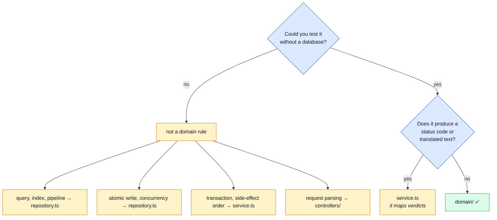
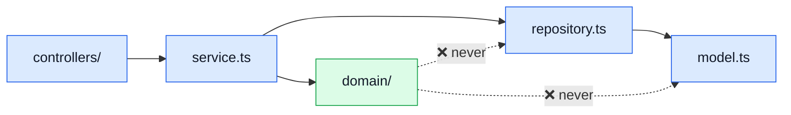
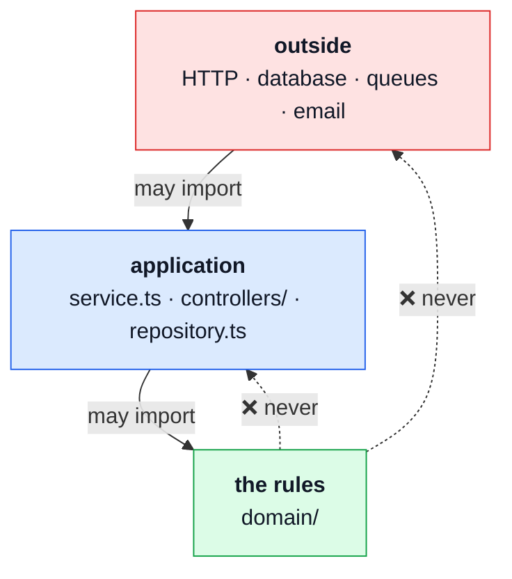
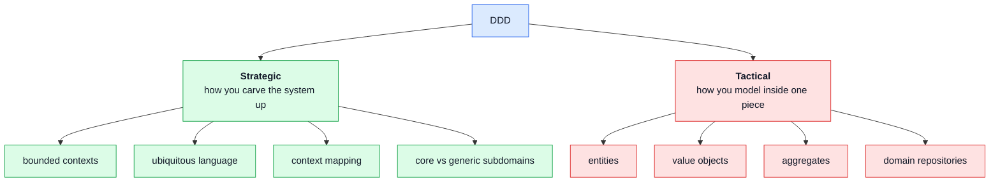
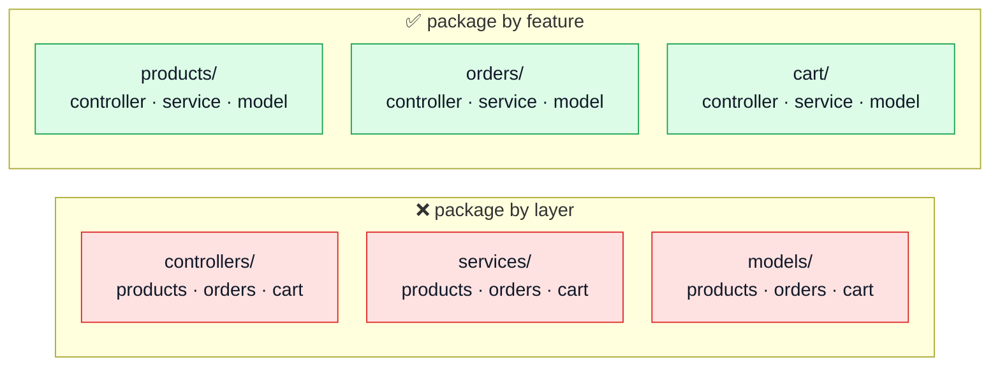
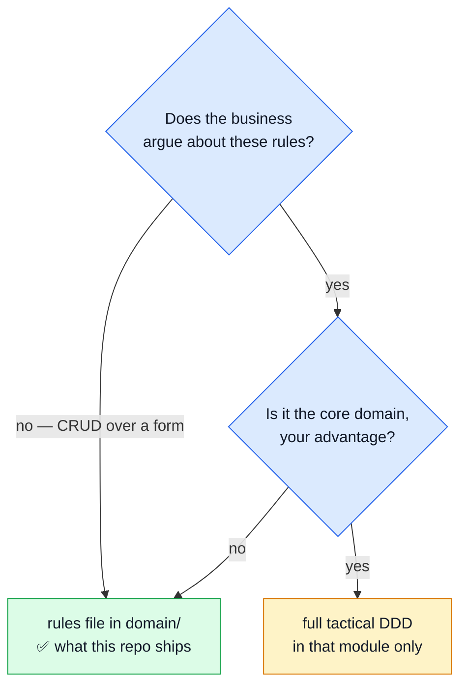

# Domain layer & DDD

Two things, in order:

1. **`domain/`** — the folder, the rule, and where a piece of logic goes.
2. **DDD** — what it actually is, and why it is _not_ the same as this architecture.

---

## 1. The folder

> **A business rule is anything you could test without a database.**
> It goes in `src/modules/<name>/domain/`, as a function that takes data and returns a verdict.

### Where does this go?



### The rule, enforced by lint



**The arrow points inward only.** `domain/` may not import:

| Forbidden                                  | Why                                               |
| ------------------------------------------ | ------------------------------------------------- |
| `mongoose`                                 | a rule may not know how anything is stored        |
| `express`                                  | a rule may not know it was reached over HTTP      |
| `@infrastructure/*`, `@kernel/*`, `@app/*` | those are tiers; domain sits below all of them    |
| `@modules/*`                               | a sibling's rules are its own                     |
| `../*` — its own module's outer files      | domain may not read `../model` or `../repository` |

A rule that needs a document has not been extracted — it has been moved.

### The shape: verdict, not rejection

```ts
// domain/rules.ts — knows nothing of 422, 404 or i18n
export const checkOrderLines = (lines) =>
    lines.length === 0
        ? { ok: false, reason: 'no-lines' }
        : lines.some(hasNoProduct)
          ? { ok: false, reason: 'product-missing' }
          : { ok: true };
```

```ts
// service.ts — owns the translation into an answer
if (!verdict.ok)
    return verdict.reason === 'no-lines'
        ? generateReject(422, [t('generic.error-missing-data')])
        : generateReject(404, [t('products.not-found')]);
```

The rule says _what is wrong_. The service says _what that means to an HTTP client_. Status codes
and copy are delivery concerns; the same verdict serves a queue consumer or a CLI importer.

### Why bother

`src/modules/orders/tests/unit/totals.property.test.ts` runs **13 properties × 300 generated baskets, seeded, with no
`setupTestDb`, no `beforeAll` and no mocks** — there is nothing to set up, because the file under
test cannot reach anything. It proves things like _"a total is never `NaN`, for every possible
input"_, which is a claim about all inputs that no table of examples can make. A `NaN` total
reaches a customer as a blank price, so this is worth proving rather than spot-checking.

**Lint is how the boundary is enforced, not why it exists.** The block in `eslint.config.ts` points
at `src/modules/*/domain/**` because ESLint matches on paths — a folder is simply the only thing a
linter can aim at. If the folder existed _only_ to satisfy the linter, it would be ceremony. It
exists so that money arithmetic can be proven; the linter is what stops that from decaying the
first day someone needs "just one query" inside a rule, at which point the fast proof quietly
becomes a slow integration test nobody runs.

### Is this standard?

Yes. A framework-free innermost layer is one of the most agreed-on ideas in software architecture —
four traditions describe the same ring under four names:



| Tradition                        | Year | Author            | What it calls the innermost ring |
| -------------------------------- | ---- | ----------------- | -------------------------------- |
| **DDD**, layered architecture    | 2003 | Eric Evans        | the **domain layer**             |
| **Hexagonal** (Ports & Adapters) | 2005 | Alistair Cockburn | the inside, behind ports         |
| **Onion Architecture**           | 2008 | Jeffrey Palermo   | Domain Model + Domain Services   |
| **Clean Architecture**           | 2012 | Robert C. Martin  | Entities, then Use Cases         |

All four state the same rule this page opened with: the rules do not import the delivery mechanism
or the database, and the dependency arrow points inward only. `domain/` is the DDD spelling, which
is why the folder carries that name.

**Will a reader recognise it?** Depends on the reader, and it is worth being honest about that:

| Arriving from                      | Reaction                                               |
| ---------------------------------- | ------------------------------------------------------ |
| Java/Spring, .NET, Go, or any DDD  | instant — `orders/domain/` is the expected layout      |
| Nx / modular monorepos             | familiar — the "domain library" split is the same idea |
| typical Express or Vue application | often not — this is the page that has to explain it    |

The third row is why this page exists. The idea is standard; its presence in a Node boilerplate is
not, so it gets documented rather than assumed.

**When you would not have one at all:** a module whose rules are all "store this, return it" has no
domain layer, and inventing one produces empty folders. Most modules here have none — see
[the floor](#the-floor-testable-without-a-database-is-necessary-not-sufficient) for the test a rule
must pass before it earns a place.

### The floor: "testable without a database" is necessary, not sufficient

The question above decides _where_ a rule goes. It does not decide _whether_ there is a rule. A
one-line expression passes "testable without a database" trivially, so the test alone would pull
every ternary in the codebase into `domain/`.

> **A rule earns `domain/` when it has more than one caller, _or_ a non-obvious failure mode a
> reader would otherwise reintroduce. A one-line expression with one caller and no trap is
> inlined, and its comment goes with it.**

The comment is the part worth keeping. `order.deletedAt = order.deletedAt ? undefined : new Date()`
with _"delete stamps, delete again restores — an order is a financial record"_ above it says
everything a `nextDeletionState(deletedAt, now)` said, minus an import, a barrel line and a hop.

Both halves are live:

| Kept              | Why it clears the floor                                                                                |
| ----------------- | ------------------------------------------------------------------------------------------------------ |
| `sumLineItems`    | Two modules — `cart` totals itself through it, so a summary cannot disagree with the order it previews |
| `steppedQuantity` | One caller, but a real trap: the clamp catches a double click outrunning `:disabled`                   |
| `checkOrderLines` | Ordered reasons that map to distinct status codes and analytics labels                                 |

| Removed             | Why it did not                                                                |
| ------------------- | ----------------------------------------------------------------------------- |
| `nextDeletionState` | `deletedAt ? undefined : now`, one caller — the call site was shorter inlined |
| `readScope`         | A tagged union its only caller destructured two lines later                   |
| `canDecrement`      | `q > MIN_LINE_QUANTITY`, one template binding                                 |

### The folder is optional

A few modules have one — `orders`, `cart`, `delivery` and `inventory` — out of thirteen. Creating
an empty `domain/` to match a shape is how ceremony starts.

**`delivery/domain/` is the shortest worked example, and the best argument for the folder.** It is
two pure functions, `findShippingMethod` and `priceShipping`, and they are the module's _entire_
barrel: a sibling prices a shipping method without learning that shipments, couriers or a
`shipmentRepository` exist. That is what stops `cart`'s checkout and `GET /delivery/methods` from
ever quoting different numbers — there is one function and both call it — and it is a published
language rather than a handle on this module's storage, which is the distinction
[Strategic DDD](./strategic-ddd.md) draws between kinds of dependency edge.

**`inventory/domain/transitions.ts` is the other kind of case: the folder holding the model
itself.** It is one table mapping each of the six stock transitions to the pair of counter deltas
it implies, plus the subtraction that defines availability. Nothing about it needs a database, and
everything that does — the conditional writes, the ledger row, the reservation lifecycle — reads
the table rather than restating it. The service's `writerFor` is deliberately a second short table
beside it, so "which write performs a transition" and "what that transition costs" can be read
against each other; `tests/unit/transitions.test.ts` asserts they agree for every reason.

---

## 2. What DDD is

**Domain-Driven Design** (Eric Evans, 2003) is a way of _modelling a business in code_. It has two
halves, and almost everyone means the second when they say "DDD".



**Green = this repo has it. Red = it does not.**

---

## 3. DDD vs feature/domain architecture

These are not the same thing, and conflating them is the usual reason "we do DDD" means "we have
folders named after features".

**Feature architecture is a _packaging_ decision.** Where do files live?



Deleting a feature becomes one folder instead of three edits. **This repo does this, and it is
done.**

**DDD is a _modelling_ decision.** What do the files contain?

|             | Feature architecture           | DDD (tactical)                |
| ----------- | ------------------------------ | ----------------------------- |
| Answers     | _where does this file live?_   | _how is this rule expressed?_ |
| Unit        | a folder                       | an aggregate                  |
| Deliverable | a directory tree               | a model of the business       |
| Alone?      | yes — and this repo largely is | yes, in any tree shape        |

**You can have immaculate feature folders and zero DDD.** That is roughly this repo's position, and
it is a good one — the usual failure is the reverse: elaborate tactical patterns inside a ball of mud.

The overlap is real but partial: a **bounded context** and a **feature folder** often end up being
the same directory, which is why people conflate them. But a bounded context is defined by _where
one model and one language stop being valid_, not by where you put files.

---

## 4. Where this repo stands

**Strategic DDD — adopted, and machine-checked.** Each row is a declaration in the code with a test
behind it, not a claim about intent. See [Strategic DDD](./strategic-ddd.md) for what each one
enforces and what it refuses.

| Concept                | Where                                                                                            |
| ---------------------- | ------------------------------------------------------------------------------------------------ |
| Bounded context        | one folder per module; `rm -rf` deletes the domain                                               |
| Published language     | the module barrel, `index.ts` — lint forbids reaching past it, and a test forbids widening it    |
| Context map            | `dependsOn` in each `module.ts`: typed edges, validated as a DAG at boot and against the imports |
| Ubiquitous language    | `language` in each `module.ts` — per context, so one word may mean two things                    |
| Subdomain distillation | `subdomain` in each `module.ts` — and a generic module may not carry a `domain/` folder          |
| Domain events          | `kernel/events.ts` — `products` emits, `cart` subscribes                                         |
| Domain service         | `orders/domain/totals.ts`                                                                        |

**Tactical DDD — absent, deliberately:**

| Concept                             | Today                                   |
| ----------------------------------- | --------------------------------------- |
| Entity                              | none — a Mongoose document is the model |
| Value object                        | none — money is `number`                |
| Aggregate root                      | implicit only                           |
| Repository returning domain objects | no — returns `OrderDocument`            |
| Invariants at construction          | no — Mongoose schema validators         |

One tell: the `__v` conditional write in `cart/services/checkout.ts` is **aggregate versioning**,
hand-rolled because there is no aggregate to hang it on. The need is real; only the vocabulary is
missing.

---

## 5. Should you go further?



DDD's own doctrine: spend the modelling effort on the **core domain**, keep supporting and generic
subdomains simple. A boilerplate cannot know which is which, so it ships the cheap option and leaves
the expensive one one folder away.

`DDD_EXPLORATION.md` (repo root) prices the expensive option in full — the four options open, what
breaks, what it costs, and the two value types worth taking on their own.

## Related pages

- [Layers](./layers.md) — the folder map
- [Modules](./modules.md) — the tier rules and their naming
