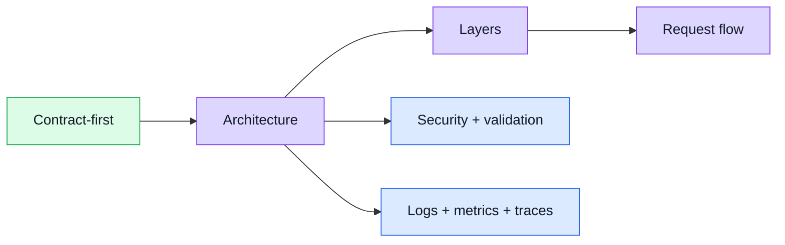

# Theory

This section explains **how the boilerplate thinks**.
It is about patterns and structure, not product details.

## Theory in one screen

## Main strategies already present in the code

- **Contract first**: the [API section](../api/) starts from [`openapi.yaml`](../api/openapi-workflow.md#openapi-is-the-source-of-truth).
- **Layered backend**: routes -> middlewares -> controllers -> services -> repositories -> models.
- **Database isolation**: Mongoose queries stay near repositories, not scattered through controllers.
- **Fail-open optional infrastructure**: [Redis](../tools/redis-cache.md), [Winston](../tools/winston.md), [Tempo](../tools/tempo.md), and [PostHog](../tools/posthog.md) improve behavior when configured, but the app keeps running when they are disabled.
- **Promise-oriented style**: the codebase often prefers promise chaining over large `async` / `await` + `try/catch` blocks.
- **Boilerplate over product detail**: examples are intentionally generic so the same shape can be reused in other variants.

## Where each topic lives

| Need                                | Go to                                    |
| ----------------------------------- | ---------------------------------------- |
| Understand the big blocks and boundaries | [Architecture](./architecture.md)    |
| Read the folder-by-folder explanation | [Layers](./layers.md)                  |
| Follow one request end-to-end       | [Request Flow](./request-flow.md)        |
| Understand process model & shutdown | [Clustering & Shutdown](./clustering.md) |
| Understand dependency choices       | [Tools](../tools/)                       |
| Change contract, types, or mocks    | [API](../api/)                           |
