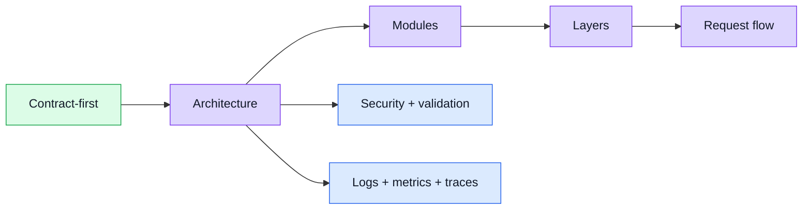
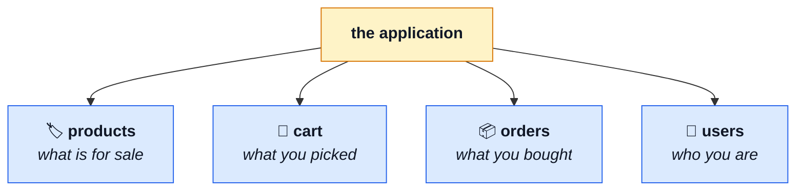
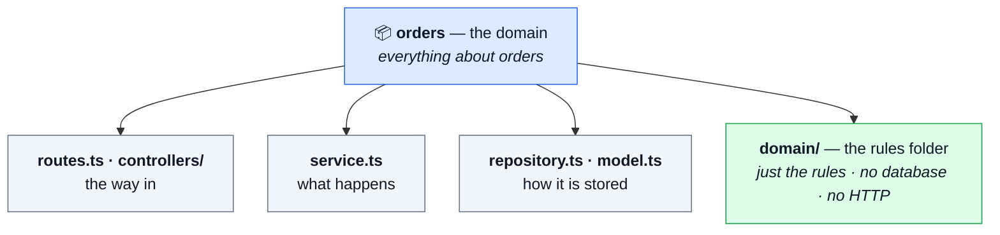
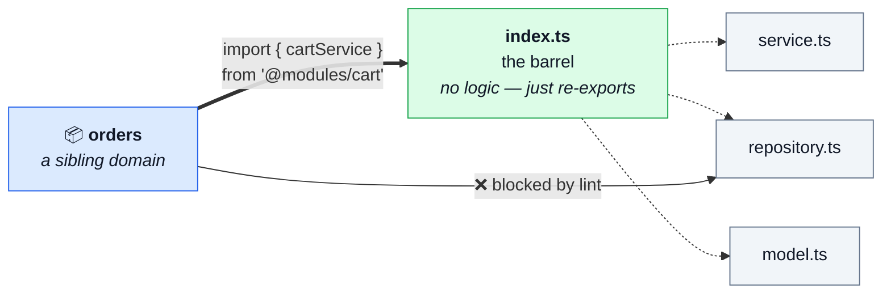

# Theory

This section explains **how the boilerplate thinks**.
It is about patterns and structure, not product details.

## Theory in one screen

```mermaid
%%{init: {'flowchart': {'nodeSpacing': 50, 'rankSpacing': 65}}}%%
flowchart LR
    Contract[Contract-first] --> Architecture[Architecture]
    Architecture --> Modules[Modules]
    Modules --> Layers[Layers]
    Layers --> Flow[Request flow]
    Architecture --> Safety[Security + validation]
    Architecture --> Signals[Logs + metrics + traces]

    classDef contract fill:#dcfce7,stroke:#16a34a,color:#111827;
    classDef structure fill:#ddd6fe,stroke:#7c3aed,color:#111827;
    classDef ops fill:#dbeafe,stroke:#2563eb,color:#111827;
    class Contract contract;
    class Architecture,Modules,Layers,Flow structure;
    class Safety,Signals ops;
```

## The words these pages use

Two words appear on almost every page below, so they are worth ten lines here.

### A **domain** is one area of the business

Not a technical thing. Describe the shop out loud — "customers put **products** in a **cart**, then
place an **order**" — and the nouns you used are the domains.

```mermaid
%%{init: {'flowchart': {'nodeSpacing': 40, 'rankSpacing': 45}}}%%
flowchart TD
    APP["<b>the application</b>"]
    APP --> P["🏷️ <b>products</b><br/><i>what is for sale</i>"]
    APP --> C["🛒 <b>cart</b><br/><i>what you picked</i>"]
    APP --> O["📦 <b>orders</b><br/><i>what you bought</i>"]
    APP --> U["👤 <b>users</b><br/><i>who you are</i>"]

    classDef app fill:#fef3c7,stroke:#d97706,color:#111827;
    classDef dom fill:#dbeafe,stroke:#2563eb,color:#111827;
    class APP app;
    class P,C,O,U dom;
```

**One domain = one folder** under `src/modules/`. That is the whole rule, and it is what makes
"adding a domain is a folder plus a line, removing one is `rm -rf`" true.

### The confusing part: a domain contains a folder called `domain/`

Same word, two sizes. The **domain** is the whole business area; the **`domain/` folder** inside it
holds only the pure rules — the part you can test without a database.

```mermaid
%%{init: {'flowchart': {'nodeSpacing': 35, 'rankSpacing': 40}}}%%
flowchart TD
    D["📦 <b>orders</b> — the domain<br/><i>everything about orders</i>"]
    D --> R["<b>routes.ts · controllers/</b><br/>the way in"]
    D --> S["<b>service.ts</b><br/>what happens"]
    D --> RP["<b>repository.ts · model.ts</b><br/>how it is stored"]
    D --> DM["<b>domain/</b> — the rules folder<br/><i>just the rules · no database · no HTTP</i>"]

    classDef dom fill:#dbeafe,stroke:#2563eb,color:#111827;
    classDef pure fill:#dcfce7,stroke:#16a34a,color:#111827;
    classDef normal fill:#f1f5f9,stroke:#64748b,color:#111827;
    class D dom;
    class DM pure;
    class R,S,RP normal;
```

(`cart` is the one that splits `service.ts` into a `services/` folder — same layer, more files.)

The word shows up in four senses across this documentation. They are related, but not the same:

| When you read…                | It means                                                    | Example                           |
| ----------------------------- | ----------------------------------------------------------- | --------------------------------- |
| "a domain", "modular domains" | one business area = one folder in `src/modules/`            | `cart`, `orders`                  |
| "the `domain/` folder"        | the pure-rules layer _inside_ one of those                  | `orders/domain/rules.ts`          |
| "a domain event"              | a message one domain publishes so others need not import it | `kernel/events.ts`                |
| "the domain" (in DDD)         | the business itself, as a thing to be modelled              | [Domain layer](./domain-layer.md) |

It never means a DNS name on these pages.

### A **barrel** is a file that only re-exports

`index.ts` holds no logic. It collects what the outside is allowed to reach, so a sibling imports
one name instead of learning your folder layout — which is why lint can enforce the boundary.

```mermaid
%%{init: {'flowchart': {'nodeSpacing': 35, 'rankSpacing': 45}}}%%
flowchart LR
    SIB["📦 <b>orders</b><br/><i>a sibling domain</i>"]
    B["<b>index.ts</b><br/>the barrel<br/><i>no logic — just re-exports</i>"]
    S["service.ts"]
    R["repository.ts"]
    M["model.ts"]

    SIB ==>|"import { cartService }<br/>from '@modules/cart'"| B
    B -.-> S
    B -.-> R
    B -.-> M
    SIB -->|"❌ blocked by lint"| R

    classDef dom fill:#dbeafe,stroke:#2563eb,color:#111827;
    classDef barrel fill:#dcfce7,stroke:#16a34a,color:#111827;
    classDef inner fill:#f1f5f9,stroke:#64748b,color:#111827;
    class SIB dom;
    class B barrel;
    class S,R,M inner;
```

A module nothing imports has no barrel at all — `observability` is that case, and the absence is
the point.

## Main strategies already present in the code

- **Contract first**: the [API section](../api/) starts from [`openapi.yaml`](../api/openapi-workflow.md#openapi-is-the-source-of-truth).
- **Modular domains**: every domain lives in one folder under `src/modules/`, and adding or removing one is a folder plus a line in `src/modules.ts`. See [Modules](./modules.md).
- **Layered backend**: routes → middlewares → controllers → services → repositories → models, _inside_ each module. See [Layers](./layers.md).
- **Database isolation**: [Mongoose](../tools/mongodb-mongoose.md) queries stay near repositories, not scattered through controllers.
- **Fail-open optional infrastructure**: [Redis](../tools/redis-cache.md), [Winston](../tools/winston.md), [Tempo](../tools/tempo.md), and [product analytics](../tools/analytics.md) improve behavior when configured, but the app keeps running when they are disabled.
- **Promise-oriented style**: the codebase often prefers promise chaining over large `async` / `await` + `try/catch` blocks.
- **Boilerplate over product detail**: examples are intentionally generic so the same shape can be reused in other variants.

## Where each topic lives

| Need                                     | Go to                                                                       |
| ---------------------------------------- | --------------------------------------------------------------------------- |
| **Open the code for the first time**     | **[Reading Path](./reading-path.md)**                                       |
| Understand the big blocks and boundaries | [Architecture](./architecture.md)                                           |
| Understand how domains stay separable    | [Modules](./modules.md)                                                     |
| Actually add or remove a domain          | [Adding & Removing a Module](./module-lifecycle.md)                         |
| Understand the domain-modelling stance   | [Strategic DDD](./strategic-ddd.md), then [Tactical DDD](./tactical-ddd.md) |
| Read the folder-by-folder explanation    | [Layers](./layers.md)                                                       |
| Follow one request end-to-end            | [Request Flow](./request-flow.md)                                           |
| Know which sources an endpoint reads     | [Request Input](./request-input.md)                                         |
| Understand process model & shutdown      | [Clustering & Shutdown](./clustering.md)                                    |
| Understand dependency choices            | [Tools](../tools/)                                                          |
| Change contract, types, or mocks         | [API](../api/)                                                              |
