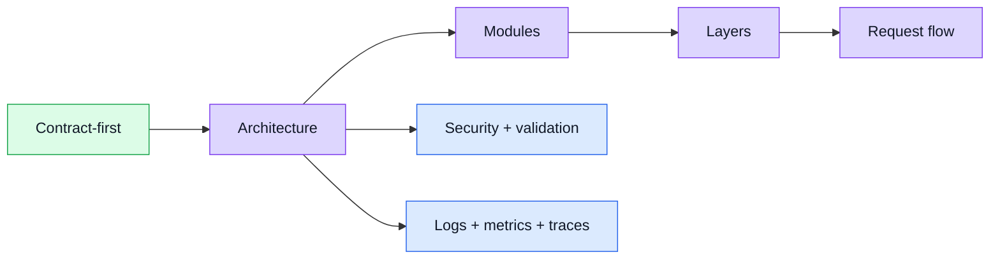

# Theory

This section explains **how the boilerplate thinks**.
It is about patterns and structure, not product details.

## Theory in one screen

```mermaid
%%{init: {'flowchart': {'nodeSpacing': 50, 'rankSpacing': 65}}}%%
flowchart LR
    Contract[Contract-first] --> Architecture[Architecture]
    Architecture --> Modules[Modules]
    Modules --> Layers[Layers]
    Layers --> Flow[Request flow]
    Architecture --> Safety[Security + validation]
    Architecture --> Signals[Logs + metrics + traces]

    classDef contract fill:#dcfce7,stroke:#16a34a,color:#111827;
    classDef structure fill:#ddd6fe,stroke:#7c3aed,color:#111827;
    classDef ops fill:#dbeafe,stroke:#2563eb,color:#111827;
    class Contract contract;
    class Architecture,Modules,Layers,Flow structure;
    class Safety,Signals ops;
```

## Main strategies already present in the code

- **Contract first**: the [API section](../api/) starts from [`openapi.yaml`](../api/openapi-workflow.md#openapi-is-the-source-of-truth).
- **Modular domains**: every domain lives in one folder under `src/modules/`, and adding or removing one is a folder plus a line in `src/modules.ts`. See [Modules](./modules.md).
- **Layered backend**: routes → middlewares → controllers → services → repositories → models, _inside_ each module. See [Layers](./layers.md).
- **Database isolation**: [Mongoose](../tools/mongodb-mongoose.md) queries stay near repositories, not scattered through controllers.
- **Fail-open optional infrastructure**: [Redis](../tools/redis-cache.md), [Winston](../tools/winston.md), [Tempo](../tools/tempo.md), and [PostHog](../tools/posthog.md) improve behavior when configured, but the app keeps running when they are disabled.
- **Promise-oriented style**: the codebase often prefers promise chaining over large `async` / `await` + `try/catch` blocks.
- **Boilerplate over product detail**: examples are intentionally generic so the same shape can be reused in other variants.

## Where each topic lives

| Need                                     | Go to                                    |
| ---------------------------------------- | ---------------------------------------- |
| Understand the big blocks and boundaries | [Architecture](./architecture.md)        |
| Add or remove a whole domain             | [Modules](./modules.md)                  |
| Read the folder-by-folder explanation    | [Layers](./layers.md)                    |
| Follow one request end-to-end            | [Request Flow](./request-flow.md)        |
| Know which sources an endpoint reads     | [Request Input](./request-input.md)      |
| Understand process model & shutdown      | [Clustering & Shutdown](./clustering.md) |
| Understand dependency choices            | [Tools](../tools/)                       |
| Change contract, types, or mocks         | [API](../api/)                           |
| See what is deliberately unfinished      | [Known Gaps](./known-gaps.md)            |
