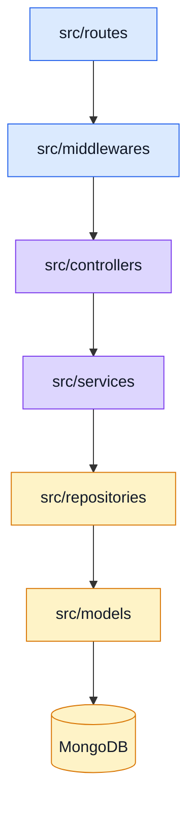
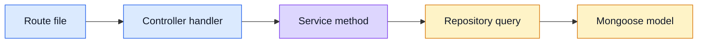

# Layers

This page is the **folder map**.
Use it when you want the exact implementation path without reading every source file.

## Layer stack

## Quick map

| Layer        | Folder             | Main job                                             |
| ------------ | ------------------ | ---------------------------------------------------- |
| Routes       | `src/routes`       | match URLs and attach middleware                     |
| Middlewares  | `src/middlewares`  | auth, authorization, rate limit, request guards      |
| Controllers  | `src/controllers`  | parse request, call services, send response          |
| Services     | `src/services`     | business rules and orchestration                     |
| Repositories | `src/repositories` | persistence queries                                  |
| Models       | `src/models`       | Mongoose schema/types                                |
| Utils        | `src/utils`        | shared helpers such as cache, logs, metrics, tracing |

## How to read a feature

### Example from this repo

For a product flow you usually move through:

- `src/routes/products.ts`
- `src/controllers/products/*`
- `src/services/products.ts`
- `src/repositories/products.ts`
- `src/models/products.ts`

That same shape is the real value of the boilerplate.
The entity names are examples.

## What each layer should not do

- Routes should not hide business logic.
- Controllers should not become query-heavy.
- Services should not depend on Express response objects.
- Repositories should not decide HTTP status codes.
- Models should not know route behavior.

## Why this is useful

- easier tests
- easier refactors
- easier stack swaps later
- easier onboarding when ADHD brain wants clear buckets

## Observability in one paragraph

Three signals, only one wired end-to-end by default:

- **Traces** (Tempo, via OpenTelemetry) — the timeline of one request, every DB and Redis call, every error.
- **Logs** (Winston → stdout) — slim per-request access logs and error logs, each carrying the `trace_id` that links back to a trace.
- **Metrics** (`/observability/metrics`, opt-in) — Prometheus exposition for HTTP rates/latency and a few business counters.

When something breaks, the log line gives you a `trace_id`, you paste it in Grafana → Tempo, and you get the full picture.

## Related pages

- [Architecture](./architecture.md)
- [Request Flow](./request-flow.md)
- [Runtime](../tools/runtime.md)
- [API overview](../api/#rest-patterns-used-here)
