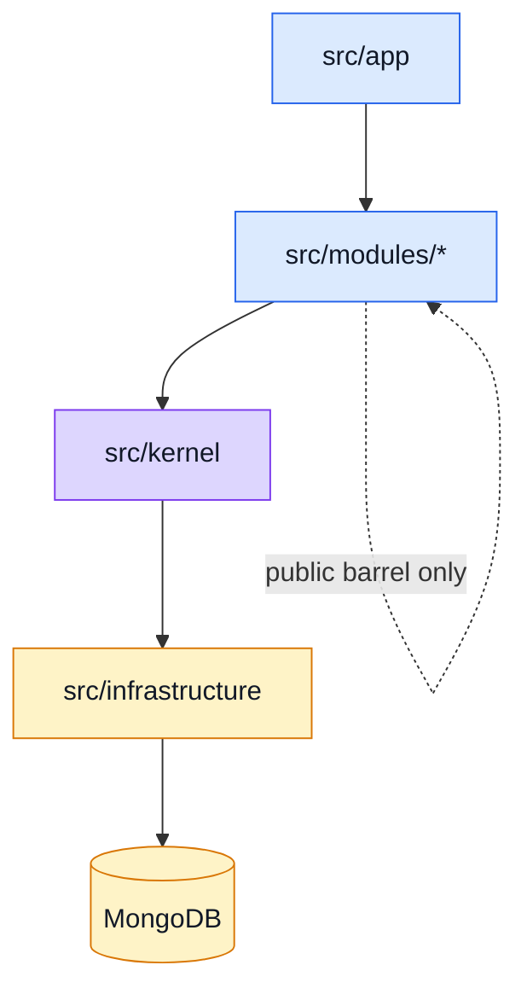
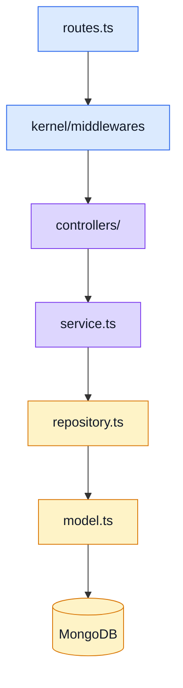
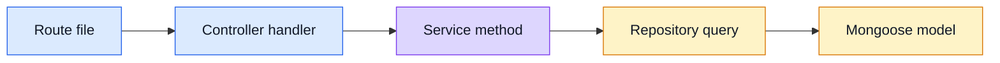

# Layers

This page is the **folder map**.
Use it when you want the exact implementation path without reading every source file.

There are two axes, and confusing them is the usual source of "where does this go?":

- **tiers** decide what a file is allowed to know — `infrastructure` never knows that modules exist,
  `kernel` knows they exist but never which ones, a module knows exactly one domain;
- **layers** decide what a file does within its domain — route, controller, service, repository,
  model. A module contains all five.

## Tier stack

```mermaid
%%{init: {'flowchart': {'nodeSpacing': 45, 'rankSpacing': 65}}}%%
flowchart TD
    A[src/app] --> M[src/modules/*]
    M --> P[src/kernel]
    P --> C[src/infrastructure]
    C --> DB[(MongoDB)]
    M -.->|public barrel only| M

    classDef domain fill:#dbeafe,stroke:#2563eb,color:#111827;
    classDef plat fill:#ddd6fe,stroke:#7c3aed,color:#111827;
    classDef base fill:#fef3c7,stroke:#d97706,color:#111827;
    class A domain;
    class M domain;
    class P plat;
    class C,DB base;
```

The rule, enforced by `no-restricted-imports`:

- `infrastructure` imports nothing above it;
- `kernel` may import `infrastructure`, never a module and never `app`;
- a module may import `infrastructure`, `kernel`, and **only the public barrel** of another module —
  `@modules/<name>`, never `@modules/<name>/service` — and never `app`;
- `app` may import anything: it is the tier allowed to know which domains exist;
- nothing outside a module imports its internals.

Two modules that each need the other are not a dependency pair. Either they are one module, or the
reverse edge becomes a domain event — see `src/kernel/events.ts`, and the catalogue/cart pair for
the worked example.

## Layer stack, inside one module

```mermaid
%%{init: {'flowchart': {'nodeSpacing': 45, 'rankSpacing': 65}}}%%
flowchart TD
    A[routes.ts] --> B[kernel/middlewares]
    B --> C[controllers/]
    C --> D[service.ts]
    D --> E[repository.ts]
    E --> F[model.ts]
    F --> G[(MongoDB)]

    classDef entry fill:#dbeafe,stroke:#2563eb,color:#111827;
    classDef infrastructure fill:#ddd6fe,stroke:#7c3aed,color:#111827;
    classDef data fill:#fef3c7,stroke:#d97706,color:#111827;
    class A,B entry;
    class C,D infrastructure;
    class E,F,G data;
```

## Quick map

| Tier           | Folder               | Main job                                                               |
| -------------- | -------------------- | ---------------------------------------------------------------------- |
| App            | `src/app`            | assembles this application; the only tier allowed to know every domain |
| Registry       | `src/modules.ts`     | the enabled module list — the one file that names every domain         |
| Modules        | `src/modules/*`      | one domain each, top to bottom; `index.ts` is its only public surface  |
| Kernel         | `src/kernel`         | the module system only: registry, event bus, auth port, the guard      |
| Infrastructure | `src/infrastructure` | technical substrate, Express and Mongoose included — see below         |

Four tiers, one alias each — `@app/*`, `@modules/*`, `@kernel/*`, `@infrastructure/*` — so every import
line says which boundary it crosses. [Modules](./modules.md) has the full picture and the reasoning,
including why these two are named `kernel` and `infrastructure` rather than `platform` and `core`.

Inside a module, the layer files are `routes.ts`, `controllers/*`, `service.ts`, `repository.ts`,
`model.ts`, plus `module.ts` (its manifest) and `index.ts` (its barrel).

### When `service.ts` becomes `services/`

A module's service starts as one file and stays one file for as long as reading it top to bottom is
practical. Past roughly **300 lines** it stops being practical, and the sanctioned move is a
`services/` folder with an `index.ts` — not a second module, and not a `helpers.ts` on the side.

This is a size rule, not an architectural one, and nothing above the layer changes: controllers
still import `../services`, the module barrel still exports one `<domain>Service`, and the tier
rules are untouched. It is written down because the alternative is worse in both directions — a
1,200-line `service.ts` nobody wants to open, or a split that feels like breaking the convention
and so gets done furtively.

Split by **what the operations do**, never by size alone. `cart` is the worked example, and it is
the only module past the threshold today:

| File          | What is in it                                                  |
| ------------- | -------------------------------------------------------------- |
| `view.ts`     | joining lines to products, and the shape the contract declares |
| `items.ts`    | reading a cart and changing what is in it                      |
| `checkout.ts` | turning a cart into an order, and the race that guards it      |
| `cleanup.ts`  | tearing down carts when a user or product is deleted           |

One of those files is usually internal — here `view.ts`, whose helpers the other three share and no
caller asks for by name. Export its **types** from the barrel, not its helpers.

### And `domain/`, if the module has rules

A module may also carry `domain/` — pure business rules, lint-guaranteed free of Express, Mongoose
and every tier. `orders` and `cart` have one; the rest do not, and that is the correct state rather
than a gap. [Domain Layer](./domain-layer.md) is the full page: what earns a place there, the
verdict-not-rejection shape, and when a module should instead go to full tactical DDD.

A module may also carry the things that used to live in shared registries, each named for what it
is: `audit.ts` (the actions it emits), `metrics.ts` (its Prometheus counters), `events.ts` (its
domain events), `seeds.ts` (its slice of the demo dataset) and `locales/` (its copy, in every
language it ships). None of these is enumerated anywhere central — `audit.ts`, `metrics.ts` and
`events.ts` register or augment themselves, while `seeds` and `locales` are declared in the
manifest so the seeder and the i18n boot can walk the registry without naming a domain.

A module does not have to serve HTTP. The manifest is a union of two alternatives — one carrying
`basePath` **and** `routes`, one carrying neither — so a domain that owns a collection and no URL is
a first-class entry rather than a special case. `audit-logs` is the example: it owns the audit
trail, while the endpoint that reads it, `GET /observability/audit`, belongs to the dashboard that
renders it. The `never` typing means a router without a mount point (or the reverse) is a type error
at the manifest, not a route that silently never registers.

There are no layer directories. `src/controllers`, `src/services`, `src/repositories` and
`src/models` existed while the domains were being migrated and were deleted with the last of them;
their path aliases are gone from `tsconfig.json` too, and lint rejects them from inside a module so
a re-created folder cannot quietly become a second home for domain code.

There is also no top-level `middlewares/`, `jobs/`, `routes/` or `workers/`. Each was a directory
named after a MECHANISM rather than a tier, and three of them held a single file:

| Was                                    | Is now                                    | Why                                            |
| -------------------------------------- | ----------------------------------------- | ---------------------------------------------- |
| `src/middlewares/*`                    | `src/infrastructure/http/middlewares/*`   | domain-free pipeline; survives with no modules |
| `src/middlewares/auth-jwt.ts`          | `src/kernel/middlewares/` + a port        | needed a user; see [Modules](./modules.md)     |
| `src/modules/account/token-cleanup.ts` | `src/modules/account/`                    | it is account's token lifecycle                |
| `src/workers/*`                        | `src/infrastructure/adapters/*.worker.ts` | the consumer half of an adapter                |
| `src/routes/index.ts`                  | `src/app/system-routes.ts`                | the ping belongs to no domain                  |
| `src/bootstrap/*`                      | `src/app/*`                               | assembling this application                    |
| `src/core/*`                           | `src/infrastructure/*`                    | the name meant the opposite half elsewhere     |
| `src/platform/*`                       | `src/kernel/*`                            | it is a microkernel, not a base layer          |

`src/app` is the assembly tier: the only place that reaches both `src/infrastructure` and every module.

`src/infrastructure` is the bottom of the dependency graph: it may be imported by any
layer above, and may never import from them. ESLint enforces this.

| Folder                         | Main job                                                                                                                                                                |
| ------------------------------ | ----------------------------------------------------------------------------------------------------------------------------------------------------------------------- |
| `infrastructure/runtime`       | runs once at startup: env validation, DB connect, [OTel SDK](../tools/opentelemetry.md), graceful shutdown                                                              |
| `infrastructure/adapters`      | clients owning an external connection: [cache](../tools/redis-cache.md), [queue](../tools/rabbitmq.md), mailer, storage, [logger](../tools/winston.md), filesystem, PDF |
| `infrastructure/observability` | [metrics](../tools/prometheus.md), [tracing](../tools/opentelemetry.md) helpers, audit, analytics, SSE stream                                                           |
| `infrastructure/http`          | Express-coupled request/response helpers, and in `middlewares/` the domain-free pipeline: cache, locale, rate limiting, access logs, observability context, route flags |
| `infrastructure/persistence`   | mongoose substrate every collection shares: the base repository, search/pagination filters, the serialization transform                                                 |

Note what is **not** in that table: no `totals.ts`, no shared pricing, no "utils". The substrate
holds no business rule, however many modules want one — see the `infrastructure` / `kernel` line in
[Modules](./modules.md).

## How to read a feature

```mermaid
%%{init: {'flowchart': {'nodeSpacing': 50, 'rankSpacing': 60}}}%%
flowchart LR
    Route[Route file] --> Controller[Controller handler]
    Controller --> Service[Service method]
    Service --> Repository[Repository query]
    Repository --> Model[Mongoose model]

    classDef entry fill:#dbeafe,stroke:#2563eb,color:#111827;
    classDef infrastructure fill:#ddd6fe,stroke:#7c3aed,color:#111827;
    classDef data fill:#fef3c7,stroke:#d97706,color:#111827;
    class Route,Controller entry;
    class Service infrastructure;
    class Repository,Model data;
```

### Example from this repo

For a product flow you usually move through:

- `src/modules/products/routes.ts`
- `src/modules/products/controllers/*`
- `src/modules/products/service.ts`
- `src/modules/products/repository.ts`
- `src/modules/products/model.ts`

All five sit in one folder, which is the point: the flow is readable without leaving the directory,
and deleting the directory deletes the domain.

That same shape is the real value of the boilerplate.
The entity names are examples.

### Adding a domain

One folder under `src/modules/` with a `module.ts`, plus one line in `src/modules.ts`. Nothing
else — not the route mounting, not the lint config.

Add an `index.ts` when another module needs something from this one, and export the narrowest thing
that satisfies it: the barrel is a promise that the shape will not move. A module nothing imports
has no barrel at all — `observability` is the case, and the absence is what makes the boundary
structural rather than advisory.

### Removing a domain

`rm -rf src/modules/<name>` and delete its line from `src/modules.ts`. Whatever then fails to
compile is a real dependency another module declared on it, which is exactly what you want to see.

## What each layer should not do

- Routes should not hide business logic.
- Controllers should not become query-heavy.
- Services should not depend on Express response objects.
- Repositories should not decide HTTP status codes.
- Models should not know route behavior.

## Why this is useful

- easier tests
- easier refactors
- easier stack swaps later
- easier onboarding when ADHD brain wants clear buckets

## Observability in one paragraph

Three signals, only one wired end-to-end by default:

- **Traces** ([Tempo](../tools/tempo.md), via [OpenTelemetry](../tools/opentelemetry.md)) — the timeline of one request, every DB and Redis call, every error.
- **Logs** ([Winston](../tools/winston.md) → stdout) — slim per-request access logs and error logs, each carrying the `trace_id` that links back to a trace.
- **Metrics** (`/observability/metrics`, opt-in) — [Prometheus](../tools/prometheus.md) exposition for HTTP rates/latency and a few business counters.

When something breaks, the log line gives you a `trace_id`, you paste it in [Grafana](../tools/grafana.md) → Tempo, and you get the full picture.

Those are the three that leave the process. The application emits four more — audit, analytics, the SSE metrics feed and queue jobs — and [Events & Logging](../tools/events-and-logging.md) is the map of all seven and when to use which.

## Related pages

- [Architecture](./architecture.md)
- [Domain Layer](./domain-layer.md) — where a business rule goes, and the `domain/` folder
- [Request Flow](./request-flow.md)
- [Runtime](../tools/runtime.md)
- [API overview](../api/#rest-patterns-used-here)
