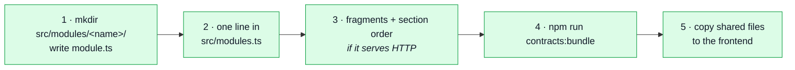
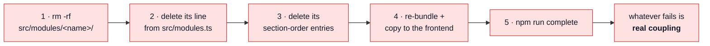
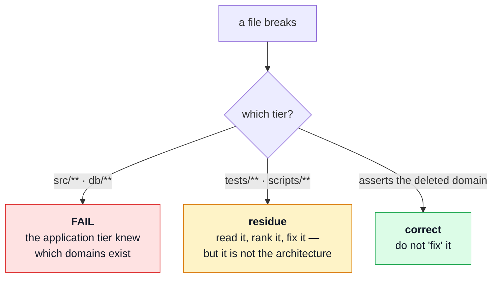
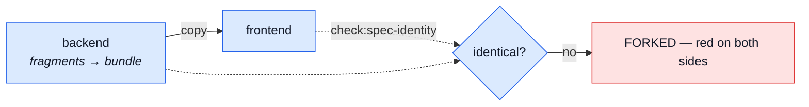

# Adding & removing a module

The procedure, in order, with the commands. [Modules](./modules.md) is the reasoning behind the
shape; this page is what you actually type.

Both halves are the same claim read in two directions:

> A domain is one folder plus one registry line. Adding it costs a folder and a line; removing it
> costs `rm -rf` and a line. Anything else that breaks is **real coupling**, and seeing it is the
> point.

That claim is not aspirational — `wishlist` was added under it, and three domains were deleted under
it. What each one actually cost is recorded below, honestly, including the parts that are more than
one line.

## The registries, all four of them

A module is named in exactly four places, and three of them are conditional. Knowing which ones
apply to your domain is most of both procedures:

| Registry              | File                                    | Applies when                       |
| --------------------- | --------------------------------------- | ---------------------------------- |
| `enabledModules`      | `src/modules.ts`                        | **always**                         |
| `MODULE_SECTIONS`     | `scripts/contracts/openapi.ts`          | the domain serves HTTP             |
| `ANALYTICS_SECTIONS`  | `scripts/contracts/analytics-events.ts` | the domain has an `analytics.ts`   |
| `ASYNC_SECTION_ORDER` | `scripts/contracts/asyncapi.ts`         | the domain owns an `asyncapi.yaml` |
| `SHARED_SECTIONS`     | `scripts/contracts/asyncapi.ts`         | …and an API client can reach it    |

A fifth list is _nearly_ one and is worth knowing about: a module that declares `probes.ts` is
imported by name in `scripts/contracts/generate-collections.ts`. It is not in the table because it
needs no discipline — it is a real import, so deleting the module stops the build on its own rather
than waiting for a bundle to come out quietly short.

There used to be a `SEED_SECTION_ORDER` here too. It is gone: the demo dataset stopped being
assembled from per-module text and is now **published** — `npm run seed:export` seeds a throwaway
database with the real seeders and writes what the API answers to `db/demo/demo-data.json`. A module
states its records in an ordinary `demo.ts` that its own code imports, so there is nothing to list.
Its staleness check is `npm run check:seed-export`.

Nothing else enumerates domains. Route mounting, the seeder, the i18n boot, the audit vocabulary and
the metrics registry all walk the registry instead — which is why none of them appears in either
checklist.

The last three exist because **the contract is fragmented and shared with the paired frontend**.
They are the price of one document assembled from per-module pieces, not a leak. Leaving one stale
is a hard error naming the missing file:

```
Error: [analytics-events] src/infrastructure/observability/analytics-events.frontend.ts
  names a fragment that does not exist:
  src/modules/products/analytics.ts
  Deleting a domain means deleting its entry from the bundle's section list too —
  and mirroring both in the paired repo.
```

---

## Adding a module



### 1 · The folder

At minimum a `module.ts`. Everything else is the domain's own business — add a file when the domain
needs it, not because the table has a row for it.

```
src/modules/<name>/
    module.ts                      the manifest — the only file src/modules.ts imports
    routes.ts                      if it serves HTTP
    controllers/*.ts               ditto
    service.ts                     if it has behaviour
    services/                      instead of service.ts, once one file stops being readable
    repository.ts · model.ts       if it owns a collection
    domain/                        if it has rules worth proving without a database
    providers/                     if it owns an outbound port — see payments/
    index.ts                       ONLY if a sibling imports this module
    locales/{en,it,es}.json        if it produces user-facing text
    audit.ts · metrics.ts          if it records actions or numbers
    events.ts · emails.ts          if it publishes events or sends mail
    openapi.yaml                   its standalone slice of the REST contract
    asyncapi.yaml                  the same, if it owns a channel
    probes.ts                      the requests a spec cannot describe
    analytics.ts                   the event names it emits
    factory.ts · demo.ts          how its records are built, and the demo ones
    tests/unit/ · tests/contract/  co-located, deleted with the module
```

Everything at that root is a layer or a self-registering slot; everything that is a **subject**
is a folder named for it. That is the rule, and it is what decides where a new file goes when the
list above has no row for it. `openapi.yaml` and `probes.ts` are the contract slice this module
owns; [Contract Ownership & Fragmentation](../api/contract-fragmentation.md) is what reads them.

`wishlist` is the reference: it was the first module added after the registry existed, and its tree
is exactly the list above minus the parts it does not need (no `index.ts`, since nothing imports it;
no `audit.ts`; no `emails.ts`).

The manifest is the whole contract between the domain and the application:

```ts
// src/modules/wishlist/module.ts
import path from 'node:path';
import type { AppModule } from '@kernel/registry';
import { router } from './routes';
import { seedWishlistCollection } from './demo';

export default {
    name: 'wishlist',
    subdomain: 'supporting',
    language: {
        Wishlist: 'One saved list per user. Holds product references and nothing else.'
    },
    basePath: '/wishlist',
    routes: router,
    dependsOn: [
        {
            module: 'products',
            as: 'conformist',
            because:
                'Reads catalogue documents as they are — a saved line is meaningless without the product it points at.'
        },
        {
            module: 'users',
            as: 'conformist',
            because: 'Reads the account the list belongs to, and listens for its destruction.'
        }
    ],
    locales: path.join(__dirname, 'locales'),
    seeds: seedWishlistCollection
} satisfies AppModule;
```

`dependsOn` names **siblings, not files**. Declare it and the registry fails the boot — by name — if
that sibling is not enabled. Leave it out and the failure is a 500 on the first request that crosses
the gap.

Three fields on that manifest are strategic rather than operational, and all three are required:

| Field            | What it says                                                       | What refuses it                                                                     |
| ---------------- | ------------------------------------------------------------------ | ----------------------------------------------------------------------------------- |
| `subdomain`      | `core`, `supporting` or `generic` — how much modelling is worth it | a `generic` module carrying a `domain/` folder fails `subdomain-discipline.test.ts` |
| `language`       | the terms this module uses, as it means them                       | an empty or placeholder glossary fails the same suite                               |
| `as` / `because` | what kind of relationship each edge is, and why                    | an edge nothing imports, or an import no edge declares, fails `context-map.test.ts` |

The temptation is to fill these in later. Do not: the questions are easiest to answer while you
still remember why you drew the boundary, and hardest once the module is six months old. See
[Strategic DDD](./strategic-ddd.md).

::: tip A domain with no URL is a first-class module
Omit `basePath` and `routes` entirely and you get a headless module — `audit-logs` is one. The
manifest type is a union with `never`s on both alternatives, so declaring a router with no mount
point is a type error rather than a route that silently never registers.
:::

### 2 · The line

```ts
// src/modules.ts
import wishlist from './modules/wishlist/module';

export const enabledModules: AppModule[] = [account, auditLogs, cart /* … */, wishlist];
```

Keep the array alphabetical. Order only decides route-mounting sequence, which is irrelevant for
distinct base paths, so alphabetical keeps diffs boring.

**Stop here if the domain serves no HTTP.** It is mounted, seeded, translated, audited and measured
already — nothing below applies.

### 3 · The fragments and their section entries

Write `openapi.yaml`, add the domain to `MODULE_SECTIONS`, and add its paths to the root's index. Do
the same for `ANALYTICS_SECTIONS` if you wrote an `analytics.ts`, and for `ASYNC_SECTION_ORDER` if
you wrote an `asyncapi.yaml`. A `demo.ts` needs no entry anywhere — the dataset is published from a
real seeding run, not assembled from a list.

An `asyncapi.yaml` costs one decision the others do not: whether the domain also belongs in
`SHARED_SECTIONS`. It does if a browser can reach the channels — an SSE stream, a websocket — and it
does not if they cross a broker the frontend cannot open. Shared sections land in
`asyncapi.public.yaml` and are copied to the paired frontend; the rest stay in `asyncapi.yaml` here.
Leaving a browser-facing section out is the quiet failure: the frontend generates types that do not
mention the channel, and nothing says why.

A section entry with no fragment on disk is the hard error shown above. A fragment on disk with no
section entry is worse — it is silently ignored, and the endpoint ships undocumented.

### 4 · Bundle

```bash
npm run contracts:bundle          # assembles openapi.yaml, both asyncapi bundles, analytics, seed identities
npm run lint:openapi              # spectral
```

`contracts:bundle` bundles the contract documents and stops there. The client collections are
generated and `.gitignore`d, so they are opt-in:

```bash
npm run contracts:bundle -- bruno insomnia mockoon postman
```

`contract.{bruno,insomnia,mockoon,postman}.*` land at the repo root, untracked, built from the committed
`openapi.yaml` and the demo dataset. They are generated and never hand-edited — a request the
contract cannot describe belongs in that module's `probes.ts`.

### 5 · The paired repo

`openapi.yaml` and the other shared bundles are byte-identical across the two repos. Copy them over
and run the identity gate on both sides:

```bash
npm run check:spec-identity
```

A red `spec-identity` after adding a domain is **correct** — it is the gate saying the frontend has
not received the regenerated files yet. See [the shared contract](#the-shared-contract-in-both-directions).

### 6 · Check

```bash
npm run complete
```

### What it actually cost

`wishlist`, measured:

|                                                  |                                                            |
| ------------------------------------------------ | ---------------------------------------------------------- |
| files added                                      | one folder                                                 |
| lines changed elsewhere                          | 1 in `src/modules.ts` + its section-order entries          |
| existing files needing an edit to accommodate it | **0**                                                      |
| generated unasked                                | the bundles; the client collections when asked for by name |

---

## Removing a module



### 1–3 · Delete the folder, the line, the entries

```bash
rm -rf src/modules/<name>
# delete the import and the array entry in src/modules.ts
# delete its entry from MODULE_SECTIONS / ANALYTICS_SECTIONS / ASYNC_SECTION_ORDER
# and, if it declared probes, from scripts/contracts/generate-collections.ts
```

Deleting a module named in another module's `dependsOn` stops the boot with the offending pair
named. That is the registry working — either delete the dependant too, or drop the edge.

### 4 · Re-bundle and mirror

```bash
npm run contracts:bundle
npm run lint:openapi
```

Spectral will report `oas3-unused-component` **warnings** for shared components in
`shared/contracts/` whose only referrers are gone. Warnings, not errors, and correct as far as the
tool can see — but they are the thing the next deletion trips over, so prune them while you know
which domain they belonged to.

Then copy the shared bundles to the frontend.

### 5 · Read the failures — they are not all equal

This is the part that makes the exercise worth running. Classify every failure by **which tier it
is in**, because only one tier is a verdict on the architecture:



**A break in `src/**`or`db/**` is the only real failure.** It means something in the application
tier named a domain, and that is the thing the four tiers exist to prevent.

Breaks under `tests/**` and `scripts/**` are residue. They are worth fixing, but they do not
invalidate the claim — and some of them are **supposed** to break:

| Break                                                             | Verdict                                                                                               |
| ----------------------------------------------------------------- | ----------------------------------------------------------------------------------------------------- |
| an integration test asserting a race between two deleted modules  | correct — no modules, no race                                                                         |
| `spec-identity` reporting the shared bundles as forked            | correct — deleting a domain **is** a two-repo change, and this is it saying so                        |
| a sweep canary whose floor was calibrated to the old module count | residue — compare the sweep against the disk instead, see [What it finds today](#what-it-finds-today) |
| a central spec importing the deleted module                       | residue — the spec used a domain as sample data                                                       |

---

## The shared contract, in both directions

`openapi.yaml` and its sibling bundles are shared **byte-identically** with the paired frontend.
Neither repo owns them alone, so both procedures end the same way:



So a red `spec-identity` in the middle of either procedure is a **step you have not done yet**, not
a bug. It goes green when the paired repo has the same bytes.

---

## Re-running the deletability check

The removal procedure doubles as an acceptance test, and it is worth running deliberately after any
significant change — not because it is expected to fail, but because the failures it finds are
invisible to `tsc`, to lint, and to a fully green suite.

Run it on a throwaway copy so nothing in the repo is touched:

```bash
SB=$(mktemp -d)                                   # outside the repo
rsync -a --exclude node_modules --exclude .git ./ "$SB"/
cp -al node_modules "$SB"/node_modules            # same filesystem, or copy it
cd "$SB"

rm -rf src/modules/{products,cart,orders}
# drop the imports + array entries from src/modules.ts
npx tsc --noEmit                                  # THE assertion: 0 errors in db/**, and none
                                                  # in src/** from a module that did not DECLARE
                                                  # the dependency in its manifest

# drop them from MODULE_SECTIONS, ANALYTICS_SECTIONS, ASYNC_SECTION_ORDER,
# and from generate-collections.ts if any of them declared probes
npm run contracts:bundle
npx spectral lint openapi.yaml --ruleset spectral.yaml
npm test                                          # everything else: a report, not a verdict
```

Pick domains that are **depended upon**, not leaves — deleting a leaf proves very little. The three
above are the interesting set because `cart → products`, `cart → orders` and `orders → products` are
all declared edges.

### What it finds today

Re-run 2026-08-16, at thirteen modules: **62 type errors across 26 files, 47 of them under `src/`.**
Read them in three piles, because only one is a problem — and it is empty.

**Legitimate — ten production files across four modules.** `delivery`, `inventory`, `payments` and
`wishlist` stop compiling because they genuinely depend on what was deleted, and each one
**declares** that in `dependsOn`. This is the DAG working: deleting a supplier breaks its customers,
the registry would refuse the boot with the offending pair named, and the answer is to delete the
dependents too or pick a different set. An earlier run of this check reported "zero files in `src/`"
— that was true when those four modules did not exist, not a property that was lost. **`db/**` is
still at zero\*\*, and that is the number this exercise is actually defending.

**Correct — the section lists and the co-located specs that assert a deleted domain.** Six of the
errors are `scripts/contracts/analytics-events.ts` and `generate-collections.ts` naming
`products`/`cart`/`orders`, which is step 3 of the removal procedure announcing itself rather than
residue. Ten more are the four dependent modules' own `tests/unit` and `tests/contract` files, which
go with their modules.

**Residue — the rest.** Central specs using a domain as sample data:
`tests/unit/infrastructure/observability/analytics.test.ts` (three modules' `analytics.ts`),
`mailer-templates.test.ts` (three modules' `emails.ts`),
`tests/integration/concurrency/cart-races.test.ts` (correct — no modules, no race) and
`tests/contract/request-contract.test.ts`. Plus one worth naming separately: `account`'s own
address-book specs import `products` and `cart` factories from a module `account` does not depend
on, which `module-test-boundaries.test.ts` permits (a sibling's `tests/` is a legal reach) and only
this exercise makes visible.

The sweep canaries are **no longer in that pile.** They stated their floor as a literal calibrated
to the nine-module build — `expect(files.length).toBeGreaterThanOrEqual(6)` and friends — and the
interesting part is how they failed: not by breaking, but by going **slack**. Nine-module floors
against a thirteen-module repo pass even with three domains deleted, so they had stopped asserting
anything at all. Each now compares the sweep against the disk (`owners` equals the modules that have
a `tests/` directory) with a floor of `≥ 1`, which both survives a deletion and actually bites when
a walk silently misses a module.

### Why this is a procedure and not a test

Nothing in the suite runs the deletion, and that is deliberate — the interesting failures are the
ones a sweep cannot express:

- **A count calibrated to the current build.** `expect(files.length).toBeGreaterThanOrEqual(6)` is
  a copy of `src/modules.ts` expressed as an integer, in a file that mentions no domain and
  therefore reads as domain-free. There is no name to grep for. The fix is per-canary — assert the
  sweep is consistent with the disk (`found.length === onDisk.length`) with a floor of `≥ 1`.
- **A mechanism test using a domain as sample data.** `mailer-templates.test.ts` imports three
  modules' `emails.ts` to render every template. Every one of those imports is through a legitimate
  public surface, so no import rule can distinguish it from a correct one. What makes it fragile is
  the _reason_ for the import, and that is a judgement call.
- **A named export from a generated file.** ~~`generate-collections.ts` imports `seedProducts` and
  `seedOrders` by name~~ — fixed when the dataset stopped being a bundle. It reads
  `db/demo/demo-data.json` now and indexes into `collections.products` / `collections.orders`, which
  is _whatever the seeders produced_ rather than two domain-shaped identifiers. Kept here as the
  worked example: the fix was not a lint rule, it was removing the reason the import existed.

    The same file imports domain names again today — `src/modules/<name>/probes.ts`, for the four
    modules that declare probes — and that one is deliberate. The difference is what the import is
    _for_: `seedProducts` was a domain used as a convenient handle on data the file could have read
    generically, while a probe is a thing the module genuinely owns and nothing else can supply. So
    the break it produces is informative rather than annoying, which is the whole test. An import that
    fails loudly when a module goes away is not coupling to design out; it is the checklist entry the
    compiler is holding for you.

- **A whole-word scan for domain names.** Tried and rejected: `observability` and `locales` are
  module names _and_ infrastructure folder names, and `db/migrations/**` names collections forever
  by design. The false-positive rate makes it unusable.

What the suite does cover is the neighbouring ground: `module-test-boundaries.test.ts` holds a
co-located spec to its sibling's barrel, and `request-sources.test.ts` keeps every mounted route in
the spec and every spec operation mounted. Neither is a substitute for actually deleting a folder.

## Related pages

- [Modules](./modules.md) — why the shape is what it is
- [Layers](./layers.md) — the layer stack inside one module
- [Contract Ownership & Fragmentation](../api/contract-fragmentation.md) — how fragments become bundles
