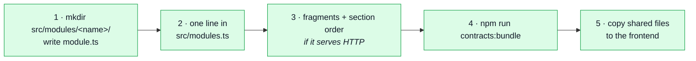
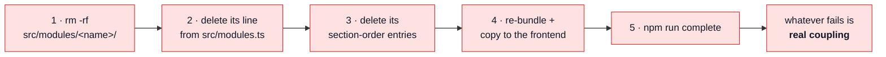
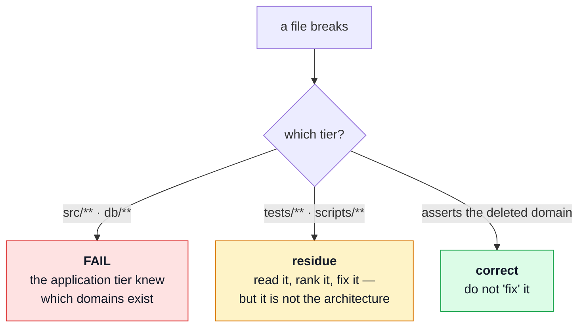
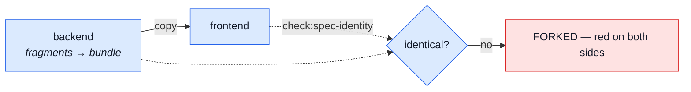

# Adding & removing a module

The procedure, in order, with the commands. [Modules](./modules.md) is the reasoning behind the
shape; this page is what you actually type.

Both halves are the same claim read in two directions:

> A domain is one folder plus one registry line. Adding it costs a folder and a line; removing it
> costs `rm -rf` and a line. Anything else that breaks is **real coupling**, and seeing it is the
> point.

That claim is not aspirational — `wishlist` was added under it, and three domains were deleted under
it. What each one actually cost is recorded below, honestly, including the parts that are more than
one line.

## The registries, all four of them

A module is named in exactly four places, and three of them are conditional. Knowing which ones
apply to your domain is most of both procedures:

| Registry                  | File                                   | Applies when                                   |
| ------------------------- | -------------------------------------- | ---------------------------------------------- |
| `enabledModules`          | `src/modules.ts`                       | **always**                                     |
| `SECTION_ORDER`           | `scripts/contracts/openapi.ts`         | the domain serves HTTP                         |
| `ANALYTICS_SECTION_ORDER` | `scripts/contracts/analyticsEvents.ts` | the domain has an `analytics.fragment.ts`      |
| `SEED_SECTION_ORDER`      | `scripts/contracts/seedIdentities.ts`  | the domain has a `seed-identities.fragment.ts` |

Nothing else enumerates domains. Route mounting, the seeder, the i18n boot, the audit vocabulary and
the metrics registry all walk the registry instead — which is why none of them appears in either
checklist.

The last three exist because **the contract is fragmented and shared with the paired frontend**.
They are the price of one document assembled from per-module pieces, not a leak. Leaving one stale
is a hard error naming the missing file:

```
Error: [analytics-events] src/infrastructure/observability/analytics-events.ts
  names a fragment that does not exist:
  src/modules/products/analytics.fragment.ts
  Deleting a domain means deleting its entry from the bundle's section list too —
  and mirroring both in the paired repo.
```

---

## Adding a module



### 1 · The folder

At minimum a `module.ts`. Everything else is the domain's own business — add a file when the domain
needs it, not because the table has a row for it.

```
src/modules/<name>/
    module.ts                      the manifest — the only file src/modules.ts imports
    routes.ts                      if it serves HTTP
    controllers/*.ts               ditto
    service.ts                     if it has behaviour
    repository.ts · model.ts       if it owns a collection
    index.ts                       ONLY if a sibling imports this module
    locales/{en,it,es}.json        if it produces user-facing text
    seeds.ts                       if it ships fixtures
    audit.ts · metrics.ts          if it records actions or numbers
    events.ts · emails.ts          if it publishes events or sends mail
    openapi/paths.yaml             its slice of openapi.yaml
    openapi/schemas.yaml           ditto
    analytics.fragment.ts          its slice of the analytics event catalogue
    seed-identities.fragment.ts    its slice of the shared seed identities
    tests/unit/ · tests/contract/  co-located, deleted with the module
    dev/                           GENERATED — do not hand-write
```

`wishlist` is the reference: it was the first module added after the registry existed, and its tree
is exactly the list above minus the parts it does not need (no `index.ts`, since nothing imports it;
no `audit.ts`; no `emails.ts`).

The manifest is the whole contract between the domain and the application:

```ts
// src/modules/wishlist/module.ts
import path from 'node:path';
import type { IAppModule } from '@kernel/registry';
import { router } from './routes';
import { seedWishlistCollection } from './seeds';

export default {
    name: 'wishlist',
    basePath: '/wishlist',
    routes: router,
    dependsOn: ['products', 'users'],
    locales: path.join(__dirname, 'locales'),
    seeds: seedWishlistCollection
} satisfies IAppModule;
```

`dependsOn` names **siblings, not files**. Declare it and the registry fails the boot — by name — if
that sibling is not enabled. Leave it out and the failure is a 500 on the first request that crosses
the gap.

::: tip A domain with no URL is a first-class module
Omit `basePath` and `routes` entirely and you get a headless module — `audit-logs` is one. The
manifest type is a union with `never`s on both alternatives, so declaring a router with no mount
point is a type error rather than a route that silently never registers.
:::

### 2 · The line

```ts
// src/modules.ts
import wishlist from './modules/wishlist/module';

export const enabledModules: IAppModule[] = [account, auditLogs, cart /* … */, wishlist];
```

Keep the array alphabetical. Order only decides route-mounting sequence, which is irrelevant for
distinct base paths, so alphabetical keeps diffs boring.

**Stop here if the domain serves no HTTP.** It is mounted, seeded, translated, audited and measured
already — nothing below applies.

### 3 · The fragments and their section entries

Write `openapi/paths.yaml` and `openapi/schemas.yaml`, then add the domain to `SECTION_ORDER`. Do
the same for `ANALYTICS_SECTION_ORDER` and `SEED_SECTION_ORDER` if you wrote those fragments.

A section entry with no fragment on disk is the hard error shown above. A fragment on disk with no
section entry is worse — it is silently ignored, and the endpoint ships undocumented.

### 4 · Bundle

```bash
npm run contracts:bundle          # assembles openapi.yaml, asyncapi.yaml, analytics, seed identities
npm run lint:openapi              # spectral
```

`contracts:bundle` bundles the fragment-authored documents **first**, then generates the collection
fragments from the fresh `openapi.yaml`, then assembles the client bundles. That order matters and
is already correct in the script — you do not need the two-step workaround that older notes describe.

The four files under `dev/` appear on their own. They are generated, committed, and never
hand-edited.

### 5 · The paired repo

`openapi.yaml` and the other shared bundles are byte-identical across the two repos. Copy them over
and run the identity gate on both sides:

```bash
npm run check:spec-identity
```

A red `spec-identity` after adding a domain is **correct** — it is the gate saying the frontend has
not received the regenerated files yet. See [the shared contract](#the-shared-contract-in-both-directions).

### 6 · Check

```bash
npm run complete
```

### What it actually cost

`wishlist`, measured:

|                                                  |                                                  |
| ------------------------------------------------ | ------------------------------------------------ |
| files added                                      | one folder                                       |
| lines changed elsewhere                          | 1 in `src/modules.ts` + 3 section-order entries  |
| existing files needing an edit to accommodate it | **0**                                            |
| generated unasked                                | 4 `dev/` fragments, the collections, the bundles |

---

## Removing a module



### 1–3 · Delete the folder, the line, the entries

```bash
rm -rf src/modules/<name>
# delete the import and the array entry in src/modules.ts
# delete its entry from SECTION_ORDER / ANALYTICS_SECTION_ORDER / SEED_SECTION_ORDER
```

Deleting a module named in another module's `dependsOn` stops the boot with the offending pair
named. That is the registry working — either delete the dependant too, or drop the edge.

### 4 · Re-bundle and mirror

```bash
npm run contracts:bundle
npm run lint:openapi
```

Spectral will report `oas3-unused-component` **warnings** for shared components in
`shared/contracts/` whose only referrers are gone. Warnings, not errors, and correct as far as the
tool can see — but they are the thing the next deletion trips over, so prune them while you know
which domain they belonged to.

Then copy the shared bundles to the frontend.

### 5 · Read the failures — they are not all equal

This is the part that makes the exercise worth running. Classify every failure by **which tier it
is in**, because only one tier is a verdict on the architecture:



**A break in `src/**`or`db/**` is the only real failure.** It means something in the application
tier named a domain, and that is the thing the four tiers exist to prevent.

Breaks under `tests/**` and `scripts/**` are residue. They are worth fixing, but they do not
invalidate the claim — and some of them are **supposed** to break:

| Break                                                             | Verdict                                                                                     |
| ----------------------------------------------------------------- | ------------------------------------------------------------------------------------------- |
| an integration test asserting a race between two deleted modules  | correct — no modules, no race                                                               |
| `spec-identity` reporting the shared bundles as forked            | correct — deleting a domain **is** a two-repo change, and this is it saying so              |
| a sweep canary whose floor was calibrated to the old module count | residue — see [Known gaps §7](./known-gaps.md#7-what-still-breaks-when-domains-are-deleted) |
| a central spec importing the deleted module                       | residue — the spec used a domain as sample data                                             |

---

## The shared contract, in both directions

`openapi.yaml` and its sibling bundles are shared **byte-identically** with the paired frontend.
Neither repo owns them alone, so both procedures end the same way:



So a red `spec-identity` in the middle of either procedure is a **step you have not done yet**, not
a bug. It goes green when the paired repo has the same bytes.

---

## Re-running the deletability check

The removal procedure doubles as an acceptance test, and it is worth running deliberately after any
significant change — not because it is expected to fail, but because the failures it finds are
invisible to `tsc`, to lint, and to a fully green suite.

Run it on a throwaway copy so nothing in the repo is touched:

```bash
SB=$(mktemp -d)                                   # outside the repo
rsync -a --exclude node_modules --exclude .git ./ "$SB"/
cp -al node_modules "$SB"/node_modules            # same filesystem, or copy it
cd "$SB"

rm -rf src/modules/{products,cart,orders}
# drop the imports + array entries from src/modules.ts
npx tsc --noEmit                                  # THE assertion: 0 errors in src/** and db/**

# drop them from SECTION_ORDER, ANALYTICS_SECTION_ORDER, SEED_SECTION_ORDER
npm run contracts:bundle
npx spectral lint openapi.yaml --ruleset spectral.yaml
npm test                                          # everything else: a report, not a verdict
```

Pick domains that are **depended upon**, not leaves — deleting a leaf proves very little. The three
above are the interesting set because `cart → products`, `cart → orders` and `orders → products` are
all declared edges.

### Why this is a procedure and not a test

Nothing in the suite runs the deletion, and that is deliberate — the interesting failures are the
ones a sweep cannot express:

- **A count calibrated to the current build.** `expect(files.length).toBeGreaterThanOrEqual(6)` is
  a copy of `src/modules.ts` expressed as an integer, in a file that mentions no domain and
  therefore reads as domain-free. There is no name to grep for. The fix is per-canary — assert the
  sweep is consistent with the disk (`found.length === onDisk.length`) with a floor of `≥ 1`.
- **A mechanism test using a domain as sample data.** `mailer-templates.test.ts` imports three
  modules' `emails.ts` to render every template. Every one of those imports is through a legitimate
  public surface, so no import rule can distinguish it from a correct one. What makes it fragile is
  the _reason_ for the import, and that is a judgement call.
- **A named export from a generated file.** `scripts/contracts/generateCollections.ts` imports
  `seedProducts` and `seedOrders` by name from `db/seeds/seed-identities.ts` — a legitimate path,
  a domain-shaped identifier. It should take the seed dataset as _whatever identities exist_, not as
  two named exports.
- **A whole-word scan for domain names.** Tried and rejected: `observability` and `locales` are
  module names _and_ infrastructure folder names, and `db/migrations/**` names collections forever
  by design. The false-positive rate makes it unusable.

What the suite does cover is the neighbouring ground: `module-test-boundaries.test.ts` holds a
co-located spec to its sibling's barrel, and `request-sources.test.ts` keeps every mounted route in
the spec and every spec operation mounted. Neither is a substitute for actually deleting a folder.

## Related pages

- [Modules](./modules.md) — why the shape is what it is
- [Layers](./layers.md) — the layer stack inside one module
- [Contract Ownership & Fragmentation](../api/contract-fragmentation.md) — how fragments become bundles
- [Known gaps](./known-gaps.md) — what is deliberately unfinished
