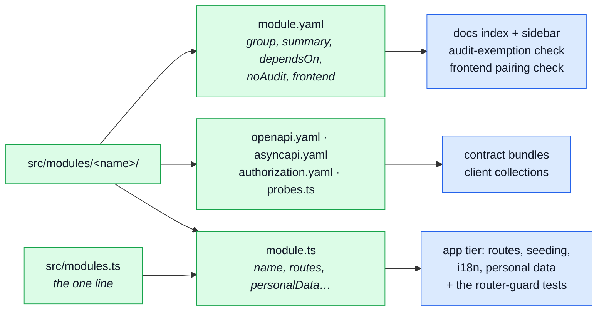
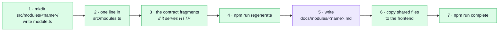
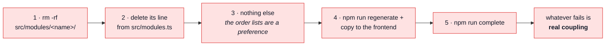
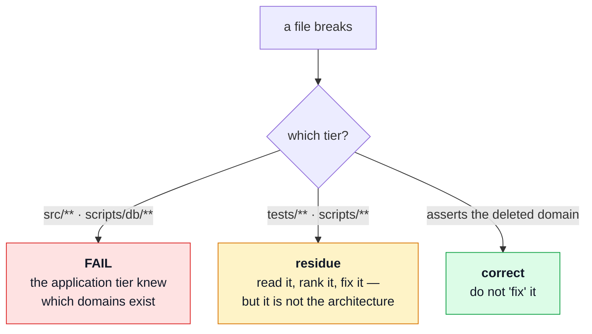
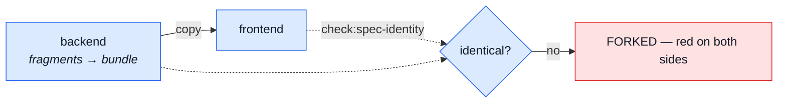

# Adding & removing a module

The procedure, in order, with the commands. [Modules](./modules.md) is the reasoning behind the
shape; this page is what you actually type.

Both halves are the same claim read in two directions:

> A domain is one folder plus one registry line. Adding it costs a folder and a line; removing it
> costs `rm -rf` and a line. Anything else that breaks is **real coupling**, and seeing it is the
> point.

That claim is not aspirational — `wishlist` was added under it, and three domains were deleted under
it. What each one actually cost is recorded below, honestly, including the parts that are more than
one line.

## The one registry, and everything that reads from the folder

A module is named in exactly one place that decides whether it exists: `enabledModules` in
`src/modules.ts`. Everything else a module has to say about itself sits in its own folder, and the
tables that used to be edited by hand read it from there.


```mermaid
%%{init: {'flowchart': {'nodeSpacing': 30, 'rankSpacing': 50}}}%%
flowchart LR
    M["src/modules/&lt;name&gt;/"] --> Y["module.yaml<br/><i>group, summary, dependsOn,<br/>noAudit, frontend</i>"]
    M --> F["openapi.yaml · asyncapi.yaml<br/>authorization.yaml · probes.ts"]
    M --> T["module.ts<br/><i>name, routes, personalData…</i>"]
    R["src/modules.ts<br/><i>the one line</i>"] --> T
    Y --> D["docs index + sidebar<br/>audit-exemption check<br/>frontend pairing check"]
    F --> B["contract bundles<br/>client collections"]
    T --> A["app tier: routes, seeding,<br/>i18n, personal data<br/>+ the router-guard tests"]
    classDef own fill:#dcfce7,stroke:#16a34a,color:#111827;
    classDef read fill:#dbeafe,stroke:#2563eb,color:#111827;
    class M,Y,F,T,R own;
    class D,B,A read;
```

| What a module declares                         | Read by                                                                                   |
| ---------------------------------------------- | ----------------------------------------------------------------------------------------- |
| `module.yaml#group`, `summary`                 | the docs index and the `/modules/` sidebar (`scripts/docs/module-catalogue.ts`)           |
| `module.yaml#noAudit` (a reason)               | `tests/cross-cutting/audit-actions.test.ts` — the reviewed "emits no audit action" answer |
| `module.yaml#frontend` (only if not same-name) | `tests/cross-cutting/frontend-pairing.test.ts`                                            |
| `openapi.yaml` (paths and tags)                | the root contract, completed by `scripts/contracts/root-assembly.ts`                      |
| `probes.ts`                                    | the client collections, loaded by directory scan                                          |
| `module.ts#routes`                             | the router-guard tests, through `enabledModules`                                          |

Three order lists remain, and they are a PREFERENCE, not a registry:

| List                 | File                                        | What it decides                                             |
| -------------------- | ------------------------------------------- | ----------------------------------------------------------- |
| `MODULE_ORDER`       | `scripts/contracts/openapi-bundle.ts`       | order only — where its paths sit in the OpenAPI bundle      |
| `MODULE_ASYNC_ORDER` | `scripts/contracts/asyncapi-bundles.ts`     | order only — where its channels sit in the AsyncAPI bundle  |
| `PREFERRED_ORDER`    | `scripts/contracts/authorization-bundle.ts` | order only — where its keys sit in the authorization bundle |

MEMBERSHIP is discovered from disk: a module folder either ships an `openapi.yaml` /
`asyncapi.yaml` / `authorization.yaml` or it doesn't, and `scripts/contracts/section-order.ts` puts
the discovered ones in the listed order, drops a listed module whose folder is gone, and appends
one the list has never heard of in alphabetical order. The root OpenAPI document is treated the
same way: `shared/contracts/openapi.root.yaml` keeps one `$ref` per module path in the order the
bundle has always had, and `assembleRoot` drops the entries of a module that is gone and appends
the paths and tags of one it has not seen. So neither adding nor removing a module needs an edit
to any of them — an edit only moves where the module sits, and the bundles of a full checkout keep
their historical order byte for byte.

An `asyncapi.internal.yaml` (a queue nothing outside this service reaches) and whether a module's
public `asyncapi.yaml` is frontend-visible are both fully automatic — see step 3 below — so neither
needs a registry line at all.

An `analytics.ts` needs no entry anywhere: `tests/cross-cutting/analytics-events.test.ts` sweeps the
module folders for one.

A library exactly one module imports is that module's too, though it needs no entry anywhere:
[Package Dependencies](../tools/package-dependencies.md) derives ownership straight from the
import graph. Adding one means running the [vetting rules](../tools/dependency-vetting.md) first
and writing a `## Libraries` section on the module's own page; removing the module removes the
library from `package.json` in the same change, once nothing else has started importing it. See
[Libraries a module owns](./modules.md#libraries-a-module-owns).

A module's demo records live in `scenarios/<name>.ts`, tabled by `scenarios/index.ts` — a list,
but not a hand-kept one of these four: adding an entry is optional (a module need not have demo
data at all), and forgetting to remove one after deleting a module is caught by
`tests/cross-cutting/scenario-fixtures.test.ts` rather than by a build failure. What the API
actually answers for a seeded row is not published anywhere; it is checked directly, against a
real database, by `tests/integration/scenarios/shop.test.ts`.

Nothing else enumerates domains. Route mounting, the seeder, the i18n boot, the audit vocabulary and
the metrics registry all walk the registry instead — which is why none of them appears in either
checklist.

What still names modules by hand, and why it is not a table a new module edits:

- **`AccountExportResponse`** in `shared/contracts/openapi.root.yaml` has one field per module that
  contributes a personal-data section — the export envelope is a contract, and a section a module
  adds is a contract change made deliberately.
- **Role grants** in `shared/authorization-roles.yaml` and the cases in
  `shared/authorization-conformance.yaml`. A module that introduces permission keys decides which
  roles hold them; the keys themselves live in the module's own `authorization.yaml`.
- **`WRITE_EXCEPTIONS`** in `tests/cross-cutting/write-routes-are-guarded.test.ts`, only for a
  module whose write route deliberately needs no permission key. A module whose writes all sit
  behind `requirePermission` adds nothing.

---

## Adding a module


```mermaid
%%{init: {'flowchart': {'nodeSpacing': 40, 'rankSpacing': 45}}}%%
flowchart LR
    A["1 · mkdir src/modules/&lt;name&gt;/<br/>write module.ts"] --> B["2 · one line in<br/>src/modules.ts"]
    B --> C["3 · the contract fragments<br/><i>if it serves HTTP</i>"]
    C --> D["4 · npm run regenerate"]
    D --> E["5 · write<br/>docs/modules/&lt;name&gt;.md"]
    E --> F["6 · copy shared files<br/>to the frontend"]
    F --> G["7 · npm run complete"]
    classDef s fill:#dcfce7,stroke:#16a34a,color:#111827;
    classDef d fill:#ede9fe,stroke:#7c3aed,color:#111827;
    class A,B,C,D,F,G s;
    class E d;
```

### 1 · The folder

At minimum a `module.ts` and a `module.yaml`. Everything else is the domain's own business — add a
file when the domain needs it, not because the table has a row for it.

```
src/modules/<name>/
    module.ts                      the manifest — the only file src/modules.ts imports
    module.yaml                    always — group, summary, subdomain, siblings it may reach; see strategic-ddd.md §2
    routes.ts                      if it serves HTTP
    controllers/*.ts               ditto
    service.ts                     if it has behaviour
    services/                      instead of service.ts, once one file stops being readable
    repository.ts · model.ts       if it owns a collection
    domain/                        if it has rules worth proving without a database
    providers/                     if it owns an outbound port — see payments/
    index.ts                       always — the convenience barrel, see strategic-ddd.md §5
    locales/{en,it,es}.json        if it produces user-facing text
    audit.ts · metrics.ts          if it records actions or numbers
    events.ts · emails.ts          if it publishes events or sends mail
    openapi.yaml                   its standalone slice of the REST contract
    asyncapi.yaml                  the same, if it owns a channel
    probes.ts                      the requests a spec cannot describe
    analytics.ts                   the event names it emits
    factories.ts                   how its test/demo records are built
    tests/unit/ · tests/contract/  co-located, deleted with the module

scenarios/<name>.ts                its demo records — outside src/, see tools/demo-profile.md
```

Everything at that root is a layer or a self-registering slot; everything that is a **subject**
is a folder named for it. That is the rule, and it is what decides where a new file goes when the
list above has no row for it. `openapi.yaml` and `probes.ts` are the contract slice this module
owns; [Contract Ownership & Fragmentation](../api/contract-fragmentation.md) is what reads them.

::: tip The module to copy is `feedback`
Start from [`feedback`](../modules/feedback.md), not from a shop module. It is `group: foundation`,
so it survives `npm run demo:remove` and depends on nothing; it also carries most of what a new
module reaches for — a public route above an admin gate, keyed writes, a rate-limit budget,
locales, a template, a personal-data section, an audit vocabulary and a contract slice.
`wishlist` was the first module added after the registry existed and is the smallest shop domain,
but a copy of a shop module starts life with a dependency on the shop that the foundation may
not have.
:::

A new `package.json` dependency this module alone needs is this module's, the moment nothing else
imports it — no registry entry, just the vetting rules and a `## Libraries` section on the
module's page. See [Libraries a module owns](./modules.md#libraries-a-module-owns).

**A config line outside the module is still the module's.** A scheduled job's `docker/crontab`
line, a compose service only it needs, an `.env-example` variable nothing else reads — none of
these can live under `src/modules/<name>/`, but deleting the module should still mean deleting
them. Wherever the file format allows a comment, that line carries:

```
# WARNING: owned by the <name> module — delete it when removing the module (docs/modules/<name>.md)
```

`package.json` is the one exception — its own comments do not survive `npm install`, so its
scripts are listed on the module's page instead (see step 5 below). A `scripts/ops/*.ts` script's own
docblock names the `npm run` entry and crontab line that go with it, the same way; see
`scripts/ops/sweep-webhook-retries.ts` for the pattern. `tests/cross-cutting/scheduled-jobs.test.ts` is
what turns a forgotten crontab line, or a script pointing at a file that no longer exists, into a
failing test rather than a silent 2am cron failure.

The manifest is the whole contract between the domain and the application:

```ts
// src/modules/feedback/module.ts (abridged)
import path from 'node:path';
import type { AppModule } from '@kernel/registry';
import { router } from './routes';

/**
 * Contact requests: anyone may file one, admins read and triage them. Records an email address
 * rather than referencing a user, since the form is open to people with no account. A leaf in
 * both directions.
 */
export default {
    name: 'feedback',
    basePath: '/feedback',
    routes: router,
    // REQUIRED, not optional — a module cannot compile without answering this. 'none' is the
    // explicit, reviewed answer for a module with nothing personal to export.
    personalData: [
        { section: 'feedback', collect: (subject) => findOwnTicketsForExport(subject.email) }
    ],
    locales: path.join(__dirname, 'locales')
} satisfies AppModule;
```

Every field here is read by something at boot — that is the bar for adding one. What the module
reaches for is its `import` statements, and how it reaches is the docblock above the manifest, in
prose, where a reader meets both at once. Write that docblock while you still remember why you drew
the boundary: the question is easiest to answer now and hardest once the module is six months old.
See [Strategic DDD](./strategic-ddd.md) for the four kinds of relationship worth naming in it.

::: tip A domain with no URL is a first-class module
Omit `basePath` and `routes` entirely and you get a headless module — `access` is one. The
manifest type is a union with `never`s on both alternatives, so declaring a router with no mount
point is a type error rather than a route that silently never registers.
:::

### 2 · The line

```ts
// src/modules.ts
import feedback from './modules/feedback/module';

export const enabledModules: AppModule[] = [account, auditLogs, cart /* … */, feedback];
```

Keep the array alphabetical. Order only decides route-mounting sequence, which is irrelevant for
distinct base paths, so alphabetical keeps diffs boring.

**Stop here if the domain serves no HTTP.** It is mounted, seeded, translated, audited and measured
already — nothing below applies.

### 3 · The fragments

Write `openapi.yaml`; its paths and tags reach the root contract by themselves
(`scripts/contracts/root-assembly.ts`). A line in `MODULE_ORDER` is optional —
it only chooses where the paths sit; without one the module is appended alphabetically. The same
goes for `MODULE_ASYNC_ORDER` if you wrote a top-level `asyncapi.yaml` (not `asyncapi.internal.yaml`
— see below). An `analytics.ts` needs no entry anywhere — the name is swept off disk. A
`scenarios/<name>.ts`, if the domain has demo data, needs one line in `scenarios/index.ts`'s table —
the rows themselves are produced by seeding the catalogue and driving the real endpoints at boot,
not assembled from a committed list.

Whether the channels reach a browser is a naming choice, not a registry entry: `asyncapi.yaml` IS
the module's public event catalogue — an SSE stream, a websocket — and lands in `asyncapi.public.yaml`,
copied to the paired frontend. `asyncapi.internal.yaml` is a queue crossing a broker the frontend
cannot open, and never leaves this bundle. A domain can own either, both, or neither.

A listed order entry with no fragment on disk is ignored, and a fragment on disk with no entry is
appended — neither fails the bundle, because membership is what is on disk. The same goes for a
`probes.ts`: the client collections find it by scanning the module folders.

### 4 · Bundle

```bash
npm run regenerate -- --no-sync   # bundles, generated client and schemas, every generated doc block
npm run lint:openapi              # spectral
```

`contracts:bundle` bundles the contract documents and stops there. The client collections are
generated and `.gitignore`d, so they are opt-in:

```bash
npm run contracts:bundle -- bruno insomnia mockoon postman
```

`contract.{bruno,insomnia,mockoon,postman}.*` land at the repo root, untracked, built from the committed
`openapi.yaml` and `scenarios/subjects.ts`'s example ids. They are generated and never hand-edited —
a request the contract cannot describe belongs in that module's `probes.ts`.

### 5 · The page

Write `docs/modules/<name>.md` by hand. Nothing generates it, and the shape every existing page
follows is three parts:

- the **At a glance** box — what it owns, what it depends on, what breaks if you change it
- **The story** — why the domain exists, the decisions that are not obvious from the code, the traps
- **Related pages** — the siblings and the horizontal pages a reader will want next

Copy [`feedback`'s page](../modules/feedback.md) — the same module you copied the code from — and
replace it. Do not
restate what the code already says — the routes are in `src/modules/<name>/routes.ts` and
`openapi.yaml`, the fields are in `model.ts`, and a page repeating either goes stale the first time
someone edits the source and not the prose. A module page owns the DECISION; the mechanism belongs
to a page under [Tools](../tools/) or [Theory](../theory/).

Then fill in the descriptor the page is listed from — no other registration:

- `summary` and `group` in `module.yaml` put the module in the index and the `/modules/` sidebar,
  under Foundation or Demo shop
- `frontend:` in `module.yaml`, only if the paired frontend module has a different name
- `noAudit:` in `module.yaml`, with the reason, only if the module deliberately emits no audit action

If the domain carries a file shape no other module has, give it a row in
[`docs/reference/src-modules.md`](../reference/src-modules.md) so the vocabulary stays written
down.

### 6 · The paired repo

`openapi.yaml` and the other shared bundles are byte-identical across the two repos. Copy them over
and run the identity gate on both sides:

```bash
npm run check:spec-identity
```

A red `spec-identity` after adding a domain is **correct** — it is the gate saying the frontend has
not received the regenerated files yet. See [the shared contract](#the-shared-contract-in-both-directions).

### 7 · Check

```bash
npm run complete
```

### What it actually cost

`wishlist`, measured when the registry tables were still edited by hand (today the section-order
entries and the docs registrations below are gone too):

|                                                  |                                                            |
| ------------------------------------------------ | ---------------------------------------------------------- |
| files added                                      | one folder                                                 |
| lines changed elsewhere                          | 1 in `src/modules.ts` + its section-order entries          |
| documentation written by hand                    | two sections of one page — the rest is generated           |
| existing files needing an edit to accommodate it | **0**                                                      |
| generated unasked                                | the bundles; the client collections when asked for by name |

---

## Removing a module


```mermaid
%%{init: {'flowchart': {'nodeSpacing': 40, 'rankSpacing': 45}}}%%
flowchart LR
    A["1 · rm -rf<br/>src/modules/&lt;name&gt;/"] --> B["2 · delete its line<br/>from src/modules.ts"]
    B --> C["3 · nothing else<br/><i>the order lists are a preference</i>"]
    C --> D["4 · npm run regenerate +<br/>copy to the frontend"]
    D --> E["5 · npm run complete"]
    E --> F["whatever fails is<br/><b>real coupling</b>"]
    classDef s fill:#fee2e2,stroke:#dc2626,color:#111827;
    class A,B,C,D,E,F s;
```

### 1–3 · Delete the folder and the line

```bash
rm -rf src/modules/<name>
# delete the import and the array entry in src/modules.ts
```

Its paths leave the contract, its probes leave the collections and its `module.yaml` entries leave
the docs with the folder — each is read from disk.

Deleting a module another one imports stops `tsc` on the importing file, naming the line. Either
delete the dependant too, or drop the import.

`tsc` also stops on a `scripts/ops/` script that runs the module — delete the script itself to fix it.
From there the chain flags the rest step by step rather than needing to be walked by hand:
`tests/cross-cutting/scheduled-jobs.test.ts` fails the `package.json` entry that named the
now-deleted script, and once that entry is gone too, the same test fails the `docker/crontab` line
that named IT.

A module that owns more outside `src/modules/` lists it on its own page — see
[webhooks](../modules/webhooks.md#not-wanted-remove-the-module).

Drop any `package.json` dependency this module owned alone too — [Package
Dependencies](../tools/package-dependencies.md), regenerated, shows which; a leftover reads as
still owned by a module that no longer exists.

### 4 · The page

```bash
rm docs/modules/<name>.md
# and any sub-pages it had, e.g. docs/modules/<name>-<flow>.md
```

Its index entry, its sidebar entry and its pairing statement all lived in its own `module.yaml`,
which went with the folder, so there is nothing to un-register. Deleting the page itself is still a
step you do by hand; nothing currently refuses a leftover one.

### 5 · Re-bundle and mirror

```bash
npm run contracts:bundle
npm run lint:openapi
```

Spectral will report `oas3-unused-component` **warnings** for shared components in
`shared/contracts/` whose only referrers are gone. Warnings, not errors, and correct as far as the
tool can see — but they are the thing the next deletion trips over, so prune them while you know
which domain they belonged to.

Then copy the shared bundles to the frontend.

### 6 · Read the failures — they are not all equal

This is the part that makes the exercise worth running. Classify every failure by **which tier it
is in**, because only one tier is a verdict on the architecture:


```mermaid
%%{init: {'flowchart': {'nodeSpacing': 35, 'rankSpacing': 45}}}%%
flowchart TD
    F["a file breaks"] --> Q{"which tier?"}
    Q -->|"src/** · scripts/db/**"| BAD["<b>FAIL</b><br/>the application tier knew<br/>which domains exist"]
    Q -->|"tests/** · scripts/**"| RES["<b>residue</b><br/>read it, rank it, fix it —<br/>but it is not the architecture"]
    Q -->|"asserts the deleted domain"| OK["<b>correct</b><br/>do not 'fix' it"]
    classDef bad fill:#fee2e2,stroke:#dc2626,color:#111827;
    classDef warn fill:#fef3c7,stroke:#d97706,color:#111827;
    classDef good fill:#dcfce7,stroke:#16a34a,color:#111827;
    class BAD bad;
    class RES warn;
    class OK good;
```

**A break in `src/**`or`scripts/db/**` is the only real failure.** It means something in the application
tier named a domain, and that is the thing the four tiers exist to prevent.

Breaks under `tests/**` and `scripts/**` are residue. They are worth fixing, but they do not
invalidate the claim — and some of them are **supposed** to break:

| Break                                                             | Verdict                                                                                               |
| ----------------------------------------------------------------- | ----------------------------------------------------------------------------------------------------- |
| an integration test asserting a race between two deleted modules  | correct — no modules, no race                                                                         |
| `spec-identity` reporting the shared bundles as forked            | correct — deleting a domain **is** a two-repo change, and this is it saying so                        |
| a sweep canary whose floor was calibrated to the old module count | residue — compare the sweep against the disk instead, see [What it finds today](#what-it-finds-today) |
| a central spec importing the deleted module                       | residue — the spec used a domain as sample data                                                       |

### What `demo:remove` does about the residue

`npm run demo:remove` (and `removeModules` in `scripts/ops/demo-remove-modules.ts`, which the
locales recipe of `measure:demo-strip` shares) takes the mechanical share of the residue out itself:

- **A test that imports a removed module is deleted**, and so is every test that imports one of
  those — `tests/support` helpers included. A test may also say `// requires-module: a, b` on a line
  of its own when it drives the kernel through a module's subjects without importing it.
- **The shared authorization files lose the module's keys.** `shared/authorization-roles.yaml` drops
  the grants, and `shared/authorization-conformance.yaml` drops the module's keys from every caller
  and every case about a subject only that module declared.
- **The scenario fixtures lose the module's slice** (`scenarios/<name>.ts` and its table entry).

Writing a test that survives this is one rule: **a test that needs a module to say something says so
in its imports, and a foundation test never borrows one as sample data.** A test about a foundation
module that also has shop cases keeps those cases in a file of their own (`shop.contract.test.ts`,
`checkout.test.ts`), so the strip removes exactly them. A sweep with an exact expected set filters it
through `isDeployed(<module>)` from `@tests/paths`, and a canary floor is a floor the foundation
modules alone clear.

---

## The shared contract, in both directions

`openapi.yaml` and its sibling bundles are shared **byte-identically** with the paired frontend.
Neither repo owns them alone, so both procedures end the same way:


```mermaid
%%{init: {'flowchart': {'nodeSpacing': 40, 'rankSpacing': 40}}}%%
flowchart LR
    BE["backend<br/><i>fragments → bundle</i>"] -->|copy| FE["frontend"]
    FE -.->|"check:spec-identity"| GATE{"identical?"}
    BE -.-> GATE
    GATE -->|no| RED["FORKED — red on both sides"]
    classDef n fill:#dbeafe,stroke:#2563eb,color:#111827;
    classDef r fill:#fee2e2,stroke:#dc2626,color:#111827;
    class BE,FE,GATE n;
    class RED r;
```

So a red `spec-identity` in the middle of either procedure is a **step you have not done yet**, not
a bug. It goes green when the paired repo has the same bytes.

---

## Re-running the deletability check

The removal procedure doubles as an acceptance test, and it is worth running deliberately after any
significant change — not because it is expected to fail, but because the failures it finds are
invisible to `tsc`, to lint, and to a fully green suite.

Run it on a throwaway copy so nothing in the repo is touched:

```bash
SB=$(mktemp -d)                                   # outside the repo
rsync -a --exclude node_modules --exclude .git ./ "$SB"/
cp -al node_modules "$SB"/node_modules            # same filesystem, or copy it
cd "$SB"

rm -rf src/modules/{products,cart,orders}
# drop the imports + array entries from src/modules.ts
npx tsc --noEmit                                  # THE assertion: 0 errors in scripts/db/**, and none
                                                  # in src/** from a module that did not DECLARE
                                                  # the dependency in its manifest

# and from generate-collections.ts if any of them declared probes
npm run contracts:bundle
npx spectral lint openapi.yaml --ruleset shared/contracts/spectral.yaml
npm test                                          # everything else: a report, not a verdict
```

Pick domains that are **depended upon**, not leaves — deleting a leaf proves very little. The three
above are the interesting set because `cart → products`, `cart → orders` and `orders → products` are
all declared edges.

### What it finds today

Re-run 2026-08-16, at thirteen modules: **62 type errors across 26 files, 47 of them under `src/`.**
Read them in three piles, because only one is a problem — and it is empty.

**Legitimate — ten production files across four modules.** `delivery`, `inventory`, `payments` and
`wishlist` stop compiling because they genuinely import what was deleted. That is a real coupling
failing loudly at the file and line that holds it, and the answer is to delete the dependents too or
pick a different set. An earlier run of this check reported "zero files in `src/`"
— that was true when those four modules did not exist, not a property that was lost.
**`scripts/db/**` is still at zero\*\*, and that is the number this exercise is actually defending.

**Correct — the section lists and the co-located specs that assert a deleted domain.** Six of the
errors were the section lists and `client-collections-bundle.ts` naming `products`/`cart`/`orders`, which
was the removal procedure announcing itself rather than residue (both are read from disk now). Ten more are the four dependent modules' own `tests/unit` and `tests/contract` files, which
go with their modules.

**Residue — the rest.** Central specs using a domain as sample data:
`tests/unit/infrastructure/observability/analytics.test.ts` (three modules' `analytics.ts`),
`mailer-templates.test.ts` (three modules' `emails.ts`),
`tests/integration/concurrency/cart-races.test.ts` (correct — no modules, no race) and
`tests/contract/request-contract.test.ts`. Plus one worth naming separately: `account`'s own
address-book specs import `products` and `cart` factories from a module `account` does not depend
on, which `eslint-plugin-boundaries` permits (a sibling's `tests/` is a legal reach) and only this
exercise makes visible.

The sweep canaries are **no longer in that pile.** They stated their floor as a literal calibrated
to the nine-module build — `expect(files.length).toBeGreaterThanOrEqual(6)` and friends — and the
interesting part is how they failed: not by breaking, but by going **slack**. Nine-module floors
against a thirteen-module repo pass even with three domains deleted, so they had stopped asserting
anything at all. Each now compares the sweep against the disk (`owners` equals the modules that have
a `tests/` directory) with a floor of `≥ 1`, which both survives a deletion and actually bites when
a walk silently misses a module.

### Why this is a procedure and not a test

Nothing in the suite runs the deletion, and that is deliberate — the interesting failures are the
ones a sweep cannot express:

- **A count calibrated to the current build.** `expect(files.length).toBeGreaterThanOrEqual(6)` is
  a copy of `src/modules.ts` expressed as an integer, in a file that mentions no domain and
  therefore reads as domain-free. There is no name to grep for. The fix is per-canary — assert the
  sweep is consistent with the disk (`found.length === onDisk.length`) with a floor of `≥ 1`.
- **A mechanism test using a domain as sample data.** `mailer-templates.test.ts` imports three
  modules' `emails.ts` to render every template. Every one of those imports is through a legitimate
  public surface, so no import rule can distinguish it from a correct one. What makes it fragile is
  the _reason_ for the import, and that is a judgement call.
- **A named export from a generated file.** ~~`client-collections-bundle.ts` imports `seedProducts` and
  `seedOrders` by name~~ — fixed when the dataset stopped being a bundle. It reads
  `scenarios/subjects.ts` now, which states only ids and credentials rather than two domain-shaped
  identifiers pulled from a generated file. Kept here as the worked example: the fix was not a lint
  rule, it was removing the reason the import existed.

    The same file imports domain names again today — `src/modules/<name>/probes.ts`, for the four
    modules that declare probes — and that one is deliberate. The difference is what the import is
    _for_: `seedProducts` was a domain used as a convenient handle on data the file could have read
    generically, while a probe is a thing the module genuinely owns and nothing else can supply. So
    the break it produces is informative rather than annoying, which is the whole test. An import that
    fails loudly when a module goes away is not coupling to design out; it is the checklist entry the
    compiler is holding for you.

- **A whole-word scan for domain names.** Tried and rejected: `observability` and `locales` are
  module names _and_ infrastructure folder names, and a module's `scenarios/<name>.ts` names
  collections forever by design. The false-positive rate makes it unusable.

What the suite does cover is the neighbouring ground: `eslint-plugin-boundaries` holds a
co-located spec to its sibling's barrel, and `request-sources.test.ts` keeps every mounted route in
the spec and every spec operation mounted. Neither is a substitute for actually deleting a folder.

## Related pages

- [Modules](./modules.md) — why the shape is what it is
- [Layers](./layers.md) — the layer stack inside one module
- [Contract Ownership & Fragmentation](../api/contract-fragmentation.md) — how fragments become bundles
- [Modules overview](../modules/) — the module pages this procedure adds to and removes from
