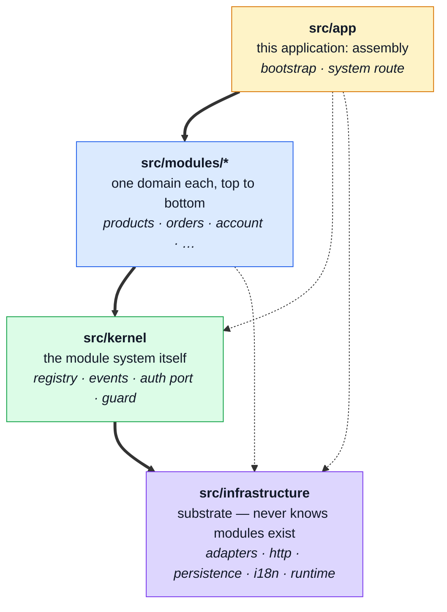
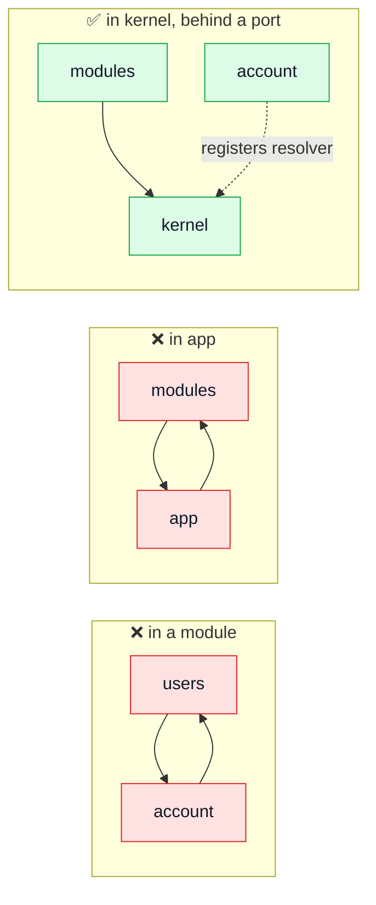
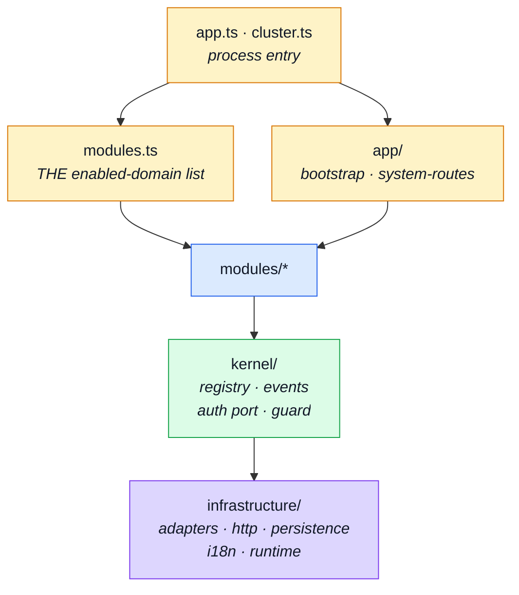
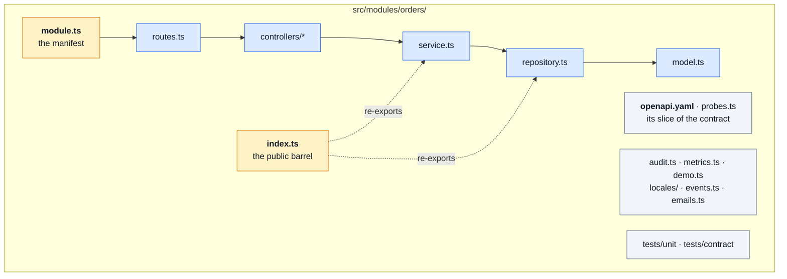
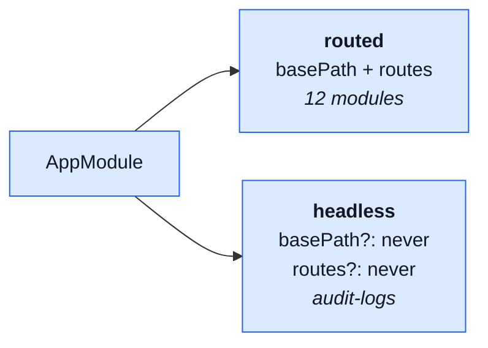
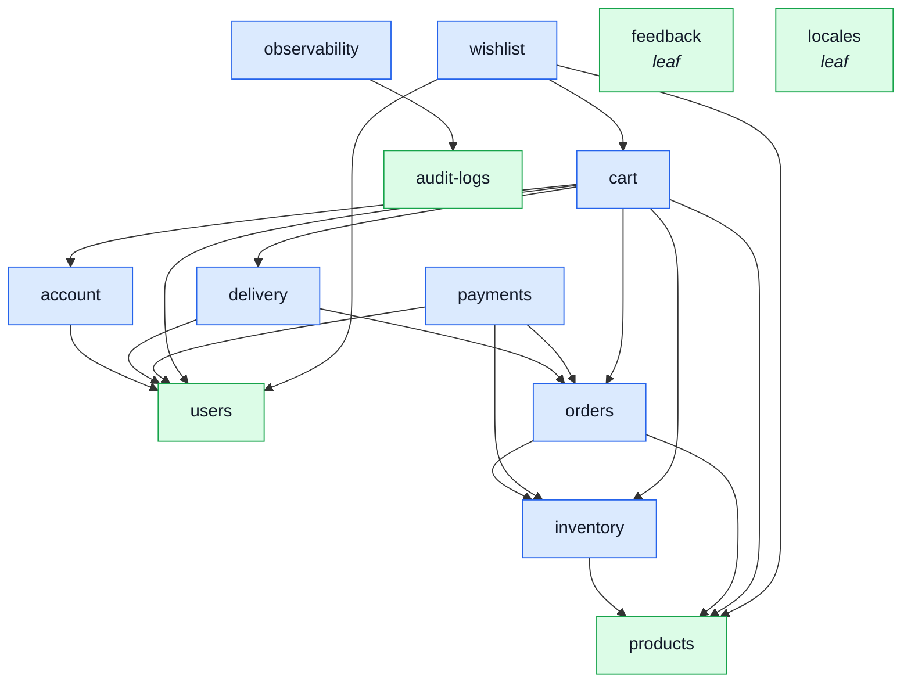
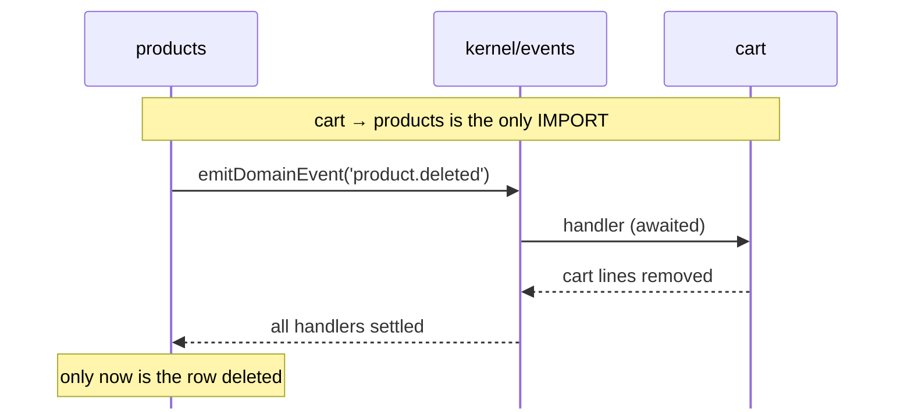
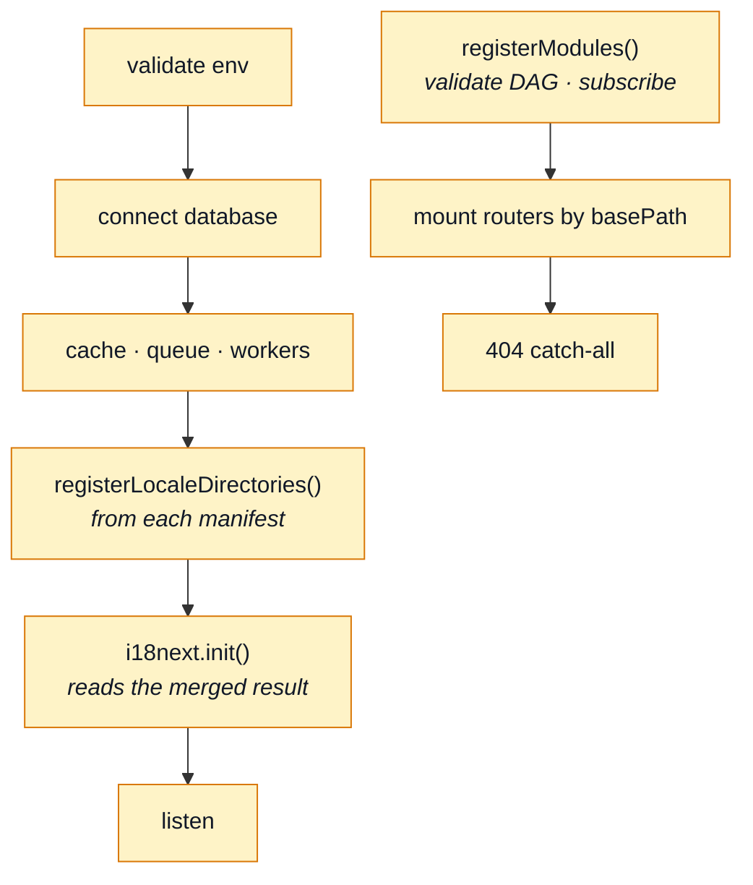

# Modules

A domain lives in exactly one folder. Adding one is a folder plus a line; removing one is `rm -rf`
plus deleting that line. Everything on this page exists to make those two sentences true.

> New to the words **domain** and **barrel**? They are defined with a picture each in
> [The words these pages use](./index.md#the-words-these-pages-use).

## The four tiers



**Every arrow points down, and none points back.** That is the whole architecture. A tier may import
anything below it and nothing above it, and lint enforces each edge in both directions.

| Tier               | Folder               | Knows about                                | May import             |
| ------------------ | -------------------- | ------------------------------------------ | ---------------------- |
| **App**            | `src/app`            | this application: how it is assembled      | modules, kernel, infra |
| **Modules**        | `src/modules/<name>` | its own domain, plus siblings' **barrels** | kernel, infra          |
| **Kernel**         | `src/kernel`         | that modules exist — never _which_ ones    | infra                  |
| **Infrastructure** | `src/infrastructure` | Express, Mongoose, the outside world       | —                      |

### The `infrastructure` / `kernel` line

This is the boundary people trip on, so it gets one question and no adjectives:

> **If this project had no modules at all — if it were one undivided app — would this file still
> make sense?**

- **Yes, it still works** → `infrastructure`.
- **No, it becomes meaningless** → `kernel`.

`infrastructure` is not "framework-free" — it is the opposite. Seven files there import Express and
six import Mongoose, which is exactly right: `infrastructure/http/response.ts` is Express-coupled
substrate and belongs where it is. The one thing it may never contain is the knowledge that a
module system exists.

It also may not hold a **business rule**, even one that two modules share. That is the trap this
tier invites, because "two modules need it" feels like a reason to push something down. It is not:
the substrate is what the application runs ON, and none of it knows what an order or a price is. A
shared rule belongs to whichever domain OWNS it, exported through that module's barrel — see
`modules/orders/totals.ts`, which sat here until the rename made the leak obvious.

So `kernel` is small on purpose. It is the module system, and nothing else:

| File                            | Why it cannot be infrastructure                                           |
| ------------------------------- | ------------------------------------------------------------------------- |
| `registry.ts`                   | it _is_ the module system — `AppModule`, the DAG check, `registerModules` |
| `events.ts`                     | it exists so two modules can talk without importing each other            |
| `authentication.ts`             | the socket `account` plugs into, so guards need no module import          |
| `middlewares/authorizations.ts` | the guard that consumes that socket                                       |
| `seed-accounts.ts`              | the two demo identities four modules point at, owned by none of them      |

`seed-accounts.ts` is the one that looks like it does not belong, so it is worth a sentence. `users`
seeds the demo accounts, but `orders`, `cart` and `wishlist` each seed a row that belongs to a
person and need that person's id to name them. Reaching into `@modules/users` for six string
literals would buy three registry edges — one of them a `shared-kernel` — for pure data; repeating
the ids in four files buys a dangling reference nothing catches. So the kernel holds the handles and
not the records, which is the same inversion as the auth port: a sibling gets what it needs to name
a person without taking on the shape of a user. The file's own header carries the full argument.

Delete `src/modules/` and those five files lose their reason to exist. Everything else that is
domain-free is `infrastructure`, no matter where it sits in the request lifecycle:

| Feature                        | Home                                                | Why it is not kernel                          |
| ------------------------------ | --------------------------------------------------- | --------------------------------------------- |
| response cache, `noStore`      | `infrastructure/http/middlewares/cache.ts`          | Express caching; no module needed             |
| locale negotiation             | `infrastructure/http/middlewares/locale.ts`         | wraps `infrastructure/i18n`; no module needed |
| observability context          | `infrastructure/http/middlewares/observability.ts`  | seeds a request context                       |
| access logging                 | `infrastructure/http/middlewares/request-logger.ts` | reads tracer + metrics labels                 |
| rate limiting, metrics scraper | `infrastructure/http/middlewares/security.ts`       | generic HTTP hardening                        |
| conditional handler toggle     | `infrastructure/http/middlewares/route-flag.ts`     | imports nothing but Express                   |
| email queue consumer           | `infrastructure/adapters/email.worker.ts`           | the consumer half of `adapters/mailer.ts`     |
| PDF queue consumer             | `infrastructure/adapters/pdf.worker.ts`             | the consumer half of `adapters/pdf.ts`        |
| worker registration at boot    | `app/workers.ts`                                    | names which queues _this_ build drains        |

The test that keeps this honest: a `kernel` file may be imported by a module, but its **purpose**
must dissolve if modules do. Being domain-free is not enough — most of `infrastructure` is
domain-free too.

Both tables describe the tree as it is. `src/kernel/` holds five files.

### Why these names, and what everyone else calls them

Separating a module system from its substrate is a well-established pattern. The **vocabulary is
not**, and that is the whole reason this section exists:

| Project       | The module / DI system | The substrate     |
| ------------- | ---------------------- | ----------------- |
| **VS Code**   | `vs/platform`          | `vs/base`         |
| **NestJS**    | `@nestjs/core`         | `@nestjs/common`  |
| **Angular**   | `@angular/core`        | `@angular/common` |
| **Spring**    | `spring-context`       | `spring-core`     |
| **Backstage** | `core-plugin-api`      | `core-components` |
| **this repo** | `kernel`               | `infrastructure`  |

Read the table for what it actually shows: **`core` names both halves, depending on who you ask.**
Nest and Angular use it for the DI container, Spring and Backstage for the substrate. This repo
used it for the substrate, and the section above had to open with a standing disclaimer saying so
— insisting, every time, that `core` did not mean what most readers assume.

That is the argument in one line. A name needing a disclaimer does negative work: a NOVEL name
makes a reader look it up, an OVERLOADED one makes them think they already know. The second failure
is silent, and it is the expensive one.

`infrastructure` needs no disclaimer. Adapters, HTTP plumbing, persistence substrate and runtime
are what the word means in hexagonal architecture — the tradition this dependency rule already
comes from. `common` and `base` were the other candidates and were rejected for the opposite
reason: they describe nothing, and a folder that describes nothing accepts anything, which is
exactly how the old `src/utils/` became a dumping ground.

**`platform` → `kernel` is the less obvious half, so here is the case against it first.** VS Code
is a real precedent, and an earlier version of this page leaned on it to keep the name. Two things
outweighed it. First, `vs/platform` is VS Code's _service and DI layer_ — a third meaning again, so
the precedent supports "platform ≈ services", not "platform ≈ plugin host". Second, the word now
belongs to platform engineering, where "the platform" is the base layer everything runs on. That is
this repo's `infrastructure`. Read cold, the two old names pointed at each other's contents.

`kernel` carries none of that. These files are a **microkernel**: a small fixed host that
loads, validates and connects plugins it has never heard of — the pattern under its textbook name.
The folder says what it is, and so does the tier beneath it.

These names are deliberately kept. The confusion this section exists to prevent was never caused by
the words — it was caused by a criterion that did not match the code, and by files sitting in the
wrong tier. Both are fixed above, and a rename would be motion rather than progress.

### Why "app" is a tier and not a leftovers drawer

It holds the things that are allowed to know every domain: `bootstrap` (the `install(app)` steps),
and the system route that belongs to no domain. `src/modules.ts` and `app.ts` sit beside it for the
same reason — the registry names every enabled domain, which nothing below it may do.

The test for whether something belongs here: **does it need to know which domains exist?** If yes,
it is `app`. If it needs a domain's _capability_ but not its identity, it is `kernel` with a port.

### The rule that forced the shape

`authorizations.ts` guards every module's routes and needs a user to do it. That is a genuine
tension, and the naive placements both fail:



In `account` it closes a `users → account → users` cycle, because `users`' own admin routes need
`isAdmin`. In `app` it makes modules import upward. So `kernel` declares what it needs —
"turn this token into a user" — and `account` registers an implementation at boot. Same inversion as
`IAuditSink` and `IImageStore`. See `src/kernel/authentication.ts`.

### Where everything else sits



**One alias per tier**, so an import line states which tier it crosses: `@app/*`, `@modules/*`,
`@kernel/*`, `@infrastructure/*`.

Two naming details worth knowing, because both were confusing before:

- **`infrastructure/runtime`** starts the _process's_ resources — database connection, env validation, the
  OTel SDK, signal handlers. No Express anywhere. It was once `core/bootstrap`, which made it look
  like a twin of the app tier's boot steps; it never was.
- **queue consumers are `infrastructure`, not `kernel`.** Sending an email and rendering a PDF are verbs,
  not domains, and neither one stops making sense in an app with no modules — so each consumer sits
  beside the adapter it is the other half of. Only `registerWorkers()` is app-tier, because naming
  which queues this build drains is an assembly fact. A domain-owned worker would belong to its
  module; there is not one yet.

## What a module contains



| File                                                             | Required?                             | What it is                                                                          |
| ---------------------------------------------------------------- | ------------------------------------- | ----------------------------------------------------------------------------------- |
| `module.ts`                                                      | **yes**                               | the manifest — the only file `src/modules.ts` imports                               |
| `index.ts`                                                       | only if a sibling imports this module | the public barrel; a module nothing imports has none                                |
| `routes.ts` + `controllers/`                                     | only if the domain serves HTTP        | `audit-logs` has neither                                                            |
| `service.ts` · `repository.ts` · `model.ts`                      | only if it owns data                  | `locales` and `observability` own none — they serve URLs over other domains         |
| `services/`                                                      | when `service.ts` outgrows one file   | see [Layers](./layers.md#when-service-ts-becomes-services)                          |
| `domain/`                                                        | only if the module has rules to prove | see [Domain Layer](./domain-layer.md)                                               |
| `openapi.yaml`                                                   | if it serves HTTP                     | its standalone slice of the REST contract                                           |
| `asyncapi.yaml`                                                  | if it owns a channel                  | the same, for the async contract, server included — `observability` is the only one |
| `probes.ts`                                                      | as needed                             | the requests a spec cannot describe — see below                                     |
| `providers/`                                                     | if the domain has an outbound port    | `payments` is the only one — see below                                              |
| `audit.ts` · `metrics.ts` · `demo.ts` · `locales/` · `events.ts` | as needed                             | the domain's slice of what used to be shared registries                             |
| `analytics.ts` · `factory.ts`                                    | as needed                             | the event names it emits; how its records are built                                 |
| `emails.ts`                                                      | only if the domain sends email        | the finished copy of its emails — see below                                         |
| `tests/unit/` · `tests/contract/`                                | yes, in practice                      | deleted with the module                                                             |

The table lists what a module MAY have. What decides **where** in the module a file goes is one
rule, and `account` is the module that forced it to be written down:

> A module root holds the manifest, the barrel, the contract files, the single-file layers and the
> self-registering slots. Everything else goes in a folder named for what it holds.

Under it, `account`'s eight loose root files sorted into three piles: `jwt.ts`, `cookies.ts` and
`tokens.ts` were the token surface and became `session/` (with `tokens.ts` renamed `config.ts`, since
it holds no token — it reads how long they live); `verification.ts`, `token-cleanup.ts` and
`addresses-service.ts` were behaviour and joined `services/`, where `service.ts` had already been
split into `authentication.ts` and `profile.ts`; and `addresses-model.ts` / `addresses-repository.ts`
were simply this module's `model.ts` and `repository.ts` under a prefix that dated from when it had
no collection at all. `users/validation.ts` merged into `users/model.ts` for the same reason. The
rule is what makes the table above readable as a shape rather than a suggestion: a file at the root
is a layer, and a folder is a subject.

Nothing central enumerates these. `audit.ts`, `metrics.ts` and `events.ts` register or augment
themselves on import; `seeds` and `locales` are declared in the manifest so the seeder and the i18n
boot can walk the registry without naming a domain.

`probes.ts` is the one row that is not obvious from the name. A generated API collection can only
contain the calls the contract describes, and a contract describes valid calls and their declared
answers — so the requests that prove the API _rejects_ things have nowhere to come from. A module
declares those as data (method, path, headers, body, and a `why` that becomes the description) and
the collection generator emits them after its contract-derived requests. Four modules carry one, and
a module deleted without removing its entry from `scripts/contracts/generate-collections.ts` stops
the build rather than shipping a short collection. See
[Contract Ownership & Fragmentation](../api/contract-fragmentation.md#the-client-collections-generated).

`providers/` is a **module-tier port**: the same inversion as `IAuditSink` and `IImageStore`, owned
by a domain instead of by the substrate. `payments/providers/` declares what a payment provider must
do, ships a `fake` implementation, and picks between them on `NODE_PAYMENT_PROVIDER` — so going live
means writing `stripe.ts` beside it and changing an env var, while the contract, the service and the
frontend hear nothing. It belongs to `payments` and not to `infrastructure` for the reason the
`infrastructure` / `kernel` line already gives: charging a card is this domain's business, and a
substrate that knew what a charge was would be holding a business rule. The pattern is already being
copied — `infrastructure/observability/analytics/index.ts` cites it by name for its own
`NODE_ANALYTICS_PROVIDER` seam.

`emails.ts` is the newest of them and exists for a boundary reason. An email is rendered by
`infrastructure/adapters/email.worker.ts`, which drains a queue possibly in another process, long after
the request that asked for the email ended — so there is no locale store there and nothing to
resolve a translation key against. Rather than rebuild that context in the worker, each module
resolves its own copy while the request is alive: `emails.ts` returns an `IEmailContent` (template
name, subject, and every string the template interpolates), the controller hands it to
`enqueueEmail`, and the job that reaches the worker is finished text. The workers import no i18n
at all, and the templates interpolate rather than translate.

## The manifest

```ts
export default {
    name: 'orders',
    subdomain: 'core',
    language: {
        Order: 'What a customer bought, frozen. Immutable in substance: only its status moves.'
        // …
    },
    basePath: '/orders',
    routes: router,
    dependsOn: [
        {
            module: 'products',
            as: 'conformist',
            because:
                'An order item embeds `productSchema` itself, so the catalogue’s shape is this module’s shape too.'
        }
    ],
    locales: path.join(__dirname, 'locales'),
    seeds: seedOrdersCollection
} satisfies AppModule;
```

`subdomain`, `language` and the `as`/`because` on each edge are the module's **strategic**
declarations — what it is to the business, the words it uses, and what kind of relationship each
arrow is. Nothing reads them at runtime; `tests/cross-cutting/` reads all three. They are covered in
[Strategic DDD](./strategic-ddd.md).

It is a union of two alternatives, so a domain that owns data but no URL is a first-class entry
rather than a special case:



The `never`s are the point: declaring a router with no mount point, or a mount point with nothing to
mount, is a type error at the manifest rather than a route that silently never registers.

**Keep it small.** A field only one module fills does not belong here — that module should do the
thing itself. `subscribe` was the one field that broke it; six modules fill it today, which settled the question in favour of keeping it.

## The dependency graph



Every arrow is a `dependsOn` — declared, and validated as a **DAG at boot**. Four modules declare
nothing and are depended on instead (`products`, `users`, `audit-logs`) or by nobody at all
(`feedback`, `locales`). `cart` is the busiest node with six edges, which is not a smell to
refactor away: a checkout is the one operation that genuinely needs the catalogue, the customer, the
order it becomes, the units held against it, the address it ships to and the price of getting it
there.

`inventory` is worth reading as a shape rather than a node. It sits one level above `products` and
three modules depend on it, because it owns the only writes to the two stock counters: `cart` and
`orders` ask it to hold units, `payments` asks it to turn a hold into a sale. It used to sit at the
bottom as a passive listener while four modules each moved stock themselves — the module named
`inventory` did not own inventory — and inverting that is what the arrows now record.

The reverse direction is domain events, and it is a **separate** graph on purpose — an event edge is
exactly the edge that would have made the import graph a cycle:

| Event                           | Emitted by  | Handled by                    |
| ------------------------------- | ----------- | ----------------------------- |
| `product.deleted`               | `products`  | `cart`, `wishlist`            |
| `user.deleted`                  | `users`     | `cart`, `wishlist`, `account` |
| `order.status_changed`          | `orders`    | `delivery` (on `shipped`)     |
| `order.cancelled`               | `orders`    | `payments` (refunds)          |
| `inventory.reservation_expired` | `inventory` | `orders` (cancels the order)  |

Note who emits: every one comes from a module low in the import graph telling a module above it
something, because a module cannot import its own dependants. `inventory.reservation_expired` is the
clearest case — the sweep releases the units itself and needs nobody's help for that, but cancelling
the order behind the hold belongs to `orders`, which already imports `inventory`. An import back
would be the cycle the registry refuses to boot, so it is announced instead.

There is deliberately **no** stock event, and there used to be. `product.stock_moved` was emitted by
whoever had just changed a count, with `inventory` listening and writing a ledger row — which made
the row a REACTION to the write rather than half of it, so every mover had to remember to announce
on every path, and on the rollback paths they did not. A counter change nobody recorded is not a
smaller feature, it is a corrupt audit trail. The row is now written by the same function call that
moves the counter and cannot be forgotten, because there is nothing left to forget.

Every solid arrow also carries a **kind**: `conformist`, `customer-supplier`, `published-language`
or `shared-kernel`. That label is what makes the map answer "what does changing `products` cost?"
rather than only "who touches `products`?" — see [Strategic DDD](./strategic-ddd.md).

That pairing is the answer to mutual need. Deleting a product must empty it from every cart, while
the cart needs the catalogue to price a line. As imports that is a cycle; as one import plus one
event it is a straight edge:



Handlers are **awaited in registration order**, so the dependent rows are gone before the owning row
disappears. A handler that throws is logged and does not fail the emitter — a listener must not roll
back an operation that was already authorised.

### The bus is not transactional, and must not be made so

That last sentence has a consequence worth stating outright, because it looks like a bug the first
time you meet it: if cart cleanup throws while a product is being hard-deleted, **the product is
still deleted and the orphaned cart lines stay**.

This is deliberate. The emitting module cannot reason about the failure modes of code it has never
heard of, and a subscriber must not be able to veto an operation it never authorised.

**The thing to not do:** if a future flow needs cross-module cleanup to be all-or-nothing, this is
the wrong primitive and must not be bent into one. Awaiting handlers inside the emitter's
transaction makes every subscriber a participant in a transaction it cannot see — which is how the
dependency arrow this bus exists to remove comes back, pointing the other way. Either that cleanup
belongs in the owning module, or the two modules were one module.

## Boot order



Two orderings are load-bearing: locale directories must be registered **before** `i18next.init()`,
which reads the merged dictionaries; and `registerModules` must run **before** the first route
exists, so every subscription is attached before anything can emit.

## Adding and removing a domain

Adding one is a folder plus a line; removing one is `rm -rf` plus deleting that line. The full
procedure — the conditional registries, the bundling, the two-repo step — is
[Adding & removing a module](./module-lifecycle.md). What belongs on this page is why it works and
what it measured.

**It works because nothing central enumerates domains.** Route mounting, the seeder, the i18n boot,
the audit vocabulary and the metrics registry all walk the registry rather than naming its entries,
so none of them is on either checklist. `src/modules.ts` is the one file that names a domain, and
the three `*_SECTION_ORDER` lists are the one exception — the price of a contract assembled from
per-module fragments and shared with the paired frontend.

**And it is measured, in both directions.** `wishlist` was added under it: one folder, one registry
line, its section-order entries, and **zero** edits to any existing file.

Deleting `products`, `cart` and `orders` together, **re-measured 2026-08-16 at thirteen modules**:
62 type errors across 26 files.

| Tier                  | Files that break | What they are                                                           |
| --------------------- | ---------------- | ----------------------------------------------------------------------- |
| `db/**`               | **0**            | —                                                                       |
| `src/**` (production) | 10               | four modules that **declare** the edge in `dependsOn` — the DAG working |
| co-located specs      | 10               | five modules' own tests, reaching for a deleted domain's factories      |
| `tests/**`            | 4                | central specs using a domain as sample data, or asserting one           |
| `scripts/**`          | 2                | the section lists, announcing the entry you have not deleted yet        |

**The `db/**`zero is the verdict**, and it is a narrower claim than the one this table used to
make. An earlier run reported zero in`src/\*\*`too; that was true when`delivery`, `inventory`,
`payments`and`wishlist` did not exist, and it was never the property being defended. Those four
break because they genuinely depend on what was deleted and said so in their manifest — the registry
would refuse the boot naming the offending pair, which is the failure mode the DAG exists to
produce. What must stay at zero is the tier that names domains without declaring them, and it has.

The rest is residue in test and script code — the two `scripts/**` breaks are the hard errors the
removal procedure tells you to fix in step 3, and some of the test breaks are **correct** and must
not be "fixed". Which is which, and how to re-run it, is
[Re-running the deletability check](./module-lifecycle.md#re-running-the-deletability-check).

If a module you delete was named in another module's `dependsOn`, the registry stops the boot with
the offending pair named rather than 500-ing on the first request that crosses the gap.

::: tip Run a deletability test after any significant change
Delete two or three domains on a throwaway copy and see what breaks. Nothing in the suite checks
this, and every finding it has ever produced was invisible to `tsc`, to lint and to a fully green
run. The procedure is
[Re-running the deletability check](./module-lifecycle.md#re-running-the-deletability-check).
:::

## What is guarded, and by what

Some of these rules are relational — what a file may import depends on which module owns it — and
`no-restricted-imports` only matches file globs. Those live as tests instead, in
`tests/cross-cutting/`.

| Rule                                                                                  | Guard                              |
| ------------------------------------------------------------------------------------- | ---------------------------------- |
| No module imports a sibling's internals                                               | ESLint `no-restricted-imports`     |
| `infrastructure` and `kernel` never import a module                                   | ESLint, per-tier blocks            |
| A spec may reach its own module, a sibling's barrel, manifest or tests — nothing else | `module-test-boundaries.test.ts`   |
| Two modules never claim the same audit action, and every action is dotted             | `audit-actions.test.ts`            |
| No module shadows a shared locale key, or writes outside its own namespace            | `locale-namespaces.test.ts`        |
| Every language declares the same keys across every module                             | `locale-parity.test.ts`            |
| `infrastructure`'s shared scalars still match every operation in `openapi.yaml`       | `contract-scalars.test.ts`         |
| Every controller handles its own rejections                                           | `every-controller-catches.test.ts` |
| **A function added to a service but forgotten in its namespace**                      | `service-namespaces.test.ts`       |
| Every declared `dependsOn` edge is imported, and every import is declared             | `context-map.test.ts`              |
| A `generic` module carrying a `domain/` folder                                        | `subdomain-discipline.test.ts`     |
| Every committed bundle still equals a fresh run of the bundler                        | `contract-bundles.test.ts`         |
| Every mounted route is in the spec, and every spec operation is mounted               | `request-sources.test.ts`          |

Each of these was verified by deliberately breaking it and watching it fail. A guard nobody has seen
fire is a comment. All but the last live in `tests/cross-cutting/`; `request-sources.test.ts` sits
in `tests/contract/`, because it needs the loaded spec the contract harness already registers.

**`service-namespaces.test.ts` is the newest and the least obvious**, because the thing it catches
never fails on its own. Every module is reached through exactly one `*Service` namespace — the
convention was 9 modules to 3 before the test existed, with `delivery`, `inventory` and `payments`
exporting loose functions instead. Both styles work, which is precisely why the split survived: what
it cost was a spec copied from a module that does `jest.spyOn(service, 'fn')` not running against a
module with no object to spy on. The second property is the one a convention alone cannot hold —
**the namespace must hold every function the service exports** — because adding one and forgetting
to list it is silent. The loose export keeps working, callers that already import by name never
notice, and the namespace quietly stops being the whole surface it claims to be.

What the test deliberately does **not** assert is that the object is named after its module.
`feedback` exports `feedbackRequestService` and `audit-logs` exports `auditLogService`, both named
for the record they serve rather than for the folder. A rule that failed those two would be a rule
about spelling rather than about structure — so neither is a violation.

## Related pages

- [Adding & removing a module](./module-lifecycle.md) — the procedure, with the commands
- [Layers](./layers.md) — the layer stack inside one module
- [Architecture](./architecture.md) — the runtime shape of the service
- [Request Flow](./request-flow.md) — what happens to one request
