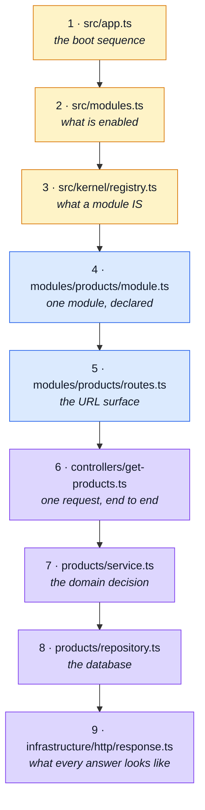

# Reading Path

**The first hour in the codebase.** Every other page here explains a concept; this one names the
files, in order, and says what to skip.

The repository is ~21,000 lines of production source across 13 modules, and ~33,000 with the
co-located tests. You do not need to read them. Nine files carry the shape of the whole thing, and
every module is a variation on one of them.

::: tip Before the code
If you want the tool inventory first — what Redis, Prism, Stryker, Orval and the rest are doing
here and why each earns its place — read **[Tools Explained](../tools/tools-explained.md)**. It has
the whole stack on one diagram. This page is about the code.
:::

::: tip Landed on a file instead
This page is for reading the codebase in order. If you got here from a filename you did not
recognise, the **[File Glossary](../reference/)** is the other direction: look the file up, get a
sentence and a link, carry on with what you were doing.
:::

---

## The path



---

### 1 · `src/app.ts` — how the server starts

150 lines, and the only file that knows the boot order. Read the bottom half first: the six
`install*` calls **are** the middleware stack, in the order a request travels it.

**Take away:** security → request context → telemetry → static → routes → error handling. That
order is behaviour, not documentation.

### 2 · `src/modules.ts` — what this build serves

41 lines, mostly imports. Thirteen domains, one array.

**Take away:** enabling or disabling a domain is one line here. There is no filesystem discovery,
no auto-registration, no magic.

### 3 · `src/kernel/registry.ts` — what a module _is_

The thesis of the repository. A module is a **typed object**, not a folder convention: it declares
its name, dependencies, routes, locales, seeds and event subscriptions, and the registry validates
the dependency graph at boot.

**Take away:** `AppModule` is a union — `RoutedModule` (has `basePath` + `routes`) or
`HeadlessModule` (has neither, e.g. `audit-logs`). Declaring one without the other is a type error
at the manifest, not a route that silently never mounts.

### 4 · `src/modules/products/module.ts` — one module, declared

20 lines. **`products` is the reference module** — when you add a domain, copy this one. It depends
on nothing, so it shows the shape without the complications.

**Take away:** compare it with `src/modules/orders/module.ts`, which declares `dependsOn` and
`subscribe`. That is the whole difference between a leaf domain and a connected one.

### 5 · `src/modules/products/routes.ts` — the URL surface

**Take away:** two things that are easy to miss. Static segments (`/search`, `/categories`) are
declared **before** `/:id` or Express matches them as ids. And several routes point at the same
controller on purpose — `GET /products` and `POST /products/search` are one handler, as are
`PUT /products` and `PUT /products/:id`.

### 6 · `src/modules/products/controllers/get-products.ts` — one request, end to end

The most important single file on this list. Every controller in every module has this shape:

```
readInput(request, declaration)     ← collect input from params/query/body
schema.safeParse(...)               ← validate against the contract
  ↳ on failure: rejectResponse(422)
service.doTheThing(...)             ← the actual work
  ↳ then:  successResponse(...)
  ↳ catch: rejectDatabaseError(...)
```

**Take away:** once you have read one controller, you have read all 60. The variation between them
is the schema and the service call.

### 7 · `src/modules/products/service.ts` — the domain decision

Where "admin sees deleted products, the public does not" lives. Services take decisions; they do
not touch Express (no `request`, no `response`) and do not write Mongo queries.

### 8 · `src/modules/products/repository.ts` — the database

Built on `createBaseRepository`. Note the `SearchSpec`: filters are declared as **data** — filter
key → Mongo path — so `$regex`, `$elemMatch` and `ObjectId` never leak up into a service.

### 9 · `src/infrastructure/http/response.ts` — what every answer looks like

Every endpoint answers `{ success, status, message, data | errors }`. This is the contract the
generated client and the paired frontend both depend on.

**Take away:** `rejectResponse` does **not** throw. Controllers must `return` it.

---

## Then: pick your next question

| You want to…                                  | Go to                                               |
| --------------------------------------------- | --------------------------------------------------- |
| See the request travel the middleware stack   | [Request Flow](./request-flow.md)                   |
| Understand what may import what               | [Layers](./layers.md)                               |
| Add or delete a domain                        | [Adding & Removing a Module](./module-lifecycle.md) |
| Change an endpoint's contract                 | [OpenAPI Workflow](../api/openapi-workflow.md)      |
| Know which tool does what, and why it is here | [Tools Explained](../tools/tools-explained.md)      |

---

## What to skip on a first pass

Not because it is unimportant — because none of it changes your mental model of the codebase, and
all of it is easier to read once you have one.

| Skip                                                                 | Until                                                                                                                      |
| -------------------------------------------------------------------- | -------------------------------------------------------------------------------------------------------------------------- |
| `src/infrastructure/adapters/*` (cache, queue, storage, mailer, pdf) | You need that specific capability. Each is self-contained.                                                                 |
| `src/infrastructure/observability/*`                                 | You are debugging a trace or adding a metric.                                                                              |
| `src/modules/*/openapi/*`                                            | The contract, one module at a time. Authored — see [Contract Ownership & Fragmentation](../api/contract-fragmentation.md). |
| `src/modules/account/*`                                              | It is the biggest and least typical module (21 routes, JWT, cookies, sessions, tokens). Read `products` first.             |
| `src/cluster.ts`                                                     | You are changing process management. See [Clustering & Shutdown](./clustering.md).                                         |
| `eslint.config.ts`, `stryker.config.json`, `jest.config.js`          | You are changing the gate itself.                                                                                          |

---

## The five rules the code assumes you know

Everything above is easier if these are in your head first:

1. **A module is a value.** One typed object per domain, listed in `src/modules.ts`.
2. **Layers only point downward.** `kernel` and `infrastructure` know no domain; modules know each
   other only through declared `dependsOn` or domain events.
3. **The contract is an output.** `openapi.yaml` is assembled from per-module fragments, and
   generates the client and Zod schemas both repos import. Never edit `openapi.yaml` or `api/`.
4. **Controllers respond, services decide, repositories query.** No layer does two of those.
5. **`id` is not `_id`.** Mongo stores `_id`; the API speaks `id`. `persistence/serialize.ts` is
   the border.
