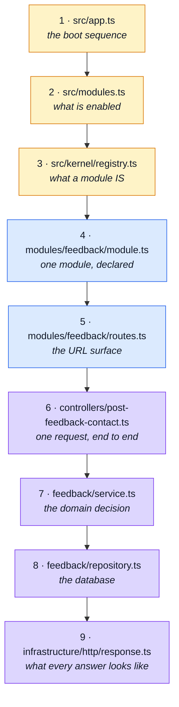

# Reading Path

**The first hour in the codebase.** Every other page here explains a concept; this one names the
files, in order, and says what to skip.

The repository is a lot of production source across many modules, with even more in the co-located
tests. You do not need to read them. Nine files carry the shape of the whole thing, and every
module is a variation on one of them.

::: tip Before the code
If you want the tool inventory first — what Redis, Prism, Stryker, Orval and the rest are doing
here and why each earns its place — read **[Tools Explained](../tools/tools-explained.md)**. It has
the whole stack on one diagram. This page is about the code.
:::

::: tip Landed on a file instead
This page is for reading the codebase in order. If you got here from a filename you did not
recognise, the **[File Glossary](../reference/)** is the other direction: look the file up, get a
sentence and a link, carry on with what you were doing.
:::

---

## The path


```mermaid
%%{init: {'flowchart': {'nodeSpacing': 30, 'rankSpacing': 40}}}%%
flowchart TD
    A["1 · src/app.ts<br/><i>the boot sequence</i>"] --> B["2 · src/modules.ts<br/><i>what is enabled</i>"]
    B --> C["3 · src/kernel/registry.ts<br/><i>what a module IS</i>"]
    C --> D["4 · modules/feedback/module.ts<br/><i>one module, declared</i>"]
    D --> E["5 · modules/feedback/routes.ts<br/><i>the URL surface</i>"]
    E --> F["6 · controllers/post-feedback-contact.ts<br/><i>one request, end to end</i>"]
    F --> G["7 · feedback/service.ts<br/><i>the domain decision</i>"]
    G --> H["8 · feedback/repository.ts<br/><i>the database</i>"]
    H --> I["9 · infrastructure/http/response.ts<br/><i>what every answer looks like</i>"]

    classDef boot fill:#fef3c7,stroke:#d97706,color:#111827;
    classDef mod fill:#dbeafe,stroke:#2563eb,color:#111827;
    classDef req fill:#ddd6fe,stroke:#7c3aed,color:#111827;
    class A,B,C boot;
    class D,E mod;
    class F,G,H,I req;
```

---

### 1 · `src/app.ts` — how the server starts

`createApp()` is the only function that knows the boot order. Read the bottom half of its
body first: the six `install*` calls **are** the middleware stack, in the order a request travels
it. Calling `createApp()` is the side effect, not importing the file — `src/serve.ts` is what
actually starts one listening.

**Take away:** security → request context → telemetry → static → routes → error handling. That
order is behaviour, not documentation.

### 2 · `src/modules.ts` — what this build serves

Mostly imports. Every domain, one array.

**Take away:** enabling or disabling a domain is one line here. Nothing else names a module: the
contract, the docs and the guard tests read each module's own folder.

### 3 · `src/kernel/registry.ts` — what a module _is_

The thesis of the repository. A module is a **typed object**, not a folder convention: it declares
its name, routes, locales, scenario guarantees and event subscriptions, and the registry calls what
it declares.

**Take away:** every field on `AppModule` is read by something — `basePath` and `routes` by
`app/routes.ts`, `locales` by i18next, `subscribe` by `registerModules`, `scenario` by
`scenarios/check.ts`'s guarantee comparison. A field nothing reads is a comment with extra syntax,
which is why several used to be here and are not.

### 4 · `src/modules/example/module.ts` — one module, declared

**`example` is the module to copy** — when you add a domain, start from this one. It has its own
group (`npm run demo:remove` deletes it too — copy it first) and depends only on `users`, so it shows the shape without
the complications. Start the tour here rather than in a shop module for the same reason. It has no
docs page on purpose: the header of each of its files says its role in any module, and
[the module template](./modules.md#the-module-template) lists what each optional capability costs.

**Take away:** compare it with `src/modules/orders/module.ts`, which declares `subscribe` and whose
docblock explains what it reaches for. That is the whole difference between a leaf domain and a
connected one.

### 5 · `src/modules/example/routes.ts` — the URL surface

**Take away:** two things that are easy to miss. The gate is **positional**: the one public route
(`GET /published/:id`) sits above `router.use(getAuth, …)` and everything below it is signed-in,
purely by where it was typed. And static segments (`/search`) are declared **before** `/:id` or
Express matches them as ids. Several routes also point at the same controller on purpose — `GET
/examples` and `POST /examples/search` are one handler.

### 6 · `src/modules/example/controllers/post-example.ts` — one request, end to end

The most important single file on this list. Every controller in every module has this shape:

```
parseBody(schema, request.body, response)   ← validate against the contract
  ↳ on failure: a 422 is already sent, return
service.doTheThing(...)                     ← the actual work
  ↳ then:  createdResponse(...) / successResponse(...)
  ↳ catch: catchAs(response, 'name')
```

**Take away:** once you have read one controller, you have read all 60. The variation between them
is the schema and the service call.

### 7 · `src/modules/example/services/crud.ts` — the domain decision

Where "a published example cannot go back to a draft, and publishing it tells its owner" lives (the
rule itself is pure, in `domain/lifecycle.ts`). Services take decisions; they do not touch Express
(no `request`, no `response`) and do not write Mongo queries. Who may see which row is not decided
by hand either: `accessibleFilterFor` compiles the caller's keys into the query.

### 8 · `src/modules/example/repository.ts` — the database

Built on `createRepository`. Note the `searchable` spec: filters are declared as **data** — filter
key → Mongo path — so `$regex`, `$elemMatch` and `ObjectId` never leak up into a service.

### 9 · `src/infrastructure/http/response.ts` — what every answer looks like

Every endpoint answers `{ success, status, message, data | errors }`. This is the contract the
generated client and the paired frontend both depend on.

**Take away:** `rejectResponse` does **not** throw. Controllers must `return` it.

---

## Then: pick your next question

| You want to…                                               | Go to                                               |
| ---------------------------------------------------------- | --------------------------------------------------- |
| See the request travel the middleware stack                | [Request Flow](./request-flow.md)                   |
| Understand what may import what                            | [Layers](./layers.md)                               |
| Add or delete a domain                                     | [Adding & Removing a Module](./module-lifecycle.md) |
| Change an endpoint's contract                              | [OpenAPI Workflow](../api/openapi-workflow.md)      |
| Know which tool does what, and why it is here              | [Tools Explained](../tools/tools-explained.md)      |
| Understand why the code is tenant-aware but ships one shop | [Tenancy](./tenancy.md)                             |

---

## What to skip on a first pass

Not because it is unimportant — because none of it changes your mental model of the codebase, and
all of it is easier to read once you have one.

| Skip                                                                 | Until                                                                                                                      |
| -------------------------------------------------------------------- | -------------------------------------------------------------------------------------------------------------------------- |
| `src/infrastructure/adapters/*` (cache, queue, storage, mailer, pdf) | You need that specific capability. Each is self-contained.                                                                 |
| `src/infrastructure/observability/*`                                 | You are debugging a trace or adding a metric.                                                                              |
| `src/modules/*/openapi/*`                                            | The contract, one module at a time. Authored — see [Contract Ownership & Fragmentation](../api/contract-fragmentation.md). |
| `src/modules/account/*`                                              | It is the biggest and least typical module (21 routes, JWT, cookies, sessions, tokens). Read `example` first.              |
| `src/cluster.ts`                                                     | You are changing process management. See [Clustering & Shutdown](./clustering.md).                                         |
| `eslint.config.ts`, `stryker.json`, `jest.config.js`                 | You are changing the gate itself.                                                                                          |

---

## The five rules the code assumes you know

Everything above is easier if these are in your head first:

1. **A module is a value.** One typed object per domain, listed in `src/modules.ts`.
2. **Layers only point downward.** `kernel` and `infrastructure` know no domain; modules reach each
   other only through a sibling's barrel, or through domain events.
3. **The contract is an output.** `openapi.yaml` is assembled from per-module fragments, and
   generates the client and Zod schemas both repos import. Never edit `openapi.yaml` or `api/`.
4. **Controllers respond, services decide, repositories query.** No layer does two of those.
5. **`id` is not `_id`.** Mongo stores `_id`; the API speaks `id`. `persistence/serialize.ts` is
   the border.
