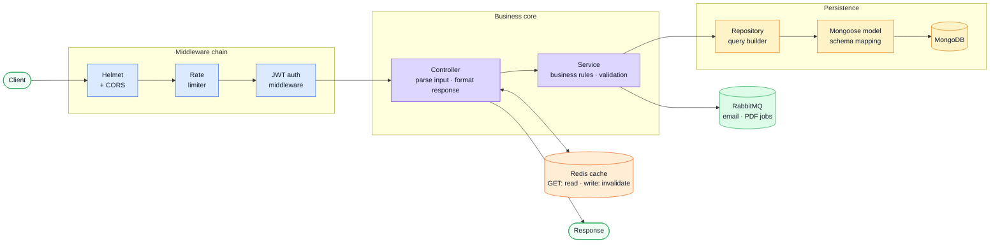
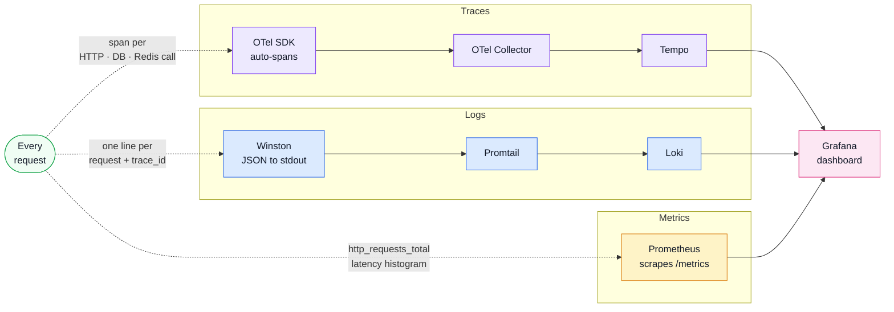

# Request Flow

## End-to-end path

## Observability signals

Every request produces three independent signal streams in parallel with the flow above.

## What each layer does

| Layer                                 | Responsibility                                                                                                                                                                                       |
| ------------------------------------- | ---------------------------------------------------------------------------------------------------------------------------------------------------------------------------------------------------- |
| Middleware chain                      | Helmet sets security headers · CORS checks the origin · rate limiter blocks abuse · JWT auth verifies the token (or skips for public routes)                                                         |
| Redis cache                           | GET requests probe Redis first. A hit returns the stored response immediately — no controller, no database reached. On a write the controller invalidates related tags so stale entries are evicted. |
| Controller                            | Parses HTTP input, calls the service, formats the final response envelope.                                                                                                                           |
| Service                               | Applies business rules and validation (Zod). Publishes async jobs to RabbitMQ when needed.                                                                                                           |
| Repository → Mongoose model → MongoDB | Runs the actual database query. Repositories own query shape; models own schema. Controllers never touch either directly.                                                                            |
| RabbitMQ                              | Receives heavy async jobs (email, PDF). The HTTP handler responds immediately; a separate worker processes the job at its own pace.                                                                  |

## Cross-cutting strategies

### Security first

Things like [Helmet](../tools/security.md), CORS, cookies, auth, and rate limits happen near the edge.
That keeps the inside layers focused.

### Validation close to intent

Input coercion and business validation happen in services, often with [Zod](../tools/runtime.md), instead of being mixed into repositories.

### Optional acceleration

[Redis cache hooks](../tools/redis-cache.md) speed up repeated reads, but the API still works when Redis is off.

### Async offloading

Heavy tasks (email, PDF generation) are pushed to [RabbitMQ](../tools/rabbitmq.md) so the HTTP response returns immediately.

### Signals everywhere

[Winston](../tools/winston.md), [Prometheus](../tools/prometheus.md), [OpenTelemetry](../tools/opentelemetry.md), and [Grafana](../tools/grafana.md) make it easier to debug the same request from multiple angles. Each log line carries a `trace_id` that links back to the full trace in Grafana → Tempo.

## Why the flow matters

When you change behavior, ask:

- Is this an **API contract** change? Go to [API](../api/).
- Is this a **dependency or infrastructure** concern? Go to [Tools](../tools/).
- Is this a **layer ownership** issue? Go back to [Layers](./layers.md).
- Is this about **process lifecycle**, scaling, or shutdown? Go to [Clustering & Shutdown](./clustering.md).
