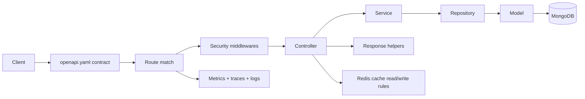

# Request Flow

## End-to-end path

## What normally happens

1. The route is described in [`openapi.yaml`](../api/openapi-workflow.md#openapi-is-the-source-of-truth).
2. Express matches the request and runs middlewares.
3. Security middlewares decide whether the request may continue.
4. The controller converts HTTP input into service input.
5. The service applies business rules and orchestration.
6. The repository talks to Mongoose and MongoDB.
7. Response helpers return the final REST shape.
8. Observability code records logs, metrics, and traces around the flow.

## Cross-cutting strategies

### Security first

Things like [Helmet](../tools/security.md), CORS, cookies, auth, and rate limits happen near the edge.
That keeps the inside layers focused.

### Validation close to intent

Input coercion and business validation usually happen in services, often with [Zod](../tools/runtime.md), instead of being mixed into repositories.

### Optional acceleration

[Redis cache hooks](../tools/redis-cache.md) speed up repeated reads, but the API still works when Redis is off.

### Signals everywhere

[Winston](../tools/winston.md), [Prometheus](../tools/prometheus.md), [OpenTelemetry](../tools/opentelemetry.md), and [Grafana](../tools/grafana.md) make it easier to debug the same request from multiple angles.

## Why the flow matters

When you change behavior, ask:

- Is this an **API contract** change? Go to [API](../api/).
- Is this a **dependency or infrastructure** concern? Go to [Tools](../tools/).
- Is this a **layer ownership** issue? Go back to [Layers](./layers.md).
- Is this about **process lifecycle**, scaling, or shutdown? Go to [Clustering & Shutdown](./clustering.md).
